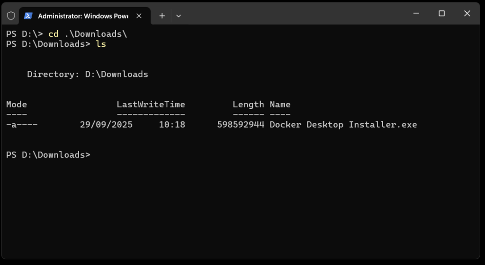
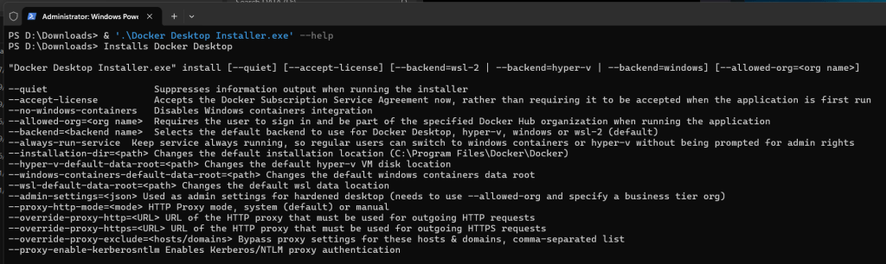
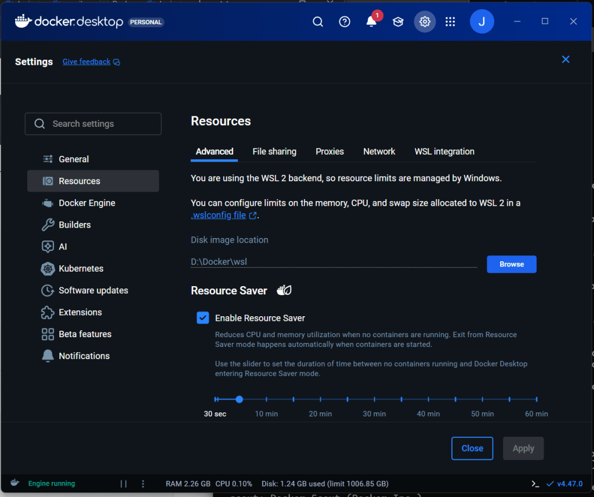

We want Docker Desktop itself, plus all its data (images, volumes, models), to live on **`D:\Docker`** instead of clogging `C:`. The first thing you must do is to download the installer (Grab it from here: [https://docs.docker.com/desktop/setup/install/windows-install/](https://docs.docker.com/desktop/setup/install/windows-install/) )... I've placed it in my D drive...



I tried some of the [most promising commands](https://forums.docker.com/t/docker-installation-directory/32773/20) but just didn't work, and, as we cannot rely on any LLM for these kind of experiments, I just tried to get some direct help...



**Nice! This is exactly what we were looking for...** Here we have very interesting params:

- `--installation-dir` → where Docker Desktop binaries go.

- `--wsl-default-data-root` → all Linux backend images, volumes, Model Runner data.

- `--hyper-v-default-data-root` → I included this one “just in case” we switch backends (something quite unlikely).

- `--quiet --accept-license` make the install unattended.

**So, now, we have two options...**

## Option 1 -> Using `Start-Process` (PowerShell)

Open **PowerShell as Administrator** in the folder where the installer is (in my case `D:\Downloads`) and run:

```powershell
Start-Process -Wait -FilePath ".\Docker Desktop Installer.exe" -ArgumentList @(
    "install",
    "--quiet",
    "--accept-license",
    "--backend=wsl-2",
    "--installation-dir=D:\Docker\Program",
    "--wsl-default-data-root=D:\Docker\wsl",
    "--hyper-v-default-data-root=D:\Docker\hyperv",
    "--windows-containers-default-data-root=D:\Docker\windows"
) -Verb RunAs
```

## Option 2 — Direct launch (command line)

If you prefer a single command without `Start-Process`, just run:

```bash
.\Docker Desktop Installer.exe install --quiet --accept-license --backend=wsl-2 `
  --installation-dir=D:\Docker\Program `
  --wsl-default-data-root=D:\Docker\wsl `
  --hyper-v-default-data-root=D:\Docker\hyperv `
  --windows-containers-default-data-root=D:\Docker\windows
```

After installation, if run `docker info` you will see that cli plugins still are under C:\\Program Files\\Docker but all the other stuff will life inside the provided path...  

Check that **`Docker Root Dir`** points to `D:\Docker\wsl\…`.



This is a recurrent problem, so, if you found this useful, please, ñleave a comment and share it.
