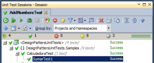
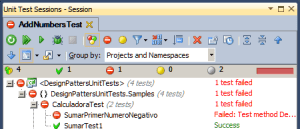
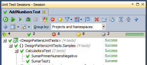
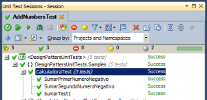
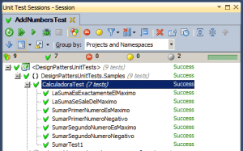
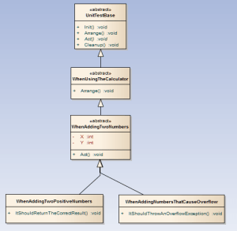

> "El testing puede probar la presencia de errores pero no la ausencia de ellos."

Edsger Wybe Dijkstra

  

El presente artículo pretende ser una gran introducción a test unitarios y TDD y una breve introducción a Mocking.

  

La presencia de tests no garantiza la ausencia de errores a no ser que se cubran todos los caminos posibles del algoritmo o del proceso y de ahí la importancia de la cobertura de código, a mayor cobertura de código mayor seguridad de que no va a haber ninguna casuística “dramática”, es decir, algún caso no contemplado que haga que todo o parte de nuestro software “se rompa”. 

  

Antes de llegar a los tests unitarios y de pasar al Mocking voy a hacer un repaso de algunos conceptos generales relacionados con pruebas de software.

  

**Test de validación / Tests de aceptación**  

> Wikipedia: Proceso de revisión de Que el software producido cumple con las especificaciones de cliente y cumple su cometido. Se Valida Que lo Que se ha conseguido es realmente lo Que el usuario realmente quería . La pregunta a realizarse es: Es esto lo que el cliente quiere?

Ahora mismo lo que generalmente se hace en grandes proyectos tener a un grupo de testers probando casos de uso, es decir, viendo si se cumplen todos los requisitos en cada paso del caso de uso, entendiendo por caso de uso a una descripción detallada de una o varias funcionalidades.

  
**Test de funcionalidad**  

> Wikipedia: Una prueba funcional es una prueba basada en la ejecución, revisión y retroalimentación de las funcionalidades previamente diseñadas para el software. Las pruebas funcionales se hacen mediante el diseño de modelos de prueba que buscan evaluar cada una de las opciones con las que cuenta el paquete informático.

 **Test de integración**  

> Wikipedia: Se refieren a la prueba o pruebas de todos los etementos individuales que componen un proceso de una sola vez, así pues, los módulos individuales son combinados y probados en conjunto. Son las pruebas posteriores a las pruebas unitarias de cada módulo y preceden a las pruebas del sistema. 

Prueban varios componentes en conjunto. Hoy en dia son las pruebas más habituales y también pueden implementarse como tests unitarios aunque no siempre son deterministicos o repetibles, porque tienen demasiadas variables en juego, y no siempre son "rápidos", de hecho casi nunca lo son. 

  
**Test unitario**  

> Wikipedia: En programación, una prueba unitaria es una forma de probar el correcto funcionamiento de un módulo de código. Esto sirve para asegurar que cada uno de los módulos funciona correctamente por separado. Luego, con las pruebas de integración, se podrá asegurar el correcto funcionamiento del sistema o subsistema en cuestión. 

La idea es escribir casos de prueba para cada función no trivial o método en el modulo de forma que cada caso sea independiente del resto. No entendamos módulos como clases enteras, incluso ni siquiera como métodos, dentro de un mismo método, uno que contenga varios bucles, se podría definir  todo un conjunto de pruebas cuyo objetivo sea verificar que dado unas precondiciones o unos valores iniciales se cumplen unas post-condiciones, es decir, unas salidas o unos estados finales. Lo detallaré un poco más adelante cuando hable de la metodología AAA de tests unitarios. Como ya se ha dicho éstos son los tests más básicos y en ellos sólo se prueba o una clase aislada o interacciones entre clases o bloques pequeños de funcionalidad y deberían cumplir siempre las siguientes características:

- Deben ser repetibles y determinísticos, es decir, ante unos inputs debo ser capaz de determinar los outputs SIEMPRE, porque se los requisitos y no escribo código a lo loco a ver que sale, y si ante determinadas situaciones sé que voy a tener determinados resultados ésto va a suceder y se va a repetir siempre
- Deben (o deberian) se automáticos, Visual Studio y/o Team Foundation Server se encargan de ello en entornos Microsoft y sé que otros entornos también incluyen frameworks para pasar baterías de tests unitarios.

**Test Driven Development**

  

Hay que entender bien para que están pensados los tests unitarios y no probar partes del código a lo loco y es aquí donde entra TDD. TDD significa Test Driven Development, es decir, desarrollo guiado por pruebas. Es realmente sencillo explicarlo y todos lo entenderán aunque no sean programadores porque son tres pasos nada más.

  
1º Defines una prueba en la que se pide cumplir cierto requisito.  
2º Escribes el código que hace que se cumpla ese requisito.

3º Ejecutas la prueba, si falla es porque el código está mal, si pasa puedes atacar el siguiente requisito.  
  
A grandes rasgos es así de sencillo aunque el bucle en nuestro trabajo es un poco mas complejo aunque el siguiente gráfico lo expresa a la perfección:  
  

 

  
Como vemos, las pruebas unitarias fomentan que el desarrollador modifique el código para mejorar su estructura lo que se ha llama actualmente refactorización. Al hacer TDD el desarrollador se ciñe más a los requisitos y no adelanta trabajo, cosa que suele degenerar en código decadente y zonas de código inutilizadas.   
  
Algo muy importante que poca gente menciona es que se puede documentar el código mediante pruebas unitarias. Como he dicho, una prueba unitaria verifica que se cumple un requisito, al elegir bien la nomenclatura de las pruebas unitarias podremos saber a la perfección como se comporta un servicio en nuestro sistema leyendo tan sólo lo títulos de cada una de las pruebas que cubren el código de dicho servicio.

  

Más adelante haré una o varias demostraciones de TDD para que se vean los patrones AAA y la nomenclatura When-ItShould que nos ayudarán a escribir tests más limpios y a documentar mediante tests respectivamente.

  

****¿Qué aportan los tests unitarios y TDD a nuestros proyectos de Software?****

  

  

Quizá sería más corto preguntar qué cosas no aportan los tests unitarios y el TDD porque, despues de lo expuesto hasta aquí vemos que los tests unitarios:

- Reducen el número de errores y bugs ya que éstos, aplicando TDD, se detectan antes incluso de crearlos.
- Facilidad para entender el código, ya que eligiendo una buena nomenclatura los tests sirven de documentación.
- Facilidad para mantener el código ya que proveen de una "malla de seguridad" que nos protege ante cambios, pues, un error que surga al aplicar un cambio debería ser detectado (y corregido) antes de subir ese cambio. 
- Ayudan a evitar regresiones, es decir, rollbacks por subidas de código que rompen algo. 
- Dan confianza, gracias a esa malla de seguridad 
- Facilidad para desarrollar si se aplica TDD pues nos ceñimos a los requisitos.
- Ayudan a encontrar inconsistencias en los requisitos 
- Ayudan a especificar comportamientos
- Ayudan a refactorizar para mejorar la calidad de nuestro código (Clean code!)
- A medio/largo plazo aumentan (mucho) la productividad.
- Simplifican la integración de sistemas pues permiten llegar a la fase de integración con la seguridad de que cada módulo independiente cumple con cierto grado de calidad y está funcionando como debería, además reducen drásticamente los problemas y los tiempos dedicados a la integración porque nos permiten poder probar o depurar las relaciones de un módulo con el sistema sin necesidad de disponer del sistema completo. Ésto se logra simulando o falseando comportamientos de clases enteras con lo que se conoce como Mocking.  

Y todo esto repercute en lo que al cliente más le importa, el ROI, Return Of Investment en inglés o retorno de la inversión en castellano, es decir, en si ha invertido todo éste dinero en un software que vale para algo o no y, sobretodo, el tiempo que va a tardar en amortizar ésta inversión.

  

Todo ésto está muy bien, ¿verdad? ¿A alguien que no conociera nada sobre tests unitarios y TDD no le han llamado la atención? Pero ¡ojo! siempre hay que considerar, como decía al principio de éste artículo, que los tests:  

1. No garantizan el éxito de un proyecto
2. No aseguran 100% de calidad
3. No son aplicables a todo proyecto, ojalá lo fueran y vemos avances en ese sentido cada día.
4. Obligan a pensar antes de empezar a programar! (cosa que se debería hacer siempre pero que la experiencia me dice que no es tan habitual...) 

**Mitos sobre los tests unitarios:**

  

"**Escribir pruebas unitarias es escribir el doble de código.**"

Las pruebas siempre se deben ir escribiendo a medida que se desarrolla el software (TDD). A medida que desarrollamos vamos probando nuestro código lo que nos permite asegurar que el módulo queda terminado correctamente, libre de errores. Escribimos monos código, os lo aseguro.

  

"**Desarrollar pruebas unitarias hace que los tiempos de desarrollo Se incrementen, incrementando I así los costes del proyecto.**"

Entre desarrollar sin tests y con tests, sinceramente, es más rápido, a priori, desarrollar sin probar nada... Lo hemos hecho hasta ahora, ¿no? (podria estar de acuerdo con esto en un desarrollo de andar por casa... ) pero entre desarrollar con pruebas unitarias y probar con métodos "mas rústicos", ésta segunda manera es más lenta y mas cara. La manera más rápida de desarrollar software es haciéndolo bien, si no desarrollamos código de calidad y no realizamos pruebas, los tiempos de desarrollo se podrán disparar enormemente porque se incrementa el tiempo de integración, los tiempos de depuración y el tiempo resolviendo incidencias, estabilizando el sistema, corrigiendo de bugs, etcétera. Además, muchos productos tienen un mantenimiento evolutivo que implica el desarrollo de nuevas funcionalidad y la corrección de incidencias. Sin un proceso adecuado de pruebas unitarias, los tiempos de pruebas se dispararan en fases posteriores, ya que será necesario probar y corregir tanto las nuevas funcionatidades como las funcionalidades ya existentes ante cada cambio. ¿Cuántas veces alguien ha subido algo y al cabo de dos días alguien se da cuenta de que hay un fallo en otra parte del sistema por culpa de aquella subida? 

  

**lntegración Continua**

  

Al hilo de lo que estaba diciendo, el control de la calidad de nuestras subidas, hay que hablar de la integración continua.  No se deben confundir los tests de integración con el concepto de integración continua., ya he hablado antes de ésto sin llegar a llamarlo integración continua. 

  

**Integración continua** quiere decir que si un test que antes funcionaba falla tras una subida existe una regresión entre el ultimo commit o subida testeada y la actual. Cuantos menos commits se hagan entre el proceso de pasar todas las pruebas mejor pues será más fácil ubicar y resolver cualquier error que nuestro desarrollo haya provocado. Mi regla es sencilla, antes de subir hay que bajar la última versión del código por si algún compañero ha subido algo, y se deben pasar todas las pruebas en local. Si todos los tests pasan entonces podemos subir con bastante tranquilidad. Si trabajamos con TFS podemos configurarlo para que en cada subida se pasen de nuevo todos los tests.  
  
Otra regla divertida y que motiva al equipo a asegurarse antes de subir su código es llevar un registro de quien ha roto la compilación y hacerlo de una manera "cachonda", por ejemplo, mandando a todo el equipo una foto con la cara de quien acaba de romper la compilación o dejarle en su escritorio un set de globos de helio y una corona hasta que otro compañero "la cague" y rompa la compilación. ¿No suena divertida? ¿Quien ha dicho que programar fuera aburrido?

  
En un servidor de integración continua ideal (como TFS) deberíamos poder:  

- Programar la ejecución de tests "rápidos" (ante cada subida o cada hora durante la jornada laboral, eso dependerá del proyecto)
- Programar tests "lentos" diariamente, tests enfocados a la integración o tests de estrés que sepamos que tardan demasiado tiempo. 
- Obtener feedback de cada commit o subida en cuestión de minutos.

**TDD: Metodología AAA  y nomenclatura When-ItShould**  

  

Hasta ahora he hablado mucho y he programado poco, vamos a ver con unos ejemplos prácticos de qué va todo ésto. Voy a empezar con el ejemplo típico de la calculadora. Supongamos que nos han pedido que hagamos una calculadora muy simple que sume dos números enteros naturales positivos a prueba de fallos. Como somos unos profesionales del TDD vamos a crear primero la clase CalculadoraTest y un primer método de prueba que instancie una calculadora y que comprueba que el resultado de sumar dos números, por ejemplo 2 y 2 es el que tiene que ser, es decir, 4. (repetible y determinista).

```
[TestClass]public class CalculadoraTest{    [TestMethod]    public void SumarTest1()    {        var calculadora = new Calculadora();        var resultado = calculadora.Suma(2, 2);        Assert.AreEqual(2 + 2, resultado);    }}
```

Lo primero que vemos es que éste código de test falla porque ni siquiera existe la clase Calculadora así que, como somos unos profesionales y practicamos los principios SOLID cada vez que programamos, vamos a empezar creando una [interfaz](http://juan-garcia-carmona.blogspot.com.es/2012/09/la-potencia-de-una-interfaz-simple.html) ICalculadora ([ISP](https://jgcarmona.com/isp-interface-segregation-principle-principio-de-segregacion-de-interfaces/)) y una clase Calculadora que la implemente, ambas vacías. Ésto es a lo que en varias ocasiones hemos llamado refactorizar, ahora hemos hecho una refactorización partiendo desde la nada. Pero el código de pruebas sigue fallando, nos falta el método Suma así que lo vamos a crear en la interfaz y en la clase, vacío con, por ejemplo un "return -1;"

```
public interface ICalculadora{    int Suma(int num1, int num2);}
```

```
public class Calculadora : ICalculadora{    public int Suma(int num1, int num2)    {        return -1;    }}
```

Si ejecutamos la prueba evidentemente va a fallar porque al sumar 2 + 2 nos va a devolver -1 y no va a cumplir la asertación, es decir, la verificación que hemos impuesto a nuestro test. ¿Qué hacemos ahora? Bueno, vamos a conseguir que pase el test, ¿no? Devolvamos num1 + num2.

```
public class Calculadora : ICalculadora{    public int Suma(int num1, int num2)    {        return num1 + num2;    }}
```

Ahora si ejecutamos el test el test pasa.  
  

[](https://jgcarmona.com/wp-content/uploads/2012/09/21a0a-test1.png)

  
Bien, hemos avanzado pero nos quedan requisitos por cumplir, nos han pedido que sean dos números enteros positivos y a prueba de fallos y nos hemos quedado en "dos números enteros", nos queda el positivos y el a prueba de fallos, fallos que podrían venir de un desbordamiento pero vamos por pasos, nuestro siguiente requisito va a ser que sean positivos y vamos a seguir los requisitos a rajatabla, es decir, si nos llega un número negativo no nos vamos a inventar un mensaje ni un log, no, vamos a lanzar una excepción de argumentos. Empecemos con el primer número:

```
[TestMethod][ExpectedException(typeof(ArgumentOutOfRangeException))]public void SumarPrimerNumeroNegativo(){    var calculadora = new Calculadora();    calculadora.Suma(-2, 2);}
```

Si ejecutamos el test falla porque en nuestra clase no estamos controlando eso.  
  

[](https://jgcarmona.com/wp-content/uploads/2012/09/dba6a-testprimernumerofalla.png)

  

Habrá que refactorizarla para comprobar si el primer parámetro es menor que cero y lanzar una ArgumentOutOfRangeException. El código de nuestra clase quedará así:

```
public int Suma(int num1, int num2){    if (num1 < 0)        throw new ArgumentOutOfRangeException("num1");    return num1 + num2;}
```

Si ahora ejecutamos los tests pasan todos, estamos en verde.  
  

[](https://jgcarmona.com/wp-content/uploads/2012/09/d9bfa-testprimernumeropasa.png)

  
 ¡Genial! Pues hagamos lo mismo con el siguiente parámetro, con num2, primero el test y luego el código que pasa el test:

```
[TestMethod][ExpectedException(typeof(ArgumentOutOfRangeException))]public void SumarSegundoNumeroNegativo(){    var calculadora = new Calculadora();    calculadora.Suma(-2, 2);}
```

```
public int Suma(int num1, int num2){    if (num1 < 0)        throw new ArgumentOutOfRangeException("num1");    if (num2 < 0)        throw new ArgumentOutOfRangeException("num2");    return num1 + num2;}
```

Y si ejecutamos los tres tests pasan todos.  
  

[](https://jgcarmona.com/wp-content/uploads/2012/09/d9766-testsegundonumeropasa.png)

  
Como vemos éste proceso iterativo e incremental de testeo (TDD) es bueno pues, nos ceñimos a los requisitos sin inventarnos nada, cosa a la que tendemos todos los desarrolladores de forma innata cuando los requisitos no son claros. Voy a obviar todos los pasos pero voy a aabar los tests y la clase que se ciñe a los requisitos del ejemplo. Primero los tests:

```
[TestClass]public class CalculadoraTest{    [TestMethod]    public void SumarTest1()    {        var calculadora = new Calculadora();        var resultado = calculadora.Suma(2, 2);        Assert.AreEqual(2 + 2, resultado);    }    [TestMethod]    [ExpectedException(typeof(ArgumentOutOfRangeException))]    public void SumarPrimerNumeroNegativo()    {        var calculadora = new Calculadora();        calculadora.Suma(-2, 2);    }    [TestMethod]    [ExpectedException(typeof(ArgumentOutOfRangeException))]    public void SumarSegundoNumeroNegativo()    {        var calculadora = new Calculadora();        calculadora.Suma(2, -2);    }    [TestMethod]    [ExpectedException(typeof(ArgumentOutOfRangeException))]    public void SumarPrimerNumeroEsMaximo()    {        var calculadora = new Calculadora();        calculadora.Suma(int.MaxValue, 2);    }    [TestMethod]    [ExpectedException(typeof(ArgumentOutOfRangeException))]    public void SumarSegundoNumeroEsMaximo()    {        var calculadora = new Calculadora();        calculadora.Suma(2, int.MaxValue);    }    [TestMethod]    [ExpectedException(typeof(ArithmeticException))]    public void LaSumaSeSaleDelMaximo()    {        var calculadora = new Calculadora();        calculadora.Suma(int.MaxValue-1, 2);    }    [TestMethod]    public void LaSumaEsExactamenteElMaximo()    {        var calculadora = new Calculadora();        calculadora.Suma(int.MaxValue - 1, 1);    }}
```

Después la clase que los pasa:

```
public class Calculadora : ICalculadora{    public int Suma(int num1, int num2)    {                if (num1 < 0)            throw new ArgumentOutOfRangeException("num1");        if (num2 < 0)            throw new ArgumentOutOfRangeException("num2");        if (num1 >= int.MaxValue)            throw new ArgumentOutOfRangeException("num1");        if (num2 >= int.MaxValue)            throw new ArgumentOutOfRangeException("num2");        try        {            int result = (Convert.ToUInt16(num1 + num2));            return result;        }        catch(ArithmeticException ex)        {            throw new ArithmeticException("La suma se sale del máximo!",ex);        }    }}
```

  

[](https://jgcarmona.com/wp-content/uploads/2012/09/a5154-los7testspasan.png)

  
¿Es mejorable éste código? Pues seguro que si pero no es el objetivo de éste artículo aprender C# sino hacer una introducción al TDD y a Mocking. Observad que en todos los tests hemos hecho más o menos lo mismo, hemos creado y preparado el test, en este caso creando una calculadora y dando valor a las variables. Después hemos ejecutado lo que queríamos probar, en nuestro caso el método sumar, y después hemos verificado que el resultado de la prueba era el esperado. En todos los tests más o menos lo mismo, ¿cierto? Pues ¡bienvenido a la metodología AAA!

  
**Metodologfa AAA: Arrange-Act-Assert**  
  
Es muy simple, lo acabamos de ver:  

1. **Arrange**: significa preparar y dar valores
2. **Act**: es actuar, ejecutar lo que se quiere probar
3. **Assert**: es asegurarse de que se ha hecho lo que se tiene que hacer

Hace unos años descubrí, [gracias a Gary Mclean Hall](http://garymcleanhall.wordpress.com/2011/07/26/towards-better-unit-testing-organization/), ésta manera de escribir tests unitarios y en verdad me ha facilitado la vida, a mí y a los compañeros que la han aprendido, interiorizado y aplicado en sus desarrollos. Voy a compartir en éste artículo su clase en aquel artículo, hecha mía y renombrada hacia la metodología AAA:  

  

```
using Microsoft.VisualStudio.TestTools.UnitTesting;/* * *  * Los tests unitarios tienen un comportamiento muy simple: *  * 1º Arrange()    -> Organizar las precondiciones * 2º Act()        -> Actuar, es decir, ejecutar lo que se quiere probar * 3º Assert()     -> Verificar que se han cumplido las postcondiciones *  * Esta visión simplista junto con una buena nomenclatura harán tu TDD mucho más sencillo. *  * Juan García Carmona *  * */namespace ArrangeActAssert{    [TestClass]    public abstract class UnitTestBase    {        [TestInitialize]        public void Init()        {            Arrange();            Act();        }        protected virtual void Arrange()        {        }        protected abstract void Act();        [TestCleanup]        public void Cleanup()        {            System.Windows.Threading.Dispatcher.CurrentDispatcher.InvokeShutdown();        }    }}
```

  
Ésta clase la tengo en un proyecto que se llama ArrangeActionAssert, es un proyecto que incluyen desde hace tiempo todos mis proyectos de tests. AAA y When-ItShould están intimamente relacionados, When-ItShould significa, literalmente, Cuando-Debería. Cuando son las dos primeras dos aes, que en palabras de Gary se puede traducir como Given That y When, es decir, nuestras tres aes son GivenThat-When-ItShould. Es lo mismo y quizá mas intuitivo, por ejemplo y al hilo del ejemplo anterior:  
  
"**Cuando** sumo dos números enteros positivos **debería** obtener la suma de ambos."  
  
Con la nomenclatura When-ItShould se puede cubrir toda la lógica de un algoritmo complejo y  
documenta por si sola porque, tan solo con ver los nombres de los tests que cubren cierta  
funcionalidad, se puede entender que hace y ver toda la lógica de negocio.  
  
Veamos como quedaría el ejemplo de la calculadora utilizando AAA como clase base de nuestros tests y la nomenclatura When-ItShould...  
  
Ésta sería la primera aproximación en UML (no ha quedado exactamente así pero sólo quiero que se vea la intención):  
  

[](https://jgcarmona.com/wp-content/uploads/2012/09/247fe-uml_aaa.png)

Éste sería el código de pruebas:

  

```
[TestClass]public abstract class WhenUsingTheCalculator : UnitTestBase{    protected Calculadora Calculator;    protected override void Arrange()    {        base.Arrange();        Calculator = new Calculadora();    }}[TestClass]public abstract class WhenAddingTwoNumbers : WhenUsingTheCalculator{    protected abstract int X { get; }    protected abstract int Y { get; }    protected int result;    protected override void Act()    {        result = Calculator.Suma(X, Y);    }}[TestClass]public class WhenAddingTwoPositiveNumbers : WhenAddingTwoNumbers{    protected override int X { get { return 13; } }    protected override int Y { get { return 45; } }    [TestMethod]    public void ItShouldReturnTheCorrectResult()    {        Assert.AreEqual(58, result);    }}[TestClass]public class WhenTheFirstNumberIsLessThanZero : UnitTestBase{    // ARRANGE:    protected  int X { get { return -1; } }    protected int Y { get { return 1; } }    protected int result;    protected Calculadora Calculator;    protected override void Arrange()    {        base.Arrange();        Calculator = new Calculadora();    }    // ACT:    // No queremos actuar aquí porque queremos recuperar una excepción:    protected override void Act(){}    [TestMethod]    [ExpectedException(typeof(ArgumentOutOfRangeException))]    public void ItShouldThrowAnOutOfRangeException()    {        // Actuamos dentro del Test        result = Calculator.Suma(X, Y);    }}[TestClass]public class WhenTheSecondNumberIsLessThanZero : UnitTestBase{    // ARRANGE:    protected int X { get { return 1; } }    protected int Y { get { return -1; } }    protected int result;    protected Calculadora Calculator;    protected override void Arrange()    {        base.Arrange();        Calculator = new Calculadora();    }    // ACT:    // No queremos actuar aquí porque queremos recuperar una excepción:    protected override void Act() { }    [TestMethod]    [ExpectedException(typeof(ArgumentOutOfRangeException))]    public void ItShouldThrowAnOutOfRangeException()    {        result = Calculator.Suma(X, Y);    }}[TestClass]public class WhenTheFirstNumberIsOutOfRange : UnitTestBase{    // ARRANGE:    protected int X { get { return int.MaxValue; } }    protected int Y { get { return 1; } }    protected int result;    protected Calculadora Calculator;    protected override void Arrange()    {        base.Arrange();        Calculator = new Calculadora();    }    // ACT:    protected override void Act() { }    [TestMethod]    [ExpectedException(typeof(ArgumentOutOfRangeException))]    public void ItShouldThrowAnOutOfRangeException()    {        result = Calculator.Suma(X, Y);    }}[TestClass]public class WhenTheSecondNumberIsOutOfRange : UnitTestBase{    // ARRANGE:    protected int X { get { return 1; } }    protected int Y { get { return int.MaxValue; } }    protected int result;    protected Calculadora Calculator;    protected override void Arrange()    {        base.Arrange();        Calculator = new Calculadora();    }    // ACT:    protected override void Act() { }    [TestMethod]    [ExpectedException(typeof(ArgumentOutOfRangeException))]    public void ItShouldThrowAnOutOfRangeException()    {        result = Calculator.Suma(X, Y);    }}[TestClass]public class WhenTheTheSumIsOutOfRange : UnitTestBase{    // ARRANGE:    protected int X { get { return 2; } }    protected int Y { get { return int.MaxValue-1; } }    protected int result;    protected Calculadora Calculator;    protected override void Arrange()    {        base.Arrange();        Calculator = new Calculadora();    }    // ACT:    protected override void Act() { }    [TestMethod]    [ExpectedException(typeof(ArithmeticException))]    public void ItShouldThrowAnArithmeticException()    {        result = Calculator.Suma(X, Y);    }}[TestClass]public class WhenTheTheSumIsExactlyMaxValue : UnitTestBase{    // ARRANGE:    protected int X { get { return 1; } }    protected int Y { get { return int.MaxValue - 1; } }    protected int result;    protected Calculadora Calculator;    protected override void Arrange()    {        base.Arrange();        Calculator = new Calculadora();    }    // ACT:    protected override void Act() { }    [TestMethod]    public void ItShouldReturnMaxValue()    {        result = Calculator.Suma(X, Y);        Assert.AreEqual(int.MaxValue, result);    }}
```

  

Creo que ese código es auto explicativo  y las pruebas lo son aún más, quizá es demasiado largo y se podría simplificar mucho, por ejemplo, haciendo algo muy común que es hacer Arrange y Act dentro del método de test en pruebas que esperan excepciones. Que no se pierda nadie, en la clase WhenAddingTwoNumbers podría haber metido, sueltos, cada uno de los tests de errores y haberlos llamado por ejemplo  ItShouldReturnMaxValueGivenThatTheSumIsExactlyMaxValue y dentro de ese método de prueba podría haber hecho:

  

```
result = Calculator.Suma(1, int.MaxValue -1);Assert.AreEqual(int.MaxValue, result);
```

  
Además, al escribir éstas pruebas me he dado cuenta, porque una de ellas me fallaba, que mi calculadora no se estaba comportando bien entorno al valor máximo. Al final he refactorizado el código de la calculadora y ha quedado así:  

```
public class Calculadora : ICalculadora{    public int Suma(int num1, int num2)    {        if (num1 < 0)            throw new ArgumentOutOfRangeException("num1");        if (num2 < 0)            throw new ArgumentOutOfRangeException("num2");        if (num1 >= int.MaxValue)            throw new ArgumentOutOfRangeException("num1");        if (num2 >= int.MaxValue)            throw new ArgumentOutOfRangeException("num2");        try        {            var result = num1 + num2;            if (result < 0)                throw new ArithmeticException("La suma se sale del máximo!");            else            return result;        }        catch(ArithmeticException ex)        {            throw new ArithmeticException("La suma se sale del máximo!",ex);        }    }}
```

  
¿Sigue el lector conmigo o se ha marchado asustado?  
  
**Cobertura**  
  
Antes de entrar en temas de Mocking, parte importante de éste artículo, y para relajarnos un poco quiero volver al principio:  

> "El testing puede probar la presencia de errores pero no la ausencia de ellos."

Ya nos ha quedado claro a todos que la presencia de tests no garantiza la ausencia de errores a no ser que se cubran todos los caminos posibles de nuestros algoritmos, y de ahí la importancia de la cobertura de código. A mayor cobertura, mayor seguridad de que no va a haber ninguna causistica "dramática", algún caso no contemplado que haga que todo o parte de nuestro software "se rompa". (Lo sé, me repito, pero es importante)  
  
Se llega a la practica certeza de que no hay errores cuando se han probado todas los posibles caminos de un algoritmo. La cantidad de caminos depende de la complejidad de cada algoritmo y dicha complejidad se mide con lo que se conoce como complejidad ciclomática.  
  
**Complejidad ciclomática**  

> **Wikipedia**: La complejidad ciclomática (en inglés, cyclomatic complexity) es una métrica del software que proporciona una medición cuantitativa de la complejidad lógica de un programa. Es una de las métricas de software de mayor aceptación, ya que ha sido concebida para ser independiente del lenguaje.

Se utiliza, entre otras cosas para planificación de pruebas: el análisis matemático ha  
demostrado que la complejidad ciclomática indica el número exacto de casos de prueba  
necesarios para probar cada punto de decisión en un programa.  
  
Siendo:  
  

- CC = complejidad ciclomatica
- A = Número de aristas del grafo. Una arista conecta dos vértices si una sentencia puede ser ejecutada inmediatamente después de la primera.
- N = Número de nodos del grafo correspondientes a sentencias del programa.
- P = Número de componentes conexos correspondientes a las diferentes subrutinas, funciones o métodos.

  
Entonces: CC = A - N + P  
  
No voy a entrar en ejemplos de cálculo de la complejidad ciclomática pero si alguien quiere saber más aquí dejo [éste enlace](http://www.codeproject.com/Articles/11719/Cyclomatic-Code-Complexity-Analysis-for-Microsoft).  
  
Ahora pasemos, por fin, a Mocking...  
  
**¿Qué es Mocking?**  
  
Es Una técnica para testar software en la que se simulan partes del sistema con las que el objeto a testar tiene alguna dependencia. Un mock es un objeto "dummy", son "fakes" de partes del sistema a las que se puede definir su comportamiento "On the fly". ¿Cómo es posible ésto? Fácil, un mock usa la interfaz de un objeto real y la implementa y si hemos seguido mínimamente los principios SOLID podemos sustituir una instancia de nuestro objeto falseado, nuestro mock, por el objeto que en realidad se esperaba.  
  
Repito, el objeto que queremos probar utiliza un objeto "mockeable", y lo es porque implementa cierta interfaz que define su comportamiento. Al objeto testeable no le importa en realidad cual de los dos objetos usa, no sabe si es una implementación real o es un fake. En el fondo no deja de ser polimorfismo aplicado mediante [inyección o inversión de dependencias](https://jgcarmona.com/dip-dependency-inversion-principle-principio-de-inversion-de-dependencias/).  
  

1. DI obliga a separar componentes
2. Para testar hace falta aislar módulos
3. Aislar módulos implica quitar dependencias
4. Mocking permite simular otros módulos

  
Ergo :  
  

**Mocking Rocks!!**

  

Éste artículo quería ser una introducción a TDD y Mocking y no un artículo sobre Mocking, por eso, después de varios días preparandolo acabo de decidir dejar para un siguiente artículo el Mocking propiamente dicho, en castellano, claro, pero voy a recomendar alguna lectura que estoy seguro que puede servir de guía para quien haya leído hasta aquí y no pueda esperar al siguiente aertículo.

  

[How to use Moq mocking library](http://geekswithblogs.net/liammclennan/archive/2008/05/09/122007.aspx)

[Basic mocking with Moq](http://blog.decayingcode.com/post/part-2-basic-of-mocking-with-moq.aspx)

[Beggining with Moq](http://www.codethinked.com/Beginning-Mocking-With-Moq-3-Part-1)

  

Como comentario final quiero insistir en que merece la pena tener siempre presentes los [principios SOLID](http://juan-garcia-carmona.blogspot.com.es/2012/09/principios-solid.html) y GRASP o principios para la asignación de responsabilidades, los patrones de diseño y en concreto la inyección de dependencias ([DI](http://en.wikipedia.org/wiki/Dependency_injection)) y el principio en el que se basa, la inversión del control ([loC](http://es.wikipedia.org/wiki/Inversi%C3%B3n_de_control)). Tener estos conceptos claros nos facilitará el testing mediante Mocking y en general, dichos principios nos aportarán profesionalidad desarrollando software. Aún tengo pendiente una serie de artículos sobre GRASP y otra serie de artículos sobre patrones de diseño entre los que está DI, todos ellos con ejemplos de código y diagramas UML realizados por mí. En concreto para el de patrones de diseño quería hacerlo, y ya lo he empezado, utilizando TDD y mocking. Tiempo al tiempo.

Juan García Carmona

[d.jgc.it@gmail.com](mailto:d.jgc.it@gmail.com)
