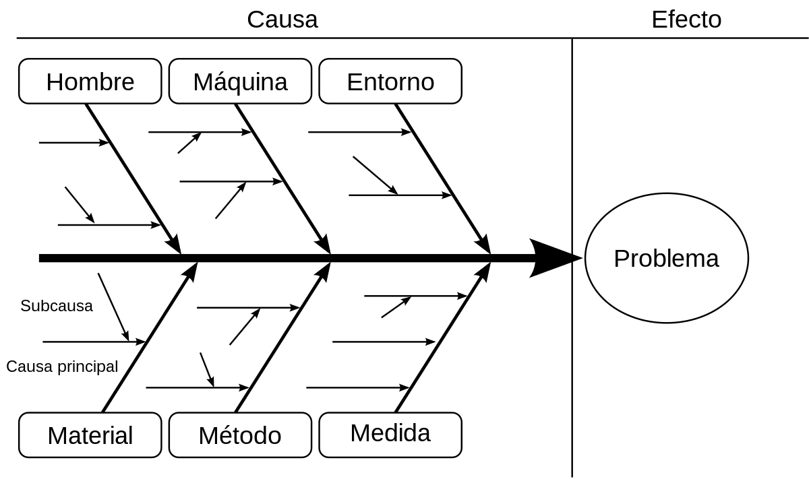

Kaizen proviene de los términos japoneses **"kai"**, que significa cambio, y **"zen"**, que significa bueno. Esto se traduce literalmente como "cambio para mejorar"o lo que es lo mismo, "mejora continua". Kaizen es una mentalidad que subraya la importancia de la mejora continua e incremental. El concepto anima a la gente a dar pequeños pasos para crear un cambio significativo. En lugar de intentar cambios radicales, el Kaizen hace hincapié en soluciones sencillas pero eficaces para lograr el éxito a largo plazo. Aunque parece simple, el Kaizen tiene el potencial de transformar nuestras vidas y nuestro trabajo, también en el campo del desarrollo de software.

## ¿Cómo podemos aplicar Kaizen en nuestras vidas?

La clave para la mejora continua es centrarse en pequeños cambios positivos, paso a paso, que nos acerquen cada vez más al objetivo final. Esto significa identificar áreas de nuestra vida donde queremos mejorar y luego hacer pequeños cambios para lograrlo. Por ejemplo, si queremos perder peso, podemos comenzar por hacer pequeñas modificaciones en nuestra dieta y rutina de ejercicio. También podemos utilizar Kaizen para alcanzar nuestro Ikigai.

Tener presente este concepto, Kaizen, y su filosofía de mejora continua, también puede ayudarnos a mantenernos motivados para alcanzar nuestros objetivos. Al centrarnos en pequeñas metas diarias o semanales, nos sentimos realizados cuando logramos cumplirlas y nos motivamos para seguir adelante con el próximo paso hacia el éxito final.

Para implementar Kaizen en el desarrollo de software, hay algunas herramientas y técnicas que los equipos de desarrollo pueden usar para mejorar la calidad de su código.

Algunas de estas herramientas y técnicas incluyen:

- La utilización sistemática de **pruebas unitarias** para asegurar que la calidad del código sea alta antes de publicarse.

- Las **revisiones de código** frecuentes. Pedir opiniones con regularidad no solo ayuda a los equipos a conocer mejor su producto, sino que también fomenta la empatía entre los grupos y los clientes, lo que conduce a resultados superiores a largo plazo.

- También es conveniente **utilizar métricas e indicadores** para monitorizar el rendimiento, es una forma eficaz de identificar áreas de mejora en un grupo de trabajo y en un sistema informático, ya que este análisis nos permite planificar actividades posteriores y mejorarlas según sea necesario.

## Ejercicios Prácticos para Implementar Kaizen en el Desarrollo de Software

Además de estas técnicas, habituales y frecuentes en nuestro campo, aquí os dejo dos valiosas herramientas para ayudarnos a implementar Kaizen en nuestro trabajo diario (y quizá también en nuestra vida):

### **Cuestionario Kaizen:**

El cuestionario Kaizen se compone de 12 preguntas clave sobre nuestro proyecto actual o metodología existente, con el objetivo de identificar áreas potencialmente mejorables.  Las 12 preguntas clave incluidas en el cuestionario Kaizen son:

1. ¿Estoy **motivado** para realizar este trabajo?

3. ¿Tengo suficientes **recursos** para poder completar este trabajo?

5. ¿Es esta tarea **importante para el equipo**?

7. ¿Estamos usando **la mejor metodología posible** para lograr nuestro objetivo?

9. ¿El **proceso** es predecible y repetible?

11. ¿Es el **trabajo** tangible o intangible?

13. ¿Será suficiente el **tiempo** disponible para esta tarea?

15. ¿Los **resultados** son medibles y los **problemas** son diagnosticables?

17. ¿Se ha tomado un buen **control de calidad** del trabajo realizado hasta ahora?

19. ¿Existen métodos efectivos de **revisión** de código en nuestro equipo?

21. ¿Qué podemos hacer para **optimizar nuestros procesos** existentes?

23. ¿Cuáles son los **riesgos** potencialmente relacionados con esta tarea y qué podríamos hacer para abordarlos de forma efectiva?

El cuestionario Kaizen puede ser útil tanto para un desarrollador individual como para grupos de desarrolladores. A nivel personal, el cuestionario puede ayudarnos a identificar metas personales y los procesos que necesitan ser mejorados para alcanzarlas. El cuestionario también puede apoyar equipos más grandes en la evaluación y optimización de sus proyectos actuales. Al completar el cuestionario con sinceridad, los miembros del equipo obtienen una comprensión clara de cómo se están llevando los proyectos y qué cambios podrían implementarse para lograr mejores resultados. Además, el uso frecuente del cuestionario permite al equipo rastrear su progreso a través del tiempo, lo que les permite evaluar si el rendimiento aumentó o disminuyó y lanzar ideas para mejorar su trabajo a corto y largo plazo.

### **Diagrama Causa-Efecto (Ishikawa):**

El Diagrama de Ishikawa, también conocido como Diagrama de Causa y Efecto o Espina de Pescado, es una herramienta utilizada para identificar las posibles causas subyacentes detrás de un problema. El diagrama se presenta visualmente como una espina de pescado con varias ramas que muestran diferentes áreas en las que podrían existir posibles causas del problema. Estas áreas incluyen el personal, los procesos, la tecnología, los materiales y el medio ambiente. La metodología se aplica al problema en cuestión para identificar factores que contribuyan al mismo y ofrecen soluciones sólidas basadas en estos hallazgos.

Para crear un diagrama Ishikawa, primero hay que **identificar el problema** en cuestión y **establecer un objetivo** para resolverlo. Luego, se debe establecer un **equipo de trabajo** que trabaje en conjunto para formular preguntas relacionadas con el problema. El objetivo principal del diagrama es **separar la causa del efecto** y deben tenerse en cuenta todas las posibles causas. Una vez que los miembros del equipo han identificado las posibles causas y motivos, pueden comenzar a diseñar el diagrama. Esto implica dibujar la espina de pescado con los factores preestablecidos alrededor de los ejes y luego conectar cada factor a sus respectivas áreas.

Los diagramas de Ishikawa son una herramienta valiosa en el proceso [Kaizen](https://es.wikipedia.org/wiki/Kaizen), ya que **permiten a los equipos reconocer los aspectos externos e internos que influyen en un problema.** Esto les ayuda a adquirir un conocimiento interpretativo de lo que está causando ese problema, dotándoles así de la capacidad de desarrollar planes eficaces de mejora.  
  
Puedes volver a la serie de artículos **[haciendo clic aquí](https://jgcarmona.com/mejorar-en-programacion-con-filosofias-japonesas/)**.
