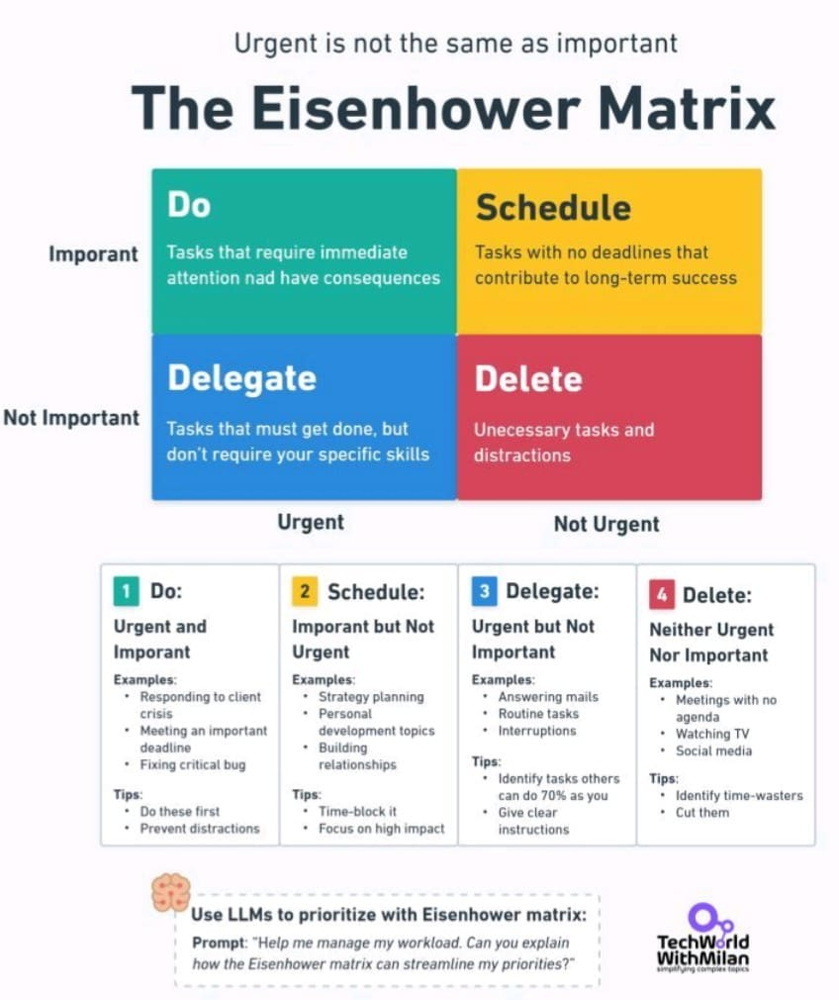
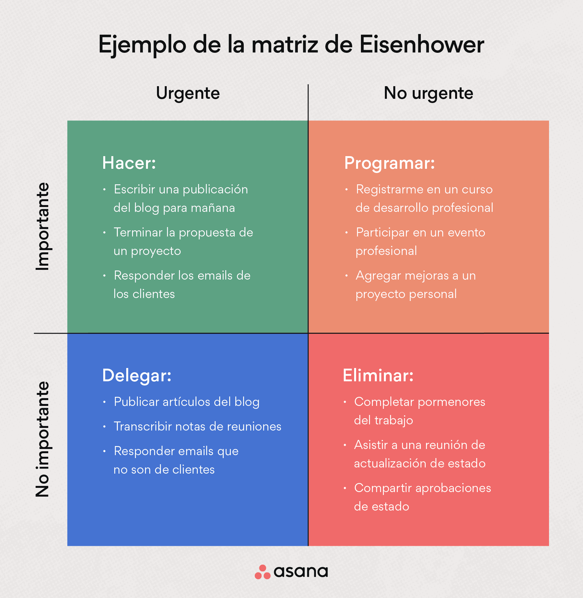

La mayoría de las personas no tiene un problema de tiempo. Su forma de organizar su tiempo tiene un problema de enfoque.

Pasan el día apagando fuegos, saltando entre tareas urgentes, pero sin avanzar en lo que realmente importa. La solución no es otra app. Es mucho más fácil, se trata de aprender a distinguir lo urgente de lo importante.

Para eso existe una herramienta visual que llevo años enseñando a mis alumnos y mentees: la Matriz de Eisenhower.

## ¿Qué es la Matriz de Eisenhower?

Una cuadrícula. Dos ejes:

Urgente vs No urgente

Importante vs No importante

Y a partir de ahí, cuatro tipos de tareas:

📌 Hacer (Urgente + Importante): tareas críticas con consecuencias reales si se retrasan.  
📆 Programar (Importante + No urgente): lo estratégico, lo que construye tu futuro (pero que casi siempre pospones).  
🔁 Delegar (Urgente + No importante): cosas que hay que hacer, pero no necesariamente tú.  
❌ Eliminar (Ni urgente ni importante): lo que drena tu energía sin aportar valor.

Un ejemplo práctico (Dr. Milan Milanović)

El Dr. Milan Milanović es CTO y referente en liderazgo técnico con más de 20 años de experiencia profesional en sectores como banca, energía, telecomunicaciones y seguros. Combina una sólida carrera técnica con una fuerte vocación formativa: ha publicado más de 20 artículos científicos en conferencias y revistas internacionales, y hoy lidera procesos de transformación apoyando a equipos y profesionales como formador, mentor y coach.  
Un perfil imprescindible a seguir en LinkedIn si te interesa el desarrollo profesional serio y con impacto.

Otro ejemplo (Asana)

Este segundo ejemplo de Asana muestra cómo aplicar esta herramienta en entornos de marketing, contenido y gestión de tareas cotidianas. Visual, claro y accionable.

¿Cómo lo uso con mis alumnos?

Cuando empiezo a trabajar con un ingeniero, líder técnico o emprendedor que se siente "atascado" o "desbordado", no empiezo por productividad, empiezo por ayudarle a encontrar su rumbo y su ritmo... Y una de las herramientas que más ayuda es ésta, la matriz de Eisenhower.

Usamos esta matriz como base para auditar juntos en qué están invirtiendo a menudo malgastando su tiempo, a menudo malgastado.

Y el patrón se repite:  
Lo importante está enterrado bajo lo urgente.  
Lo estratégico siempre se aplaza.

Con solo 30 minutos aplicando esta herramienta, muchas personas encuentran foco, orden y paz mental.

### ¿Quieres aplicarlo tú también?

✅ Si estás saturado de tareas que no sabes ni por qué haces  
✅ Si sientes que no llegas a lo importante  
✅ O si simplemente quieres claridad para tomar mejores decisiones…

[Reserva](/contact) una sesión de [mentoring](https://jgcarmona.com/mentorias/) conmigo.  
Trabajo con desarrolladores, ingenieros y líderes técnicos para ayudarles a mejorar no solo su productividad, sino su claridad estratégica.

[¿Te enseño a gestionarte mejor?](https://jgcarmona.com/coaching/)
