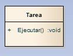
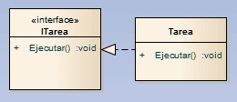
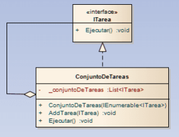
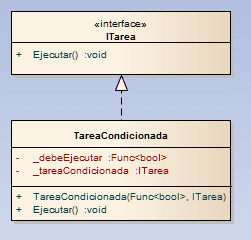

> El propósito de este artículo es completar con diagramas de clase y con código lo poco que hablé de las Interfaces en otros artículos anteriores, "[UML de batalla](https://jgcarmona.com/uml-de-batalla/)" e "[ISP: Interface Segregation Principle // Principio de Segregación de Interfaces](https://jgcarmona.com/isp-interface-segregation-principle-principio-de-segregacion-de-interfaces/)", y demostrar de forma práctica algunas de sus bondades y/o las virguerías que podemos hacer nosotros con ellas.

Lo primero de todo, ¿qué es una interfaz? Cualquier desarrollador que me esté leyendo debería saberlo y si no lo sabe bien se puede leer [éste breve artículo de la Guía de programación en C#](http://msdn.microsoft.com/es-es/library/ms173156\(v=vs.80\).aspx), el cuál es bastante recomendable si queda alguna duda al respecto. Mi definición de Interfaz es que es un contrato.

> Una interfaz es un contrato de software el cuál, las clases que realizan dicha interfaz, deben cumplir implementándola debidamente.

Ya mostré en los distintos artículos relacionados con los [principios](http://juan-garcia-carmona.blogspot.com.es/2012/08/principios-solid.html) [S](https://jgcarmona.com/srp-single-responsibility-principle-principio-de-unica-responsabilidad/).[O](https://jgcarmona.com/ocp-open-closed-principle-principio-abierto-cerrado/).[L](https://jgcarmona.com/lsp-liskov-substitution-principle-principio-de-sustitucion-de-liskov/).[I](https://jgcarmona.com/isp-interface-segregation-principle-principio-de-segregacion-de-interfaces/).[D](https://jgcarmona.com/dip-dependency-inversion-principle-principio-de-inversion-de-dependencias/). ejemplos de malos  y buenos usos de interfaces y seguro que volveré a hablar de ellas cuando acabe la serie de artículos sobre GRASP. Hoy mi propósito, como decía, es jugar un poco con ellas tanto con código como con [diagramas de clases UML](http://juan-garcia-carmona.blogspot.com.es/2012/09/uml-de-batalla.html).

Voy a partir de una clase cuya [única responsabilidad](https://jgcarmona.com/srp-single-responsibility-principle-principio-de-unica-responsabilidad/) es ejecutar algo, a ésta clase la voy a llamar **Tarea**.

[](https://jgcarmona.com/wp-content/uploads/2012/09/865c4-tarea.png)

Imagina que ésta clase pertenece a un programa para el que se le quieren añadir mejoras como control de **tareas en hilos**, **tareas compuestas,** **bifurcaciones de tareas**, **tareas condicionales**, etcétera y seré yo quien desarrolle dichas mejoras. Lo primero que haré será rezar porque exista una interfaz ITarea para que todas las clases que desarrolle a partir de ahora para implementar los nuevos requisitos cumplan con su única responsabilidad, en nuestro ejemplo "Ejecutar()". Ha habido suerte y existe ITarea, y por tanto parto de lo siguiente:

[](https://jgcarmona.com/wp-content/uploads/2012/09/41b48-itarea.png)

¿Recuerdas el [UML de batalla](http://juan-garcia-carmona.blogspot.com.es/2012/09/uml-de-batalla.html)? La línea discontinua con punta de flecha blanca significa que realiza, es decir, Tarea realiza ITarea, o lo que es lo mismo, Tarea implementa la Interfaz ITarea. En código tengo ésto, mi punto de partida:

```
public interface ITarea
{
    void Ejecutar();
}
```

```
public class Tarea : ITarea
{
    public void Ejecutar()
    {
        //SRP: Single Responsibility Principle
    }
}
```

Bien, voy a atacar ahora uno de los primeros requisitos nuevos, las tareas compuestas. es decir, agrupar una serie de tareas para ser ejecutadas en serie. Para ésto voy a crear una clase que implemente ITarea pero que además contenga, internamente, un conjunto de ITareas, algo así:

[](https://jgcarmona.com/wp-content/uploads/2012/09/4c51d-conjuntodetareas.png)

Éste podría ser el código:

```
public class ConjuntoDeTareas : ITarea
{
    private readonly List<ITarea> _conjuntoDeTareas;

    public ConjuntoDeTareas(IEnumerable<ITarea> tareas)
    {
        _conjuntoDeTareas = new List<ITarea>();
        if (tareas != null)
        {
            foreach (var tarea in tareas)
            {
                AddTarea(tarea);
            }
        }
    }

    public void Ejecutar()
    {
        foreach (var tarea in _conjuntoDeTareas)
        {
            tarea.Ejecutar();
        }
    }

    public void AddTarea(ITarea tarea)
    {
        if (tarea != null)
        {
            _conjuntoDeTareas.Add(tarea);
        }
    }
}
```

¿Por qué lo he hecho así? Como éste ConjuntoDeTareas implementa ITarea puedo pasar cualquier ConjuntoDeTareas a cualquier método o constructor que utilice una ITarea y ejecutar todo ese conjunto de tareas de  golpe y por si solo, sin tener que reescribir el código que ya había para una sola tarea y refactorizarlo para funcionar con varias. ¿Cuánto tiempo y quebraderos de cabeza me habré ahorrado por haberle dedicado un poco de tiempo a pensar antes de actuar? Supongo que bastante y además, no hay nada que me impida incluir un ConjuntoDeTareas dentro de otro ConjuntoDeTareas ya que implementa ITarea y podré construir, de manera simple, verdaderos "monstruos de las Tareas" que serán ejecutados en profundidad por mi código cuando yo quiera. ¡Bravo!

Voy a atacar ahora el típico problema cuando trabajamos con conjuntos de objetos, la gestión de nulos y las odiosas **NullReferenceException**. Puedo usar instancias de **TareaNula** en vez de nulls para evitar null reference exceptions. Una buena práctica sería hacer logging del uso de instancias de ésta clase para localizar el punto en el que se generan nulos en el sistema. La clase TareaNula es muy simple:

```
public class TareaNula:ITarea
{
    public void Ejecutar()
    {
        // ¿Log aquí?
    }
}
```

Voy a por otro de los nuevos requisitos, imaginemos que nos dicen que se quiere que la ejecución se realice sólo bajo cierta **condición**. En vez de llevar el control de la ejecución a un nivel superior creo una clase que implemente ITarea y que se encargue de comprobar si debe ejecutarse o no. Su estructura en un diagrama de clases podría ser ésta:

[](https://jgcarmona.com/wp-content/uploads/2012/09/6f2ba-tareacondicionada.png)

Y éste su código:

```
public class TareaCondicionada : ITarea
{
    private readonly Func<bool> _debeEjecutar;
    private readonly ITarea _tareaCondicionada;

    public TareaCondicionada(Func<bool> condicion, ITarea tarea)
    {
        if (condicion == null)
        {
            throw new ArgumentException("condicion");
        }

        if (tarea == null)
        {
            throw new ArgumentException("tarea");
        }

        _debeEjecutar = condicion;
        _tareaCondicionada = tarea;
    }

    public void Ejecutar()
    {
        if (_debeEjecutar())
        {
            _tareaCondicionada.Ejecutar();
        }
    }
}
```

Gracias a ésta nueva clase **TareaCondicionada**, al tratarse de una implementación de **ITarea**, podemos, junto con la clase **ConjuntoDeTareas**, tratar un conjunto de tareas y al ejecutar dicho conjunto algunas pueden no ejecutarse. ¿Suena útil? Puede serlo. ¿Y si ampliáramos éste comportamiento de la siguiente forma, que bajo cierta condición se ejecute una tarea pero que si no se cumple se ejecute otra tarea distinta? Por la bifurcación que implica llamaré a esta nueva clase **TareaBinaria**:

[](https://jgcarmona.com/wp-content/uploads/2012/09/71a2c-tareabinaria.png)

Me quedaría algo tan simple como ésto:

```
public class TareaBinaria : ITarea
{
    private readonly Func<bool> _condicion;
    private readonly ITarea _trueTarea;
    private readonly ITarea _falseTarea;

    public TareaBinaria(Func<bool> condicion, ITarea tareaSeCumple, ITarea tareaNoSeCumple)
    {
        if (condicion == null)
        {
            throw new ArgumentException("condicion");
        }
        if (tareaSeCumple == null)
        {
            throw new ArgumentException("tareaSeCumpleCondicion");
        }
        if (tareaNoSeCumple == null)
        {
            throw new ArgumentException("tareaNoSeCumpleCondicion");
        }

        _condicion = condicion;
        _trueTarea = tareaSeCumple;
        _falseTarea = tareaNoSeCumple;
    }

    public void Ejecutar()
    {
        if (_condicion())
        {
            _trueTarea.Ejecutar();
        }
        else
        {
            _falseTarea.Ejecutar();
        }
    }
}
```

Ojo porque aquí podemos explotar. ¿Y si en vez de tener una condición binaria me pidieran que actua de acuerdo a un valor enumerado o que utilice ésta condición como un parámetro para aplicarlo en un bucle al "Ejecutar"? Podría hacerlo y no sería complicado, ¿verdad?

Ahora cambiemos de escenario. Imagina que nos han pedido que se ejecute una Tarea A hasta que suceda un **evento** y luego quieren que se ejecute una Tarea B. Necesito pasar un evento al constructor de una **TareaInterrumpible** pero, hasta donde yo sé, no se puede hacer esto con .NET así que voy a definir una interfaz para éste propósito a ver qué sale, **IInterrupción**:

```
public interface IInterrupcion
{
    event Action Signal;
}
```

Bueno, IInterrupcion (la podía haber llamado IInterrumpible) tiene la señal que actuará de evento y la TareaInterrumpible que busco podría implementarse así:

```
public class TareaInterrumpible : ITarea
{
    private readonly IInterrupcion _interrupcion;
    private readonly ITarea _tareaNormal;
    private readonly ITarea _tareaInterrupcion;

    public TareaInterrumpible(IInterrupcion interrupcion, ITarea tareaNormal, ITarea tareaInterrupcion)
    {
        if (interrupcion == null)
        {
            throw new ArgumentException("interrupcion");
        }
        if (tareaNormal == null)
        {
            throw new ArgumentException("TareaNormal");
        }
        if (tareaInterrupcion == null)
        {
            throw new ArgumentException("TareaInterrupcion");
        }
        _interrupcion = interrupcion;
        _tareaNormal = tareaNormal;
        _tareaInterrupcion = tareaInterrupcion;
    }

    public void Ejecutar()
    {
        _interrupcion.Signal += EjecutarTareaInterrupcion;
        _tareaNormal.Ejecutar();
    }

    private void EjecutarTareaInterrupcion()
    {
        _tareaInterrupcion.Ejecutar();
    }
}
```

Me gusta, parece viable, pero... ¡Oye! ¿Y si resulta que una tarea y la otra son mutuamente excluyentes? No podría ejecutar una tarea hasta que no hubiera cancelado la otra. ¿Cómo hago esto? Bien, pues a priori se me ocurre que podría crear una interfaz **ICancelable** así:

```
public interface ICancelable
{
    void Cancelar();
}
```

Y hacer que la primera tarea implementara también ICancelable para cancelarla antes de ejecutar la otra tarea. Si, probablemente lo hiciera así y dormiría más tranquilo sabiendo que todo iba a funcionar como se espera.

Sigamos enredándonos un poco en este ejemplo, imagina que alguna de estas tareas puede llevar mucho tiempo de ejecución. Como no quiero que se retrase el proceso de ejecución de todo un ConjuntoDeTareas  porque quiero ir obteniendo resultados de la ejecución de mis tareas quizá necesite crear un nuevo tipo de tareas que **se ejecuten en un hilo aparte** y no estorben la ejecución de las demás, las llamaré **TareaEnHilo**:

```
public class TareaEnHilo : ITarea
{
    private readonly ITarea _tareaAlHilo;
    private readonly BackgroundWorker _backgroundWorker;

    public TareaEnHilo(ITarea tarea)
    {
        if (tarea == null)
        {
            throw new ArgumentException("tarea");
        }
        _tareaAlHilo = tarea;
        _backgroundWorker = new BackgroundWorker();
        _backgroundWorker.DoWork += (sender, eventArgs) => EjecutarTarea();
    }

    public void Ejecutar()
    {
        _backgroundWorker.RunWorkerAsync();
    }

    private void EjecutarTarea()
    {
        _tareaAlHilo.Ejecutar();
    }
}
```

En el ejemplo, y pensando en un gran conjunto de tareas, podría meter las tareas más "largas" las primeras en mi **ConjuntoDeTareas** como instancias de **TareaEnHilo**. ¡Ojo!, no es descabellado que al conjunto del sistema le pueda interesar que éstas tareas que se ejecutan en hilos separados fueran tareas tareas cancelables, es decir, que implementaran **ICancelable**. Quedaría algo así:

```
public class TareaAsincrona : ITarea, ICancelable
{
    private readonly ITarea _tareaAlHilo;
    private readonly BackgroundWorker _backgroundWorker;

    public TareaAsincrona(ITarea tarea)
    {
        if (tarea == null)
        {
            throw new ArgumentException("task");
        }
        _tareaAlHilo = tarea;
        _backgroundWorker = new BackgroundWorker();
        _backgroundWorker.DoWork += (sender, eventArgs) => EjecutarTarea();
        _backgroundWorker.WorkerSupportsCancellation = true;
    }

    public void Ejecutar()
    {
        _backgroundWorker.RunWorkerAsync();
    }

    public void Cancelar()
    {
        _backgroundWorker.CancelAsync();
    }

    private void EjecutarTarea()
    {
        _tareaAlHilo.Ejecutar();
    }
}
```

¡Genial! ¡Bravo! Pero: ¿Y para qué tantas vueltas?

Volvamos al inicio de éste artículo, tu y yo **somos los nuevos arquitectos** de un proyecto y nos van a encargar que **añadamos una serie de funcionalidades** sobre algo que ya hay desplegado, funcionalidades a priori **aparentemente complejas pero nunca se sabe...** Lo realmente llamativo de éste artículo debería ser que con este tipo de técnicas, es decir, utilizando "decoradores" y [Segregación de Interfaces](https://jgcarmona.com/isp-interface-segregation-principle-principio-de-segregacion-de-interfaces/),  **podríamos implementar cualquier requisito nuevo sin tener que modificar ninguno de los componentes del sistema que actualmente utilicen esta interfaz** sobre la que hemos estado jugando "alrededor".

Hemos visto como se puede lograr una separación de cometidos y mantener el [principio de única responsabilidad](https://jgcarmona.com/srp-single-responsibility-principle-principio-de-unica-responsabilidad/) al mismo tiempo: separamos cometidos al ir creando multitud de clases alrededor de una interfaz en lugar de modificar o falsear el comportamiento de los componentes del sistema que la utilizan y mantenemos el principio de única responsabilidad ya que cada clase, cada implementación distinta de ITarea en éste ejemplo, se centra en su cometido y no en otros.

Al ejercer el principio de [segregación de interfaces](https://jgcarmona.com/isp-interface-segregation-principle-principio-de-segregacion-de-interfaces/) el número de interfaces puede crecer muchísimo, exponencialmente. Esto no quiere decir que por cada interfaz que surja debamos tener en cuenta todas estas "implementaciones decoradas" que hoy hemos visto, nada más lejos, sólo es que hay muchas ocasiones en las que una o más de estas soluciones, en colaboración, pueden quitar complejidad a componentes de nuestro sistema que no tendrían porque tenerla y simplificarnos mucho nuestro trabajo....

Y estaremos aplicando los principios SOLID.

Juan García Carmona

[d.jgc.it@gmail.com](mailto:d.jgc.it@gmail.com)
