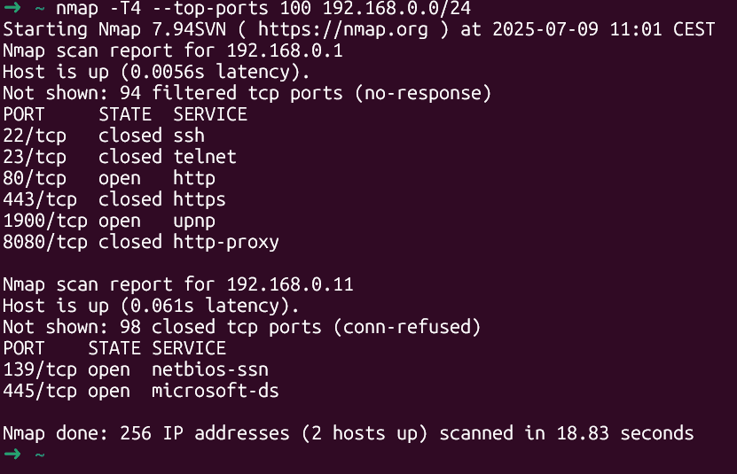

Si eres administrador de redes o sistemas, saber Linux ya no es opcional. Aquí tienes lo mínimo que necesitas para empezar a descubrir redes, analizar tráfico y automatizar tareas desde Ubuntu. Este artículo es la **continuación natural de [“Tu primer Linux en 3 pasos”](https://jgcarmona.com/ubuntu-linux-en-windows-con-wsl/)**, una guía que escribí para ayudar a un amigo a instalar Ubuntu desde Windows y empezar con WSL.

Ahora damos un paso más allá.


Este segundo artículo nace por necesidad práctica: ese mismo amigo, administrador de red, está haciendo muchísimo trabajo manual para auditar y gestionar una red compleja. Aunque mi día a día gira más en torno al desarrollo y la arquitectura de software, hoy me salgo de esa zona para hablar de herramientas de red. Algunas las verás como herramientas de hacking. Otras, como utilidades de administración. Depende de cómo —y quién— las use.

El objetivo aquí es claro: enseñar cómo descubrir y mapear todos los equipos conectados a una red, para poder gestionarlos mejor.

Todo con herramientas libres, potentes y al alcance de cualquiera que tenga una máquina con Linux.

##   
¿Qué es sudo?

En Ubuntu y sistemas basados en Debian sudo significa **su**peruser **do**. Te permite ejecutar un comando como administrador. Por ejemplo, así actualizaría el sistema:

```bash
sudo apt update
```

## Herramientas básicas

Primero, actualiza tu sistema:

```bash
sudo apt update && sudo apt upgrade -y
```

Luego instala las herramientas necesarias:

```bash
sudo apt install nmap masscan net-tools tcpdump snmp ipcalc traceroute xmlstarlet xsltproc -y
```

> ⚠️ Si usas WSL, algunas funciones como escaneos ARP o `tcpdump` estarán limitadas. Mejor usar una VM o Linux real.

## Cómo descubrir equipos en la red

### Con Nmap (preciso y versátil)

```bash
nmap -sn 192.168.1.0/24
```

- `-sn`: hace ping scan (sin escanear puertos).

- Devuelve qué dispositivos están activos.

Para ver puertos y servicios:

```bash
nmap -sS -sV 192.168.1.11
```

- `-sS`: escaneo TCP stealth.

- `-sV`: identifica servicios y versiones.

Un ejemplo real, un router cercano:  


### Con Masscan (más rápido)

```bash
sudo masscan 192.168.0.0/24 -p1-1000 --rate=100
```

- Muchísimo más rápido que Nmap.

- Ideal para detectar rápidamente hosts activos.

## ¿Y si no sabes nada de la red en la que estás?

Imagina que entras a una red nueva. Solo tienes acceso a una máquina Linux (real o en WSL). No sabes ni tu IP, ni el rango, ni qué hay en la red. Aquí va la secuencia mínima:

### 1\. Averigua si estás en una red virtual (como WSL) o física

```bash
traceroute 8.8.8.8
```

Si el primer salto es `172.x.x.x`, estás en una red virtual (como WSL). Si ves `192.168.x.1` o `10.x.x.x`, es más probable que ya estés en la red real.

También puedes mirar:

```bash
ip a
ip route | grep default
```

### 2\. Calcula el rango de red

Si ves que tu IP es `192.168.0.215/24`, el rango será `192.168.0.0/24`. Puedes confirmarlo con:

```bash
ipcalc 192.168.0.215/24
```


### 3\. Haz un escaneo rápido

```bash
nmap -T4 --top-ports 100 192.168.0.0/24
```

- Escanea los 100 puertos más comunes.

- Muy útil para empezar.



Para solo saber quién está activo:

```bash
nmap -sn -T5 192.168.0.0/24
```


Nota: esta es una red pequeña y, bueno, es Julio, estoy prácticamente solo en la oficina.

## ¿Hay dispositivos utilizando SNMP?

Que, en realidad, es el propósito del artículo, analizar una red grande gestionada por nosotros o nuestra empresa... Un trabajo legítimo... Pero complejo.

### 1\. Podemos detectarlos...

```bash
sudo nmap -sU -p161 --open 192.168.0.0/24
```

- SNMP usa UDP 161.

- Si ves `161/udp open|filtered`, puede que haya algo.

### 2\. Y podemos hacer consultas SNMP

```bash
snmpwalk -v2c -c public 192.168.0.11 1.3.6.1.2.1.1
```

- Devuelve nombre, descripción, uptime...

Para ver tablas MAC (útil en switches):

```bash
snmpwalk -v2c -c public 192.168.0.11 1.3.6.1.2.1.17.4.3
```

Si ves varias MACs desde distintos switches, puedes empezar a deducir la topología de red.

## ¿Y si no hay SNMP?

Puedes descubrir vecinos con ARP y escaneos más creativos:

```bash
arp -a
```

También puedes lanzar sondas más variadas:

```bash
sudo nmap -sn -PE -PS443,4070 -PA80 -PP 192.168.0.0/24
```

- `-PE`: ping ICMP.

- `-PS`: SYN a puertos comunes.

- `-PA`: ACK.

- `-PP`: timestamp ICMP.

## ¿Y si quiero ver qué hay en un host concreto?

```bash
nmap -sS -sV 192.168.0.11
```

Verás si hay HTTP, SMB, SSH, etc. y qué versiones usan. Ideal para saber si estás ante un repetidor, un router o un NAS.

## Herramientas avanzadas (solo si tienes tiempo y ganas)

| Herramienta | Descubre | Visualiza | SNMP | Uso recomendado |
| --- | --- | --- | --- | --- |
| Netdisco | ✅ | ✅ | ✅ | Red gestionada (Perl) |
| NAV | ✅ | ✅ | ✅ | Entornos educativos |
| LibreNMS | ✅ | ✅ | ✅ | Monitorización completa |
| Zabbix | ✅ | ✅ | ✅ | Monitorización + alertas |
| Observium | ✅ | ✅ | ✅ | UI cuidada, más cerrado |

> También puedes probar `lldpd`, `cdpr` o `topotool` si buscas algo CLI para topología nivel 2.

Con solo tener una máquina Linux, `nmap`, `masscan` y `snmpwalk` puedes hacer mucho más de lo que parece. Desde descubrir todos los dispositivos en la red, hasta ver qué hacen y cómo están conectados.

Si además tienes acceso SNMP, puedes empezar a automatizar inventarios, deducir topologías y facilitar tu trabajo de administración.

Esto no es hacking. Es administración de redes, con cabeza y buenas herramientas.

* * *

## EXTRA: Comandos útiles con nmap explicados

Aquí tienes una lista de comandos reales con nmap, explicados paso a paso para que sepas qué hace cada uno y cuándo usarlo en tu trabajo de red.

Te dejo un resumen con todos y más abajo, cada uno, epxlicado:

```bash
nmap -sn 192.168.1.0/24 # Descubrir hosts vivos
nmap -sS 192.168.1.1 # Escaneo TCP sigiloso
nmap -sS -sV 192.168.1.1 # Ver servicios y versiones
nmap -O 192.168.1.1 # Detección de SO
nmap -A 192.168.1.1 # Escaneo completo
nmap -p 22,80,443 192.168.1.0/24 # Solo puertos específicos
nmap -sU -p161 192.168.1.0/24 # Escaneo UDP para SNMP
nmap --script=snmp-info 192.168.1.1 # Info SNMP via script
nmap --script vuln 192.168.1.1 # Buscar vulnerabilidades
nmap -iL hosts.txt # Escanear desde archivo
nmap -oN resultado.txt 192.168.1.0/24 # Guardar resultados
```

**1\. Descubrir equipos conectados en la red**

```bash
nmap -sn 192.168.1.0/24
```

- Realiza un ping scan (sin escanear puertos).

- Muestra qué dispositivos están activos en ese rango IP.

- Ideal para un barrido rápido.

**2\. Escanear puertos abiertos (modo sigiloso)**

```bash
nmap -sS 192.168.1.1
```

- Usa SYN Scan (modo stealth), muy eficaz y discreto.

- Detecta puertos abiertos sin completar la conexión TCP.

**3\. Detectar versiones de servicios**

```bash
nmap -sS -sV 192.168.1.1
```

- Escanea puertos y además identifica los servicios que hay detrás.

- Por ejemplo: Apache 2.4.54, OpenSSH 8.2, etc.

**4\. Detección del sistema operativo**

```bash
nmap -O 192.168.1.1
```

- Intenta adivinar si el host es Windows, Linux, Cisco, etc.

- Basado en fingerprints TCP/IP.

**5\. Escaneo completo y detallado**

```bash
nmap -A 192.168.1.1
```

- Activa todo: detección de SO, traceroute, versiones, y scripts NSE.

- Muy útil para auditorías completas.

- ⚠️ ADVERTENCIA⚠️ Probablemente active alarmas en firewalls.

**6\. Escanear puertos concretos**

```bash
nmap -p 22,80,443 192.168.1.0/24
```

- Solo analiza los puertos que indiques.

- Útil para comprobar accesibilidad SSH, HTTP y HTTPS.

**7\. Escaneo UDP (por ejemplo, SNMP)**

```bash
sudo nmap -sU -p 161 192.168.1.0/24
```

- Escanea puertos UDP, necesarios para servicios como SNMP o DNS.

- Más lento y menos fiable que TCP, pero necesario en redes.

**8\. Obtener info SNMP con script**

```bash
nmap --script=snmp-info 192.168.1.1
```

- Usa el motor de scripts de Nmap para consultar detalles vía SNMP.

- Muestra nombre del dispositivo, interfaces, descripción, etc.

**9\. Buscar vulnerabilidades conocidas**

```bash
nmap --script vuln 192.168.1.1
```

- Ejecuta scripts NSE que detectan vulnerabilidades sin explotar nada.

- Ideal para detectar configuraciones peligrosas o software desactualizado.

**10\. Escanear desde una lista de IPs**

```bash
nmap -iL hosts.txt
```

- Escanea todas las IPs incluidas en el archivo hosts.txt.

- Útil para escanear objetivos definidos.

**11\. Guardar resultados en un archivo**

```bash
nmap -oN escaneo.txt 192.168.1.0/24
```

- Guarda los resultados en formato legible.

- Puedes usar -oX para XML o -oG para parsear con scripts.

**12\. Escaneo de puertos más comunes**

```bash
nmap --top-ports 100 192.168.1.1
```

- Escanea solo los 100 puertos más usados.

- Muy rápido y útil cuando no sabes por dónde empezar.

**13\. Escaneo rápido con configuración agresiva**

```bash
nmap -T4 -F 192.168.1.0/24
```

- T4 acelera el escaneo.

- F usa un conjunto reducido de puertos comunes.

- Ideal para reconocimiento inicial rápido.
