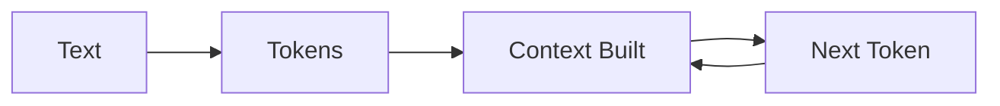
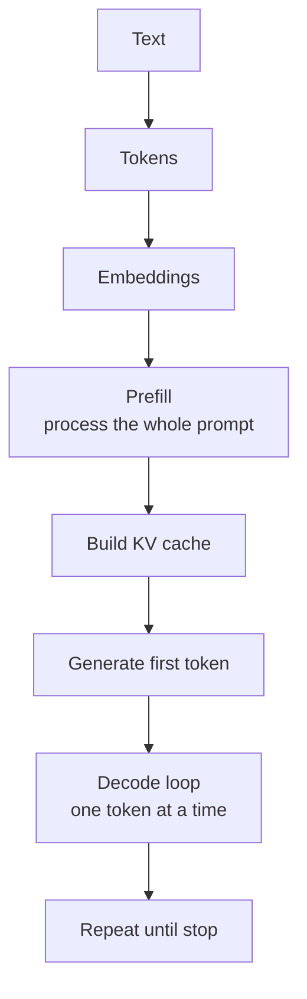
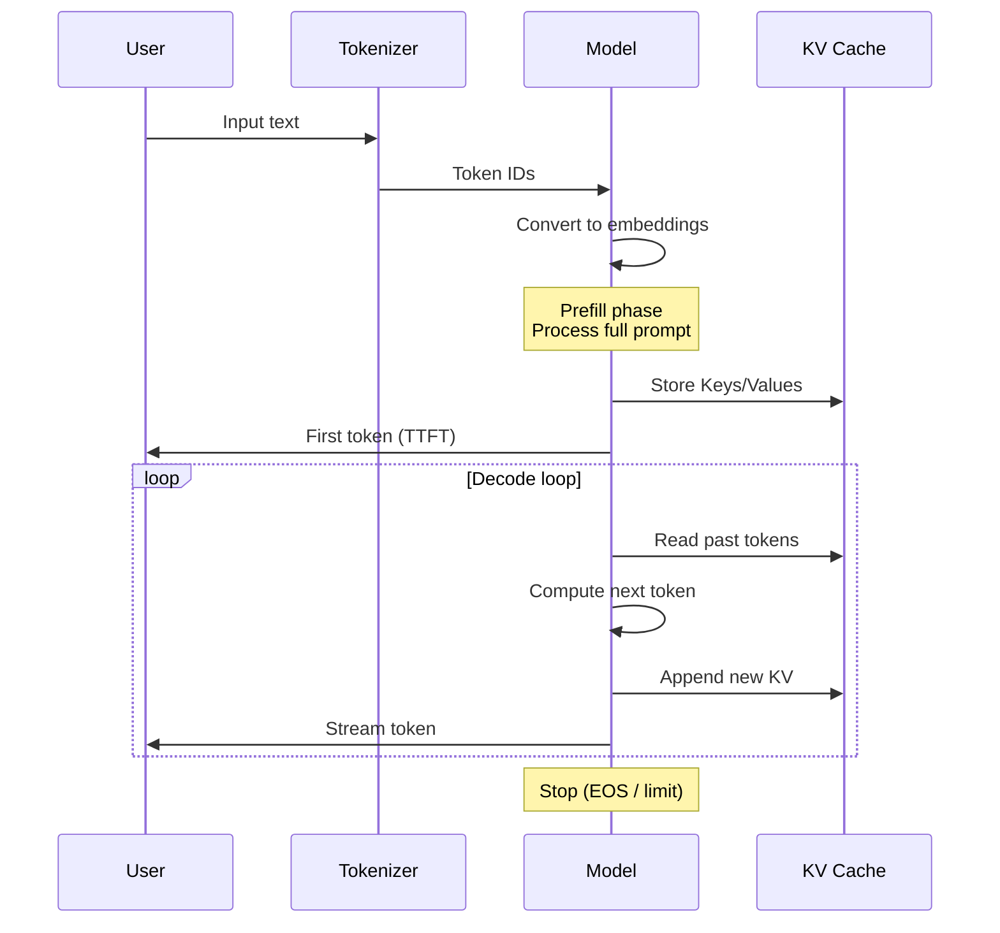
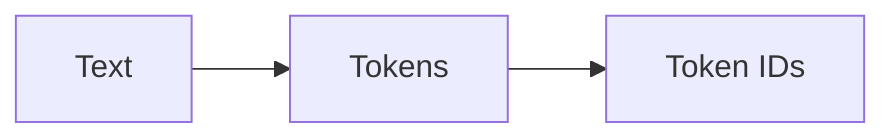
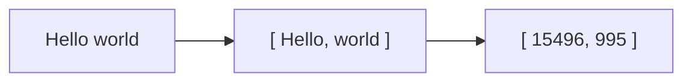
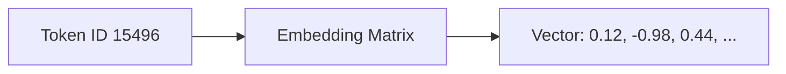
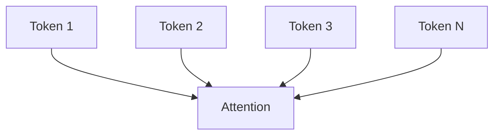
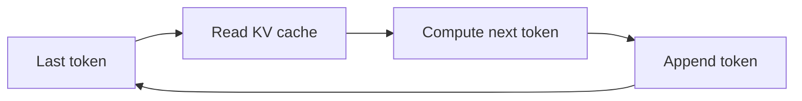
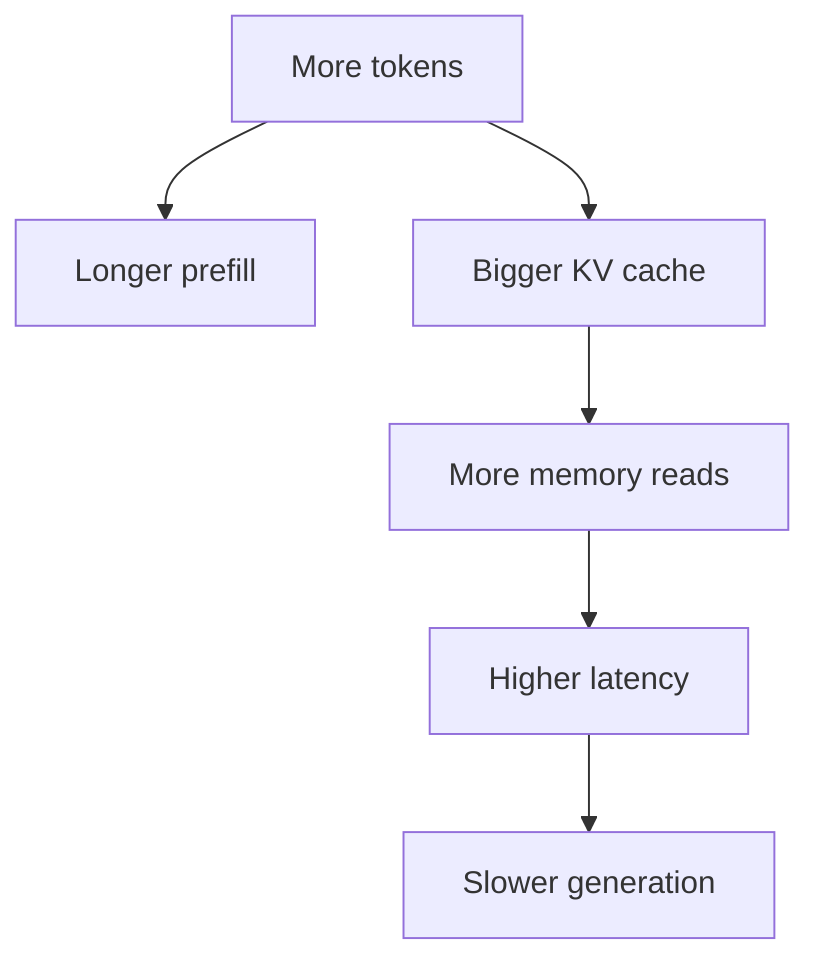

# Local LLMs Under the Hood

> Despite being an article about LLMs, this was written entirely by a human being. The only intelligence here today is yours. Enjoy!

## There is no magic at all

I am sorry to tell you this, but there is no real intelligence inside AI. No thinking. No reasoning. No magic. No engineer, goblin, or tiny architect trapped inside your GPU writing code or giving advice. **LLMs are just a very expensive mathematical trick.**

In a few words, an LLM is a pipeline that turns text into numbers, pushes those numbers through a stack of matrix operations, and spits out the next most probable token.

Today I want to distill this pipeline for you because it will help us to understand other related topics like runtimes, performance, improvements, quantization and costs that, without understanding the basics would look like black magic, and,  I insist, there is no black magic at all.

Follow me, it's not that hard.

## The LLM Pipeline

Everything reduces to a loop. 

1. Text becomes tokens
2. Tokens build context (prefill + KV cache)
3. Model predicts the next token
4. That token is appended and the loop continues



There are some concepts and intermediate steps  worth explaining, so, let me expand that oversimplified flow... 



And, please, follow this sequence diagram that explains "the magic" under LLMs:



That's all, I wish someone had explained it to me that simply. Let's dive into each step.

## Step 1: From Text to Tokens.

Text is not text, it’s tokens. When we type:

```js
console.log("Hello world");
```

You can think: “that’s one line of code.” but the model sees something closer to:

```text
["console", ".", "log", "(", "\"", "Hello", " world", "\"", ")", ";"]
```

Well, it's worse than that. Depending on the tokenizer, it could be:

```text
["con", "sole", ".", "log", "(", "\"", "Hel", "lo", " wor", "ld", "\"", ")", ";"]
```
Models don’t operate on words. They operate on **tokens**. Tokens are the units a model actually sees: variable-length text fragments (not words) chosen by a tokenizer to efficiently represent language.

Some consequences:

* `"Hello"` might be **1 token**
* `"Hel" + "lo"` might be **2 tokens**
* `" world"` (note the space) might be **1 token**

Now take something uglier, a small JSON example:

```json
{"user_id":12345,"is_active":true}
```

This often explodes into many tokens because:

* underscores break patterns
* numbers are split
* JSON syntax is repetitive

Same with source code, logs, stack traces. So, remember:

> Tokens are how text is broken so machines can process it

And token count is what actually matters. That fragmentation, not your words, is what defines cost, speed, and limits.

So, what is a tokenizer then? A tokenizer is the component that maps raw text into a fixed vocabulary of token IDs, so the model can process it numerically.



i.e.: 





---

## Step 2: From Token IDs to Vectors

Models cannot operate just with integers, it needs continuous values so each token ID is used to look up a vector in a matrix. It is called **Embedding Matrix**, and it is the numeric space where computation happens. 

Think of it like this:



This matrix has a fixed shape:
```
EmbeddingMatrix[vocab_size][hidden_dimension]
```
For example:
```
vocab_size ≈ 50,000
hidden_dimension ≈ 4096
```
So, this is what we get in this second step. Every token ID maps to a vector with thousands of dimensions. This is important. Just coordinates, per Token ID, in a very large space.

Thousands of dimensions are hard to imagine, so let’s cheat with two. Here is an example to visualize it:

```
"cat" → (0.9, 0.8)
"dog" → (0.85, 0.75)
"car" → (-0.4, 0.2)
```

Tokens used in similar contexts end up close to each other in this multidimensional space. in my example "cat" and "dog" are close due to the similarity but "car" is far from them.

Once understood the purpose of these vectors, scale that idea to thousands of dimensions. 

This is the result of training a model. During training, the model adjusts these vectors so tokens used in similar contexts tend to occupy nearby regions of this space. Then, patterns emerge when all values are considered together.

> If there is any kind of magic, it is here.

Let's recap:

Text -> Tokens -> Token IDs -> Vectors

From this point forward, the model does not work with tokens or IDs anymore. It works with vectors. The algorithm, the model, will spend the rest of its time handling these vectors.

- attention compares vectors
- KV cache stores vectors
- every layer transforms vectors

Let's continue...

## Step 3: Prefill (processing everything you wrote)

Now the model processes your entire input at once, and all tokens are already known, which means the model can run this phase **in parallel**.



### Attention (the core mechanism)

> Each token asks: “Which other tokens should I care about?”

Example:

```text
"The sky is blue because it scatters light"
```

* “it” looks back to “sky”
* “scatters” relates to “light”

Attention computes relationships between tokens, assigns weights, and mixes their vectors.

Result:

```text
Input vectors → Context-aware vectors
```

This is the first moment where tokens stop being independent and become contextualized. This is why, as in real life, attention is extremely important.

### What “prefill” actually means

Prefill is this entire process: taking all input tokens and transforming them into context-aware vectors in a single pass.

It has two defining properties:

#### 1. Parallel

All tokens are processed together, this is why GPUs perform well here: they are optimized for large vector and matrix operations.

#### 2. Expensive

Because this is a causal model, each token can attend only to previous tokens and itself. Token 10 can look back to tokens 1–10, but not to token 11.

```text
N tokens → roughly N² / 2 interactions
```

This creates a triangular attention pattern: token 1 attends to 1 token, token 2 to 2 tokens, and so on, up to token N attending to N tokens. The total number of interactions is therefore 1 + 2 + ... + N ≈ N² / 2, which results in O(N²) complexity.

Example:

```text
100 tokens   → 10,000 interactions
1,000 tokens → 1,000,000 interactions
```

That’s the **quadratic cost** of attention.

## Step 4: KV Cache (storing reusable state).

During prefill, the model computes internal attention data called Keys and Values.
- A Key helps future tokens decide whether this past token is relevant. 
- A Value carries the information that can be reused if it is relevant. 
These are not exposed, but they are critical because they are stored in memory, in a cache called **KV cache**, which will be reused in the next phase. 

One of the things that happen while running LLMs is that the KV cache grows with every token, and this, my friend, is one of the main constraints in local inference:

- KV Cache consumes significant VRAM
- KV Cache must be read at every generation step
- KV Cache impacts latency and throughput

Recent improvements in local AI are heavily focused here:

- Reducing KV size (e.g. grouped-query attention)
- Improving memory layout (paged KV cache)
- Avoiding unnecessary reads

> Because in long-running inference, the KV cache becomes one of the biggest bottlenecks.

### Recap

* Input: vectors
* Mechanism: attention (all-to-all interaction)
* Output: context-aware vectors
* Side effect: KV cache built for next phase

---

## Step 5: First Token Prediction

At this point, prefill has built the prompt state and the KV cache has stored the reusable attention data. Now the model can finally do the only thing it actually does:

> Predict the next token.

---

### First token (the starting point)

After prefill, the model produces the first output token.

Example:

```text
Input:
"The sky is"

Prediction:
" blue"
```

And, as I said at the very beginning, it did it because of math. It selected a likely continuation. It does not “know physics”, this prediction is pure mathematics, because, due to the data used for training. The word (token or set of tokens) "blue" is what comes after “The sky is ”. It is chosen, or inferred, because it is a highly probable continuation.

> No magic. Just maths and computation effort.

But look, this first prediction is kinda special, it is produced at the end of prefill phase, using the full prompt state that has just been built, and it marks the transition from prefill to generation. It also determines what is called the TTFT, Time To First Token.

## Step 6: Decode (the slow loop)

Prefill builds the state once. Decode consumes that state repeatedly. Now the system enters the real execution model. This is another 'uncomfortable' part of these systems: decode cannot be parallelized across time, because token N+1 depends on token N.



At each step:

1. Take the last generated token
2. Read all previous context (via KV cache)
3. Predict the next token
4. Append it
5. Repeat

Example:

```text 
"The sky is" → " blue"
"The sky is blue" → " because"
"The sky is blue because" → " of"
```

### Recap

* Prefill builds the state
* First token starts generation
* KV cache enables reuse
* Decode is just a loop repeating the same step


## Why your GPU feels slow (even if it isn’t)

At this point, people assume:

> “More GPU power = faster generation”

Wrong. I hope you already understood why, but just in case, I'll repeat myself. The bottleneck is memory.

During each decode step, the model must:

* read model weights
* read KV cache
* do a small amount of math

That means:

* lots of data movement
* relatively little computation

This is called a **memory-bound workload**.

Let me try a simple analogy:

* Prefill = factory assembly line (efficient)
* Decode = one worker fetching tools from a warehouse, at every step, so, even if the worker is fast, walking back and forth dominates time.

## Context length: the silent killer

Context length affects everything.

A longer prompt increases prefill cost. A longer conversation increases KV cache size. A larger KV cache increases memory pressure. More memory pressure increases latency.



This is why long-context models can look amazing on paper and still feel painful on local hardware.

A model may support 128K tokens. Your machine may not enjoy it.

## Going Local

What we've seen, so far, is quite generic, but you now understand why memory matters and where the highest computational efforts are, and why. 
I tried to make this pipeline clear because once you understand it, you can reason about:

- why quantization works
- why some runtimes are faster than others
- why context length is dangerous (on your machine)
- why local AI has hard limits

This is important because going local means optimize where it hurts, whenever possible. Every optimization I'll try to explain in further articles will attack one of these: 

- Fewer tokens (important if you're still targeting AIaaS and paying per token)
- Smaller Memory Footprint
- Less Data Movement
- Better Scheduling

From today you can explain to your grandmother, or even your brother-in-law, how the famous AI that everyone is talking about works.

Remember:

> ## Your AI. Your rules.


## References

- Vaswani et al., [*Attention Is All You Need*](https://arxiv.org/abs/1706.03762)
- Dao et al., [*FlashAttention: Fast and Memory-Efficient Exact Attention*](https://arxiv.org/abs/2205.14135)
- Kwon et al., [*Efficient Memory Management for Large Language Model Serving with PagedAttention*](https://arxiv.org/abs/2309.06180)
- Hugging Face Transformers documentation: [tokenizers](https://huggingface.co/docs/transformers/en/fast_tokenizers) and [KV cache](https://huggingface.co/docs/transformers/en/kv_cache)
- NVIDIA Developer Blog: [Mastering LLM Techniques: Inference Optimization](https://developer.nvidia.com/blog/mastering-llm-techniques-inference-optimization/)
- Shazeer, [*Fast Transformer Decoding: One Write-Head is All You Need*](https://arxiv.org/abs/1911.02150)