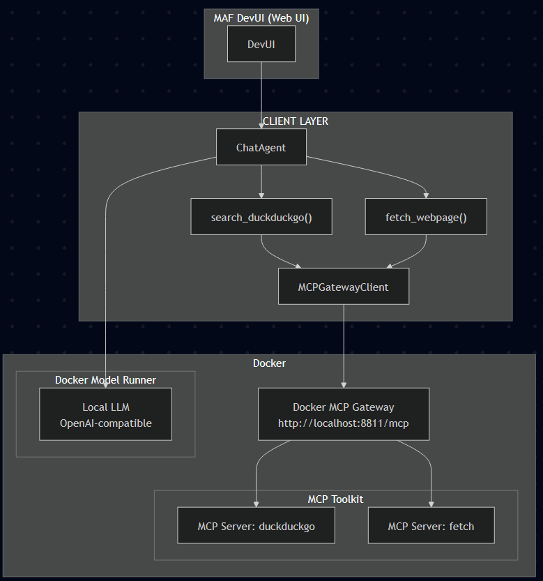
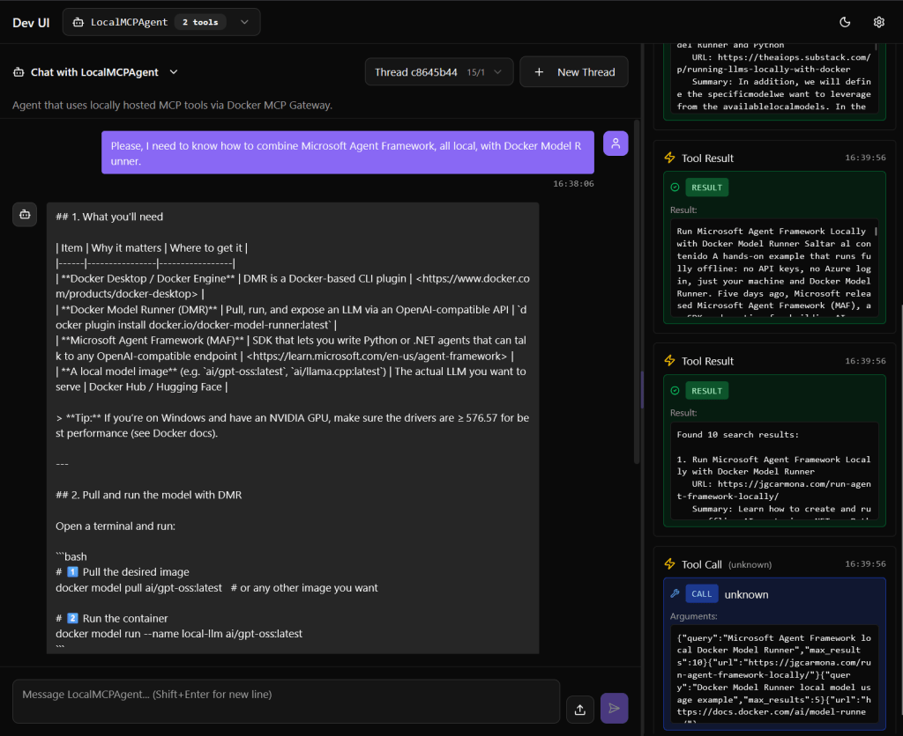

## How to wire Microsoft Agent Framework DevUI to Docker MCP and Docker Model Runner.

You already know my motto: Your AI. Your rules. In my last article, [Using MCP with Microsoft Agent Framework](https://jgcarmona.com/using-mcp-with-microsoft-agent-framework/), I showed MCP tools working in console apps (and backend services). This time I wanted the same inside **[MAF’s brand-new DevUI](https://github.com/microsoft/agent-framework/tree/main/python/packages/devui)**. Spoiler: it broke in weird ways, and here’s how I made it work anyway.

## **TL;DR**:

> DevUI can’t serialize MCP streaming content (`TextContent`, `FunctionResultContent`, …). The fix: keep a persistent streaming session to Docker MCP Gateway with a tiny `MCPGatewayClient` and expose _plain async functions_ to the `ChatAgent`. DevUI stays happy; tools work; DMR does the thinking.

### Today's mission

Run an agent _inside DevUI_ that uses MCP tools **without** crashing the UI, keeping state and streaming intact.

- **MCP (Model Context Protocol)**: a standard for agents to call tools (search, fetch, GitHub, …) locally or remotely.

- **Docker MCP Gateway**: groups several MCP servers (DuckDuckGo, Fetch, GitHub) behind one streaming endpoint (e.g., `http://localhost:8811/mcp`).

- **Reality**: MCP tools in Python/MAF (`MCPStdioTool`, `MCPStreamableHTTPTool`) work in console apps — but **DevUI dies on their streaming content**.

- Share the code, lessons learnt, and working and non working examples on this **[GitHub Repository](https://github.com/juangcarmona/ms-agent-framework-playground)**, concretely here, **[./labs/python/04\_devui\_with\_mcp](https://github.com/juangcarmona/ms-agent-framework-playground/tree/main/labs/python/04_devui_with_mcp)** .

So the ambition: **make an agent running inside DevUI consume MCP tools seamlessly**, while keeping state, streaming, tool introspection, etc.



## The Approach That Worked

I ended up ditching using `MCPStdioTool` or `MCPStreamableHTTPTool` _inside_ DevUI. Instead I built a thin client layer that lives _outside_ DevUI’s guts, wrapping everything in safe async functions the agent calls.

### MCPGatewayClient: managing a streaming session

```python
from mcp import ClientSession
from mcp.client.streamable_http import streamablehttp_client

class MCPGatewayClient:
    """High‑level client for interacting with a Docker MCP Gateway."""

    def __init__(self, gateway_url: str):
        self.gateway_url = gateway_url
        self.session: Optional[ClientSession] = None
        self._stream_ctx = None
        self._session_ctx = None

    async def connect(self) -> None:
        self._stream_ctx = streamablehttp_client(url=self.gateway_url)
        read_stream, write_stream, _ = await self._stream_ctx.__aenter__()

        self._session_ctx = ClientSession(read_stream, write_stream)
        self.session = await self._session_ctx.__aenter__()

        await self.session.initialize()

    async def list_tools(self) -> list[str]:
        assert self.session is not None, "Session not initialized"
        result = await self.session.list_tools()
        tool_names = [t.name for t in result.tools]
        return tool_names

    async def call_tool(self, name: str, arguments: Dict[str, Any]) -> str:
        assert self.session is not None, "Session not initialized"
        result = await self.session.call_tool(name=name, arguments=arguments)

        if result.content and hasattr(result.content[0], "text"):
            return result.content[0].text
        return str(result)

    async def close(self) -> None:
        if self._session_ctx:
            await self._session_ctx.__aexit__(None, None, None)
        if self._stream_ctx:
            await self._stream_ctx.__aexit__(None, None, None)
```

This is the “bridge” between DevUI‑world and MCP‑world. Not fancy, but it isolates and decouples complexity.

### MCP Gateway

I created a docker-compose.yml file in which we can easily declare and launch our MCP Gateway, a bringe between HTTP and STDIO worlds. As simple as:

```yaml
services:
  gateway:
    image: docker/mcp-gateway:latest
    command:
      - --servers=duckduckgo,fetch
      - --transport=streaming
      - --port=8811
    volumes:
      - /var/run/docker.sock:/var/run/docker.sock
    ports:
      - "8811:8811"
```

### Wrapping tools as async functions

The client points to the gateway, and the functions just use the client with function name and params (arguments).

```python
mcp_client = MCPGatewayClient(os.getenv("MCP_GATEWAY_URL", "http://localhost:8811/mcp"))

async def search_duckduckgo(query: str, max_results: int = 5) -> str:
    """Search via mcp/duckduckgo."""
    return await mcp_client.call_tool("search", {"query": query, "max_results": max_results})

async def fetch_webpage(url: str) -> str:
    """Fetch and parse a URL via mcp/fetch (name may be 'fetch' or 'fetch_content')."""
    try:
        return await mcp_client.call_tool("fetch_content", {"url": url})
    except Exception:
        return await mcp_client.call_tool("fetch", {"url": url})
```

These are now _ordinary async tool functions_ the agent can call; DevUI has no special knowledge of MCP or streaming behind them, somehting that would be nice, as I demonstrated in last two articles, with C# and Python console applications. (I created [this GitHub issue](https://github.com/microsoft/agent-framework/issues/1476) bringing detailed explanations.)

### Agent + DevUI runner

Last, but not least, DevUI runs in the same asyncio loop via Uvicorn. We connect MCP **once** before registering the agent and serving DevUI.

```python
agent = ChatAgent(
    name="LocalMCPAgent",
    description="Agent that uses MCP tools via Docker Gateway inside DevUI",
    instructions=(
        "You are a research assistant. Use `search_duckduckgo` then `fetch_webpage` "
        "to answer user questions with references."
    ),
    chat_client=OpenAIChatClient(
        base_url=os.getenv("OPENAI_API_BASE", "http://localhost:12434/engines/llama.cpp/v1"),
        api_key=os.getenv("OPENAI_API_KEY", "none"),
        model_id=os.getenv("MODEL_ID", "ai/gpt-oss:latest"),
    ),
    tools=[search_duckduckgo, fetch_webpage],
)

async def main():
    await mcp_client.connect()
    await mcp_client.list_tools()

    server = DevServer(host="0.0.0.0", port=8000, ui_enabled=True)
    server.register_entities([agent])
    app = server.get_app()

    config = uvicorn.Config(app, host="0.0.0.0", port=8000, log_level="info", loop="asyncio")
    await uvicorn.Server(config).serve()

    await mcp_client.close()

# NOTE: this is a workaround 
if __name__ == "__main__":
    try:
        loop = asyncio.get_event_loop()
        if loop.is_running():
            loop.create_task(main())
        else:
            loop.run_until_complete(main())
    except RuntimeError:
        asyncio.run(main())
```

When we spin this up, DevUI comes online, the agent is registered, the MCP session is open, and tool calls flow like normal. Luck me!  



Can you spot the bug? No? look at the times, on the right column... ([see this issue for more details...](https://github.com/microsoft/agent-framework/issues/1483)) Anyway, that's a minor issue.

## What Didn’t Work

**1) `MCPStdioTool` inside DevUI**  
What worked in console mode, inside DevUI it throws:  
`Unable to serialize unknown type: <class 'agent_framework._types.TextContent'>`  
Browser: `Uncaught TypeError: can't access property "replace", e.type is undefined`  
**Why:** DevUI’s `_stream_execution()` can’t serialize MCP’s streaming content blocks (e.g., `TextContent`, `FunctionResultContent`). Poor me!

**2) `MCPStreamableHTTPTool` inside DevUI**  
Switching from STDIO to HTTP didn’t help...  
**Why:** Same root cause, DevUI still sees streaming content types and chokes. `(Poor me!)^2`

## Lessons from this Lab

- **Works today:** Keep a persistent MCP streaming session and expose **plain async tool functions** to your agent. DevUI remains stable.

- **Not supported yet:** `MCPStdioTool` / `MCPStreamableHTTPTool` _inside_ DevUI. Their streaming content isn’t serializable by DevUI.

- **Workaround:** Manage MCP sessions yourself; launch DevUI via Uvicorn in your asyncio loop.

- **What DevUI needs:** native support for MCP content types (`TextContent`, `FunctionResultContent`, …) and proper streaming serialization.

- **Unexpected win:** I now understand DevUI’s streaming engine far better than I planned. You’re welcome, future me.

> The more MCP-aware DevUI gets, the better agentic workflows we can ship.
