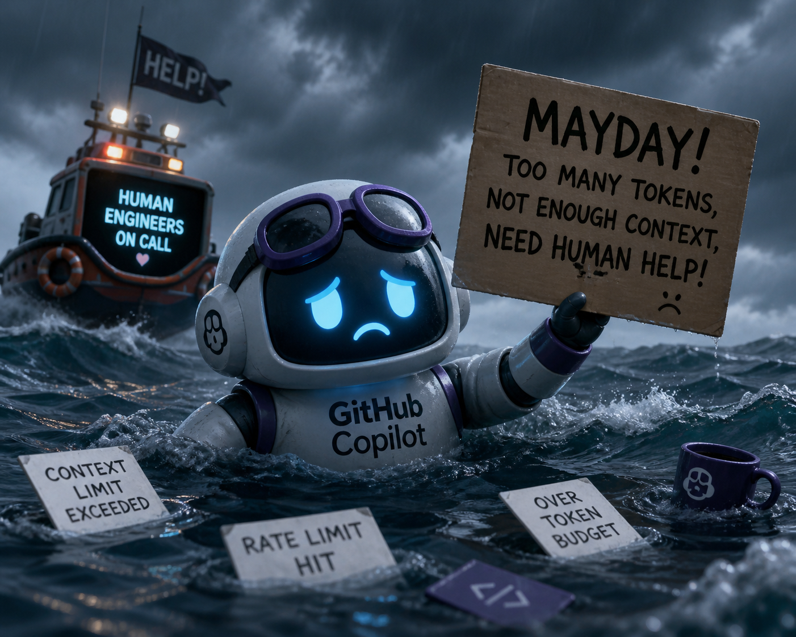
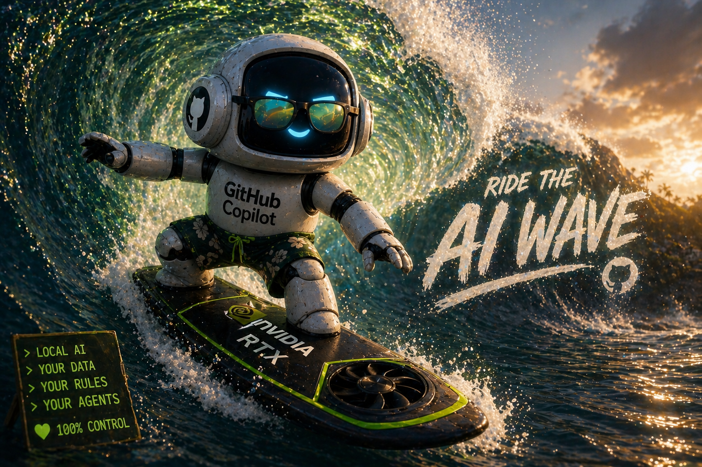
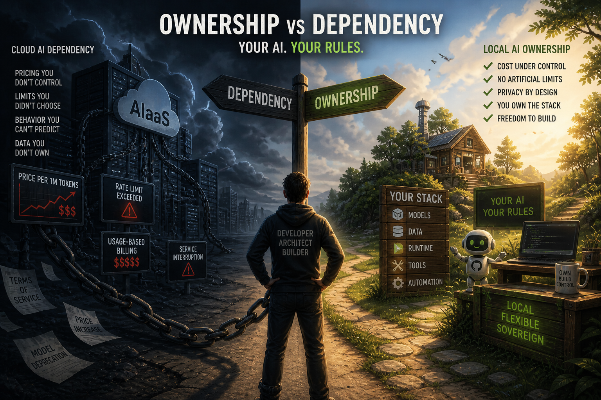

---
lang: en
title: "Mayday! Mayday! We're Running Out of Fuel!"
description: "Running out of tokens? Will you be part of this new form of slavery or will join the local ai rebellion? Your AI. Your rules."
pubDate: 2026-05-01
tags:
  - ai
  - local-ai
  - llm
  - software-architecture
  - devops
  - engineering
heroImage: "images/github_copilot_plane_out_of_fuel.png"
---

> DISCLAIMER: these are my own words. Human words. No em dashes or "this is not X, but Y" sentences here and there. Just human intelligence and thoughts packed for your enjoyment. I just used ChatGPT to generate these funny images.

Today is May 1, 2026. War in the Persian Gulf is shaking the planet's energy foundations, and the investors in the large corporations that own our beloved AI have decided it's time to get a return on their investment. Panic is gripping thousands of professional developers and millions of vibe coders hooked on the indiscriminate use of those erratic and verbose reasoning engines that we call AI.

They call it AI, but it isn't. They're LLMs, language engines, token generators. They seem intelligent, but they aren't. They're powerful tools, useful, yes, and increasingly expensive. Over the last three years, we've become hooked on using them. They've tantalized us with increasingly powerful models, with freemium services, which we've ended up paying for. We've gone from using simple chats, in consultative mode, to having veritable farms of "intelligent" agents ready to follow our orders 24/7...

And maybe this evolution itself, has been the root of the problem. I prepared an implementation with GitHub Spec Kit, over about 10 refinement turns, and when I triggered the implement command, it took 10 hours to complete, using Opus 4.6. This kind of automated agentic runs are a nightmare for the bare-metal owners where our beloved AI runs, because it is long and resource-intensive, which is, at the end, extremely expensive...

And maybe this evolution itself, has been the root of the problem. I prepared an implementation with GitHub Spec Kit, over about 10 refinement turns, and when I triggered the implement command, it took 10 hours to complete, using Opus 4.6. This kind of automated agentic runs are a nightmare for the bare-metal owners where our beloved AI runs, because it is long and resource-intensive, which is, at the end, extremely expensive... 

AI stopped being cheap (or that profitable) at the time its usage stopped being at human scale. The shift from "a few prompts" per hour to the usage of agents, loops and autonomous workflows has increased token consumption from something predictable to something invisible but massive, that is also not sustainable, nor profitable. Cost are now tied to system behavior, it has grown out of control and, here, my friend, is where investors claim this is not sustainable.

Some recent news demonstrate token consumption is growing out of control, hardware prices are rising and, finally, that investors are demanding ROI: 

- [Massive enterprise token usage (Disney example)](https://www.reddit.com/r/technology/comments/1sxu24v/one_disney_employee_calls_claude_51000_times_a/) 
- [Token budgeting (“tokenmaxxing”) trend](https://www.businessinsider.com/startups-tokenmaxxing-token-quotas-2026-4)
- [Nvidia exec says AI is more expensive than actual workers](https://www.tomshardware.com/tech-industry/artificial-intelligence/nvidia-exec-says-ai-is-more-expensive-than-actual-workers-yet-some-companies-dont-see-the-extra-costs-as-a-negative)
- [GPU cost pressure](https://www.tomshardware.com/pc-components/gpus/frameworks-new-rtx-5070-12gb-graphics-module-costs-a-whopping-usd1-199-72-percent-more-expensive-than-usd699-8gb-version-says-pricing-is-beyond-its-control)
- [Anthropic / Claude cost expectations increasing](https://www.theinformation.com/articles/anthropic-changes-pricing-bill-firms-based-ai-use-amid-compute-crunch)
- [Copilot pricing shift (usage-based)](https://github.blog/news-insights/company-news/github-copilot-is-moving-to-usage-based-billing/)

We all knew this was going to happen, didn't we?

## The Second AI Wave

I really did. From the very beginning, I knew this was going to happen. The strategy is not new. They gave us the power, fed our brains with this new drug, and made all of us AI-holics in order to shape a new form of hidden social slavery: AI as a service (AIaaS).

I insist: this horizon has always been clear to me, and that latest pricing movement from GitHub Copilot (hey, [I recently got certified!!!](https://learn.microsoft.com/en-gb/users/jgcarmona/credentials/4bbb6fda03032379)) made me think we are finally entering what I call "The Second AI Wave." If you look at this blog, you'll find a good amount of posts about experiments, frameworks, and tooling around one of my personal bets: owning my AI.

And if you're scared about rising prices and want to liberate yourself from this new form of slavery, there is hope. As Cassian Andor and Jyn Erso said: "Rebellions are built on hope." Take this idea as a reference. This is our modern hope: local AI is possible and **we all can own our AI**. Turn it into your own mantra, our lighthouse of hope, and prepare yourself to surf this second wave.

## Ownership vs Dependency

Frontier Models won't fit on your hardware, no matter how much you spend. Cloud needs to become our scalation layer, not our default tool. This is because tokens are now a budget and every architecture decision has an economic impact. I mean that this is not about better models anymore, the paradigm shift is about cost control under constraint.

If you want to know what's possible, where the frontiers of local AI are nowadays, you need to follow [Mitko Vasilev](https://www.linkedin.com/in/ownyourai/). He has been my sole reference in this journey. On every experiment he shares, after his geeky/spicy explanations he always share his motto:

> Make sure you own your AI. AI in the cloud is not aligned with you; it’s aligned with the company that owns it.	

Those words can be easily transformed into my AI motto:

> Your AI. Your rules.

Let's be clear, Cloud AI is aligned with the company that owns the infrastructure: pricing, limits, behavior... All externally controlled. **Owning the runtime changes that equation.** This is our hope. We need to move from  per-token billing to amortized compute, from unpredictable cost to bounded systems and, last but least, from external dependency to internal control.

And as demonstrated by Mitko and many others, including myself, local AI is no longer "weak". Models like Qwen 3.6 proves the shift is possible. Quantization, Fine Tunning and efficient runtimes make them usable, so, in May 2026, “Good enough” has already crossed the threshold for many tasks.

Local can actually absorb coding workflows, internal tools and automations, RAG over private data, agentic loops that would be way too expensive in cloud and most daily developer usage. ¡Promised! But here are the constraints (trade offs):

- Hardware is still expensive (and price is rising as I said)
- Setup is not trivial (but is way less difficult as it was a year ago or two)
- Frontier reasoning still lives in the cloud (you can tatoo this on your chest, it will never go out of style)
- Throughput at scale is still a challenge (But many improvements are appearing as part of this second wave...)

At the end, until we reach an all-local setup, we need to rely on cloud for capability, but use local under control and that means that **our real way of working must shift** to a hybrid model. 

And as I want to help you ride the second wave, in further articles, I will help you to understand:

- how inference actually works
- why memory is the real bottleneck
- how runtimes change performance
- how tokens and KV cache drive cost

This series of articles will go layer by layer until you can operate, not just use, your own AI systems.

## This series

1. **You are here** — Mayday! Mayday! We're Running Out of Fuel!
2. [How I Set Up GitHub Copilot CLI on Local Hardware](/en/github-copilot-local-setup/) — setup and wiring
3. [MCP Is How Local Copilot Becomes Useful](/en/copilot-cli-mcp-tools/) — tools, not magic
4. [Copilot Instructions, Agents, and Skills](/en/copilot-instructions-agents-skills/) — governance
5. [Running SDD Workflows with Local Copilot](/en/copilot-cli-sdd-workflows/) — specification-driven development
6. [VSCode Agents Window: An AI Harness Inside Visual Studio Code](/en/vscode-agents-window/), the convergence

---

Remember:

> ## Your AI. Your rules.

## &nbsp;

### May the Force be with you, always!
