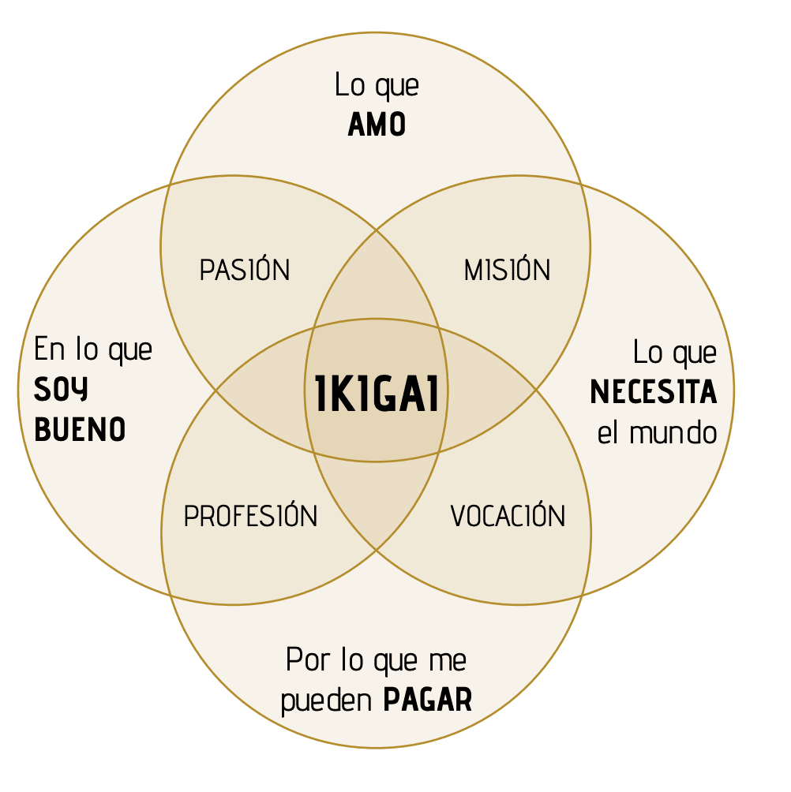
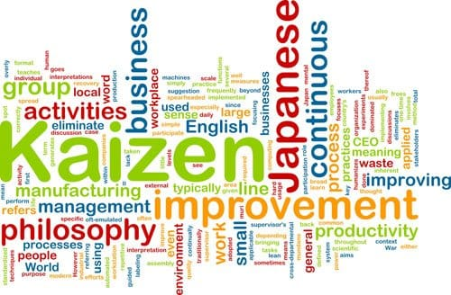

Ya sabes que soy un apasionado del desarrollo de software. Quiero contarte algo: programar no solo se trata de lenguajes de programación, algoritmos y líneas de código. Es mucho más. Es un mundo en constante cambio, donde aprendemos y crecemos cada día. Y en esta aventura, encontré algo increíble: las filosofías japonesas. Si quieres descubrir cómo estas filosofías japonesas pueden ayudarnos a mejorar nuestras habilidades de programación, sigue leyendo.

## _¿Por qué filosofías japonesas en la programación?_

Estos conceptos del Lejano Oriente hablan de armonía, propósito y eficiencia. Son famosos en negocios y, ¿adivina qué? ¡También en desarrollo de software! Me sorprendió al principio. Pero al explorar más, vi el gran valor que tienen.

## _¿Qué esperar de esta serie de artículos?_

Vamos a embarcarnos en una aventura juntos. Te mostraré cómo estas filosofías han cambiado mi forma de trabajar. Y cómo pueden cambiar la tuya.

## _[Primera parada: Ikigai](https://jgcarmona.com/ikigai-para-desarrolladores-de-software/)_

[**Ikigai**](https://jgcarmona.com/ikigai-para-desarrolladores-de-software/) nos invita a buscar nuestro propósito en la vida. Vamos a pensar en cómo esto puede dar valor a nuestros proyectos. Y en cómo afecta a las personas que usan lo que creamos.

## _[Segunda parada: Kaizen en la programación](https://jgcarmona.com/kaizen-para-desarrolladores-de-software/)_

Después, nos adentraremos en Kaizen, o el arte de la mejora continua. Veremos cómo esto nos hace crecer en habilidades y conocimientos. En el mundo de la programación, esto puede llevar nuestras habilidades al siguiente nivel. Esta filosofía no se limita a la programación o el desarrollo de software.

De hecho, Kaizen es uno de los pilares del [Lean Manufacturing](https://es.wikipedia.org/wiki/Lean_manufacturing), un enfoque en la gestión que se centra en minimizar los residuos sin sacrificar la productividad.

## _[Tercera parada: Wabi-Sabi](https://jgcarmona.com/wabi-sabi-simplicidad-e-imperfeccion-en-desarrollo-de-software/)_

Wabi-Sabi nos enseña a amar lo imperfecto. Esto puede cambiar cómo vemos el “software perfecto”. Nos ayuda a trabajar con calma y aceptación.

## [Cuarta parada: Ganbatte para desarrolladores](https://jgcarmona.com/ganbatte-para-desarrolladores-enfrentar-los-desafios-con-valentia/)

Descubriremos el espíritu de Ganbatte, para aprender a enfrentar desafíos con determinación, impulsando nuestra eficacia en el proceso de desarrollo de software.

## [Quinta parada: Oubaitoori en el software Exploraremos](https://jgcarmona.com/oubaitoori-mejorando-el-desarrollo-de-software-a-traves-de-la-observacion-y-el-estudio/)

Oubaitoori, potenciando nuestras habilidades a través de la observación y el estudio aplicados al desarrollo de software.

## [Sexta parada: Nintai, la perseverancia en desarrollo de software](https://jgcarmona.com/nintai-perseveancia-desarrollo-software/)

Conoceremos Nintai, la filosofía de la "perseverancia", como aliado poderoso para enfrentar los retos en el mundo de la programación.

## [Séptima parada: Shuhari, el camino de la maestría en desarrollo de software](https://jgcarmona.com/shuhari-el-camino-de-la-maestria-en-el-desarrollo-de-software/)

Estudiaremos Shuhari, un camino de aprendizaje que desde la adquisición rigurosa del conocimiento hasta la innovación y eventual maestría, puede llevarnos a la excelencia en el desarrollo de software.

## [Octava parada: Muda y la eficiencia en el desarrollo de software](https://jgcarmona.com/muda-mejorando-la-eficiencia-en-el-desarrollo-de-software/)

Aprenderemos sobre Muda, para transformar nuestra eficiencia al eliminar actividades innecesarias en el desarrollo de software.

## [Novena parada: Hara Hachi Bu en la programación](https://jgcarmona.com/hara-hachi-bu-el-arte-japones-del-equilibrio-aplicado-al-software/)

Veremos cómo Hara Hachi Bu puede ayudarnos a encontrar un equilibrio y evitar el agotamiento en el mundo del desarrollo de software.

## [Finalmente: Yugen, la conciencia del universo del software](Yugen, la conciencia del universo del software)

Terminaremos nuestro viaje con Yugen, donde profundizaremos en una comprensión más contemplativa de la complejidad y la interconexión de los sistemas de software y la tecnología en general.

## _Cada artículo, un nuevo descubrimiento_

En cada uno de estos artículos me centraré en un concepto. Verás ejemplos reales y cómo aplicarlos. Compartiré cómo han influido en mi vida y trabajo.

## _¿Estás listo?_

Mi objetivo es inspirarte. Quiero mostrarte un lado diferente del desarrollo de software. Uno que nos haga mejores en lo que hacemos y en quiénes somos.

¿Listo para la aventura? Prepárate, y nos vemos en el próximo artículo sobre [**Ikigai**](https://jgcarmona.com/ikigai-para-desarrolladores-de-software/).
