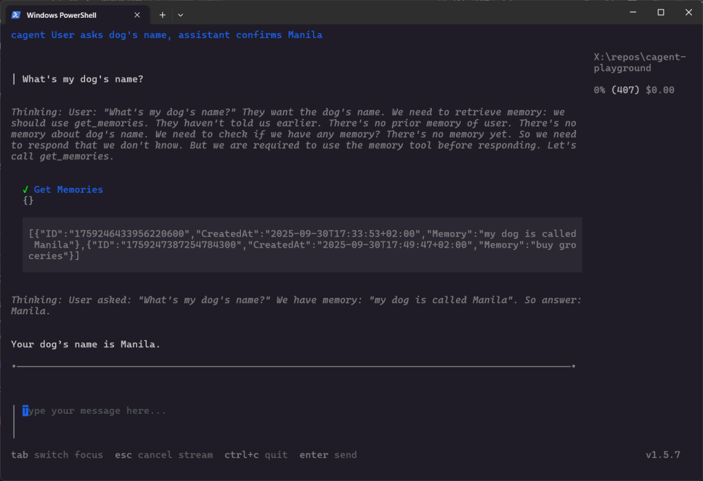
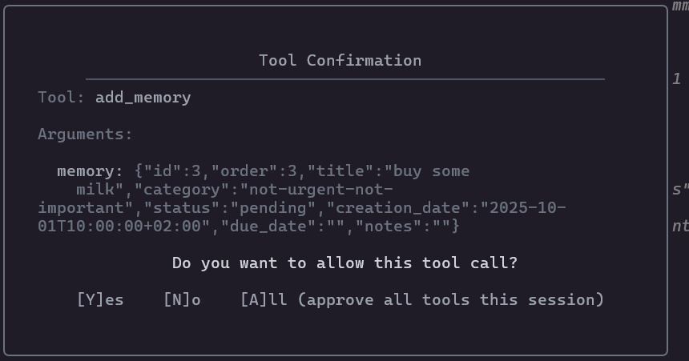
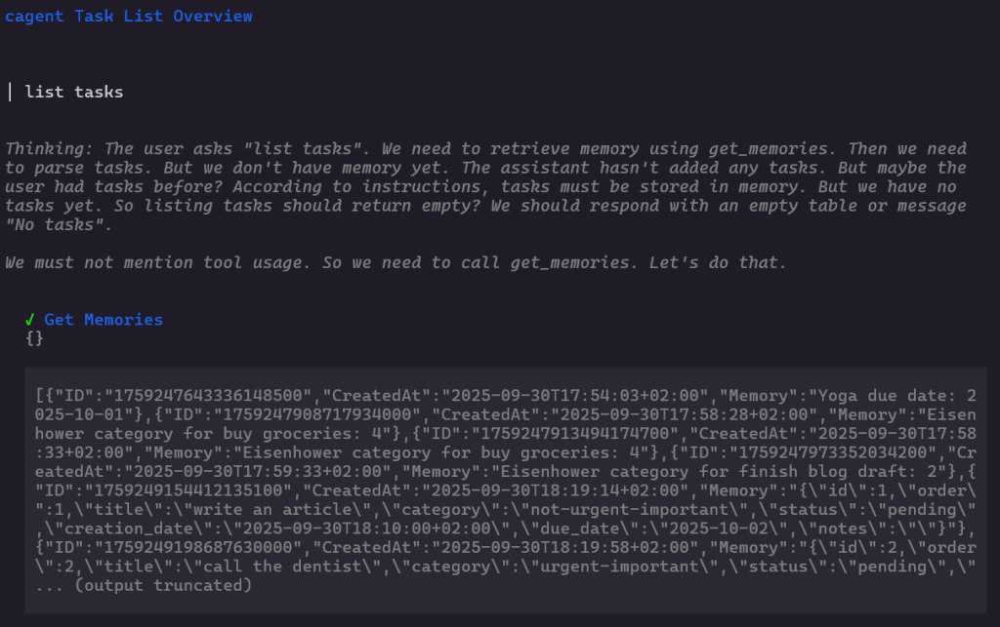
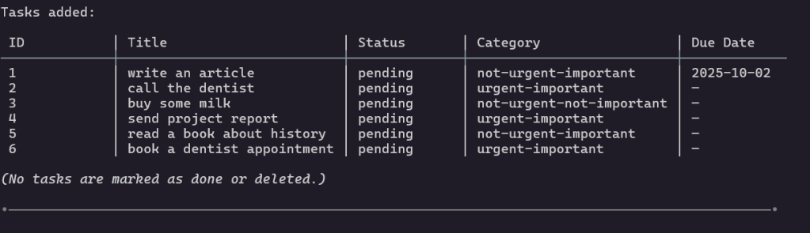
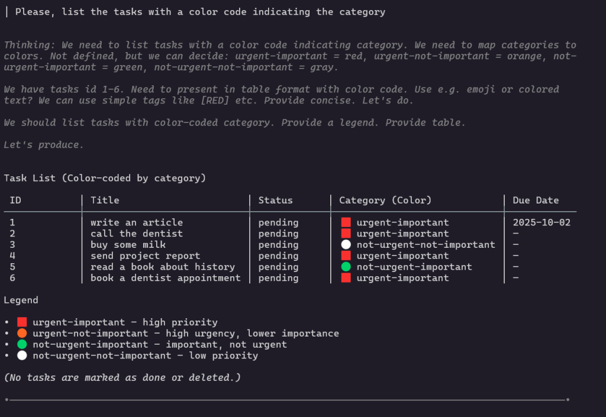

If you read my previous article on AI agents ([**AI Agents in a Nutshell**](https://jgcarmona.com/ai-agents-nutshell/)), you already know how they differ from chatbots: instead of just generating text, they **loop between reasoning, tools, and reflection until they reach a goal**.


By default, agents are like Dory 🐠 from _Finding Nemo_: living in the moment, but forgetting everything as soon as the scene changes... They only “remember” what’s inside the current session or context window. Once you restart, everything is gone.

That’s why **memory is such a defining step**. It turns an agent from a reactive wrapper around a model into something closer to a real assistant, one that can **recall, persist, and evolve across runs**.

In this article, I’ll show how to add memory to Docker cagent agents, starting with a simple assistant that remembers facts and continuing with a promising structured to-do assistant that persists tasks across sessions.

## Why Memory Matters

- **Stateless agents**: useful for one-off queries, but forgetful.

- **Agents with memory**: capable of tracking notes, tasks, or facts across sessions.

- **Local-first persistence**: with Docker cagent, memory lives in a simple SQLite file on your machine. No cloud, no vendor lock-in.

For me, this is where agents start to feel alive — because they stop treating every session as Day 0.

## Step 1 - A Simple Assistant That Remembers

In last article I wrote the classic hello-world with cagent, _hello-assistant_. Now I just added a memory to the toolset:

```yaml
version: "2"
agents:
  root:
    model: gpt-oss
    description: "A local assistant that remembers"
    instruction: |
      You are a helpful assistant. 
      Remember facts and tasks the user tells you.
    toolsets:
      - type: memory
        path: "./memory/hello-assistant.db"

models:
  gpt-oss:
    provider: dmr
    model: ai/gpt-oss
    base_url: http://localhost:12434/engines/llama.cpp/v1
```

Run it, and you can say:

```bash
> Remember my dog’s name is Manila
```

Close the session, reopen later:

```bash
> What’s my dog’s name?
Your dog’s name is Manila.
```

That’s the first step: persistence.



> ### **NOTE:**
> 
> By the time I am writing this article there is no official documentation on how memory works under the hood, I found multiple examples on how to add memory to agents in the official GitHub repository and just played around. I noticed that it uses SQLite db files, that's the only information I can provide... I'll deep dive into the repo just after my experiments to tell you how it works

## Step 2 - A Structured Todo Assistant

Next, I wanted something more practical: a **todo assistant with structured memory**.  
Instead of using cagent’s built-in `todo` tool (which, surprisignly, is ephemeral), I instructed the agent to persist tasks itself. Then I played around to force it to think... You'll see.

Here’s the YAML:

```yaml
version: "2"

agents:
  root:
    model: gpt-oss
    description: "A structured, persistent todo assistant with Eisenhower matrix categorization"
    instruction: |
      You are a persistent todo assistant. 
      You must manage tasks as structured records with the following fields:
        - id: unique identifier (sequential integer starting from 1)
        - order: manual order in the list (defaults to id if not specified)
        - title: the task description
        - category: one of [urgent-important, urgent-not-important, not-urgent-important, not-urgent-not-important]
        - status: pending | done | deleted
        - creation_description: ''
pubDate: ISO 8601 timestamp when the task was created
        - due_description: ''
pubDate: optional deadline in ISO 8601 (YYYY-MM-DD) format
        - notes: optional extra context about the task

      Rules:
        - Always persist tasks in memory so they survive across sessions.
        - When adding a new task, automatically assign id, creation_date, and default status = pending.
        - If the user doesn’t provide category or due_date, infer category from description and leave due_date blank.
        - When listing tasks, present them in a clean table-like format with id, title, status, category, and due_date.
        - When marking as done, update the task’s status to done and updated_at to now.
        - Never delete tasks permanently; instead, set status = deleted when asked to remove them.
        - Keep responses concise, user-friendly, but structured.
    toolsets:
      - type: memory
        path: "./memory/todo-assistant.db"

models:
  gpt-oss:
    provider: dmr
    model: ai/gpt-oss 
    base_url: http://localhost:12434/engines/llama.cpp/v1
```

Run it with:

```bash
./run_agent.sh todo-assistant
```

And interact with it to add some tasks...



  
Then ask it to list tasks





... And, just for fun, you could force it to think a bit more and request this: "Please, list the tasks with a color code indicating the category"



Close the terminal. Reopen it hours later. The tasks are still there.

## Why This Feels Different

- With **ChatGPT**: memory is session-bound (unless you let the vendor manage a user memory).

- With **agents + cagent memory**: memory is explicit, local, and under your control.

- Structured tasks, Eisenhower categories, timestamps → not just “remembering text,” but persisting data in a reproducible way.

This is what makes the step from “chatbot” to “assistant” so tangible.

## How Memory Works in cagent (Under the Hood)

As I said before, at the time of writing, Docker hasn’t published official docs about how memory works inside **cagent**. So I went **[into the source code](https://github.com/docker/cagent/blob/main/)** to see how it’s implemented. Inside the repo, I found a two relevant packages:

- [`pkg/memory`](https://github.com/docker/cagent/blob/main/pkg/memory/memory.go)

- [`pkg/memorymanager`](https://github.com/docker/cagent/blob/main/pkg/memorymanager/manager.go)

### 1\. The Data Model

cagent defines a simple `UserMemory` struct:

```go
type UserMemory struct {
    ID        string
    CreatedAt string
    Memory    string
}
```

So every memory row is an **ID**, a unique identifier; **CreatedAt**, a timestamp when the memory was stored; **Memory**, the actual content, free plain text. Simple and beautiful.

### 2\. The Manager Interface

The `memorymanager.Manager` interface exposes three basic operations, so agents can **store**, **retrieve**, and **delete** memory items.

### 3\. SQLite Backend

By default, cagent ships with a SQLite implementation:

- When you add `toolsets: - type: memory path: "./memory/xxx.db"` in your YAML, cagent creates (or reuses) an SQLite database file at that path.

- It creates a table called `memories` if it doesn’t exist:

```sql
CREATE TABLE IF NOT EXISTS memories (
    id TEXT PRIMARY KEY,
    created_at TEXT,
    memory TEXT
);
```

### 4\. What This Means in Practice

- **Memory is text-based**: The model decides what to store: plain notes, facts, or even structured JSON if your instructions enforce it. Simple and powerful.

- **Persistence** is local so memory lives in the SQLite file, so it survives across sessions.

- **Scope** -> memory is agent-specific: each agent can have its own DB file (e.g. `hello-assistant.db`, `todo-assistant.db`).

- **Flexibility** -> you can design simple assistants (remember “Manila is my dog”) or structured ones (todo lists with categories, due dates).

> 🔑 **Takeaway**:  
> Memory in cagent is not “magical.” It’s a small persistence layer on top of SQLite, with a schema so simple that _your instructions define how useful it becomes_. If you ask the agent to store structured JSON, it will; if you just let it store raw sentences, that’s all you’ll get.

## What’s Next

This experiment is just Phase 2 of my roadmap:

- Phase 3 → multi-agent systems.

- Phase 4 → observability and UI (logs, dashboards, streaming).

- Phase 5 → a personal multi-agent assistant that mixes memory, task tracking, and file tools.

Repo is here 👉 [](https://github.com/juangcarmona/cagent-explorations)[cagent-playground](https://github.com/juangcarmona/cagent-playground)... And the roadmap might change a but as I go...

> For me, this is the moment cagent agents stop being toy demos. Without memory, they’re like Dory, and that's not bad, but, with memory, they begin to look like assistants: reasoning, persisting, and iterating. All locally, declaratively, and reproducibly. Honestly, this tool looks promising.
