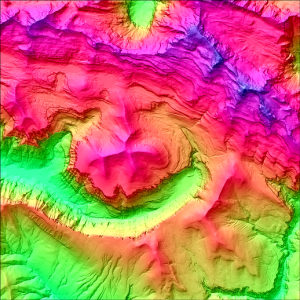
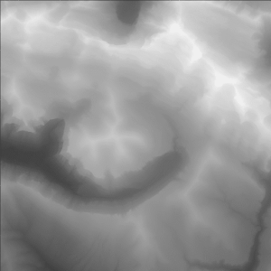
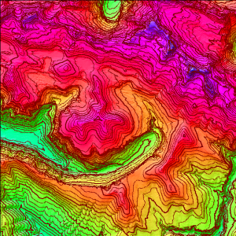
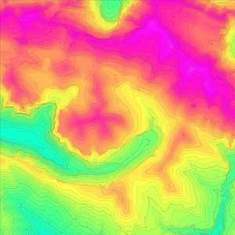
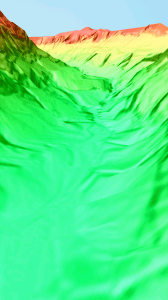
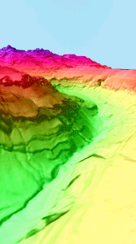
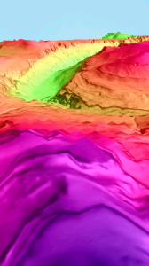

[Gredos 3D](https://play.google.com/store/apps/details?id=com.jgc.gredos_3d) es mi primera app para Android. Tenía ganas de meterme de lleno en el mundillo de la programación de aplicaciones móviles y sin habérmelo propuesto he aprendido mucho sobre mapas, cartografía y modelos digitales del terreno así como de OpenGL y la programación 3D.

  

En un primer momento la intención de la investigación inicial era aportar valor añadido a una app desarrollada por mi amigo Ricardo Vallés, [Cimas de España](https://play.google.com/store/apps/details?id=ramLabs.namespace),  pero después de varios estudios y análisis de requisitos vi que "el peso" de la información necesaria para crear un mapa de alturas o heightmap lo suficientemente detallado era tremendamente alto. No tomé nota de los pesos exactos pero estoy trabajando justo ahora mismo en otra representación 3D de otra zona montañosa y para que os hagáis una idea de los pesos os puedo decir que una imagen bastante detallada que cubre una zona de 10 kilómetros cuadrados, con una resolución de 2070 x 2071 píxeles pesa exactamente 12.564KB. Ésta imagen la he generado a partir de un modelo digital del terreno, que he descargado ésta vez del Instituto Geográfico Nacional, utilizando el programa MicroDEM. Del Modelo Digital del Terreno Original (MDT) he recortado justo el área con la que quiero trabajar, éstos 10 kilómetros cuadrados, y he exportado la imagen en formato BMP de la que hablaba hace un momento. Esa imagen la retocaré porque gracias al software que estoy utilizando puedo añadirle curvas de nivel y modificar la escala de colores que utiliza para representar la altura. Guardaré cada cambio pero siempre trabajando  sobre el mismo área. 

  

Al final lo único necesario para generar un mapa en tres dimensiones es una textura para el suelo y los datos de altura de cada punto del terreno. A éstos datos se los conoce como heightmaps o mapas de altura y la mejor y mas intuitiva forma de representarlos, y la más eficiente en cuanto a almacenamiento físico, es utilizando una imagen en escala de grises donde el negro sea la altura base y el blanco puro sea el punto más alto de toda la proyección en 3D. 

  

Al final trabajando con el programa MicroDEM sobre el mismo área acabo generando unas cuantas texturas sobre las que si quiero luego puedo jugar con el GIMP para superponerles ortofotos y genero también un heightmap.

  

El heightmap en el programa se utiliza para generar una malla de planos, que, en resumidas cuentas, es una matriz que contiene un plano, es decir, tres puntos, por cada punto con la altura en escala de grises del heightmap. Ésta malla es la que representa los triángulos que, unidos unos con otros, forman la representación del terreno. Posteriormente sobre esa malla se proyecta la imagen de la textura utilizando OpenGL y se crea así el mundo virtual.

  

Hoy estoy trabajando para generar una representación en 3D del valle de Ordesa y creo que puede ser interesante ir documentando aquí los pasos que he seguido. El código de la aplicación ya lo tengo y vale para cualquier terreno, tan sólo tengo que generar un nuevo proyecto, generar el heightmap y las texturas que va a utilizar y ajustar unas cuantos parámetros para crear una nueva aplicación 3D con la zona que quiera. 

  

Aquí podéis ver la primera imagen con la que estoy trabajando:

  

  

Así quedaría en escala de grises:

  

  

Ambas imágenes las he reducido y tienen mucho menos detalle que las que yo voy a utilizar para no ralentizar la entrada y por si alguien se las quiere descargar. Las originales pesan 12 y 3 MB respectivamente y éstas de aquí 794 y  187 KB. En la siguiente imagen se ve cómo he añadido a la textura las curvas de nivel.

  

  

Ahora voy a recortar las imágenes para que tengan un tamaño manejable, 1024 x 1024 el heightmap y 2048 x 2048 la textura. Bueno, antes de eso voy a generar las curvas de nivel incluyendo un la leyenda de la altura de cada línea. El proceso de renderizado de ésta imagen lleva muchísimo tiempo pero de ésta imagen si que os voy a dejar la original porque es un mapa muy detallado del valle de Ordesa al que seguro que más de uno puede sacar provecho si va a dar un buen paseo por allí... 

  

Bueno, ha tardado algo más de media hora en generarse y creo que las fuentes son demasiado pequeñas pero aquí os dejo la imagen original. Mientras se sube al blog voy a ir recortándola y voy a generar la primera versión de Ordesa 3D con ésta textura.

  

  

Os dejo unas capturas de pantalla de lo que he conseguido... Voy a seguir trabajando en ésto y cuando acabe lo subiré al Market y publicaré otra entrada en el blog.

  

  

  

Me gusta mucho, voy a oscurecer un poco el terreno porque creo que brilla demasiado y voy a subir ésta aplicación, la llamaré [Ordesa Virtual 3D](https://play.google.com/store/apps/details?id=com.jgc.ordesa_virtual_3d). Ésta tarde si tengo tiempo seguiré "jugando" un poco y, en vez de utilizar éste terreno, voy a construir una ortofoto a partir de las imágenes de Sigpac y creo que va a quedar espectacular. 

  

(Actualizado el 29/08/2012)

  

El resultado de mi trabajo aquella tarde es [Ordesa 3D](https://play.google.com/store/apps/details?id=com.jgc.ordesa_3d). Está bastante bien pero deja de ser útil como mapa y es más una especie de juego o aplicación vistosa de entretenimiento.

  

La aplicación ha evolucionado mucho en tan solo dos días. Primero publiqué Gredos 3D, que para mí no debeja de ser un experimento y una prueba de concepto, y después de optimizar la calidad, tanto de la resolución y la optimización del peso de la aplicación como de la calidad visual, he decidido crear otra aplicación muy similar a la primera pero en la que el mundo virtual tiene 10km cuadrados y la textura es en blanco y negro con sombras autogeneradas y con curvas de nivel. Ésta aplicación la he llamado Gredos Virtual 3D y es el mapa en tres dimensiones definitivo del circo de Gredos y sus alrededores. Dejo unas capturas de pantalla de Gredos Virtual 3D:

  
  
Aquí tenéis los enlaces a las cuatro aplicaciones 3D que llevo hechas hasta el momento:

- [Gredos 3D](https://play.google.com/store/apps/details?id=com.jgc.gredos_3d)
- [Gredos Virtual 3D](https://play.google.com/store/apps/details?id=com.jgc.gredos_virtual_3d)
- [Ordesa 3D](https://play.google.com/store/apps/details?id=com.jgc.ordesa_3d)
- [Ordesa Virtual 3D](https://play.google.com/store/apps/details?id=com.jgc.ordesa_virtual_3d)

  

  

Y desde [aquí](https://play.google.com/store/apps/developer?id=Juan+Garc%C3%ADa+Carmona) podéis acceder a todas mis aplicaciones en el [Google Play](https://play.google.com/store).
