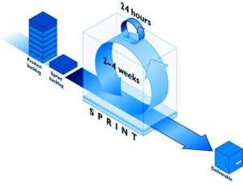

> Para empezar éste artículo tengo que decir que no soy SCRUM Master ni tengo ninguna certificación en SCRUM. Creo más en las capacidades reales de la gente que en sus certificaciones. No quiero hacer comparaciones porque las comparaciones son odiosas pero he tenido compañeros, físicos  de carrera, que ejercían increíblemente bien de arquitectos de software y de desarrolladores sin tener ninguna certificación en la materia. Aunque no soy un experto en SCRUM ni estoy certificado como tal mis conocimientos sobre la materia me los dan la experiencia y la práctica en dos implementaciones de SCRUM distintas en dos equipos de desarrollo distintos. 

**Mi resumen de SCRUM**

  

SCRUM es una metodología ágil basada en la [filosofía LEAN](http://juan-garcia-carmona.blogspot.com.es/2012/08/lean-principios-basicos-de-las.html) que, originariamente, estuvo enfocada a la gestión de proyectos de desarrollo de software pero que actualmente está siendo aplicada a otros ámbitos donde la aplicación de metodologías ágiles se han visto necesarias para la mejora de la eficiencia y la calidad.

  

SCRUM busca la optimización de la eficacia en la producción de cualquier grupo de trabajo, es decir, mejorar la eficiencia, sin detrimento de la calidad del producto final añadiendo para ello ciertos elementos que en anteriores modelos de gestión no existían como son las reuniones diarias, las retrospectivas, el método científico para la gestión de cambios propio de [Kanban](http://juan-garcia-carmona.blogspot.com.es/2012/08/el-corazon-del-metodo-kanban.html) o la representación visual del flujo de trabajo y las tareas pendientes y en ejecución (muy parecido al [tablero Kanban](http://juan-garcia-carmona.blogspot.com.es/2012/08/el-tablero-kanban.html)) que ayudan a informar y a involucrar a todos los integrantes del grupo de trabajo en el control, la gestión y la mejora de todo el proceso productivo.

  

El funcionamiento a grandes rasgos es el siguiente: 

- Somos un **grupo de trabajo** y tenemos un **producto** que hay que ir **entregando** poco a poco, d**e forma regular e incremental**. 
- Éste producto lo podemos dividir en **tareas** y tendremos una **lista de tareas** de forma que uno o varios miembros del grupo podamos acometer una tarea. Éstas tareas tienen una **estimación** del esfuerzo en puntos que representan una **suma consensuada entre el esfuerzo en tiempo y la complejidad** que supone. 
- El **grupo** como tal tiene una estimación de la **cantidad de puntos** que es **capaz de realizar** cada cierto intervalo de tiempo de entre dos y cuatro semanas. 
- **Cada día**, a primera hora, se hace **una reunión lo más breve posible** en la que cada miembro del grupo nos cuenta que hizo el día anterior, lo que piensa hacer hoy y si tienen algún tipo de problema, bloqueo o queja. 
- A la finalización de cada intervalo de tiempo se hace una **reunión retrospectiva** donde se evalúa que se ha hecho **bien** y que se ha hecho **mal** durante ese intervalo y se llega a conclusiones para el siguiente intervalo sobre cosas que hay que **empezar a hacer** o hay **dejar de hacer** y se planifican **acciones concretas con el objetivo de evolucionar** como grupo para ganar **en eficiencia y calidad**. 
- Para terminar **se prepara el siguiente intervalo** de tiempo, para lo que se seleccionan **nuevas tareas** de entre la lista de tareas a realizar, las más prioritarias y, entre todos los integrantes del grupo, se estiman, en puntos, hasta alcanzar la cantidad de puntos que el grupo es capaz de acometer.

  

No he querido entrar en muchos detalles ni en nombres de los elementos intervinientes en SCRUM para no saturar al lector pues mi objetivo hasta aquí era mostrar que **SCRUM es un método de trabajo ágil, evolutivo y autogestionado por un grupo de trabajo en constante evolución** profesional en el que toman especial protagonismo la **comunicación**, el **consenso** y la **autocrítica** y cuyo principal objetivo es la **entrega constante de valor al cliente**.

  

**Elementos de SCRUM**

  

En SCRUM se distinguen claramente tres categorías de elementos: peridos de tiempo,  artefactos y roles.

  

Periodos de tiempo

  

**Todo en SCRUM esta dividido en periodos de tiempo**, esto nos ayuda a **mantener el rumbo** del proyecto y a **entregar en las fechas previstas** ya que cada reunión tiene unas pautas y unos límites de tiempo preestablecidos. **Están prohibidas esas reuniones interminables, improductivas y tremendamente costosas.**

  

**Sprint** es el período en el que estamos trabajando. Se establece una duración fija de **entre de 2 y 4 semanas** al principio del proyecto que se debe mantener para posibilitar la gestión del cambio evolutiva.

  

Hay 5 tipos de reuniones dentro de un Sprint. 

  

- **Sprint Planning:** al comienzo del Sprint tenemos la reunión de **planificación**  que no debería durar más de una jornada de trabajo. En esta reunión **se estiman** en puntos suficientes **tareas** como para que el equipo alcance, al menos, su límite de trabajo.  
    (**8 horas máximo**)
- **Sprint Commitment Meeting:** es una reunión de **compromiso**. En ésta reunión, con la estimación ya hecha, se llega a un compromiso entre el equipo y el Jefe de producto **sobre las tareas que se realizarán** durante el Sprint.  
    (**4 horas máximo**) 
- **Sprint Review:** al final del Sprint se realiza una **revisión de lo que se ha hecho** durante el Sprint. Se evalua lo que se ha hecho y cómo se ha hecho y de ésta reunión podrían salir nuevas tareas o requisitos para el siguiente Sprint.  
    (**4 horas máximo**)
- **Sprint Retrospective:** una vez hecha la **revisión** se realiza ésta reunión de **retrospectiva** en la que se busca la **autocrítica**, individual y colectiva, **enfocada a la mejora de la eficiencia y la calidad.**  
    (**3 horas máximo**)
- **Daily Meeting:** todos los días tenemos el Daily Meeting, una **reunión** en el que **cada miembro del equipo** nos cuenta que hizo la **jornada anterior**, **lo que piensa hacer en ésta** y nos expone sus **bloqueos** si los tiene.  
    (**15 minutos máximo**)

  

  

Artefactos

  

Existen tres artefactos, el Product Backlog, el Sprint Backlog y el Burndown Chart.

  

**Product Backlog:** es una "caja" con **todos los requisitos del producto**. éstos requisitos pueden ir cambiando y ésta "caja" se puede implementar de muchas formas, dependerá del tipo de proyecto, producto o servicio que se quiera entregar. **El responsable de la gestión de ésta "caja" es el jefe de producto**, es quien modificará requisitos o los priorizará cuando crea necesario y quien "encolará" requisitos para la creación en cada Sprint del Sprint Backlog.

  

**Sprint Backlog:** es un **subconjunto** del Product Backlog **con los requisitos más prioritarios**. Durante la reunión de planificación, el Sprint Planning, el grupo de trabajo subdivide éstos requisitos en tareas que se estiman en puntos. **Una vez comenzado el Sprint el Sprint Backlog no cambia.** Es el grupo de trabajo, acorde a sus posibilidades, quien a lo largo del Sprint van pasando dichas tareas desde un estado "pendiente", es decir, están en el backlog, a un estado "Done!", es decir, finalizadas.

  

  

**Burndown Chart:** es un **gráfico que indica la cantidad de trabajo que queda en el Sprint**. En el eje Y tenemos la cantidad de trabajo pendiente y en el eje X los días que quedan para la finalización del Sprint de tal forma que el gráfico siempre es un **polígono o una curva descendente** que ha de tender a cero, de ahí el nombre. Éste gráfico es **actualizado a diario por el ScrumMaster después del Daily Meeting** tras haber escuchado a todos los integrantes del grupo decir qué consiguieron acabar durante la jornada anterior.

  

  

  

Roles  

  

Existen tres roles en SCRUM, el Product Owner o jefe de producto, el Scrum Master y el Scrum Team o equipo Scrum.

  

**Product Owner:** es el **experto en la materia**, el jefe del producto, quien se supone que **sabe lo que quiere y cómo lo quiere** y quien **prioriza** los requisitos  en las reuniones de planificación **y quien aceptará si las tareas están hechas o no** una vez que los miembros del equipo las dejan listas para verificación. 

  

**Scrum Master:** **es un entrenador y un filtro**. Como entrenador debe **garantizar el cumplimiento** de las funciones de cada miembro del equipo, **adiestrar y educar** a los miembros que lo necesiten en lo que necesiten en cada momento y **garantizar la consecución de los objetivos**. Como filtro debe **eliminar los obstáculos** y los llamados residuos de Kanban y **proteger al equipo** ante cualquier distracción externa. **Es deseable que sea un trabajador altamente cualificado con dotes de liderazgo** además de ser **responsable**, **organizado** y **consecuente**. Es importante que el Scrum Master forme parte del grupo de trabajo para que esté totalmente **involucrado en el trabajo diario** y las sensaciones generales del equipo.

  

**Scrum Team:** es el equipo o grupo de trabajo. Se recomienda que sea de **entre 2 y 7 personas** y debería estar compuesto por ingenieros, arquitectos, diseñadores y testers si el SCRUM es aplicado al desarrollo de software.

  

Para terminar mi resumen de lo que es SCRUM sólo quiero repetir una frase que más de una vez me dijo un compañero en uno de los equipos de SCRUM y es:  

> "No estamos al servicio de las metodologías sino al revés, las metodologías están a nuestro servicio."

  

Con ésto quiero decir que no debemos ser esclavos "de lo que dice el libro" sino que hemos de ir adaptándolo a nuestras necesidades en cada momento y si, por ejemplo, una reunión retrospectiva tiene que alargarse más de la cuenta porque ese sprint ha sido peculiar por algún  motivo, si va a ser beneficioso que se alarga entonces adelante. Si, en detrimento de la cantidad de trabajo que va a ser capaz de entregar el equipo durante éste Sprint existe la posibilidad de formar al equipo en cierta nueva tecnología que mejorará la eficiencia en próximos Sprints entonces formemos al equipo... Y se podrían dar muchos ejemplos al respecto.

  

Quisiera que éste resumen de SCRUM sirviera de base a distintos departamentos y organizaciones para aplicarlo como metodología en su flujo de trabajo diario.  Hay mucho más que decir sobre SCRUM, por ejemplo, no he mencionado la SCRUM Board, cosa que haré en un futuro pues he visto muchas. Además, en un próximo artículo tengo intención de mostrar algunos ejemplos que ya tengo recopilados sobre la aplicación de SCRUM en muy distintos ámbitos, todos ellos bastante lejanos al desarrollo de Software. Espero que os haya sido útil mi resumen. 

  

Juan García Camona

[d.jgc.it@gmail.com](mailto:d.jgc.it@gmail.com)
