Hoy leo que **María Teresa Ruiz Monzón**, una informática de la **Universidad del País Vasco** (UPV/EHU), acaba de presentar una aplicación para que los montañeros puedan usar la **geolocalización 3D** en sus móviles. Por lo que he leído, porque no he conseguido saber cómo se llama la aplicación para probarla, tiene un **grave fallo**, en mi opinión, y es que **necesita de conexión a Internet** para ir descargando los datos necesarios para representar el área que tienes a tu alrededor.  Lo he leído en [éste artículo](http://www.publico.es/ciencias/442444/un-google-earth-montanero-ayuda-a-orientarse-entre-la-niebla) en el que también se dice que tiene **problemas de memoria**. Por las tecnologías que menciona y por la captura de pantalla que he podido ver de la aplicación creo que el desarrollo ha sido muy similar a "**mis montañas en 3D**" sólo que **yo tomé la decisión de**, en vez de posibilitar la reproducción de la zona de España en la que estés, por esos mismos problemas de memoria, **reproducir con más calidad zonas montañosas concretas** como el **Circo de Gredos en Ávila**, el **Valle de Ordesa en Huesca**, o distintas zonas de la **Sierra de Guadarrama en Madrid y Segovia** como la zona de **Peñalara** o la ruta de **La Cuerda Larga** que va desde el Puerto de Navacerrada hasta el Puerto de La Morcuera. 

  

A raíz de ésta noticia he decidido volver a ponerme manos a la obra con "mis montañas en 3D" porque tengo pendiente, casi desde que saqué la primera versión de Gredos 3D que fue la primera que hice y una de las más vistosas, varias mejoras que, curiosamente, si que ha desarrollado María Teresa. Una de ellas es el **modo niebla**, que convertiría "mis montañas 3D" más que en un juego en una **ayuda en montaña** ya que, gracias a la brújula y a los niveles del dispositivo, en caso de niebla **nos mostraría el terreno que tenemos delante aunque no lo viéramos**. Otra de las mejoras y con la que me pondré primero es, **en modo juego**, es decir, moviéndote libremente por "el escenario", **dar al usuario información sobre su posición**, su altitud y la dirección en la que mira. La tercera de las mejoras sería **poder hacer zoom**, sé que OpenGL ES lo permite y lo apliqué en uno de los tutoriales que seguí para aprender pero tendría que recordarlo. En resumen son tres puntos, mis tres próximos hitos:

1. **Dar información de tu posición en modo juego, coordenadas, altura y dirección.**
2. **Posicionarte en el mapa si estás en ése área, modo niebla, y utilizar sensores para mostrar lo que se debería ver.**
3. **Poder hacer zoom.**
4. **(Añadido a posteriori) Mejorar la pantalla de inicio.**

  

No voy a sacar más mapas en 3D hasta que "el motor 3D", que es el mismo en todas las aplicaciones, no tenga, al menos, dos de estas tres nuevas características aunque si que tengo pensado mejorar algunas cosas en todas ellas como las texturas de alguna de ellas. Voy a hacer ahora un resumen del "estado del arte" de "mis montañas en 3D". 

  

**Todas mis aplicaciones Android las publicaré con mi nombre completo y son accesibles desde [aquí](https://play.google.com/store/apps/developer?id=Juan+Garc%C3%ADa+Carmona).**

  

[**GREDOS 3D**](https://play.google.com/store/apps/details?id=com.jgc.gredos_3d)

  

La primera que subí fue Gredos 3D, que fue uno de los primeros intentos de aprender a programar Android y que acabó derivando en una interminable serie de horas "jugando" a programar cosas en 3D. Muy entretenido y para mi gusto con **un resultado final espectacular**, aunque claro, soy el autor y siempre veo fallos, no me gusta, ni en ésta ni en las otras, la pantalla inicial, creo que es una chapuza. En Gredos 3D estamos en una representación en 3D del Circo de Gredos, Ávila, y sus alrededores. Podemos pasear rápidamente hasta el **pico Almanzor o la Galana**, andar por la **Laguna Grande de Gredos** y acercarnos a **Los Galayos**.  Si no recuerdo mal, no tengo los datos delante, eran 15 kilómetros cuadrados.

  

[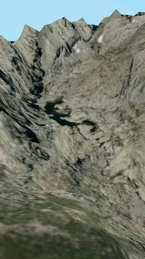](https://jgcarmona.com/wp-content/uploads/2012/09/e80ef-unnamed.jpg)

  

[**GREDOS VIRTUAL 3D**](https://play.google.com/store/apps/details?id=com.jgc.gredos_virtual_3d)

  

La siguiente aplicación que subí fue una variación de [Gredos 3D](https://play.google.com/store/apps/details?id=com.jgc.gredos_3d) a la que llamé [Gredos Virtual 3D](https://play.google.com/store/apps/details?id=com.jgc.gredos_virtual_3d) en la que en vez de una textura realizada "artesanalmente" juntando ortofotos de muchísima calidad realicé, a partir del mapa de alturas, una textura que no era más que un **mapa con curvas de nivel y sombras** creadas "automáticamente" y en el que **dibujé** a mano **las lagunas**, **la carretera de la Plataforma de Gredos** y los refugios de **El Reguero Llano** y el **Refugio Elola**.

  

  

**\[ACTUALIZADO 04/10/2012\]**

Hay bastante gente que ya lo sabe porque según las estadísticas de la Consola del desarrollador de Google Play hubo149 instalaciones totales de usuarios y hay 27 instalaciones activas de dispositivos actualmente. PAra todos menos esas 27 personas: volví a crear la textura de Gredos 3D con unas curvas de nivel más estandarizadas, es decir, con una separación de 20m entre las curvas. Me he guardado la imagen base, el mapa con curvas de nivel, para ir añadiendo sobre él caminos, rutas, cascadas de hielo, etcétera y ya he encontrado la manera de ponerle una leyenda en 3D que pueda leer el observador desde cualquier ángulo pero aún no me voy a poner con eso. Quiero que veáis el "estado del arte" del modo niebla y creo qu el siguiente vídeo habla por sí solo.

  

  

  

Mi intención es acabarlo hoy, ya tengo abierto el eclipse y el proyecto y las ideas claras sobre cómo quiero hacer la interfaz de usuario mientras se obtiene la posición GPS. Prometo hacer lo mismo para la siguiente actualización de Ordesa Virtual 3D en cuanto acabe con Gredos Virtual 3D.

  

**\[/ACTUALIZADO 04/10/2012\]**

[**ORDESA VIRTUAL 3D**](https://play.google.com/store/apps/details?id=com.jgc.ordesa_virtual_3d)

  

Ordesa Virtual 3D es una representación de **10 kilómetros cuadrados** alrededor del abrupto Valle de Ordesa. Para quien conozca ésta zona puedo decir que aparece parte del **Cañón de Añisclo**, **El Monte Perdido y el Cilindro, El Balcón de Pineta y parte del Circo de Gavarnié**. Al igual que sucede con Gredos Virtual 3D el resultado de la textura no acaba de convencerme pues no es estándar, tengo que modificarlo para que quede como en la representación que, para mi gusto, mejor quedó, la de Peñalara 3D Map. Dejo unas capturas del estado actual de Ordesa Virtual 3D.

  

[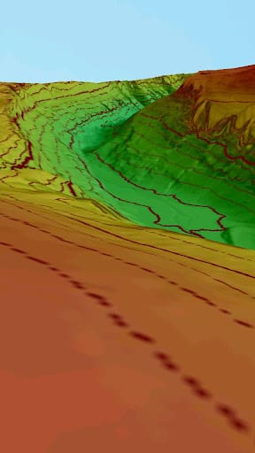](https://jgcarmona.com/wp-content/uploads/2012/09/320d5-unnamed.jpg)[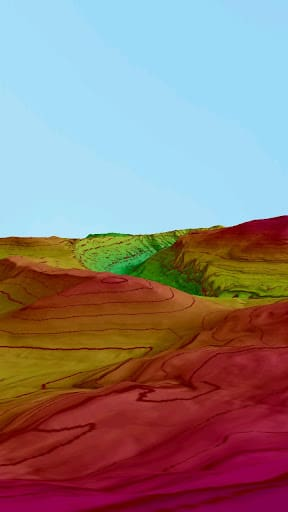](https://jgcarmona.com/wp-content/uploads/2012/09/6b6dc-unnamed.jpg)[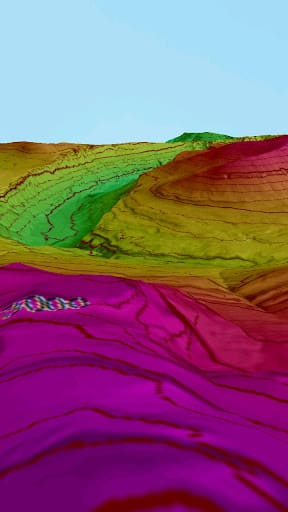](https://jgcarmona.com/wp-content/uploads/2012/09/7b724-unnamed.jpg)[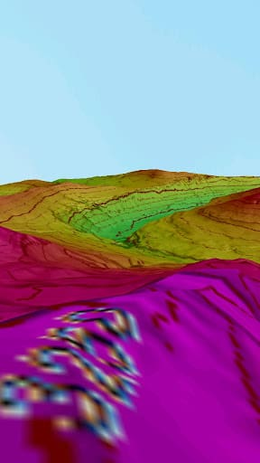](https://jgcarmona.com/wp-content/uploads/2012/09/0ea43-unnamed.jpg)[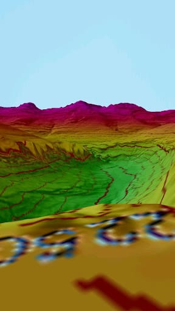](https://jgcarmona.com/wp-content/uploads/2012/09/23c62-unnamed.jpg)

  

En éstas imágenes se aprecia la sombra y se ve que están marcadas las alturas de algunas curvas de nivel pero el "código de colores" aunque si que es bastante estándar no acaba de gustarme, por eso ésta textura también la voy a modificar para que se parezca a la de Peñalara 3D Map.

  

[**ORDESA 3D**](https://play.google.com/store/apps/details?id=com.jgc.ordesa_3d)

  

Ordesa 3D es el mismo escenario que el anterior pero con una **textura basada en Ortofotos copiadas y pegadas en un lienzo de** **2048x2048 px**. **Fue un trabajo duro, cansado para la vista**, pero creo que me quedó bastante bien, el único problema fue que **dicha textura** en formato png **ocupaba una barbaridad** (más de 10 MB) así que **la comprimí y la guardé en otro formato** que llevaba menos ruido y datos que para lo que se necesita en la aplicación son inútiles. **Ésta optimización vino por un comentario que me hizo un usuario de la aplicación** ya que siempre dejo mi correo "profesional" a disposición de mis potenciales usuarios ([d.jgc.it@gmail.com](mailto:d.jgc.it@gmail.com)). Él **me dijo que en su dispositivo la aplicación no funcionaba debido a un desbordamiento de la memoria**. Ésto me llevo a desarrollar **Ordesa 3D Little** (mismo escenario pero mucha menos resolución en cuanto a alturas y en cuanto a texturas pero parecida definición en tiempo de ejecución) y a encontrar la manera en la que después he ido reduciendo el paso de las distintas texturas de "mis montañas 3D". Ordesa 3D y 3D Little se ven así:

  

[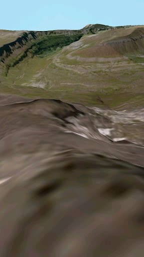](https://jgcarmona.com/wp-content/uploads/2012/09/074fb-unnamed.jpg)[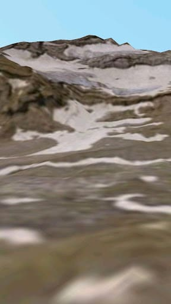](https://jgcarmona.com/wp-content/uploads/2012/09/50403-unnamed.jpg)[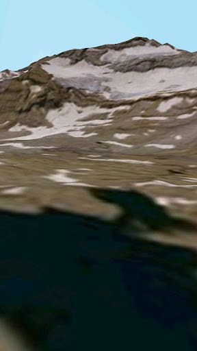](https://jgcarmona.com/wp-content/uploads/2012/09/4da6c-unnamed.jpg)[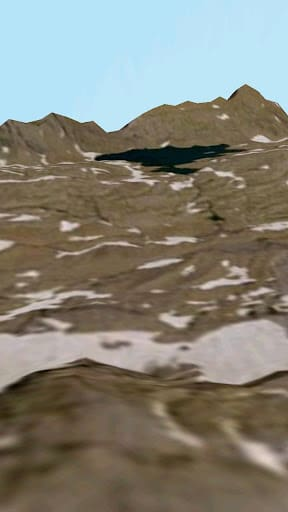](https://jgcarmona.com/wp-content/uploads/2012/09/e77f0-unnamed.jpg)[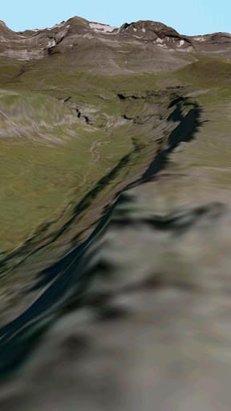](https://jgcarmona.com/wp-content/uploads/2012/09/f6ac1-unnamed.jpg)

  

Creo que cualquiera que haya estado por allí podrá decir que es tremendamente realista, en esas imágenes vemos distintas perspectivas del **Valle de Ordesa** (1, 5 y 6) el **Glaciar de Monter Perdido** (2 y 3) y el B**alcón de Pineta desde el Monte Perdido** hacia donde debería estar el **Refugio de Tucarroya** (4). Espero tener pronto el modo niebla y el panel con los datos de la posición y la dirección de la cámara en modo juego.

  

[**PEÑALARA 3D MAP**](https://play.google.com/store/apps/details?id=com.jgc.penalara_3d_map)

  

Ya he hablado antes de ésta aplicación y he dicho que era la que tenía la mejor textura (virtual o tipo mapa) de todas. Es un mapa virtual en 3D con curvas de nivel cada 20 metros alrededor del **Pico Peñalara**. Me gusta mucho como me quedó la textura y la manera en la que la hice y será como haga a partir de ahora todas las aplicaciones que pretendan ser un mapa topográfico en 3D, es decir, en un solo color, verdoso, con sombras y curvas de nivel cada 20 metros. En esta App aparecen marcadas varias zonas, en dos tonos más oscuros de verde, primero el **parque de Peñalara** y segundo las **zonas de especial protección medioambiental** del mismo; **en tono azulado aparece la parte de la estación de esquí de Valdesquí** que queda dentro del mapa. ¿Que os parecen éstas imágenes?

  

[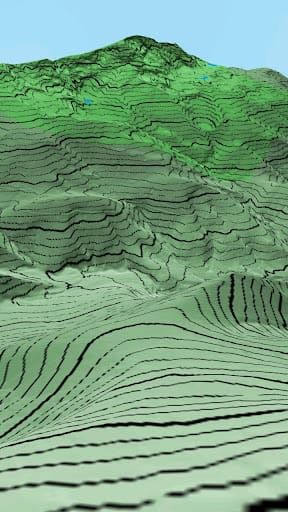](https://jgcarmona.com/wp-content/uploads/2012/09/b47ee-unnamed.jpg)[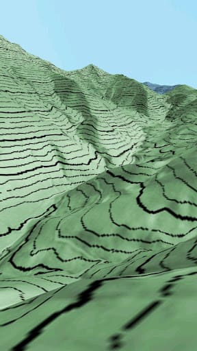](https://jgcarmona.com/wp-content/uploads/2012/09/22696-unnamed.jpg)[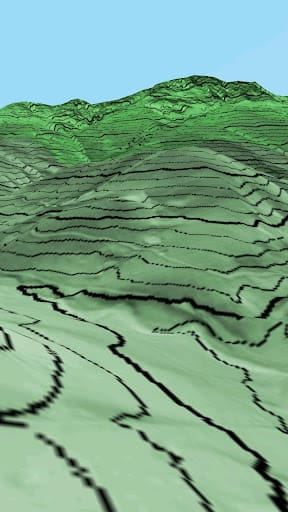](https://jgcarmona.com/wp-content/uploads/2012/09/1770b-unnamed.jpg)[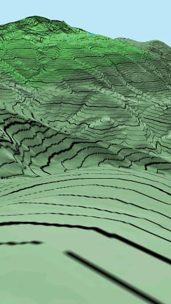](https://jgcarmona.com/wp-content/uploads/2012/09/1898c-unnamed.jpg)

  

¿Os gusta? Mi opinión ya la sabéis, y es que todas las texturas de mapas virtuales en 3D deberían ser como ésta, mejora que aplicaré poco a poco tanto a **Gredos Virtual 3D** como a **Ordesa Virtual 3D**.

  

[**CUERDA LARGA 3D MAP**](https://play.google.com/store/apps/details?id=com.jgc.cuerda_larga_3d_map)

  

**Ésta es la aplicación que abarca más superficie de todas las que he desarrollado hasta el momento.** Son **10 kilómetros en vertical**, de Norte a Sur, **por 20 kilómetros en horizontal**, de Este a Oeste. En ella aparece representada gran parte de la **Sierra de Guadarrama** y en el mapa he marcado la ruta de **La Cuerda Larga**, ruta que, de cumbre en cumbre, recorre un trayecto directo entre el **Puerto de Navacerrada** y el **Puerto de La Morcuera** por encime de lo que los madrileños conocen como "**La sierra de Madrid**". Al igual que en Peñalara 3D Map en ésta aplicación he marcado en verde más intenso otro parque natural, el **Parque Regional de La Pedriza del Manzanares**, y también aparece marcado en azul la **Estación de Esquí de Valdesquí**, esta vez en su totalidad. Quien haya probado Peñalara 3D Map dirá que la textura de ésta última aplicación es mejorable pero yo le diría que el "peso" total de la aplicación y la cantidad de recursos consumidos en tiempo de ejecución hacen inviable una mejora. 

  

[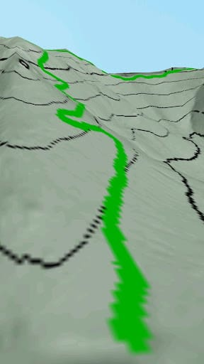](https://jgcarmona.com/wp-content/uploads/2012/09/17c50-unnamed.jpg)[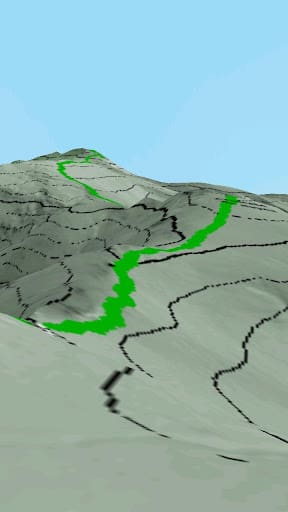](https://jgcarmona.com/wp-content/uploads/2012/09/b03bf-unnamed.jpg)[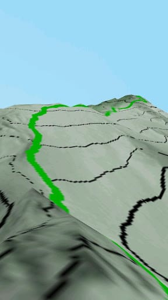](https://jgcarmona.com/wp-content/uploads/2012/09/4deec-unnamed.jpg)[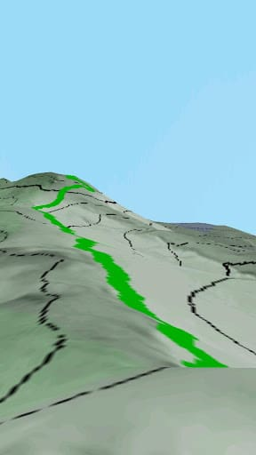](https://jgcarmona.com/wp-content/uploads/2012/09/b9612-unnamed.jpg)[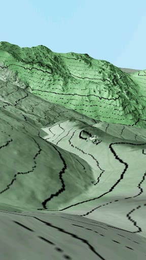](https://jgcarmona.com/wp-content/uploads/2012/09/2a1be-unnamed.jpg)[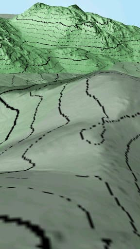](https://jgcarmona.com/wp-content/uploads/2012/09/05899-unnamed.jpg)[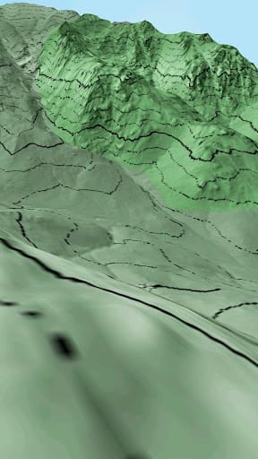](https://jgcarmona.com/wp-content/uploads/2012/09/208f2-unnamed.jpg)

  

En esas imágenes vemos el comienzo de la ruta desde el **Puerto de Navacerrada** (1) y distintas **partes de la ruta de La Cuerda Larga** (2, 3 y 4), **La Pedriza desde distintos puntos de la ruta** (5, 6 y 8) y una imagen del **Pico de La Maliciosa** (8).

  

Voy a acabar la entrada de hoy con un resumen de mis **siguientes pasos** con respecto a "mis montañas 3D". 

**1.- Mejorar las texturas de Gredos Virtual 3D y Ordesa Virtual 3D**

**2.- Mostrar información de la posición en modo juego**

**3.- Habilitar "modo niebla" (cuando estás dentro del mapa)**

**4.- Mejorar la pantalla de inicio de cada aplicación, todas son iguales con alguna variación.**

  

PD: ¿Quieres o **tienes especial interés en tener disponible alguna zona concreta en 3D** con éste formato? Pídemelo sin problema, en mi lista de mapas pendientes tengo varios valles del Pirineo y de Picos de Europa y aunque no tengo pensado seguir haciendo mapas hasta que no acabe las mejoras en "el motor 3D" si quieres que saque alguno con el estado actual (modo juego sin datos de posición) **sólo tienes que pedírmelo y lo haré encantado**.

  

Un saludo.

  

Juan García Carmona

[d.jgc.it@gmail.com](mailto:d.jgc.it@gmail.com)
