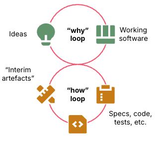
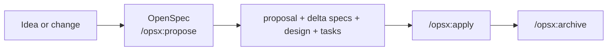
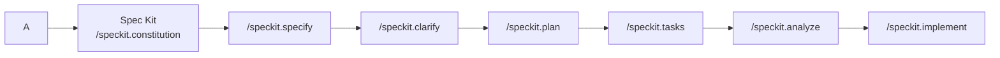
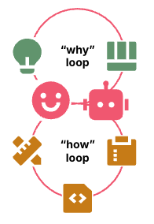

Last week I shared my thoughts about the difficulty on maintaining software quality these days that AI is producing most of our source code. I called that article [*Spec-Driven Development: Controlling AI-Generated Drift*](https://jgcarmona.com/en/spec-driven-done-right/). I aimed to share the idea on that we need to adapt to this paradigm shit and find better mechanisms togain control and avoid shift at many layers during our massive AI usage... The problem is no longer building systems, it's keeping them coherent while they evolve at a speed no human can match alone. In last article I just scratched the surface because this shift forces a different center of gravity.

**Orchestration.**

And I came today to show you a couple of ways (and tools) you can chooose to master orchestration.

---

## How I Got There

The thesis on last article was simple, `AI accelerates execution therefore specification must become the control system`. When I wrote that, I just wanted to share that I was paying a lot more attention on documentation and specs and I still recommend you to follow that approach on all your projects from now on. 

But this article goes one step further towards SDD. I don't want to stop at "please, use specs". I want to land what it actually means to move **towards** spec-driven development when you work with agents, with GitHub Copilot, with living repos, with greenfield or brownfield projects, with real real-life pressure at an absurd speed. 

This week the stars have aligned and two events have changed my perspective on this matter, and I feel compelled to share it with anyone who happens to read these lines (written entirely by a human, me, at least up to this point). 

First, a conversation with a coworker, [Andoni Santamaría](https://www.linkedin.com/in/andonisantamariaeguia), led me to **[OpenSpec](https://github.com/Fission-AI/OpenSpec)**, a lightweight, brownfield-first framework for living specifications. That blew my mind because many of my manual steps and ways of working where replicated into a tool that you could use, for free, to manage application and software development lifecycle. 

I fell in love with the project and its ease of use at first sight, both for its power and simplicity, for existing brownfield projects and its promising performance in greenfield projects. Amazing... And just as I was starting to familiarize myself with the tool, I was invited to give a talk at [GitHit Copilto Dev Days Madrid](https://githubcopilotdevdaysmadrid.techriders.es/), and I signed up to participate, at least until my talk, in the workshop organized by [Rodrigo Liberoff](https://www.linkedin.com/in/rliberoff/) and [Borja Piris de Castro](Borja Piris de Castro), **"SDD - GitHub Spec Kit for creating, managing, and building projects with AI"**... and bang! I discovered another alternative framework, perhaps even more powerful than OpenSpec, which is Spec Kit. 

It blew my mind. **BOOM!!!** Twice in a week. No wonder there's so much FOMO these days. 

Here I was, writing specs by hand or in a consultative and evolutionary way...  when it turns out there are N frameworks out there, super well-prepared to do all this, and whose results, I can tell you now, are spectacular. This change everything... HOLY SHIT! 

> I've always loved documentation, How could I missed that?

Withouth knowing nor having tried none of these tools last week I aimed for increasing our efforts on **designing better the context that governs agents**. That's why today I'm interested in talking about "towards" and not "the one true way." I don't believe in silver bullets, as you already know, and even less so at this stage. What I do believe is that we're entering a phase where improvising prompts is no longer enough. The discipline is no longer in writing better code by hand. 

*Spec-Driven Development* lands it very well: separating **spec** as the *what/why* from **plan** as the *how* stops being theory and becomes a reproducible operational sequence. What I learned myself, with `my-manual-and-quite-ineficient-process`, as well as what I learned with Andoni, Rodrigo and Borja, as well as experimenting during nightly hours this weekend present this as an explicit transition from *vibe coding* toward *context engineering*.

## I've Always Been on This Path

I know that form now on I will declare myyself a SDD evangelist, becuase whatever the automated or manual process you use, it worth. This emthusiasm, didn't come out of nowhere.

I've always leaned into what most teams avoided:

- **UML**, when it was still the default language for structure 
- **[SOLID and GRASP](https://jgcarmona.com/es/solid-y-grasp-buenas-practicas-hacia-el-exito-en-el-desarrollo-de-software/)**, I already wrote and spoke about these terms, deeply, on 2012
- **[C4 Model](https://c4model.com/)** for clarity and hierarchy
- **[Mermaid](https://mermaid.js.org/)** to keep diagrams close to code, lightweight, and versioned
- **[arc42](https://arc42.org/)** to structure architecture documentation properly
- **Design Patterns** when I need proven solutions instead of improvising under pressure ([Look at this list of 26 one-minute videos explaning "all" the design patterns](https://www.youtube.com/playlist?list=PLquujPA7EWzPhJeBWFUu9Pbj1MMc8u03y) )

That was my "gang of seven". Not academic nor dogmatic. Just tools that help me keep the system understandable while everything else tries to move faster than I can think.

And now, is when all these years of trying to understand, reading though papers, articles and books, writing and generating videos, sharing inshigts and experience about these topics with the world seems a loot more valuable. 

I am finally convinced:

> coding jobs are officialy dead

Please, understandme well, I love coding, I've been coding, daily, for more than 20 years now and I'll keep coding just for fun... But I don't think anyone would hire a mere developer anymore.

## The Missing Piece Was Never Documentation

Documentation was never the problem. **Static** documentation is. I used to say that

> Documentation is obsolete by nature

You can define:

- Perfect domain language
- Clean boundaries
- Clear diagrams

And still lose the system within weeks because nothing enforces alignment over time.

That's the gap OpenSpec and Spec Kit start to close. They don't just describe the system—they **plug into how it evolves**.

## What Convinces Me About OpenSpec

[OpenSpec](https://github.com/Fission-AI/OpenSpec) attacks the problem from a specific angle. Its official sources present it as a lightweight, universal, open-source framework compatible with multiple assistants—including GitHub Copilot—with a very explicit philosophy: **fluid not rigid**, **iterative not waterfall**, **easy not complex**, and **brownfield-first**. That statement of intent says a lot. It doesn't try to look like a corporate process. It tries to be a minimal layer of structure where intent survives velocity.

Its mental model is also distinct. OpenSpec separates two spaces: `openspec/specs/` as the source of truth for the system's current behavior, and `openspec/changes/` as a folder for proposed changes. Each change lives as a self-contained package with `proposal.md`, `design.md`, `tasks.md`, and *delta specs*. The documentation summarizes the flow as: **proposal → specs → design → tasks → implement**. That's especially sane for living repos, because the conversation stops evaporating in chat and starts being archived in the code itself.

The basic operational flow is very short: install, `openspec init`, start with `/opsx:propose`, execute with `/opsx:apply`, and consolidate with `/opsx:archive`. For the expanded profile, commands like `/opsx:new`, `/opsx:continue`, `/opsx:verify`, and `/opsx:sync` appear. It's no accident this works well with brownfield: OpenSpec insists that most real software doesn't start from scratch, and that it makes no sense to "generate all specs upfront"—you create them as needed and archive them to preserve the *why*, not just the *what*.

What I like about OpenSpec is precisely this: it doesn't try to win you over with monumentality. It wins if you understand that your biggest problem isn't starting—it's **maintaining stable context across sessions, changes, and people**. If I had to summarize it honestly: OpenSpec is a reminder that a useful spec doesn't have to be heavy, but it does have to be **persistent**.

## What Convinces Me About Spec Kit

[Spec Kit](https://github.com/github/spec-kit), for its part, is a very pragmatic attempt from GitHub (and many others) to convert that intuition into an integrated flow. GitHub open-sourced it in September 2025 and describes it as a toolkit for turning specifications from disposable scaffolding into executable, shareable artifacts. Its official documentation makes the central idea very clear: **intent-driven development**, project principles, multi-phase refinement, and less "one-shot" generation from loose prompts. Sounds great, right?

- The base flow is also explicit. First, **constitution**: guiding principles for the project. 
- Then **specify**: what I want to build and why. 
- Then **clarify** if there are ambiguities. 
- Then **plan**: technical decisions, architecture, and stack. 
- Then **tasks**: that generates the list of tasks that you agent(s) will tackle. 
- Optionally **analyze**: that allows us to analyze the specs before starting, so that we can refine or make adjustments
- Finally **implement**. 

I like it because it forces us to separate intent from solution, and because it leaves a trail in versionable artifacts: `constitution.md`, `spec.md`, `plan.md`, `tasks.md`, and even contracts, research, and quickstart in richer examples. It's very close to a manual SDLC, isn't it?

Beyond that, Spec Kit doesn't stop at the happy path. It has a clear route for **presets** and **extensions**. Presets let you modify templates and commands without forking the core; extensions add new capabilities. Template resolution follows a concrete stack: *project overrides → presets → extensions → core templates*. In serious environments, that matters a lot, it's the frontier between "using a tool" and "adapting it to your workflow without breaking it."

The workshop with Rodrigo and Borja was especially revealing because it teached me Spec Kit the best way possible: **by using it**. I just started there and then gave my speech, but I continued at home during the weekend playing around with the different phases... I still haven't finished of specifying my next big feature Spec Kit but now I know how I will do it from now on.

## Comparing OpenSpec and Spec Kit

My reading, after seeing both approaches up close, is that **OpenSpec and Spec Kit are not enemies**. They are two different responses to the same pain. The differences matter, yes, but mainly for choosing where to introduce discipline and with what level of opinion.

| Aspect | OpenSpec | Spec Kit |
|---|---|---|
| Philosophy | Lightweight, fluid, iterative, brownfield-first | More guided, more opinionated, oriented to intent + complete artifacts |
| Source of truth | `openspec/specs/` + changes in `openspec/changes/` | Constitution + numbered specs + plans + tasks within the Spec Kit flow |
| Base flow | `propose → apply → archive` | `constitution → specify → clarify → plan → tasks → analyze → implement` |
| Strength | Maintaining living, reviewable context in repos that already exist | Formalizing a pipeline from intent to implementation with clear guardrails |
| Customization | Profiles and expanded workflow | Presets, extensions, and overrides with a resolution stack |
| Best fit | Teams wanting minimal but persistent structure | Teams needing more framework, more traceability, and more homogeneity |

If I had to say it in one sentence: **OpenSpec feels like a continuity layer; Spec Kit, a governance layer**. They're not incompatible as ideas. 

## Last few chaotic thougts...

We can leverage classic SDLC models to produce serious software in weeks or days, classic watterfall or scrumfall. This doesn't eliminate the engineering, just the opposite, it forces us to be it.

> **AI doesn't eliminate engineering; it makes engineering a lot more important.**

There's no silver bullet. Everyone will have their own process. Specification-Driven Development works if you know how to define meaning, limit drift, and review with sound judgment.

And in this new landscape, there's only one word that matters:

**Orchestration.**

## Some Useful? Annotated Links

- [My previous article: *Spec-Driven Development: Controlling AI-Generated Drift*](https://jgcarmona.com/en/spec-driven-done-right/) — conceptual starting point for this piece: control, drift, and semantic anchors.
- [GitHub Copilot Dev Days 2026 — official repository](https://github.com/github/GitHub-Copilot-Dev-Days) — global context of the initiative, formats, and base materials.
- [Microsoft for Developers — GitHub Copilot Dev Days](https://developer.microsoft.com/blog/github-copilot-dev-days) — official description of the series and typical agenda.
- [TechRiders_es — GitHub Copilot Dev Days Madrid 2026 announcement](https://www.linkedin.com/posts/techriders-es_github-copilot-dev-days-madrid-2026-talleres-activity-7444773747707822082-0Job) — date, venue, and local focus for the Madrid event.
- [Plain Concepts — pre-event post](https://www.linkedin.com/posts/plainconcepts_copilotdevdaysmadrid-copilot-copilot-activity-7450456300070694913-qaOo) — public verification of my talk's title.
- [Rodrigo Liberoff — Sessionize](https://sessionize.com/rliberoff/) — public role and MVP status.
- [Borja Piris de Castro — Microsoft MVP Program recognition](https://www.linkedin.com/posts/borja-piris_los-reyes-magos-suelen-traen-regalos-muy-activity-7414620806175150080-fWLX) — public confirmation of his MVP acceptance.
- [Sessionize — "Gestionando equipos de agentes: el futuro de la programación en la era de la IA"](https://sessionize.com/s/rliberoff/gestionando-equipos-de-agentes-el-futuro-de-la-pro/169669/) — recent session by Rodrigo and Borja connecting agents, OpenSpec, BMad, and Spec Kit.
- [Workshop repo: `rliberoff/2026-github-copilot-dev-days-workshop`](https://github.com/rliberoff/2026-github-copilot-dev-days-workshop) — the most valuable material from the day: SDD taught by applying it.
- [Spec Kit — official repo](https://github.com/github/spec-kit) — philosophy, flow, and customization with presets and extensions.
- [OpenSpec — official repo](https://github.com/Fission-AI/OpenSpec) — lightweight approach, per-change artifacts, and `propose/apply/archive` flow.
- [Matthias Lange's LinkedIn thread](https://www.linkedin.com/posts/matthias-lange-a811a1152_can-everyone-calm-down-for-a-second-activity-7448773115284758529-G6eP) — a good thermometer of the current conversation: expertise, architectural integrity, and less empty hype.
