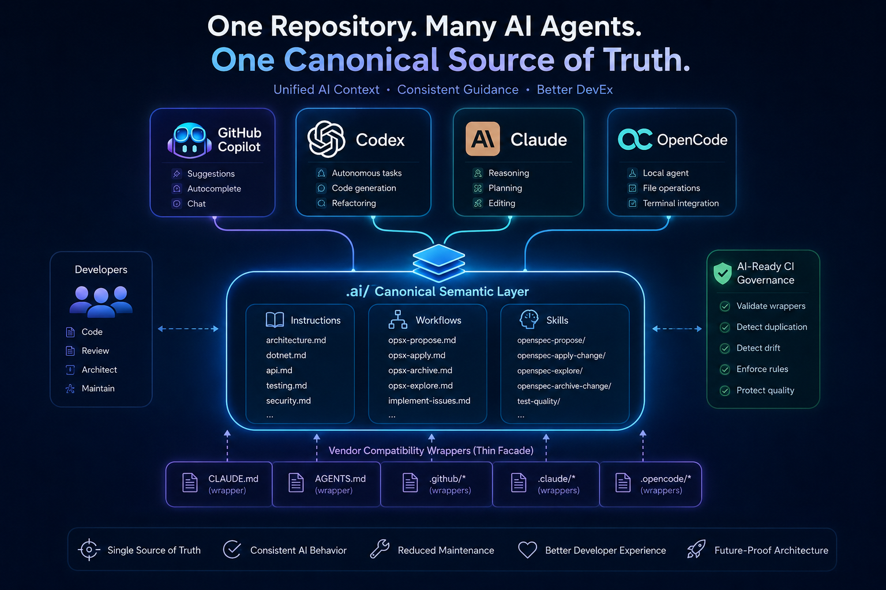

## The Problem

A Git repository used to serve humans, build systems, and CI/CD pipelines but today it also serves AI-tooling and Harnesses like Claude Code, GitHub Copilot, OpenAI Codex, OpenCode, Cursor, Aider, Gemini CLI, and whatever comes next.

Each tool expects its own instruction files, i.e.:

```
CLAUDE.md
AGENTS.md
.copilot-instructions.md
.github/prompts/*
.github/skills/*
.github/instructions/*
.claude/*
.opencode/*
.cursor/rules/*
```

The same architectural rule ends up in six files, written six slightly different ways, maintained by people who don't coordinate, becasue they don't care (`it owrks on my machine`). Three things happen:

1. **Drift.** You update `CLAUDE.md` but forget `.github/copilot-instructions.md`. Now Claude and Copilot produce different outputs for the same request.
2. **Maintenance effort scales with tool count.** Every convention change touches N files.
3. **No governance.** No single source of truth, no validation, no CI checks.

**The root cause is simple:** every vendor assumes one repository equals one AI tool but reality is totally different, I've seen oit accross many tams, one repository ends having multiple vendor specific formats running simultaneously. The industry, and ourselves, are duplicating markdown everywhere. We must do something.

## What Won't Work

**Maintain vendor files independently.** Simple, but drift is inevitable and maintenance scales linearly. This is the status quo and it breaks at team scale. It also burns tokens at xN speed, on first interactions. Just try it.

**Build a YAML or JSON DSL.** Structured, but AI agents consume natural language. You'd need adapters for every vendor, and you'd lose the expressiveness of markdown. With this approach you you've just moved duplication to a translation layer. Shame shit with different color.

**Build a compiler or generator.** Over-engineered.

**One giant context file.** Solves duplication but creates token waste. Poor modularity, merge conflicts, no vendor optimization. I wouldn't do that.

## The Architecture Emerging

AI instruction artifacts should be treated as architecture assets, not vendor configuration files. The solution seems to have a canonical semantic layer with thin vendor wrappers.

```
.ai/
  instructions/
    architecture.md
    coding-conventions.md
    testing.md
    security.md
    deployment.md
  workflows/
    code-review.md
    feature-implementation.md
  skills/
    debugging/SKILL.md
    performance/SKILL.md
    security-audit/SKILL.md
```

`.ai/` folder becomes the canonical source. Vendor directories are compatibility wrappers that reference, not duplicate, the canonical content.

```
CLAUDE.md                  # Wrapper: references .ai/*
AGENTS.md                  # Wrapper: references .ai/*
.copilot-instructions.md   # Wrapper: references .ai/*
.github/                   # Thin vendor adapters
.claude/                   # Thin vendor adapters
.opencode/                 # Thin vendor adapters
```

A wrapper is short. It points to `.ai/` and adds only vendor-specific formatting or discovery hints. I.e:

```markdown
# Claude Code Instructions

All semantic instructions live in `.ai/`.

- Architecture: [.ai/instructions/architecture.md](.ai/instructions/architecture.md)
- Coding rules: [.ai/instructions/coding-conventions.md](.ai/instructions/coding-conventions.md)
- Testing: [.ai/instructions/testing.md](.ai/instructions/testing.md)

## Claude-Specific
- Preferred tool: file editing over terminal commands
- Skills: .ai/skills/
```

In a visual manner:



The diagram above captures the full model: `.ai/` holds rules and wrappers adapt for each vendor. New vendors get a new wrapper and the canonical content never changes.

This is the **Facade + Strategy pattern** applied to repository design. `.ai/` is the facade, a unified interface hiding N vendor formats. Each wrapper is a strategy, "deliver canonical instructions to agent X". When a new vendor arrives, you add a strategy. The facade stays the same.

Markdown stays canonical because every AI tool consumes markdown. Zero translation cost, maximum expressiveness, no artificial DSL.

> Public thanks to [CKGrafico](https://github.com/CKGrafico/CKGrafico) a recent conversation with him sparked this idea. We'll make AI-powered SDLC great again! 

## Governance

Architecture without governance is a suggestion. Five rules:

1. **`.ai/*` is canonical only.** All semantic content lives here. If a rule is not in `.ai/`, it does not exist.
2. **Vendor folders are wrappers only.** References and vendor-specific optimizations. No independent rules.
3. **Humans edit `.ai/*` only.** Wrappers change only when a new vendor arrives or a vendor format shifts.
4. **New vendors integrate through wrappers.** Create the wrapper, reference `.ai/`, done. 
5. **CI validates the contract.** Automated enforcement, not just human discipline. This can be done with a simple script within a CI-like pipeline.

## CI Pipeline

A dedicated workflow validates AI instruction artifacts on every PR that touches them. I.e:

```yaml
name: AI Governance Validation

on:
  pull_request:
    branches: [main]
    paths:
      - '.ai/**'
      - 'CLAUDE.md'
      - 'AGENTS.md'
      - '.copilot-instructions.md'
      - '.github/prompts/**'
      - '.github/skills/**'
      - '.github/instructions/**'
      - '.claude/**'
      - '.opencode/**'

jobs:
  ai-governance:
    runs-on: ubuntu-latest
    steps:
      - uses: actions/checkout@v4

      - name: Validate .ai/ structure
        run: |
          for dir in instructions skills workflows; do
            [ -d ".ai/$dir" ] || { echo "::error::.ai/$dir missing"; exit 1; }
          done

      - name: Check wrapper references
        run: |
          for f in CLAUDE.md AGENTS.md .copilot-instructions.md; do
            [ -f "$f" ] && grep -q "\.ai/" "$f" || \
              echo "::error::$f does not reference .ai/"
          done

      - name: Detect broken references
        run: |
          grep -roh "\.ai/[^)\" ]*" CLAUDE.md AGENTS.md .copilot-instructions.md 2>/dev/null | \
            sort -u | while read -r ref; do
              [ -f "$ref" ] || echo "::error::Broken ref: $ref"
            done

      - name: Flag duplication
        run: |
          canonical=$(cat .ai/**/*.md 2>/dev/null | sort)
          for f in CLAUDE.md AGENTS.md .copilot-instructions.md; do
            [ -f "$f" ] || continue
            unique=$(comm -23 <(sort "$f") <(echo "$canonical") | wc -l)
            [ "$unique" -gt 30 ] && \
              echo "::warning::$f has $unique lines not in .ai/"
          done
```

Four checks: structure exists, wrappers reference `.ai/`, no broken links, no hidden duplication. Blocks merge on structural violations, warns on duplication.

## Benefits

- **O(1) maintenance.** Update one file in `.ai/`, not N vendor files.
- **Vendor independence.** Swap tools without rewriting semantic content.
- **Consistent agent behavior.** All agents reference the same source.
- **Fast vendor onboarding.** New tool = new wrapper. Minutes.
- **Governance that enforces.** CI catches drift before merge.

---

## Tradeoffs

- **More structure.** Overhead for a single-tool, single-engineer repo. Worth it when N > 2 tools or team > 3 engineers.
- **Discipline required.** Engineers must resist editing wrappers directly. CI helps; culture finishes the job.
- **Wrappers still exist.** They're thin, but they need updates when vendor formats change. (No silver bullets, sorry)
- **Immature ecosystem.** Vendor instruction systems are still evolving. The wrapper layer absorbs the churn, but absorption costs something.
- **Migration cost.** Consolidating existing vendor files into `.ai/` is real work. Do it incrementally, start with the highest-value conventions.

---

## The Bigger Picture

Platform engineering used to mean build pipelines, testing, deployment, observability. AI-SDLC adds a new class of problems: agent orchestration, semantic architecture, multi-agent consistency, instruction lifecycle management. We have many new challenges that have come to us in a very short period of time.

Repositories are becoming agent execution environments. The markdown instructions embedded in a repo are the API that AI agents consume. **Designing that API is platform engineering for the AI era.**

**Teams that treat AI instructions as architecture assets will scale AI-assisted development cleanly.** Teams that keep duplicating markdown across vendor folders will spend their time fixing drift.

This canonical semantic layer is not the final answer. Not the silver bullet, but it this approach applies real engineering principles to a real problem. 

Those are my two cents on this topic.

Start before it explodes in your hands.
