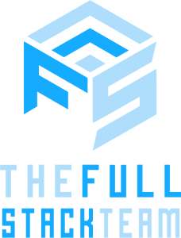

## 🌍 **Revolutionizing the IT Market with Open Source**

The IT job market has radically changed over the past decade. The rise of remote work, freelance platforms, and AI is redefining how companies and professionals connect. However, in this new paradigm, fundamental issues persist: **lack of transparency, excessive commissions, and difficulty finding the right talent**.

**The Full-Stack Team (TFST)** is an **open-source freelance platform** that was created as a response to these challenges. A **transparent and collaborative open-source project**, TFST aims to redefine how companies and IT professionals connect by integrating **smart contracts, verified reputations, and a sustainable model**.

## 🔹 **What is TFST?**

TFST is an **IT talent hub** designed to facilitate connections between **freelancers, companies, and headhunters**. Unlike other freelance platforms, **TFST does not act as an intermediary with abusive commissions**; instead, it builds a **trust-based network** through **transparency and reputation**.

### 🎯 **Our Mission:**

1. **Facilitate global opportunities for IT freelancers** without bureaucratic barriers.

3. **Provide companies with direct access to validated talent** through more efficient selection processes.

5. **Implement smart contracts** to ensure fair and secure payments.

## 🔹 **Why is TFST Different?**

🚀 **Open Source:** The project is available on [GitHub](https://github.com/jgccon/tfst/), and anyone can contribute.  
🔍 **Reputation based on real validation:** No more inflated profiles. Every professional must go through a **verification process** and **technical interviews**.  
⚡ **Payments without abusive intermediaries:** We use **smart contracts** to automate payments and reduce unnecessary commissions.  
🌍 **Access to global talent:** Companies can find the best professionals, regardless of location.  
💼 **A transparent and sustainable model:** No tricks, no empty promises. We aim to **transform the industry from the ground up**.

## 🔹 **How Can You Get Involved?**

TFST is an **open-source project**, and we are looking for contributors in multiple areas:

👨‍💻 **Developers:** Help improve the platform and its functionalities.  
🎨 **Designers:** Contribute to the visual identity and user experience.  
📢 **Marketing & Community:** Share the vision and help build a global network.  
📊 **Companies & Startups:** If you are looking for talent, join us and help validate the model.

## 🔹 **Next Steps**

We are currently in an **active development phase**, and there’s a lot to do. Our roadmap includes:

✅ A **functional MVP** in the coming months.  
✅ A **hiring platform with automated payments**.  
✅ **Integration of project management tools**.  
✅ **Community growth and startup adoption**.

## 🔹 **Join the IT Talent Revolution**

TFST is more than just a platform—it’s **a vision for the future**, where talent and transparency are the core principles. If you believe the IT market needs a change, **this is your opportunity to be part of the movement and help transform the industry in a decentralized and transparent way**.

📍 **Follow us on GitHub and contribute:** [GitHub - jgccon/tfst](https://github.com/jgccon/tfst/)  
🌍 **Visit our official domains:** [TFST.xyz](https://tfst.xyz), [tfst.app](https://tfst.app) (more information coming soon).  
🔗 **Learn more about how our open-source freelance platform works in our documentation:** [TFST Docs](https://tfst.xyz/docs)  
🔥 **Share this vision and join the change!**

TFST is both **[a personal commitment and a business bet on Open Source](http://jgcarmona.com)**. This is a project **rising from the ashes**, stronger and more meaningful than ever. More information coming soon.
