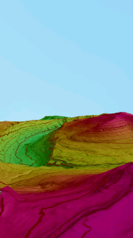
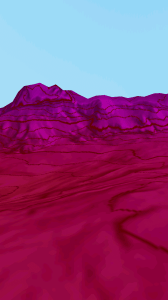
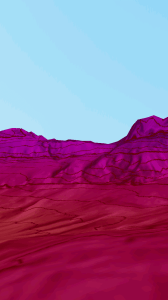
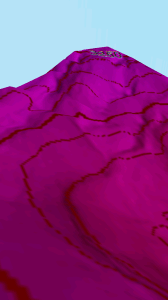
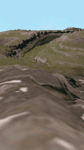
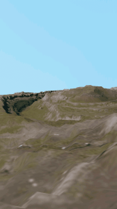
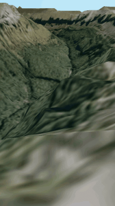
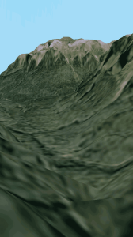
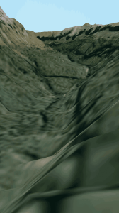

A lo largo de la tarde y siguiendo las directrices de la anterior entrada de éste blog he publicado dos aplicaciones en el Market, en Google Play.

  

La primera de ellas es de la que trataba la anterior entrada, la he llamado [Ordesa Virtual 3D](https://play.google.com/store/apps/details?id=com.jgc.ordesa_virtual_3d).  
  
(Actualizado el 29/08/2012)  
Esta mañana siguiendo algunos consejos he oscurecido las imágenes y he añadido curvas de nivel a éste mapa, mientras lo hacía he probado algo con el heightmap y he conseguido una compresión mucho mejor del bpm con lo que la calidad y el realismo del 3D se ha incrementado muchísimo a la vez que disminuía el peso del heightmap.  
  
Os dejo algunas capturas del resultado de hoy:  
  

  

¿No ha quedado genial? 

  
  
(Actualizado el 29/08/2012)  

A partir de esa, con el mismo heightmap y la misma estructura interna he creado otra aplicación en 3D cuyo realismo me ha sorprendido muchísimo. Para lograr una textura lo mas cercana a la realidad posible he utilizado el [Sistema de Información Geográfica de Parcelas Agrícolas (SIGPAC)](http://sigpac.mapa.es/fega/visor/) y el editor GIMP. Me ha costado alrededor de un dos horas conseguir entrelazar las imágenes necesarias y girarlas un poco, 3 grados en el sentido de las agujas del reloj para ser más exactos, para que encajaran a la perfección con el heightmap que tenía de la versión anterior. Insisto en que me ha asombrado lo realista que ha quedado ésta versión en 3D del valle de Ordesa. La app para andriod se llama Ordesa 3D y auqnue ya la he subido al market aún no está disponible paara su descarga, tardará entre dos y tres horas.

  

  

Voy a dejar aquí un par de capturas de pantalla que acabo de hacer ahora mismo:

  

  

 

  

Espero que os guste éste trabajo, por supuesto la aplicación es gratuita y espero que os sea útil tanto para entreteneros como para planificar vuestras próximas excursiones. 

  

Un saludo.

  

Juan García Carmona

[d.jgc.it@gmail.com](mailto:d.jgc.it@gmail.com)
