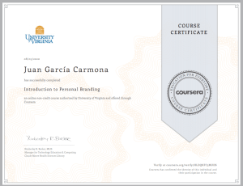

Comienza el mes de Agosto y este año mi manera de desconectar un poco de la rutina ha sido dedicarle algo de tiempo a estudiar, aprender y poner en práctica algo nuevo. El otro día entré en [Coursera](https://www.coursera.org/) y esta vez he optado por algo que tengo muy descuidado desde hace un par de años, mi marca personal, así que he empezado a hacer el curso [Introduction to Personal Branding](https://www.coursera.org/learn/personal-branding), impartido por [Kimberley R. Barker.](https://www.google.com/search?q=%22Kimberley+R.+Barker.) 

  

He decidido hacer este curso puesto que llevo los dos últimos años volcado con mi propia Startup, [Logtrip](https://logtrip.com/) ([logtrip.com](https://logtrip.com/)), creando la empresa, desarrollando un prototipo y después desarrollando un MVP cuya segunda versión lanzaremos en los próximos días. Creo firmemente en los objetivos y la filosofía de [Logtrip](https://logtrip.com/) y sigo creyendo que funcionará pese a los estragos que el COVID-19 está causando en el turismo. Durante los próximos meses debemos darlo a conocer y quiero presentarme con orgullo como su fundador, director ejecutivo (CEO) y director de tecnología (CTO). 

  

También tengo la necesidad de compartir tanto los conocimientos y experiencias adquiridos como los innumerables retos tecnológicos que hemos tenido que resolver durante todos estos meses y me gustaría esto fuera atractivo para muy diversas audiencias por lo que trabajar en mi marca personal se ha vuelto un tema muy importante.

Voy a utilizar este artículo para compartir lo que estoy aprendiendo en este breve curso y para compartir con los lectores los cambios y pequeñas decisiones que gracias a él tome respecto a la gestión de mi marca personal. Comencemos. 

### Mis tres palabras

Una de las primeras cosas que nos pide Kimberly es definirnos con tres palabras, elegir las tres palabras con las que queremos quye nos relacionen. Ella cita a parte de un poema Mary Oliver que dice así: 

> What do you plan to do with your one wild and precious life?

O lo que es lo mismo

> ¿Qué planeas hacer con tu preciosa, salvaje y única vida? 

Bueno, pues yo le he estado dando vueltas a esto y he estado haciendo listas de palabras hasta que, sin no mucho esfuerzo, me he quedado con tres que, desde mi propio punto de vista, me definen a la perfección, que son: tecnología, creatividad y coraje. 

  

¿Por qué estas palabras y no otras?

- **Tecnología**: porque mi vida profesional gira alrededor de la tecnología, me va costando contar los años que hace desde que me dedico al desarrollo de software y a la integración de tecnología. Siempre he tenido la suerte de poder estar a la vanguardia tecnológicamente hablando, y de tener tiempo para el aprendizaje, la investigación y el desarrollo. Además, como propietario de una Startup tecnológica ahora me veo aún más involucrado en la tecnología.
- **Creatividad**: porque siempre he tenido alma de artista. Estudié música y toco el piano, he escrito y ganado concursos de poesía y no se me da nada mal la pintura, además, mi cabeza siempre está llena de ideas, ideas innovadoras y bien estructuradas que en mas de una ocasión han madurado hasta convertirse en grandes productos como por ejemplo aquel Orquestador Multimodal para ciudades inteligentes que diseñé para [Alstom](https://www.alstom.com/) y que acabamos convirtiendo aquel año en [Mastria](https://www.alstom.com/our-solutions/digital-mobility/mastria-transforming-city-wide-multimodal-transport), un producto muy valorado en Alstom.
- **Coraje**: porque los que me conocen personalmente saben en mi faceta montañera sor conocido como Juan Sin Miedo y de hecho mi Facebook es [JuanSinMied0](https://www.facebook.com/JuanSinMied0). No confundamos valentía con coraje, no soy de los que se lanza hacia el peligro sin pensar, no, a mi me gusta caminar hacia el peligro conociendo los riesgos y estando preparado para superar cualquier obstáculo. 

### Mi declaración de Objetivos

El siguiente trabajo que nos pide Kimberly es trabajar en nuestro Mission Statement, es decir, nuestra Declaración de Objetivos o Declaración de Principios. Durante muchos muchos años mi declaración de objetivos ha estado en la cabecera de mis Curriculum, y ha sido esta:

> Desarrollarme profesionalmente en un buen ambiente de trabajo donde poder aportar y ampliar mis conocimientos y habilidades en ingeniería informática, desarrollo de software, nuevas tecnologías y seguridad de las tecnologías de la información y las telecomunicaciones.

Y leyéndolo y escribiéndolo ahora me siento bien conmigo mismo, realizado, porque me doy cuenta de que he logrado mi objetivo con creces pues, si, me he desarrollado profesionalmente en ambientes excelentes de trabajo y  he adquirido unos conocimientos, unas habilidades y una experiencia tremendas en ingeniería arquitectura y desarrollo de software, en seguridad informática y en general en tecnologías de la información y las telecomunicaciones. Pero hoy esa declaración de objetivos se queda corta, mi propósito en la vida sigue siendo desarrollarme profesionalmente, claro, y también quiero seguir compartiendo mis conocimientos con otros profesionales como yo pero también quiero enfocarme, como de hecho ya hago, en desarrollar tecnología y herramientas útiles para la gente, en ayudar a solucionar problemas y a generar riqueza de forma justa, es decir, tecnología que sea socialmente responsable y que esté alineada con el desarrollo sostenible y el respeto al medio ambiente.

> Quiero ayudar a mejorar el futuro de la humanidad investigando y desarrollando tecnologías, sistemas y herramientas que favorezcan el desarrollo sostenible teniendo en cuenta la dimensión local y global de los retos y problemas a los que nos enfrentamos en todo el mundo. 

Me ha llevado un rato escribirlo, lógicamente, pero más o menos ha sido fácil porque tengo claro qué es lo que quiero hacer con mi vida de ahora en adelante. De hecho ya estoy trabajando en proyectos en los que de alguna manera destaca su filosofía o sus objetivos por ser respetuosos con el medio ambiente o enfocados al desarrollo sostenible... De algunos no puedo hablar por acuerdo de confidencialidad, pero de uno de ellos en concreto, de **[Logtrip](https://logtrip.com/)**, empezaré a hablar a menudo en este blog pues es a lo que le he dedicado mis últimos dos años con mayor ahínco.

### Mi Junta Directiva Personal 

Me ha resultado muy interesante éste concepto. Consiste en identificar a ese reducido grupo de personas a quienes consultarías por cuestiones o decisiones importantes en tu vida. Deben ser personas a las que admires y/o respetes, personas que se preocupen por tí y por tus éxitos y que, sobretodo, sean honestos y sinceros contigo. Kimberly recomienda identificar a cuatro personas y hacerles saber que forman parte de tu junta directiva personal, en algunos artículos recomiendan elegir un número impar y, aunque que yo no conocía esta "técnica", hay un montón de literatura al respecto y artículos muy interesantes como [éste de Forbes](https://www.forbes.com/sites/theyec/2014/07/16/five-rules-for-selecting-your-personal-board-of-directors/#408eb753685f) o [éste otro](https://theglasshammer.com/2011/07/five-people-you-need-on-your-personal-board-of-directors/).

  

Yo tengo que seguir trabajando en mi lista y según lo vaya teniendo claro se lo iré haciendo saber uno por uno.

### Mis Redes Sociales

Otra de las cosas que recomienda Kimberly es elegir como mucho tres redes sociales y publicar al menos dos veces por semana. La decisión es fácil porque no quiero mezclar demasiado mi vida personal y mi faceta montañera, que es para lo que utilizo Facebook, con mi perfil profesional, que es para lo que utilizo Facebook y para lo que creé mi cuenta de Twitter hace un par de años. Así que voy a utilizar [LinkedIn](https://www.linkedin.com/in/juangarciacarmona/), la red social profesional por excelencia, y [Twitter](https://twitter.com/J_G__Carmona). Eso y este blog donde espero poder escribir mucho más a menudo que durante los últimos dos años.

  

Otro de los consejos interesantes y que intentaré seguir es la aplicar de la regla 80/20 al el contenido que uno publica en sus redes sociales, esto es, que el 80% de lo uno que publica en las redes sociales debe ser contenido de interés para las personas que le siguen y el otro 20% debe ser auto-promoción. Durante el curso se ha hablado también sobre la automatización a la hora de publicar contenido, de los peligros y las ventajas que puede llegar a tener usar estas técnicas. 

  

### Otros temas interesantes

También se ha halado de la gestión de la reputación y de la gran importancia que esto tiene en un mundo en el que todo el mundo consulta la reputación de todo el mundo. Os dejo aquí un enlace a una presentación super interesante sobre la gestión de la reputación online, [The reputation economy (July/2015)](https://www.slideshare.net/KR_Barker/vcu-the-reputation-economy) de la cuál dejaré unas breves pinceladas.

- "Reputation Economy": se refiere a la forma en la que la contribución de los usuarios finales configura la posición de un producto, persona, institución o negocio.
- "Google Truth": se define como la aceptación automática de los resultados de Google como una representación precisa de la realidad.
- "ORM": Online Reputation Management, básicamente, la práctica de hacer que las personas y los negocios se vean mejor en Internet
- Plan para gestionar tu reputación:

- Empieza monitorizando tu presencia online:

- Bien - Busca tu nombre al menos una vez al mes
- Mejor - Crea una alerta de búsqueda para tu nombre

- Verifica tu configuración de privacidad en todas las redes sociales
- Llena tu presencia online con contenido positivo

- Aprende a restaurar tu reputación

- Procesa primero tus emociones, pide ayuda a tus amigos y sé consciente de que no eres la primera persona a la que le pasa esto, no estás solo.
- Entiende el problema, encuentra el origen del contenido negativo y determina si fue accidental o deliberado.
- Crea un plan de recuperación estableciendo objetivos realistas e impleméntalo

Cómo crear una alerta de búsqueda en Google

1. Entra con tu cuenta de Gmail
2. Ve a [https://www.google.com/alerts](https://www.google.com/alerts)  
    
     
    
3. Click en \[+\] para añadir una alerta sobre tí o sobre tu correo electrónico:   
    
4. Crea una alerta para un tema que te interese, yo en mi caso quiero enterarme de las búsquedas que se hagan sobre mi empresa, Logtrip.  
    
5. Recibe las alertas periódicamente en tu email...

  

### Sobre los errores

En el curso Kimberly presenta una forma de pensar sobre los errores que es una especie de fórmula, la fórmula "uno, dos, cuatro"

- El número uno se refiere a que todos cometemos errores, uno mismo comete errores.
- El número dos se refiere a las dos cosas que no debemos hacer cuando cometemos un error que son:

- No poner excusas (a menos que haya realmente circunstancias que proporcionen contexto como explicación al error)
- No culpar a otro, porque es vulgar, hortera, y está mal.

- El número cuatro se refiere a las cosas que sí se deben hacer:

- Pedir disculpas, disculpas sinceras, no pretendas pedir disculpas con frases como "siento que te lo hayas tomado de esta forma..."
- Reconocer que ha sido un error.
- Preguntar como hacerlo bien.
- Sigue esos consejos.

De esta forma un error en tu marca personal o la de tu empresa se pude solucionar de una forma elegante, No debemos ver un comentario negativo o una mala valoración como algo tan negativo, no es el fin del mundo porque quizá es una gran oportunidad para demostrar al mundo la integridad de nuestra marca.

  

Y bueno, se suponía que era un curso de cinco semanas pero yo he revisado todo el contenido y visto todos los vídeos en unas cinco horas mientras escribía este artículo. Se tocan muchos temas interesantes y he aprendido sobre todo lo que he escrito hoy aquí. No deja de ser una introducción a un tema, el personal branding, que, como dije al principio, yo tenía completamente olvidado desde que empecé con Logtrip pero ahora que Logtrip necesita un empujón porque ya lo hemos puesto en marcha, mi personal branding, mi imagen de marca como su fundador, CEO y CTO, cobra gran importancia. Según publique este artículo comenzaré a trabajar en este tema porque, como también dije, tengo mucho que contenido técnico y no tan técnico que compartir durante los próximos meses. Si me has leído agradecería comentarios o contactos.

  

  

  

Espero que este artículo os haya parecido interesante y que dejéis aquí vuestros comentarios.
