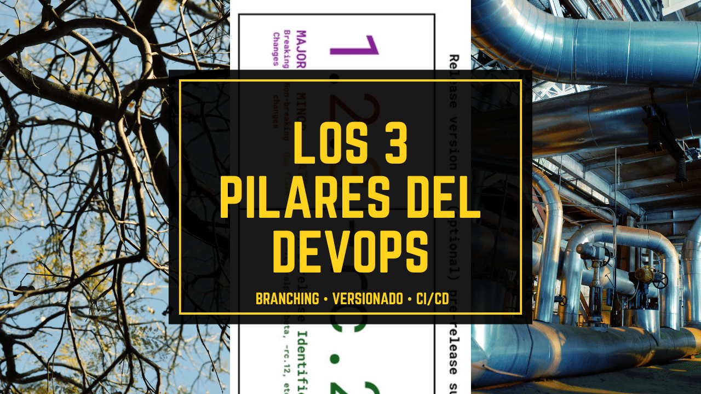

No necesitas cuarenta normas ni memorizar todas las variantes de [**GitFlow**](https://www.atlassian.com/es/git/tutorials/comparing-workflows/gitflow-workflow). Solo necesitas tener claro cómo gestionar **branching, versionado y CI/CD en DevOps**. Tres decisiones. Tres pilares que, cuando se toman bien definidos, convierten el caos en estructura y el estrés en confianza.

<figure>

<figcaption>

Los 3 pilares del DevOps moderno: Branching, Versionado y CI/CD

</figcaption>

</figure>

## Branching: política de ramas

La experiencia me dice que menos es más. El branching es como el tráfico: puedes tener muchos carriles, pero si nadie respeta el sentido de circulación, habrá colisiones. Una política de ramas, clara y concisa, que sea aplicada y respetada por todos puede suponer la diferencia entre el orden lógico y el absoluto caos. El que yo uso más a menudo parte de esta idea:

- main → producción

- develop → staging / integración

- feature/\*_, hotfix/\*_ → ramas temporales con propósito

Siempre mediante **Pull Requests revisados**. Nada se mergea sin revisión.

> Las ramas temporales (`feature/*`, `hotfix/*`) deben tener un propósito claro y limitado en el tiempo. Una rama sin propósito solo añade deuda técnica.

Este modelo funciona. Separa claramente el trabajo en curso, inherentemente inestable, del código estable. Reduce conflictos, facilita la revisión y alinea al equipo con una única fuente de verdad en cada etapa.

Nota: no siempre es sencillo aplicar este método. Por ejemplo, en GitHub, hay que trabajar nuestra política de ramas porque trata main como la rama por defecto. En breve escribiré y publicaré una receta.

## SemVer: Versionado semántico

El versionado no es un número cualquiera. Es **la narrativa técnica de tu software**. Si alguien lee `v3.4.2`, debería poder intuir qué esperar.

Aplica `MAJOR.MINOR.PATCH` como si tus usuarios, compañeros o tú dentro de tres meses fueran a juzgarte por ello:

- Cada release, un tag.

- Cada tag, un changelog.

- Cada changelog, una historia sobre el trabajo realizado.

No cuesta tanto y hay muchas maneras de hacerlo. Sólo hayq ue saber elegir e implementar la que mejor conviene en cada caso.

## **CI/CD: automatiza el ciclo de vida**

No se trata de automatizar porque sí. No es una moda. Se trata de no tener que cruzar los dedos cada vez que haces `git push`.

Tus pipelines deben hacer tres cosas sin que nadie intervenga manualmente:

1. Test

3. Build

5. Deploy (con condiciones claras)

No todo tiene que ir directo a producción. Pero **nada debería depender de pasos a mano**. Lo que no está automatizado, tarde o temprano se olvida o se rompe. Dependiendo de tu proceso podras tener pipelines de CI solamente, o pipelines de despliegue solamente, o una mezcla de ambas. Usando el ejemplo de ramas anterior.

- main
    - → Un PR a main ejecutaría CI (test & build) y sería una regla necesaria para poder validar el PR
    
    - → Un push ejecutaría CD y desplegaría, directamente, en producción (con confianza)

- develop
    - → Igual que con main, un PR a develop ejecutaría CI (test & build) y sería una regla necesario para porder validar el PR
    
    - → Un push ejecutaría nuestras pipelines de despliegue a Staging o entorno de integración

- feature/\*_, hotfix/\*_ → Si no tenemos limitaciones de agentes, un push ejecutaría sólo CI (test, build)

## Lo que pasa si no lo haces

Pûede que esto que te voy a decir ahora te suene porque lo hayas vivido o, peor aún, lo estés viviendo:

- Las ramas se crean y se olvidan.
    - WTF!?: Me da igual que sea gratis... ¿Qué sentido tiene mantener ramas ya mergeadas? (eh! quiza lo hay, te leo)

- La rama `main` a veces funciona, a veces no.
    - WTF!?: PROD no funciona pero alguien se atreve a decir que "en mi máquina funciona" → Insisto: WTF!?

- Tenemos pipelines de CI/CD… pero el despliegue a cada entorno a es una coreografía manual.
    - WTF!?: La solución es tan sencilla como, paso a paso, replicarlos en nuestras pipelines. 7 pasos? 7 tareas automatizadas.

- Nadie sabe si la `v2.3.5` incluye ese bug que se corrigió ayer.
    - WTF!?: Una buena gestión de ramas y de versiones nos permite automatizar los changelogs y saber qué hay en cada versión. Podemos decidir el nivel de detalle, pero sería ideal no perder esa trazabilidad. No cuesta tanto. No es un capricho.

> El problema no es técnico. Es de disciplina.  
> Si el equipo no lo toma en serio, el producto lo acabará pagando.

El problema no es Git. Ni Jenkins. Ni GitHub Actions o las pipelines de Azure DevOps. El problema es no tener una gestión clara, un buen proceso del ciclo de vida de tu aplicación. Sin una mentalidad ALM (Application Lifecycle Management), todo son parches, dudas y urgencias. ALM no es algo corporativo ni aburrido. Es lo que te permite responder con seguridad a preguntas como:

- ¿Qué se está desarrollando?

- ¿En qué estado está?

- ¿Cómo se versiona?

- ¿Cuándo está listo para producción?

## Y lo que pasa cuando sí lo haces

Cuando esos tres pilares están claros, el cambio se nota:

- Las ramas duran lo que deben.

- Los bugs se reproducen en _staging_, no en producción.

- Las versiones cuentan una historia.

- El equipo se enfoca en el producto, no en apagar fuegos.

## Ponte manos a la obra

Si tu equipo todavía debate si usar `develop`, o hace merges directos a `main`... Si cada semana el ritmo del sprint se paraliza porque los bugs reaparecen de la nada. Y si sientes que el caos es la norma... Es el momento de parar y replantearte qué estáis haciendo... Seguir así es insostenible.

Puedes empezar poco a poco, hoy mismo:

- Define un flujo de ramas básico.

- Usa versiones que realmente digan algo.

- Automatiza uno de esos pasos conflictivos.

El DevOps no es una moda. DevOps va de **recuperar el control técnico del producto**. Y si necesitas ayuda para aterrizarlo en tu proyecto o formar a tu equipo para dominar su entorno, [escríbeme](/contact).
