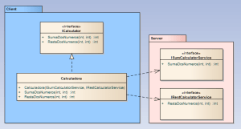
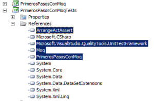
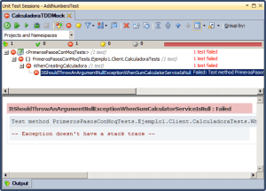
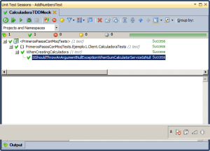
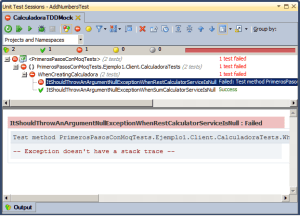
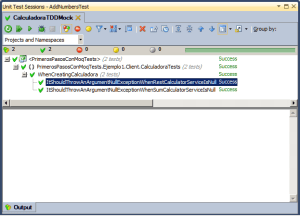
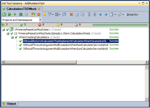
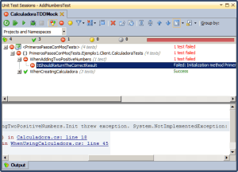
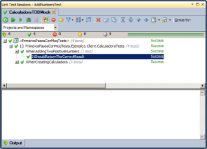
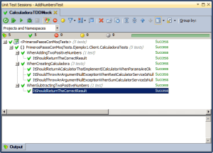

Después de "[Introducción a los Tests Unitarios, TDD y Mocking](http://juan-garcia-carmona.blogspot.com.es/2012/09/introduccion-los-tests-unitarios-tdd-y.html)" y tras la serie de artículos sobre GRASP hoy me he decidido a mostrar de forma práctica el TDD con Mocking. Quiero hacerlo así, con uno o dos ejemplos sencillos porque estoy preparando unas sesiones de TDD para patrones de diseño, es decir, como enfocar un desarrollo guiado por pruebas cuando se va a atacar cierto patrón de diseño. 

  

En el ejemplo de hoy voy a partir de aquel ejemplo de la calculadora pero hoy voy a empezar desde cero.  Voy a hacer un diagrama estático de clases primero, para definir una serie de paquetes, interfaces y clases, y un diagrama de secuencia después, para ver cuál va a ser el caso de uso que voy a atacar mediante TDD y Mocking. 

  

Voy a improvisar unos requisitos: "Queremos desarrollar una calculadora que delegue sus cálculos en una serie de servicios de cálculo. Para comenzar queremos que nuestra calculadora sea capaz de sumar y restar dos números enteros positivos utilizando para tal fin los servicios SumCalculatorService y RestCalculatorService a cuyas interfaces tenemos acceso."

  

Bueno, voy a hacer el diagrama estático de clases de todo ésto, a ver qué sale:

  

[](https://jgcarmona.com/wp-content/uploads/2012/09/dc8d4-uml_ejemplo1.png)

¿Se ve claro? Seguro que si pero lo explico, hay dos paquetes, uno el cliente, en azul y otro el servidor, en rojo. El servidor contiene o contendrá los servicios de suma (ISumCalculatorService) y de resta (IRestCalculartorService). Está la clase Calculadora que tiene dependencias (linea punteada con flecha simple hacia la dependencia) con ambos servicios y que implementa (linea punteada con felcha triangular blanca) la interfaz ICalculator. En cuanto al servidor he dicho que contiene o contendrá los servicios y digo contiene o contendrá porque haciendo TDD con Mocking no nos hace falta tener el sistema completo ya que lo que voy a hacer va a ser simular el comportamiento de las dependencias de la clase o de la funcionalidad concreta de la clase que se quiere probar.  

> A veces siento que soy muy enrevesado expresándome pero es lo que hay, no hay una manera menos enrevesada de explicarlo. El desenrevesador que lo desenrevese buen desenrevesador será. XD!

Antes de empezar a tirar lineas de código de pruebas  voy  a definir un primer ámbito en las pruebas. Las primeras pruebas pueden ser del tipo WhenCreatingTheObject, es decir, cuando se crea el objeto. Aquí  voy  a probar la inyección de dependencias en la clase calculadora y que de verdad implemente ICalculator. 

  

Y ya va siendo hora de abrir el Visual Studio para crear el proyecto del cliente, al que voy a llamar PrimerosPasosConMoq, y el proyecto que alojará los tests, PromerosPasosConMoqTests. Por cierto, dentro de dos días sale Visual Studio 2012 y creo que me voy a comprar la versión profesional y a estudiarme las mejoras a fondo, cuando lo hice con el 2010 fue duro al principio pero ahora no puedo vivir sin él y me pasó exactamente lo mismo con el Visual Studio 2005. 

Una vez creados los proyectos  voy  con las interfaces, tendré por un lado las de los servicios, que yo las escribo aquí pero que podrían, o deberían mejor dicho, estar en un ensamblado aparte:

```
public interface ISumCalculatorService{    int SumaDosNumeros(int num1, int num2);}
```

```
public interface IRestCalculatorService{    int RestaDosNumeros(int num1, int num2);}
```

Y ya si en el proyecto "definitivo" la interfaz ICalculator con los métodos que se han definido en el diagrama de clases:

```
public interface ICalculator{    int SumaDosNumeros(int num1, int num2);    int RestaDosNumeros(int num1, int num2);}
```

Ahora  voy  al proyecto de tests y le agrego las siguientes referencias, una al proyecto "definitivo" y otra a la librería de Moq (se supone que cualquier desarrollador con un mínimo de experiencia es capaz de encontrar Moq, descargarlo, descomprimirlo y añadir la referencia a la librería correspondiente a su proyecto de tests), la tercera referencia es a la librería de .Net Microsoft.VisualStudio.QualityTools.UnitTestFramework y la última al proyecto con la clase UnitTestBase que contiene y obliga a utilizar el patrón AAA en nuestros tests.  
  

[](https://jgcarmona.com/wp-content/uploads/2012/09/1902e-librerias.png)

  
Bien, pues ya va siendo hora de empezar a pensar en tests. Como decía, lo primero que hay que probar es la construcción del objeto calculadora, la inyección de dependencias, y para ello voy a crear una clase WhenCreatingCalculadora que, para cumplir con la metodología AAA heredará de UnitTestBase. Como recordatorio voy a pegar el código de UnitTestBase pero ya estaba disponible en "[Introducción a los Tests Unitarios, TDD y Mocking](http://juan-garcia-carmona.blogspot.com.es/2012/09/introduccion-los-tests-unitarios-tdd-y.html)":  
  

```
using Microsoft.VisualStudio.TestTools.UnitTesting;/* * *  * Los tests unitarios tienen un comportamiento muy simple: *  * 1º Arrange()    -> Organizar las precondiciones * 2º Act()        -> Actuar, es decir, ejecutar lo que se quiere probar * 3º Assert()     -> Verificar que se han cumplido las postcondiciones *  * Esta visión simplista junto con una buena nomenclatura harán tu TDD mucho más sencillo. *  * Juan García Carmona *  * */namespace ArrangeActAssert{    [TestClass]    public abstract class UnitTestBase    {        [TestInitialize]        public void Init()        {            Arrange();            Act();        }        protected virtual void Arrange()        {        }        protected abstract void Act();        [TestCleanup]        public void Cleanup()        {            System.Windows.Threading.Dispatcher.CurrentDispatcher.InvokeShutdown();        }    }}
```

Según escribo el código de WhenCreatingCalculadora veo un error, no existe la clase Calculadora, es buena señal pues estamos haciendo TDD y se trata de escribir pruebas y refactorizar el código para que las pruebas compilen y pasen. Voy a crear una clase Calculadora vacía para que compile y, de momento, el código de WhenCreatingCalcualdora tiene el siguiente aspecto:

```
using ArrangeActAssert;using Microsoft.VisualStudio.TestTools.UnitTesting;using Moq;using PrimerosPasosConMoq.Ejemplo1.Client;using PrimerosPasosConMoq.Ejemplo1.Server;namespace PrimerosPasosConMoqTests.Ejemplo1.Client.CalculadoraTests{    [TestClass]    public class WhenCreatingCalculadora : UnitTestBase    {        protected Calculadora _objectoToTest;        protected Mock<IRestCalculatorService> RestCalculatorServiceMock;        protected Mock<ISumCalculatorService> SumCalculatorServiceMock;        protected override void Arrange()        {            base.Arrange();            RestCalculatorServiceMock = new Mock();            SumCalculatorServiceMock = new Mock();        }        // Act, como queremos que lance excepciones, lo voy a trasladar a cada método        protected override void Act(){}    }}
```

En ése código destacan los objetos Mock, son objetos falsos que implementan cada una de las interfaces, IRestCalculatorService e ISumCalculatorService, y son los que voy a utilizar para escribir las pruebas sobre la inyección de dependencias. La primera prueba puede ser que si al primer parámetro le pasamos un objeto nulo el constructor lance una excepción. El código del test quedará así:

```
[TestMethod][ExpectedException(typeof(ArgumentNullException))]public void ItShouldThrowAnArgumentNullExceptionWhenSumCalculatorServiceIsNull(){    _objectoToTest = new Calculadora(null, RestCalculatorServiceMock.Object);}
```

Pero claro, éste código da errores de compilación porque Calculadora, que es una clase vacía, no tiene ningún constructor que acepte dos argumentos. ¿Por qué no lo tiene? Porque aún no lo he escrito. De nuevo hay que refactorizar para adaptar el código a los tests, voy a hacer que Calculadora herede de ICalculator y a ponerle un constructor que acepte dos argumentos.

```
public class Calculadora : ICalculator{    public Calculadora (ISumCalculatorService sumService, IRestCalculatorService restService)    {    }    public int SumaDosNumeros(int num1, int num2)    {        throw new NotImplementedException();    }    public int RestaDosNumeros(int num1, int num2)    {        throw new NotImplementedException();    }}
```

Bien, ahora que el código compila es el momento de ejecutar el primer test. Lo ejecuto y, tal y como esperaba, el test falla porque el constructor no lanza ninguna excepción si el primer parámetro es nulo. el mensaje es evidente:

WhenCreatingCalculadora. ItShouldThrowAnArgumentNullExceptionWhenSumCalculatorServiceIsNull did not throw expected exception System.ArgumentNullException.

\-- Exception doesn't have a stack trace --

[](https://jgcarmona.com/wp-content/uploads/2012/09/f2780-test1falla.png)

  

Pues es el momento, de nuevo, de refactorizar. Ahora que "tenemos la luz roja" es hora de buscar el verde, es decir, de que pase éste test, para poder continuar. Me voy a la clase calculadora y modifico el constructor dejándolo así:

```
public Calculadora (ISumCalculatorService sumService, IRestCalculatorService restService){    if (sumService == null)        throw new ArgumentNullException("sumService");}
```

Vuelvo a ejecutar el test y ahora pasa:  
  

[](https://jgcarmona.com/wp-content/uploads/2012/09/05264-test1pasa.png)

  

Ahora voy a probar con el segundo parámetro, escribimos el test:

```
[TestMethod][ExpectedException(typeof(ArgumentNullException))]public void ItShouldThrowAnArgumentNullExceptionWhenRestCalculatorServiceIsNull(){    _objectoToTest = new Calculadora(SumCalculatorServiceMock.Object,null);}
```

Lo ejecuto y, de nuevo tal y como era de esperar, el test falla:  
  

[](https://jgcarmona.com/wp-content/uploads/2012/09/65e5d-test2falla.png)

  
De nuevo modifico el constructor para que pasen las pruebas y me queda de la siguiente forma:

```
public Calculadora (ISumCalculatorService sumService, IRestCalculatorService restService){    if (sumService == null)        throw new ArgumentNullException("sumService");    if (restService == null)        throw new ArgumentNullException("restService");}
```

Y en verdad, ejecuto las pruebas y, ahora si, tengo luz verde para continuar:  
  

[](https://jgcarmona.com/wp-content/uploads/2012/09/ef5ed-test2pasa.png)

  

En definitiva ésto es TDD, espero que este ejemplo lo deje claro. Pero voy a seguir, voy a explotarlo un poco más. Antes me ha dado por hacer que Calculadora implementara ICalculator pero podría no haberlo hecho y tendría, para cumplir con el diseño, asegurarme de que el objeto que estoy probando es una instancia de ICalculator y eso se podría asegurar con el siguiente test (que quizá debería haber sido el primero):

```
[TestMethod]public void ItShouldImplementICalculator(){    _objectoToTest = new Calculadora(SumCalculatorServiceMock.Object, RestCalculatorServiceMock.Object);    Assert.IsNotNull(_objectoToTest as ICalculator);}
```

Vuelvo a ejecutar la batería de tests y pasan los tres tests que llevo escritos hasta el momento, tests que nos aseguran que la clase Calculadora implementa ICalculator y que está protegida frente a nulos en la inyección de dependencias. Éste último tests, el que verifica que se implemente ICalculator, podemos ampliarlo un poco más ya que al ejecutar el constructor con los parámetros correctos nos devuelve el objeto que esperamos. Podemos modificar el nombre y las verificaciones así:

```
[TestMethod]public void ItShouldReturnACalculatorThatImplementICalculatorWhenParamsAreOk(){    _objectoToTest = new Calculadora(SumCalculatorServiceMock.Object, RestCalculatorServiceMock.Object);    // Es una calculadora, se ha creado correctamente    Assert.IsNotNull(_objectoToTest);    // y además implementa ICalculator    Assert.IsNotNull(_objectoToTest as ICalculator);}
```

No solamente pasan los tests...

  

[](https://jgcarmona.com/wp-content/uploads/2012/09/94a35-test3pasa.png)

  
...sino que además los tests sirven de documentación sobre el código bajo pruebas, ¿no es genial? Dejo todo el código de la clase de pruebas con estos tres tests sobre el constructor:

```
using System;using ArrangeActAssert;using Microsoft.VisualStudio.TestTools.UnitTesting;using Moq;using PrimerosPasosConMoq.Ejemplo1.Client;using PrimerosPasosConMoq.Ejemplo1.Server;namespace PrimerosPasosConMoqTests.Ejemplo1.Client.CalculadoraTests{    [TestClass]    public class WhenCreatingCalculadora : UnitTestBase    {        protected Calculadora _objectoToTest;        protected Moc<IRestCalculatorService> RestCalculatorServiceMock;        protected Mock<ISumCalculatorService> SumCalculatorServiceMock;        protected override void Arrange()        {            base.Arrange();            RestCalculatorServiceMock = new Mock<IRestCalculatorService>();            SumCalculatorServiceMock = new Mock<ISumCalculatorService>();        }        // Act, como queremos que lance excepciones, lo voy a trasladar a cada método        protected override void Act() { }        [TestMethod]        public void ItShouldReturnACalculatorThatImplementICalculatorWhenParamsAreOk()        {            _objectoToTest = new Calculadora(SumCalculatorServiceMock.Object, RestCalculatorServiceMock.Object);            // Es una calculadora, se ha creado correctamente            Assert.IsNotNull(_objectoToTest);            // y además implementa ICalculator            Assert.IsNotNull(_objectoToTest as ICalculator);        }        [TestMethod]        [ExpectedException(typeof(ArgumentNullException))]        public void ItShouldThrowAnArgumentNullExceptionWhenSumCalculatorServiceIsNull()        {            _objectoToTest = new Calculadora(null, RestCalculatorServiceMock.Object);        }        [TestMethod]        [ExpectedException(typeof(ArgumentNullException))]        public void ItShouldThrowAnArgumentNullExceptionWhenRestCalculatorServiceIsNull()        {            _objectoToTest = new Calculadora(SumCalculatorServiceMock.Object, null);        }    }}
```

Voy a seguir haciendo TDD pero ahora sobre el uso de la calculadora, porque hasta ahora los objetos Mock que he utilizado sólo los he utilizado de adorno. Querido lector, es ahora donde empieza la auténtica magia, vamos a aplicar la herencia y la nomenclatura del primer ejemplo de tests unitarios en la calculadora y vamos a crear las siguientes clases:  
  

WhenUsingTheCalculator : UnitTestBase

```
[TestClass]public abstract class WhenUsingTheCalculator : UnitTestBase{    protected Calculadora _objectToTest;    protected Mock RestCalculatorServiceMock;    protected Mock SumCalculatorServiceMock;    protected override void Arrange()    {        base.Arrange();        RestCalculatorServiceMock = new Mock();        SumCalculatorServiceMock = new Mock();        // Esto ya lo hemos probado y sabemos que funciona:        _objectToTest = new Calculadora(SumCalculatorServiceMock.Object, RestCalculatorServiceMock.Object);    }}
```

WhenAddingTwoNumbers : WhenUsingTheCalculator

```
[TestClass]public abstract class WhenAddingTwoNumbers : WhenUsingTheCalculator{    protected abstract int X { get; }    protected abstract int Y { get; }    protected int result;    protected override void Arrange()    {        base.Arrange();        // Cuando al servicio 'falso' le pase dos números        // Que devuelva la suma de ambos        SumCalculatorServiceMock.Setup(x => x.SumaDosNumeros(X, Y)).Returns(X + Y);    }    protected override void Act()    {        result = _objectToTest.SumaDosNumeros(X, Y);    }}
```

Aquí vemos la primera simulación con objetos Mock, le estamos diciendo a SumCalculatorServiceMock que cuando la clase que estamos probando llame al método SumaDosNumeros del objeto falso, éste debe devolver la suma de dichos números.  
Veamos que sucede cuando sumemos dos números posirtivos:  
WhenAddingTwoPositiveNumbers : WhenAddingTwoNumbers

```
[TestClass]public class WhenAddingTwoPositiveNumbers : WhenAddingTwoNumbers{    protected override int X { get { return 13; } }    protected override int Y { get { return 45; } }    [TestMethod]    public void ItShouldReturnTheCorrectResult()    {        Assert.AreEqual(58, result);    }}
```

Si ejecutamos éste tests deberíamos llegar al método Calculadora.SumaDosNumeros(x,y) y, tal y como lo dejamos antes éste lanzará una NotImplementedException y por tanto el tests fallará:  
  

[](https://jgcarmona.com/wp-content/uploads/2012/09/782ce-test4falla.png)

  

Awesome! Isn\`t it? A mi particularmente me encanta... Tengo luz roja y es algo esperado, ahora lo que toca es lo de siempre, refactorizar hasta que pase el test. Ésto que implica, pues necesito una variable interna en la clase para que al construirla utilice la instancia del servicio que se le ha pasado al constructor (la primera dependencia inyectada).La clase Calculadora quedaría así:  
  

```
public class Calculadora : ICalculator{    private readonly ISumCalculatorService _sumService;        public Calculadora (ISumCalculatorService sumService, IRestCalculatorService restService)    {        if (sumService == null)            throw new ArgumentNullException("sumService");        if (restService == null)            throw new ArgumentNullException("restService");        _sumService = sumService;    }    public int SumaDosNumeros(int num1, int num2)    {        return _sumService.SumaDosNumeros(num1, num2);    }    public int RestaDosNumeros(int num1, int num2)    {        throw new NotImplementedException();    }}
```

¿Pasará el test?  
  

[](https://jgcarmona.com/wp-content/uploads/2012/09/b4179-test4pasa.png)

Hagamos lo mismo pero para restar, crearé una clase base para la resta y una clase concreta con ciertos valores para restar en la que estableceré el comportamiento esperado de nuestro servicio falseado, en éste caso el de la resta:

```
[TestClass]public abstract class WhensubtractingTwoNumbers : WhenUsingTheCalculator{    protected abstract int X { get; }    protected abstract int Y { get; }    protected int result;    protected override void Arrange()    {        base.Arrange();        // Cuando al servicio 'falso' le pase dos números        // Que devuelva la resta de ambos        RestCalculatorServiceMock.Setup(x => x.RestaDosNumeros(X, Y)).Returns(X - Y);    }    protected override void Act()    {        result = _objectToTest.RestaDosNumeros(X, Y);    }}
```

```
[TestClass]public class WhenSubtractingTwoPositiveNumbers : WhensubtractingTwoNumbers{    protected override int X { get { return 13; } }    protected override int Y { get { return 45; } }    [TestMethod]    public void ItShouldReturnTheCorrectResult()    {        Assert.AreEqual(-32, result);    }}
```

Y, bueno, evidentemente, igual que con SumaDosNumeros, como el método no está implementado, dará una NotImplementedException, tras lo cuál voy a implementar el método así:

```
public class Calculadora : ICalculator{    private readonly ISumCalculatorService _sumService;    private readonly IRestCalculatorService _subsService;        public Calculadora (ISumCalculatorService sumService, IRestCalculatorService restService)    {        if (sumService == null)            throw new ArgumentNullException("sumService");        if (restService == null)            throw new ArgumentNullException("restService");        _sumService = sumService;        _subsService = restService;    }    public int SumaDosNumeros(int num1, int num2)    {        return _sumService.SumaDosNumeros(num1, num2);    }    public int RestaDosNumeros(int num1, int num2)    {        return _subsService.RestaDosNumeros(num1, num2);    }}
```

De nuevo todos los tests pasan:  

  

[](https://jgcarmona.com/wp-content/uploads/2012/09/ec95a-test5pasa.png)

  

Y de nuevo se ve vemos la nomenclatura de los tests nos ayuda a ver qué hace y cómo se comporta nuestra clase Calculadora.

  

Espero que éste tutorial de TDD utilizando Mock sirva a muchos desarrolladores para adentrarse en el mundo del Mocking. No he entrado en mucho detalle sobre Moq en realidad, quizá deba dedicarle tiempo a otro artículo a hacer ejemplos un poco más avanzados sobre Moq y ver de forma práctica qué cosas se pueden hacer con Moq. No obstante voy a dejar un enlace a una guía rápida que hay de Moq ([Introduction to Moq](http://code.google.com/p/moq/wiki/QuickStart)) para que todo aquel que quiera continuar con éste ejemplo lo haga por su cuenta pues, voy a detener la sesión de TDD por hoy. Evidentemente no he terminado pues habría que testar (WhenUsingCalculator) malos usos o excepciones como, igual que en el primer ejemplo, cuando superamos los rangos en sumas y restas y ese tipo de cosas. 

  

Tanto si te ha sido de ayuda éste u otro tutorial o artículo o tienes alguna duda, queja, sugerencia, petición o crítica tus comentarios son bienvenidos y siempre puedes ponerte en contacto directamente conmigo vía g+ o por correo electrónico. 

  

Juan García Carmona

[d.jgc.it@gmail.com](mailto:d.jgc.it@gmail.com)
