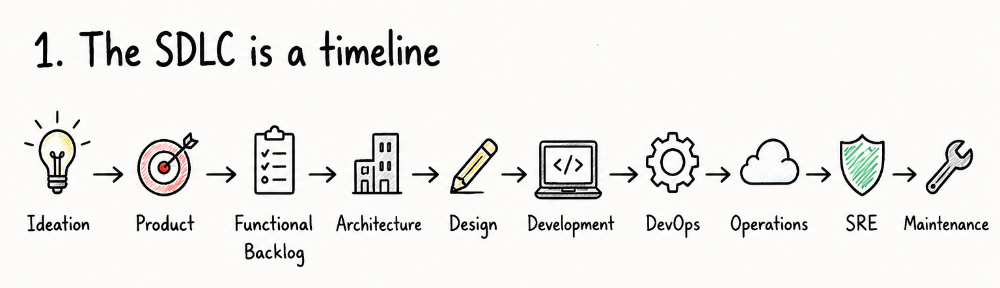
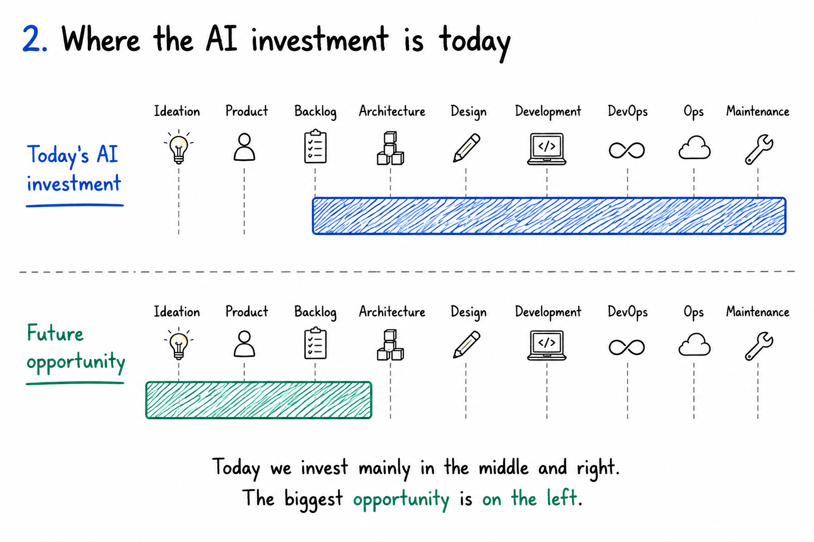
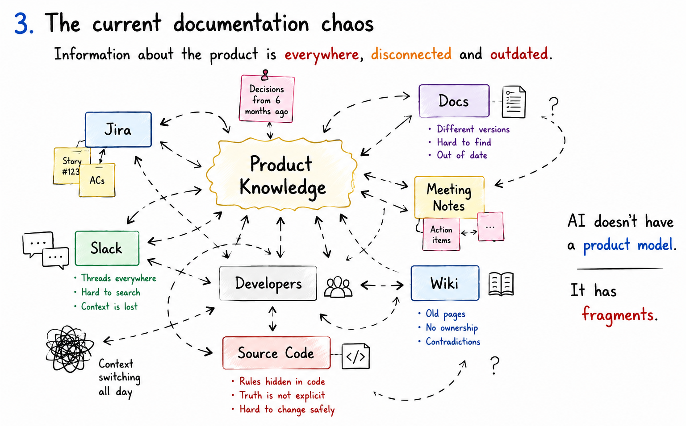
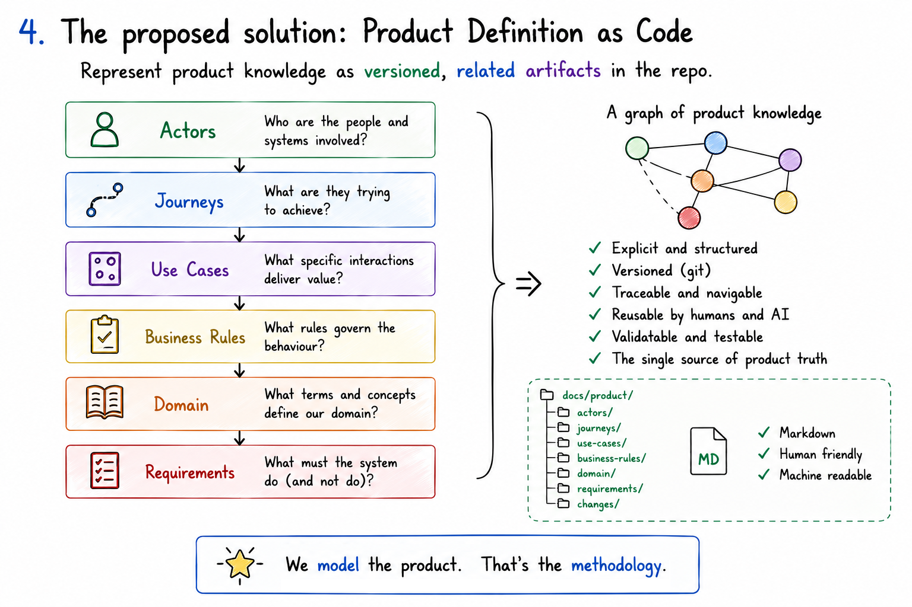
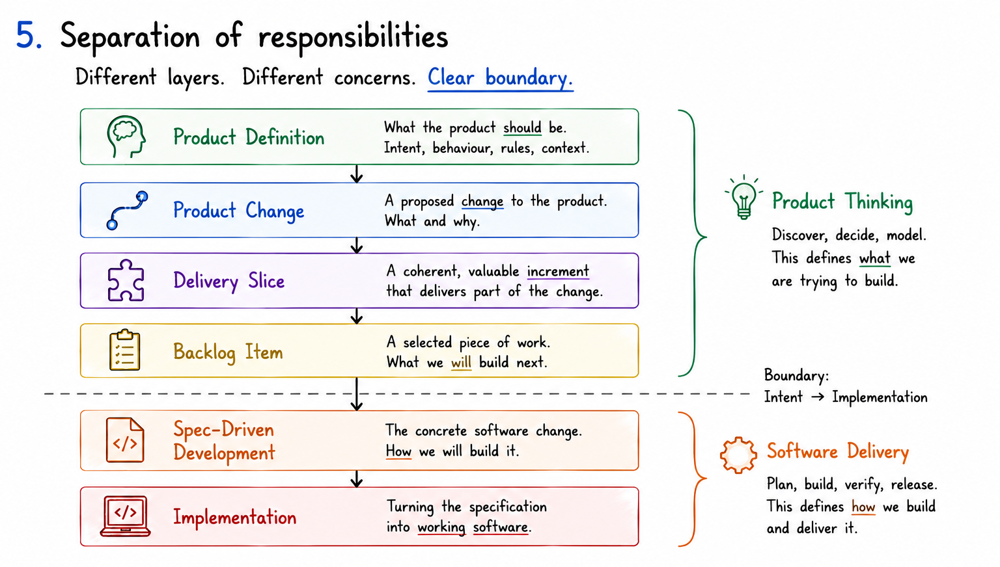
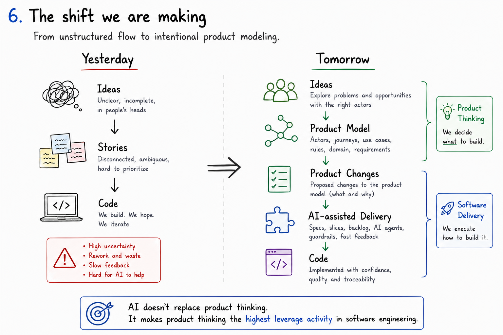
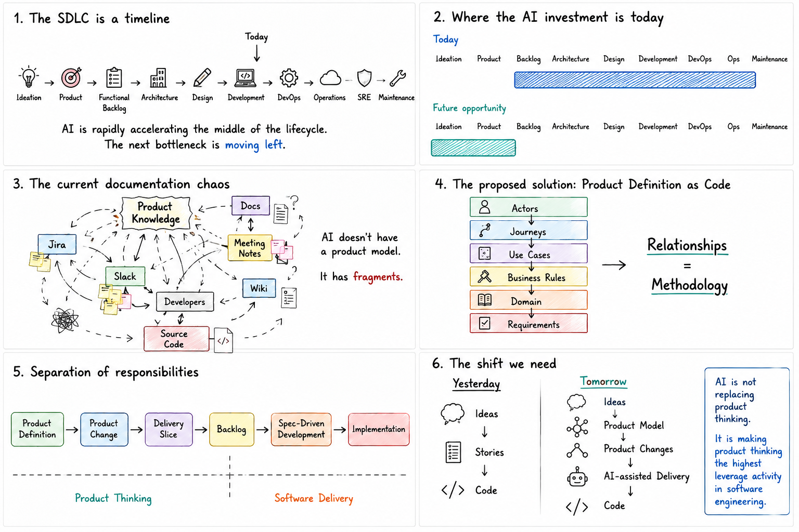

Lately, I have been working as a FDE (Forward Development Engineer) at [Plain Concepts](https://www.plainconcepts.com/who-we-are/), helping different clients introduce AI into their software development lifecycle. AI-SDLC and Spec-Driven Development are my two main areas of focus and I have been thinking a lot about the implications of AI-assisted development on the software lifecycle in many environments, with many tools, with different workflows in many different scenarios...

There is something that becomes clear as the technologies, the organizations, and the constraints change... and it is that most of them are **documentation problems**. This should not surprise anyone, IMHO, documentation and documentation management have always been a disaster across the software industry. (and I am being polite saying "disaster"...)

## AI is exposing old problems

For years, software teams have survived with fragmented knowledge:

- Product decisions hidden in meeting notes.
- Business rules buried inside tickets.
- Requirements scattered across documents, chats and people's memory.
- Architecture decisions disconnected from the code.
- Designs that no longer match the implementation.
- Operational knowledge that only exists in the minds of a few engineers.

This was already inefficient when humans were doing most of the implementation work, but with AI-assisted development, it becomes a **structural problem**.

When the product definition is incomplete, contradictory or distributed across multiple tools and people's heads, AI does what engineers have always done: to guess, so it drifts and makes mistakes.

(Side note: this is the same drift problem I wrote about in [*Spec-Driven Development: Controlling AI-Generated Drift*](/spec-driven-done-right/). SDD attacks it from the implementation side. This article goes one step further left side, before the spec even exists.)

## 1. Let's look at the left side of the SDLC

We normally represent the software development lifecycle from left to right:



The exact labels vary between organizations, but the direction is always the same: from left to right, from abstract ideas to concrete implementation, production and maintenance.

Today, most AI engineering effort is concentrated around development and the activities immediately surrounding it: code generation, testing, code review, refactoring, CI/CD, infrastructure, incident analysis, maintenance. Useful, but it addresses the **middle and right side** of the lifecycle.

As implementation becomes increasingly automated, the bottleneck moves left (and right, but that's another story).

The difficult questions are now *who* is this product for, *what* are they trying to achieve, *which* behaviour should exist, *which* rules govern that behaviour, *what* does the domain language mean, *which* requirements follow from those decisions, *what exactly* are we asking the AI to change.

This is where I want to focus today, to the **left of development** because your inputs are the product artifacts that define what we are building.

## 2. Where AI investment is today

Most AI effort today is concentrated in development, DevOps and operations. Code assistants, test generators, review bots, CI copilots, incident analyzers. All of them live on the right half of the timeline.



That is where the ROI was easiest to demonstrate, so it is where the industry invested first. Reasonable.

But it is also a saturated frontier now. The next meaningful opportunity lies on the **left side** of the lifecycle, where product intent is formed, where language is defined, where requirements are born. The source of every human and AI misunderstanding, the source of drift, the source of wasted effort.

The left side is harder. It is messier, less structured, and historically owned by humans talking to humans. Which is exactly why it has resisted automation so far.

## 3. Why is the left side so hard to automate?

Because product knowledge is fragmented.



Product decisions live in Jira. Conversations live in Slack or Teams. Long-form reasoning lives in Docs, luckily, or in chaotic Confluence pages. Half of it lives in meetings that were never minuted. The rest lives in code comments and in the heads of two senior engineers that are about to retire and a third who is frequently on vacation.

AI does not have a **product model**. We are constantly feeding it with fragments, and fragments are just "noise" that the model has to reconstruct into something understandable on every single invocation, with no guarantee it reconstructs the same meanings twice. That is the opposite of determinism, our lighthouse in AI-SDLC.

This is the root cause underneath everything I wrote in [*The Missing Standard Behind AI-Assisted Development*](/ai-tooling-lacks-foundational-standards/). There, the fragmentation, was at the tooling layer, every vendor scanning its own files. Here, the fragmentation is deeper: it is at the **product knowledge layer**, before any tool even runs.

> We cannot standardize discovery if there is nothing canonical to discover.

## 4. The proposed solution: Product Definition as Code

The deliberately inelegant word I keep using is **artifacting**.

Instead of treating product understanding as a collection of conversations, tickets and documents, we could represent its different dimensions as explicit, versioned and related artifacts. Not one enormous product document. Not a 200-page specification nobody reads. A **graph of small, focused product artifacts**.



I recently tried this approach manually with quite a few clients, and it worked. The artifacts are, in general: 
- Actors
- Journeys
- Use Cases
- Business Rules
- Domain Concepts
- Requirements


An actor participates in a journey. A journey contains use cases. A use case is governed by business rules. Business rules and domain concepts lead to requirements (functional or non-functional). 

The documents demonstrated to be useful, but the real methodology is in the **relationships between them**. Those relationships make product knowledge navigable, traceable and usable by both humans and AI.

The working name for this idea is **Product Definition as Code**.

> Everything is code. Or can become code.

That is not a slogan. It is an engineering position. If a thing can be written down, it can be versioned. If it can be versioned, it can be validated. If it can be validated, it can be trusted as input to a deterministic process. Product knowledge is no exception. The moment we stop treating it as ephemeral conversation and start treating it as a first-class artifact with identity, relationships and lifecycle, it becomes code, and code is the only thing the rest of our toolchain already knows how to handle.

### The basic principles of Product Definition as Code:

- Product knowledge lives close to the software, inside the repository.
- Markdown is the canonical representation.
- Every artifact has a stable, immutable identity.
- Relationships are explicit and machine-readable.
- The product graph is compiled from the Markdown, not authored by hand.
- Backlog items are projections of product changes, not the source of truth.
- Spec-Driven Development tools consume product context, but do not own the product definition.

This is not documentation for documentation's sake. The objective is to create a reliable product context that can be inspected, validated, changed and passed into an AI-assisted development workflow.

## 5. Separation of responsibilities

A Product Owner request should not immediately become a user story.

It should first become a **Product Change**.



That change identifies which actors are affected, which journeys change, which use cases are added or modified, which business rules apply, which requirements are introduced, and which questions remain unresolved. Only then should the change be divided into coherent delivery slices and projected into a backlog.

This creates a clean boundary.

**Product Definition** owns *what* should exist. **Spec-Driven Development** owns *how* it will be built.

When the boundary is missing, the backlog silently becomes the product definition — and the backlog is a terrible place to model a product.

This is not another SDD framework. There are already useful approaches for Spec-Driven Development, such as [OpenSpec](https://github.com/Fission-AI/OpenSpec) and [Spec Kit](https://github.com/github/spec-kit) — both of which I covered in [*Moving Toward Spec-Driven Development*](/moving-toward-spec-driven-development/). Product Definition as Code is intended to sit **before** them. It generates a stable handoff containing the relevant product subgraph for one delivery increment, and the SDD workspace remains native to the chosen framework.

The relationship is intentionally **one-way**. Product knowledge feeds delivery. Delivery may reveal contradictions or missing information, but it must not silently rewrite the product definition.

## 6. The shift we are making

So what does software engineering look like if we adopt this?



During 2026, within the AI-SDLC context, the most expensive part has become forming a coherent, versioned, machine-readable model of what the product *is* and *is becoming*.

> AI makes product thinking the highest-leverage activity in software engineering.

That is the shift. Not "AI replaces engineers." AI replaces the *translation* layer between intent and implementation, which means the quality of the intent itself becomes the constraint.

A vague requirement given to one engineer may result in a few questions and a delayed implementation. A vague requirement given to an autonomous development workflow may result in fifty changed files, a new "weird" abstraction, a couple of architectural missalignments nobody noticed at first sight, six tests and a beautifully implemented misunderstanding.

> The better the product context, the better the development loop. 

That is already a meaningful improvement, with or without AI. 🙂

## In a Nutshell



1. **The bottleneck is moving left.** As AI automates implementation, the hard part becomes knowing what to build.
2. **Investment is still on the right.** Most AI effort targets code, tests, CI and ops — the saturated frontier.
3. **The root cause is fragmentation.** Product knowledge lives in fragments, not a model. Fragments are not context.
4. **Model the product as a graph.** Versioned, related artifacts: Actors → Journeys → Use Cases → Business Rules → Domain → Requirements.
5. **Separate the concerns.** Product Definition owns *what*; SDD owns *how*. The handoff is one-way.
6. **Product thinking becomes leverage.** When translation collapses, intent quality is the constraint.

The first version does not need to solve the entire product lifecycle. It needs to prove one idea:

> A versioned graph of product artifacts can provide better context to both humans and AI before software implementation begins.

---

# Part II — ProductShape: The Reference Implementation


I couldn't stop at the idea, so, I built something on top of it I want to share with the world.

[**ProductShape**](https://github.com/juangcarmona/productshape) is the reference implementation of the Product Definition as Code methodology. It is to Product Definition as Code what OpenSpec is to Spec-Driven Development: a TypeScript toolkit that puts a canonical, versioned, machine-validatable product definition in front of your backlog and your AI-driven/Agentic/SDD workflow, whatever you choose.


It has been a beautiful exercise because the repository defines itself with its own methodology, 59 artifacts, zero diagnostics. It has delivered one real Product Change through the complete loop, from proposal to promotion, handed off into a native OpenSpec change. v0.1 is complete and published.

## The packages

All packages are published on npm under the [`@prodshape`](https://www.npmjs.com/settings/prodshape/packages) scope, versioned independently with [Changesets](https://github.com/changesets/changesets) and published from GitHub Actions with provenance.

| Package | Purpose |
|---|---|
| [`@prodshape/cli`](https://www.npmjs.com/package/@prodshape/cli) | The `prodshape` command-line tool (bundles the rest) |
| [`@prodshape/core`](https://www.npmjs.com/package/@prodshape/core) | Deterministic parsing, validation and graph compilation |
| [`@prodshape/distribution`](https://www.npmjs.com/package/@prodshape/distribution) | `init`, provider-asset generation and `doctor` |
| [`@prodshape/adapter-openspec`](https://www.npmjs.com/package/@prodshape/adapter-openspec) | OpenSpec adapter and coverage validation |
| [`@prodshape/integration-claude`](https://www.npmjs.com/package/@prodshape/integration-claude) | Claude Code renderer for canonical assets |
| [`@prodshape/integration-copilot`](https://www.npmjs.com/package/@prodshape/integration-copilot) | GitHub Copilot renderer for canonical assets |

Install it globally:

```bash
npm install -g @prodshape/cli
```

Or run it once without installing:

```bash
pnpm dlx @prodshape/cli --help
```

The CLI ships two equivalent binaries: `prodshape` (canonical) and `product-definition` (v0.x alias, identical output, removed before v1). The `/product:*` commands are canonical; `/ps:*` is an optional shorthand.

## The artifact model

The product model is a set of Markdown artifacts, each with a stable, immutable ID:

| Artifact | Prefix | What it captures |
|---|---|---|
| Actor | `ACT-` | Who or what interacts with the product |
| Journey | `JRN-` | An end-to-end outcome across use cases |
| Use Case | `UC-` | One concrete interaction and its flows |
| Business Rule | `BR-` | Durable knowledge that governs behaviour |
| Domain Term | `TERM-` | Shared language, defined in a bounded context |
| Bounded Context | `BC-` | A product-language boundary |
| Functional Requirement | `FR-` | A derived obligation: what the product must do |
| Quality Requirement | `QR-` | A measurable quality obligation |
| Constraint | `CON-` | An externally imposed or deliberately fixed boundary |

Three further kinds carry the change flow: Product Changes (`CHG-`), Delivery Slices (`SLI-`) and Product Handoffs (`HOF-`).

Each relationship is authored exactly once, in one direction, on one artifact. The graph compiler builds the full product graph from those declarations and derives all reverse views — a bounded context's owned terms, a rule's consumers, a use case's derived requirements — so nobody maintains reciprocal references. Validation over the graph is deterministic: unresolved references, disallowed target types, duplicate IDs and lifecycle violations are errors with stable codes.

## Adopting in a greenfield product

A greenfield adoption is the cleanest path: a fresh repository, no accumulated behaviour to recover. You initialize the layout, author the initial baseline, validate it, and then run your first Product Change.

**1. Initialize.**

```bash
prodshape init --ai claude --sdd openspec
```

This creates `docs/product/` (the canonical model) and `.product/` (configuration, generated graph, cache). If you requested AI integrations, it also generates managed files under `.claude/` or `.github/`, skills, `/product:*` commands, hooks. Those are generated from canonical assets and must never be edited by hand.

**2. Author the initial baseline.**

The Define operation produces the first version of your product model. Two ways to run it: with the `define-product` skill (the AI interviews you about the product and drafts schema-conformant artifacts for review, AI drafts, you decide), or by hand from `templates/` (every artifact type has a conformant template).

A workable authoring order, because relationships point upstream: Actors → Bounded contexts and domain terms → Use cases and journeys → Business rules → Functional, quality requirements and constraints.

**3. The bootstrap exception.**

The first baseline may be authored directly into `docs/product/model`, no Product Change is required to create it. This is the *only* time direct authoring into the model is allowed. Once the initial baseline is accepted, every subsequent semantic evolution must go through a Product Change.

**4. Validate.**

```bash
prodshape validate
prodshape graph --format mermaid
prodshape inspect UC-EXAMPLE-001
prodshape impact BR-EXAMPLE-001 --direction incoming
```

Validation is deterministic: schema conformance, ID and prefix rules, reference resolution, relationship target types, lifecycle interactions and required body sections, with stable diagnostic codes (`PRODUCT001`–`PRODUCT110`). Errors block; warnings inform.

## Adopting in a brownfield product

A brownfield adoption is the realistic path for most teams: existing software with behaviour, users and accumulated decisions, but no canonical product model. The path is initialize, recover a model from evidence, validate it into a baseline, then operate through Product Changes.

**1. Initialize.** Same command. It creates `docs/product/` and `.product/` and touches nothing else — your source code, build and existing documentation are untouched.

**2. Recover a candidate model.** The Recover operation reconstructs product knowledge from what the system already tells you. Evidence sources: source code and tests, API contracts, UI flows, database constraints, existing documentation, issue trackers, support conversations, and — often the highest-value source — interviews with the people who operate the system.

Candidates carry **provenance and confidence**. Each recovered artifact is a draft that records where the knowledge came from and how confident the recovery is. A business rule read directly from a validation test is not the same as one inferred from a variable name, and the candidate must say so.

A human validates before anything becomes active. Candidates enter the model with status `draft`. A person who understands the product reviews each candidate — confirming, correcting or discarding it — before it is promoted to `active`. Recovered knowledge is never auto-canonical: the tool proposes, the human decides. This boundary is deliberate and permanent.

**3. Establish the baseline.** Validated candidates are authored directly into `docs/product/model` as the first accepted baseline. Validate it. Warnings like `PRODUCT105` (business rule with no consumers) or `PRODUCT103` (requirement unreachable from any actor) are common in recovered models and usually point at knowledge you have not finished connecting.

**4. Set honest expectations.** Recovery is incremental — you do not need the whole system modelled before the baseline is useful. Start with the areas you are about to change. The model records what the product does, not what the code looks like. And some knowledge is simply gone — where nobody can confirm a rule's rationale, record what is observable and note the uncertainty rather than inventing a justification.

**5. Operate through Product Changes.** Once the baseline is accepted, the bootstrap exception is closed. Every subsequent evolution goes through the same change flow as greenfield.

## Tracking changes: the Product Change loop

From the moment the baseline is accepted, nothing modifies the product model silently. Every evolution is a **Product Change** — a validated delta with rationale, operations and complete proposed future-state artifacts.

The loop is explicit end to end:

```
Product Definition → Product Change → Delivery Slice → Backlog Item
  → Product Handoff → SDD workflow → Implementation → Verification → Promotion
```

**1. Propose.** Create a `change.md` with problem, intended outcome, rationale and operations (`add`/`modify`/`remove`), plus complete proposed future-state artifacts. The `analyze-product-change` skill helps draft this.

**2. Validate as overlay.** The change is validated as an overlay on the baseline — it does not touch the baseline. `prodshape change validate CHG-EXAMPLE-001` checks that the proposed future state is internally consistent and that every operation is legal against the current model.

**3. Slice.** After approval, decompose the change into delivery slices — implementable, verifiable product increments with explicit requirement coverage. The `slice-product-change` skill assists.

**4. Hand off.** Each slice projects to a backlog item and generates a **Product Handoff**: a framework-independent package of exactly the product subgraph that increment needs, with content digests so staleness is detectable per artifact. Your SDD framework consumes the handoff and runs its native workflow unchanged. With the OpenSpec adapter, the handoff lands as sidecar files inside a normal OpenSpec change; OpenSpec's lifecycle is untouched and archiving never promotes.

**5. Implement and verify.** The SDD workflow produces the implementation. Coverage evidence is collected.

**6. Promote.** When all slices are done or explicitly cancelled and coverage evidence exists, a human explicitly promotes the Product Change. `prodshape change promote CHG-EXAMPLE-001 --dry-run` first, then without `--dry-run`. Promotion applies the operations to the baseline and moves the change to `completed/`. It is never triggered implicitly.

This is the part I care about most. The entire chain is deterministic, traceable and auditable. No silent rewrites. No drift between what was requested, what was specified, what was implemented and what the product model says today.

## Current status and what is deliberately out

v0.1 was built in the open through four OpenSpec changes, all complete: the methodology foundation, the graph core, the change-and-handoff loop, and the AI/SDD integrations. The packages are published. The reference implementation adopted the ProductShape brand through its own Change operation (`CHG-BRAND-001`); the methodology name, Product Definition as Code, is retained.

Deliberately out of scope for v0.1: graph databases, web UIs, MCP servers, Jira integration, multi-repository graphs, automatic brownfield recovery, roadmaps and OKRs, hosted services and telemetry. The full list is in [Limitations of v0.1](https://github.com/juangcarmona/productshape/blob/main/docs/limitations-v0.1.md).

## A call for maintainers

ProductShape is v0.1. It works, it is self-hosted, and it has proven the core idea against a real repository. But a methodology only matters if it survives contact with other people's codebases, other people's domains, other people's constraints.

I am looking for maintainers who care about the left side of the SDLC — product engineers, architects, SDD practitioners, tooling authors — who want to stress-test this against real products and help shape v0.2.

If you work with OpenSpec or Spec Kit and have felt the gap upstream, this is your gap. If you have tried to give an AI agent product context and watched it hallucinate a product model from fragments, this is your problem.

[Read the manifesto](https://github.com/juangcarmona/productshape/blob/main/docs/manifesto.md). [Try the CLI](https://github.com/juangcarmona/productshape#try-it-in-five-minutes). [Open an issue](https://github.com/juangcarmona/productshape/issues). [Contribute](https://github.com/juangcarmona/productshape/blob/main/CONTRIBUTING.md).

The specification is normative. `docs/product` is canonical. Changes to the product definition itself go through its own Change operation. Dogfooding is not a marketing claim here — it is the only way the repository evolves.

## References

- [**ProductShape** — reference implementation](https://github.com/juangcarmona/productshape) — the TypeScript toolkit. Self-hosted, v0.1 complete.
- [ProductShape — npm packages](https://www.npmjs.com/settings/prodshape/packages) — all packages under the `@prodshape` scope.
- [The manifesto](https://github.com/juangcarmona/productshape/blob/main/docs/manifesto.md) — the founding position.
- [The methodology overview](https://github.com/juangcarmona/productshape/blob/main/docs/methodology/overview.md) — a five-minute read.
- [Greenfield adoption guide](https://github.com/juangcarmona/productshape/blob/main/docs/adoption/greenfield.md) — new product, fresh repository.
- [Brownfield adoption guide](https://github.com/juangcarmona/productshape/blob/main/docs/adoption/brownfield.md) — existing system, recover a model.
- [*Spec-Driven Development: Controlling AI-Generated Drift*](/spec-driven-done-right/) — the predecessor article. SDD as a control system against drift, from the implementation side.
- [*Moving Toward Spec-Driven Development with OpenSpec or Spec Kit*](/moving-toward-spec-driven-development/) — where Product Definition as Code hands off: the SDD frameworks that consume the product handoff.
- [*The Missing Standard Behind AI-Assisted Development*](/ai-tooling-lacks-foundational-standards/) — the tooling-layer fragmentation problem. This article is its product-layer counterpart.
- [*Multi-Agent AI Repository Architecture*](/multi-agent-ai-repository-architecture/) — canonical semantic layer for AI artifacts. Product Definition as Code is what makes that layer worth discovering.
- [OpenSpec](https://github.com/Fission-AI/OpenSpec) — lightweight, brownfield-first SDD framework.
- [GitHub Spec Kit](https://github.com/github/spec-kit) — intent-driven SDD toolkit from GitHub.
- [Plain Concepts](https://www.plainconcepts.com/who-we-are/) — the engineering context where these ideas are being tested against real clients.
