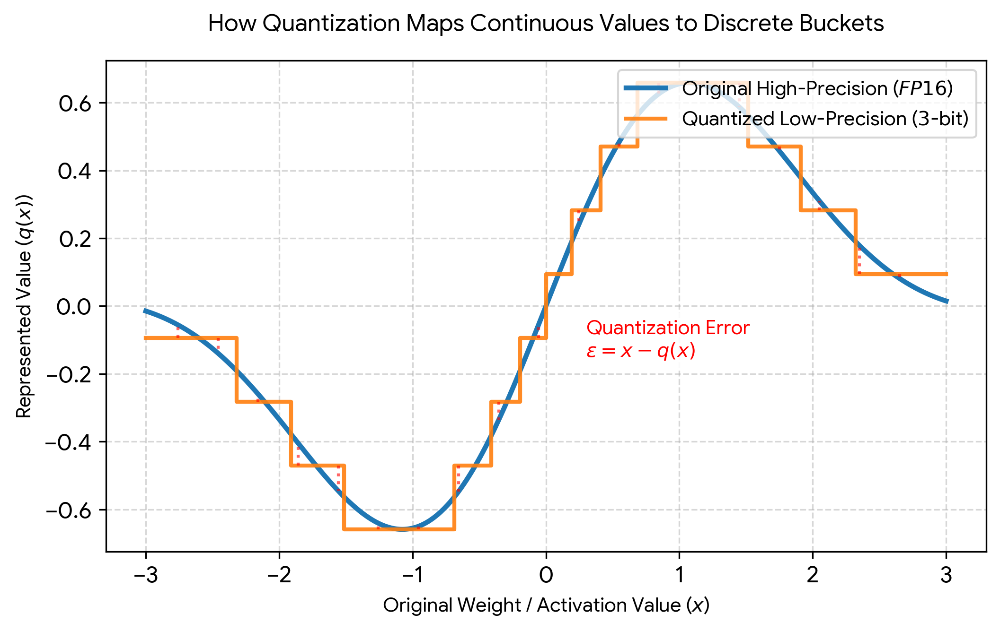

A few weeks ago, after publishing [Local LLMs Under the Hood](/blog/local-llms-under-the-hood/), I received a comment from Alfonso (altromon) that stuck with me:

> *"Thanks for this explanatory article. I would like to read your thoughts about quantization: how it affects performance and/or how to select an appropriate one. I look forward to reading from you!"*

Fair request. In that article I explained the full LLM inference pipeline, tokens, vectors, matrix math, memory, but I deliberately left quantization as a teaser. Time to pay that debt.

Here is the short version: large language models are huge because they contain billions of numbers called **weights**. These weights are what the model uses to decide what token should come next. In normal training and inference, weights are stored with high precision, FP16, BF16, or FP32. That is accurate, but expensive. More precision means more memory, more bandwidth, more GPU pressure, and higher serving cost.

> **Quantization is the idea of storing those numbers with fewer bits.** 

Instead of keeping a weight as a large and highly precise decimal value, we can store an approximation using fewer bits, 8 bits, 4 bits, or sometimes even 2 or 3 bits. The model becomes smaller, because each number takes less space. A 4-bit model can use roughly a quarter of the memory of a 16-bit model for its weights.

### Why does this work so well? 
> **Why doesn't reducing precision destroy the model?**

The key that changes everythihng is that **we are dealing with vectors**. Quantization algorithms might shorten the mathematical arrows (vectors), but they keep them pointing in, almost, the exact same direction, preserving the "model's meanings". And because AI models have billions of connections, all those tiny rounding errors end up canceling each other out across the network.

Here is a visual explanation of how the math translates into information loss at different bit widths:

If you want a quick visual primer before diving in, I also recommend [this Deepchecks article on quantization methods](https://deepchecks.com/top-llm-quantization-methods-impact-on-model-quality/) and [this 10-minute YouTube explainer](https://www.youtube.com/watch?v=vFLNdOUvD90).

## What Is Quantization and Why Does It Matter?

Think of it like image compression. A high-quality photo may contain more color detail than most people can notice. Compress it carefully, and it still looks almost the same while using much less storage. Now imagine an image with a 16-bit color palette. "Quantize" it by reducing the color scheme to 8, 6, 5, 4, 3 bits, with images, the results can be dramatic, even useless. But with neural network weights we are compressing **vectors**, not pixels. The deviation is much lower, and the meaning is preserved.

The numbers tell the story clearly. Consider a 70-billion-parameter model:

| Precision | Bits per weight | Approximate model size | Relative to FP16 |
|-----------|:-:|:-:|:-:|
| FP32      | 32 | ~280 GB | 2× |
| FP16 / BF16 | 16 | ~140 GB | 1× (baseline) |
| INT8      | 8  | ~70 GB  | 0.5× |
| INT4      | 4  | ~35 GB  | 0.25× |

Going from FP16 to INT4 cuts memory by roughly 4×. For a model that barely fits on a single high-end GPU at 16-bit, that is the difference between needing one GPU and needing four. 

> This changes who can run the model, where, and at what cost.

## 8-Bit Quantization: Where It All Started

Early LLM quantization focused on 8-bit inference. The landmark method was [**LLM.int8()**](https://arxiv.org/abs/2208.07339), which showed that large transformer models could run with much lower memory while preserving near full-precision behavior. The key insight was that most weight values can be safely rounded to 8 bits, but a small number of **outlier** values are critically important. LLM.int8() handles these outliers separately in higher precision, keeping the model accurate.

[**SmoothQuant**](https://arxiv.org/abs/2211.10438) improved the idea by observing that activations (the intermediate values flowing through the network) are harder to quantize than weights. SmoothQuant mathematically shifts the quantization difficulty from activations to weights, "smoothing" the activation distributions, making INT8 weight-and-activation inference practical on real hardware.

[**ZeroQuant**](https://arxiv.org/abs/2206.01861) from Microsoft took a different approach, combining group-wise weight quantization with token-level activation quantization and layer-by-layer knowledge distillation to achieve efficient INT8 inference without needing a full retraining pass.

These methods proved the fundamental idea: you can cut memory in half with 8-bit quantization and lose very little quality. But the community wanted to go further.

## 4-Bit Quantization: GPTQ, AWQ, and the Push for Efficiency

The real breakthrough for practical deployment came with 4-bit methods.

[**GPTQ**](https://arxiv.org/abs/2210.17323) quantizes weights after training using calibration data and approximate second-order information (based on the Hessian matrix). In plain terms: it measures which rounding mistakes would hurt the model most, then compensates for them layer by layer. The result is a 4-bit model that often performs surprisingly close to the original 16-bit version. GPTQ became one of the most widely used quantization methods, especially for GPU inference.

[**AWQ (Activation-Aware Weight Quantization)**](https://arxiv.org/abs/2306.00978) takes a different route. It observes that not all weights matter equally, a small fraction of channels carry most of the model's important information. AWQ uses activation statistics to identify and protect these critical channels during quantization. This makes AWQ fast, practical, and strong for many local and serving scenarios.

[**SpQR**](https://arxiv.org/abs/2306.03078) pushes the boundary further with a sparse-quantized representation. It identifies individual weight outliers (not just channels) and stores them at higher precision while compressing everything else to 3-4 bits. SpQR achieves near-lossless compression, less than 1% accuracy loss, even at very aggressive bit widths.

## QLoRA: Fine-Tuning Large Models on Small GPUs

Quantization is not only about inference. [**QLoRA**](https://arxiv.org/abs/2305.14314) changed the fine-tuning story. Instead of fully fine-tuning a huge model in 16-bit precision, QLoRA keeps the base model frozen in 4-bit precision and trains small adapter layers (LoRA) on top. Three key ideas make it work:

- **NF4 (4-bit NormalFloat)**: a data type specifically designed for normally distributed neural network weights, providing better information density than standard INT4.
- **Double quantization**: quantizes the quantization constants themselves, saving additional memory.
- **Paged optimizers**: uses CPU memory as overflow when GPU memory runs out.

In practice, QLoRA made it possible to fine-tune a 65B parameter model on a single 48GB GPU, a task that previously required a cluster. This democratized fine-tuning: more people could adapt large models without owning expensive hardware. If you have been thinking about [building a cost-efficient AI workstation](/blog/build-cheap-ai-workstation-europe-4gpu/), QLoRA is the reason a 4-GPU consumer rig can be genuinely useful for fine-tuning.

## KV Cache Quantization: The Long-Context Memory Problem

Quantization is not only about model weights. During inference, especially with long context windows, the **KV cache** can become a major memory bottleneck. The KV cache stores attention key-value pairs from previous tokens so the model does not recompute everything from scratch. For a 70B model processing 128K tokens, the KV cache alone can consume tens of gigabytes.

[**KIVI**](https://arxiv.org/abs/2402.02750) compresses this cache to very low precision, even 2-bit for value states and 2-bit for key states, while preserving output quality through a per-channel quantization strategy. This matters for long-context models, high-concurrency serving, and production environments where memory pressure often limits throughput more than compute does.

## Smaller Is Not Always Faster

Here is the tradeoff that catches people off guard: **smaller models are not always faster, and lower precision is not always better.**

Quantized models reduce memory use, but actual inference speed depends on hardware kernels, runtime support, batching strategy, GPU architecture, and the quantization format itself. A 4-bit model with optimized kernels (like the Marlin kernels for GPTQ/AWQ) can be significantly faster than FP16. A 4-bit model with poor kernel support can be *slower*.

This is why the tooling ecosystem matters:

- **[llama.cpp](https://github.com/ggml-org/llama.cpp/discussions/2094) and GGUF** dominate local CPU, Mac, and consumer GPU workflows. GGUF is the format, llama.cpp is the runtime. Quantization variants like Q4_K_M, Q5_K_M, and Q6_K offer different quality-speed tradeoffs. (I used it a lot, and you should keep an eye on latest PR's because [this one](https://github.com/ggml-org/llama.cpp/pull/22673) promises double inference spped. )
- **[vLLM](https://docs.vllm.ai/en/latest/features/quantization/)** is the standard for high-throughput GPU serving. It supports GPTQ, AWQ, FP8, and other formats with paged attention and continuous batching. (That's what I use when serving just for myself and for coding purposes, manual or agentic... ☺︎)
- **[bitsandbytes](https://huggingface.co/docs/transformers/quantization/bitsandbytes)** integrates directly with Hugging Face Transformers for easy 4-bit and 8-bit loading and QLoRA fine-tuning. For example, many developers use it to run a 70B model on consumer GPUs that otherwise could not fit in memory.
- **TensorRT-LLM** provides NVIDIA-optimized inference with INT4/INT8/FP8 support for production deployments. For example, companies serving high-throughput chat or agent APIs use it to maximize tokens-per-second and GPU efficiency on NVIDIA infrastructure.

[Red Hat's study of over 500,000 evaluations on quantized LLMs](https://developers.redhat.com/articles/2024/10/17/we-ran-over-half-million-evaluations-quantized-llms) provides hard data: the quality loss from quantization varies significantly by model, task, and method. Some models tolerate aggressive quantization well; others degrade quickly. 

> Benchmarking your specific quantized model, on your specific task, becomes essential.

## Choosing the Right Quantization for Your Use Case

> **There is no silver bullet**

There never is, there never will be. Similarly, **there is no single best quantization method**. The right choice depends on your deployment target:

| Use case | Recommended method | Typical bits | Runtime / format | Notes |
|----------|-------------------|:---:|------------------|-------|
| **Local inference** (CPU, Mac, consumer GPU) | GGUF via llama.cpp | 4-6 | llama.cpp | Q4_K_M or Q5_K_M is the sweet spot for most models |
| **GPU inference** (serving) | AWQ or GPTQ | 4 | vLLM, TensorRT-LLM | AWQ is often faster; GPTQ has wider model availability |
| **Fine-tuning** on limited hardware | QLoRA + bitsandbytes | 4 (NF4) | Hugging Face / PEFT | The standard approach for fine-tuning large models on single GPUs |
| **Long-context serving** | KV cache quantization (KIVI) | 2-4 | vLLM, custom | Reduces memory pressure from the KV cache, not the model weights |
| **Maximum quality** | FP8 or minimal quantization | 8 | vLLM, TensorRT-LLM | When you have the GPU memory and need every bit of accuracy |
| **Edge / mobile** | Aggressive INT4 + pruning | 2-4 | Specialized runtimes | Quality tradeoffs are real; benchmark carefully |

The practical rules:

1. **For local inference**, start with GGUF Q4_K_M or Q5_K_M. These are well-tested, widely available, and run efficiently on consumer hardware.
2. **For GPU serving**, AWQ with Marlin kernels or GPTQ with vLLM is a strong starting point. Check the [Hugging Face quantization guide](https://huggingface.co/docs/transformers/quantization/selecting) and [vLLM benchmarks](https://jarvislabs.ai/blog/vllm-quantization-complete-guide-benchmarks) for your specific model.
3. **For fine-tuning**, QLoRA is the default mental model. Use [bitsandbytes](https://huggingface.co/docs/transformers/quantization/bitsandbytes) with NF4 quantization.
4. **For long-context workloads**, watch the KV cache → it may be your bottleneck, not the model weights.
5. **Always benchmark**. Quantization is not one technique. It is a family of compromises between quality, memory, speed, cost, and operational simplicity. The only way to know what works for your setup is to measure it.

## Interesting fact

I just gave previous content to ChatGPT asking for a hero image for the article and it gave me this absurdly brillant infograhic that we can call Quantization in a Nutshell.

For the final hero image I just used Gimp, a manual and relaxing human creative process I always enjoy, as I hope you enjoyed the reading. I wait for your comments, you just need a GitHub account.

## References

1. Frantar et al. → [GPTQ: Accurate Post-Training Quantization for Generative Pre-trained Transformers](https://arxiv.org/abs/2210.17323)
2. Xiao et al. → [SmoothQuant: Accurate and Efficient Post-Training Quantization for LLMs](https://arxiv.org/abs/2211.10438)
3. Dettmers et al. → [LLM.int8(): 8-bit Matrix Multiplication for Transformers at Scale](https://arxiv.org/abs/2208.07339)
4. Yao et al. → [ZeroQuant: Efficient and Affordable Post-Training Quantization](https://arxiv.org/abs/2206.01861)
5. Dettmers et al. → [QLoRA: Efficient Finetuning of Quantized LLMs](https://arxiv.org/abs/2305.14314)
6. Lin et al. → [AWQ: Activation-aware Weight Quantization](https://arxiv.org/abs/2306.00978)
7. Dettmers et al. → [SpQR: Sparse-Quantized Representation for Near-Lossless Compression](https://arxiv.org/abs/2306.03078)
8. Liu et al. → [KIVI: 2-bit KV Cache Quantization](https://arxiv.org/abs/2402.02750)
9. [A Survey of Low-bit Large Language Models](https://arxiv.org/html/2409.16694v3)
10. [Resource-Efficient Language Models: Quantization for Fast Inference](https://arxiv.org/html/2505.08620v1)
11. Red Hat → [We ran over half a million evaluations on quantized LLMs](https://developers.redhat.com/articles/2024/10/17/we-ran-over-half-million-evaluations-quantized-llms)
12. [vLLM Quantization Docs](https://docs.vllm.ai/en/latest/features/quantization/)
13. Jarvis Labs → [The Complete Guide to LLM Quantization with vLLM](https://jarvislabs.ai/blog/vllm-quantization-complete-guide-benchmarks)
14. Hugging Face → [Quantization Overview](https://huggingface.co/docs/transformers/en/quantization/overview)
15. Hugging Face → [Selecting a Quantization Method](https://huggingface.co/docs/transformers/quantization/selecting)
16. Hugging Face → [bitsandbytes](https://huggingface.co/docs/transformers/quantization/bitsandbytes)
17. Hugging Face → [AWQ](https://huggingface.co/docs/transformers/en/quantization/awq)
18. [llama.cpp GGUF quantization discussion](https://github.com/ggml-org/llama.cpp/discussions/2094)
19. Deepchecks → [Top LLM Quantization Methods: Impact on Model Quality](https://deepchecks.com/top-llm-quantization-methods-impact-on-model-quality/)
20. [Quantization Explained (YouTube, 10 min)](https://www.youtube.com/watch?v=vFLNdOUvD90)
