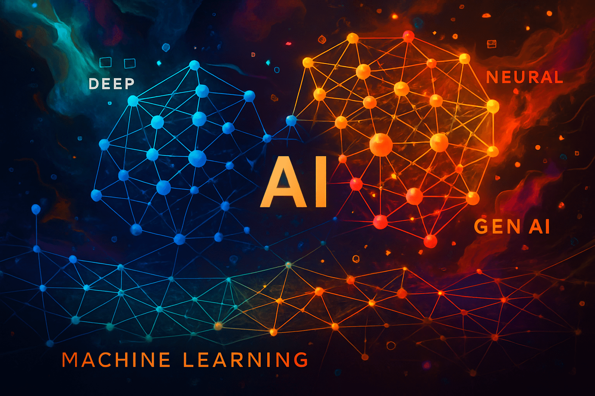

En los últimos años, la Inteligencia Artificial ha crecido muchísimo. En algunos casos está suponiendo el comienzo de un cambio de apradigma y las repercusiones de su aplciación aún son difíciles de imaginar... Su ecosistema es enorme y su jerga también. ¿Modelos, Agentes, RAG, inferencia, ML o Deep Learning? Son muchos los conceptos y muchas las palabras y las siglas relacionadas con la IA y me gustaría ayudarte a entender un poco cómo hemos llegado hasta aquí y qué papel ha jugado cada una de ellos, conceptos sin los que la IA no es lo que es hoy ni será lo que sea que esté por venir.

Además, muchos de estos términos a menudo se confunden, y se usan mal, en medios, en marketing e incluso en publicaciones técnicas de supuestos Gurús de la materia. Yo no soy un gurú ni pretendo serlo pero si que tengo experiencia con casi todo lo que hoy te cuento. Empecemos.

### Inteligencia Artificial: el paraguas grande

**IA o AI, de Artificial Intelligence,** es el concepto más general: aquí entra cualquier sistema que simule capacidades humanas como razonar, aprender, adaptarse o planificar.

Bajo ese paraguas, hay muchas ramas. Las más relevantes hoy son:

- **Machine Learning (ML)**: aprendizaje automático a partir de datos.

- **Deep Learning (DL)**: aprendizaje con redes neuronales profundas.

- **Generative AI (GenAI)**: generación de contenido (texto, imágenes, audio, código…).

- **Agentes de IA y RAG**: arquitecturas más complejas, con razonamiento, memoria, planificación y acceso a información externa.

### Machine Learning: cuando el sistema aprende con datos

El **Machine Learning** es la base práctica de la IA moderna. Existe desde mucho antes que OpenAI y su ChatGPT, y, lo creas o no, ya afecta a tu día a día desde hace muchos años.... Lo vas a flipar con los ejemplos. Se puede dividir en tres grandes bloques.

#### 1\. **Supervised Learning (Aprendizaje Supervisado)**

El sistema aprende a partir de ejemplos con respuestas conocidas. Es como enseñarle a un niño mostrándole muchas fotos etiquetadas: “esto es un gato”, “esto es un perro”.

**Ejemplos reales:**

- Detectar si un email es **spam o no spam**

- Predecir el **precio de una casa** en función de sus características

- Clasificar imágenes médicas como **benignas o malignas**

- Predecir si un cliente va a **cancelar una suscripción**

- Detectar fraude en tarjetas de crédito

Como ves, el sistema aprende a base de ejemplos. Es decir, el modelo se entrena viendo ejemplos y sus respuestas correctas para que intente generalizar. El modelo se consume dándole una entrada (un email, una imagen de un animal) e infiriendo una salida (si se trata de spam si el animal es un gato)

#### 2\. **Unsupervised Learning (Aprendizaje No Supervisado)**

Aquí no hay respuestas dadas. El sistema solo tiene datos y trata de encontrar estructuras ocultas. Como cuando entras en una fiesta y agrupas a la gente por afinidades sin saber quién es quién. Esto también ha afectado a tu vida sin tan siqueira saberlo...

**Ejemplos reales:**

- Agrupar clientes en segmentos para **marketing personalizado**

- Detectar patrones de uso anómalo en un sistema (por ejemplo, para **detección de fraude**)

- Reducir la cantidad de variables en datos complejos (**PCA**, por ejemplo en genética)

- Analizar opiniones de productos y descubrir **temas comunes**

El sistema explora, agrupa o reduce sin saber qué busca. Solo observa patrones. El resultado es el mismo, un modelo de Machine learning entrenado para, dado un input, una entrada del tipo que sea, predecir un resultado y realiza una acción concreta, como por ejemplo agrupar o encontrar similitudes o patrones.

#### 3\. **Reinforcement Learning (Aprendizaje por Refuerzo)**

Aquí el sistema aprende actuando y recibiendo recompensas o castigos. Es análogo a como entrenar a un perro: prueba algo, obervas qué pasa, y ajustas su comportamiento.

**Ejemplos reales:**

- Un agente que juega al **ajedrez o al Go** (la recompensa es ganar, o la puntuación)

- Un robot que aprende a **caminar** sin caerse (la recompensa es no caerse)

- Un sistema que optimiza el **flujo de tráfico en una ciudad** (reglas matemáticas)

- Un algoritmo que decide **cuándo mostrar publicidad** para maximizar clics (más matemáticas)

Lo esencial: hay un entorno, un agente, una acción, una recompensa. El sistema aprende por ensayo y error y se vuevle cada vez más eficiente. La máquina aprende. -> Machine Learning -> ML

### Deep Learning: cuando las redes neuronales se hacen profundas

El **Deep Learning** es una rama del _Machine Learning_ que utiliza **redes neuronales artificiales con muchas capas**. En lugar de programar reglas explícitas, dejamos que el sistema aprenda representaciones cada vez más complejas de los datos.

Por **ejemplo**, para reconocer un coche en una imagen:

- Las primeras capas detectan bordes.

- Las intermedias combinan formas simples.

- Las últimas identifican objetos completos.

Esta estructura profunda permite abordar tareas donde los patrones no son evidentes ni lineales. Es la base de tecnologías como:

- El reconocimiento facial

- Los asistentes de voz

- La traducción automática

- Y los modelos de lenguaje como **ChatGPT**

**¿Por qué ha despegado ahora?**  
Porque se ha juntado todo: más datos, más potencia de cálculo (GPUs), mejores algoritmos… y el trabajo de investigadores que defendieron estas ideas durante décadas. El nombre clave aquí es **Geoffrey Hinton**.  
Considerado el _“padrino del Deep Learning”_, fue ignorado durante años por insistir en el potencial de las redes neuronales. Mientras otros buscaban modelos estadísticos más “elegantes”, él seguía explorando arquitecturas profundas, entrenamiento por retropropagación y nuevas formas de representar el conocimiento.

No estuvo solo: junto a **Yoshua Bengio** y **Yann LeCun**, formó el trío que cambió la historia de la IA. En 2018, los tres recibieron el **Premio Turing**, el “Nobel” de la informática, por su trabajo pionero.

> “Nos dijeron que perderíamos el tiempo. Por suerte, no hicimos caso.”  
> — Geoffrey Hinton

🧱 **En resumen:** el Deep Learning es la tecnología que ha hecho posible que la IA actual vea, escuche, traduzca y converse. No es magia. Es arquitectura, datos y cálculo en profundidad.

### Generative AI: cuando la IA crea

Aquí hablamos de modelos como GPT, DALL·E, Claude, Mistral o Gemini. Usan enormes cantidades de datos y redes neuronales profundas para generar texto, imágenes, música, código e incluso vídeos. Estos modelos no “entienden” como un humano, ninguno lo hace, tan solo generan, predicen, correlacionan. Es pura teoría de juegos aplicada, matemáticas, estadística...

**Funcionan bien cuando el contexto es suficiente. Pero fallan cuando falta información clave que les permita inferir cuál será la siguiente palabra o el siguiente píxel o el nuevo fotograma.**

### ¿Y entonces qué es RAG?

**RAG (Retrieval-Augmented Generation)** ayuda a resolver el problema del contexto. Ya que los modelos suelen ser generalistas, porque son entrenados apra ser utilizados en múltiples contextos, con RAG podemos combinar un modelo generativo con una base de datos o sistema de búsqueda para que el modelo "sea más listo" e infiera de forma contextualizada. Suena enrevesado pero no lo es tanto:

🔍 **Primero recupera información relevante**, por ejemplo de documentos internos.  
🧠 Luego **usa esa información para generar una respuesta contextualizada**.

Así funciona ChatGPT y su memoria, los datos que poco a poco "ha ido aprendiendo de tí", y así funcionan sistemas como [**Sentra**](http://sentrabrain.com), un asistente corporativo pensado para ofrecer estas capacidades dentro de ambientes en los que los datos no deberían ser expuestos. También está preparado para ser desplegado como sistema de ayuda interna, como herramientas legales, entornos médicos o técnicos con alta carga de propiedad intelectual. El modelo ya no "alucina" y se inventa las respuestas (porque infiere aleatoriamente): responde en base a datos reales.

### Agentes de IA: el siguiente nivel

Los **AI Agents** no se limitan a responder: pueden razonar, planificar y actuar.  
Tienen acceso a herramientas, memoria, bases de datos y retroalimentación.

🔧 Un agente puede (o debería poder):

- Recibir una tarea del usuario

- Planificar los pasos necesarios

- Consultar fuentes externas

- Ejecutar acciones con herramientas (APIs, bases de datos…)

- Aprender de su experiencia

Es la base de sistemas como AutoGPT, LangGraph o frameworks como CrewAI, SuperAgent o **[Sentra Brain](http://sentrabrain.com)** (😉).

### Entonces… ¿qué elegir para mi proyecto?

| Objetivo | Tecnología recomendada |
| --- | --- |
| Clasificar emails o detectar fraude | ML supervisado |
| Reconocer imágenes, voz, texto | Deep Learning |
| Crear contenido o automatizar texto | Generative AI |
| Responder con base en documentos | RAG |
| Automatizar flujos complejos con razonamiento | Agentes de IA |

### ¿Quieres más?

Estos 4 artículos son de obligada lectura si te quieres adentrar, de verdad, en este mundillo. No te convertirás en un gurú, pero al menos entenderás un poco mejor de lo que hablas.

- ["**Attention Is All You Need**"](https://arxiv.org/abs/1706.03762) – paper fundacional de los Transformers.

- ["**Retrieval-Augmented Generation for Knowledge-Intensive NLP**"](https://arxiv.org/abs/2005.11401) – modelo RAG original de Facebook AI.

- ["**ReAct: Synergizing Reasoning and Acting in Language Models**"](https://arxiv.org/abs/2210.03629) – base para agentes con razonamiento.

- "**The High Performers Trap**" – The Caring Techie – un toque humano al debate técnico.

### ¿Algo más?

No, por hoy es suficiente, con que hayas llegado hasta aquí yo me doy por satisfecho... Si acaso, insistir en que la inteligencia artificial no es ciencia ficción. Es un ecosistema en expansión que, en realidad, lleva presente en nuestras vidas varias décadas ya.

Ahora estamos en pleno hype, igual que lo tuvimos con la nube o con blockchain... Al igual que en aquellas épocas, con la IA no hace falta saberlo todo pero sí es fundamental entender qué hace cada pieza y cómo pueden trabajar juntas.

> Porque no se trata de usar IA porque está de moda.  
> Se trata de usarla para resolver problemas reales y hacerlo con criterio.

¿Te pierdes con la IA? ¿Te gustaría que analice cómo aplicar estos enfoques a tu equipo, tu app o tu caso concreto?  
💬 [Escríbeme](/contact). Estás a un clic de distancia y la primera consulta siempre es gratuíta.
