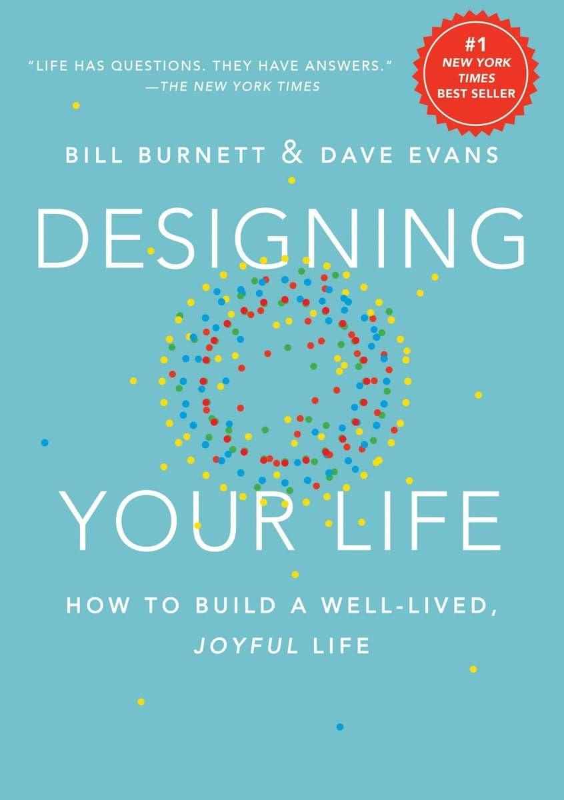

¿Sientes que **vas en piloto automático**? ¿Estás atascado? Recuperar el control de tu vida profesional no tiene por qué ser un drama ni requerir meses de **[coaching](/coaching)** o terapia psicológica. A veces basta con parar media hora, coger papel y lápiz, y tener una conversación profunda con uno mismo.

Pero no vale cualquier conversación. Las personas tendemos a divagar, y más en estas situaciones en las que no hay un rumbo claro. Déjame que te cuente un secreto: un truco, un plan para guiar este ejercicio de introspección. Un enfoque práctico, simple pero súper potente. Lo he aplicado con muchos clientes para ayudarles a tomar decisiones importantes, a veces difíciles, a veces liberadoras, con confianza, perspectiva y criterio propio.

No es magia. Funciona.  
Si ellos pudieron hacerlo... ¡Tú también podrás!

## ¿Cuál es el origen de tu estancamiento?

A veces no hace falta fracasar para sentir que algo no va bien. Puede que lleves en el mismo puesto años, usando las mismas herramientas, resolviendo los mismos problemas una y otra vez… Puede que hayas cambiado recientemente y que sin embargo todo parezca que sigue igual. Algo en tu interior se ha apagado.

**¿Te falta motivación y no sabes por qué**?

No sabes si es por aburrimiento, por falta de nuevos objetivos o, simplemente, has dejado de aprender cosas nuevas y eso te aburre.

A mí también me ha pasado. Te dices a ti mismo que todo va bien porque tienes estabilidad… y que el mercado laboral es difícil y no es el mejor momento de moverse.

> _"Quizá esta sensación es pasajera. Mañana estaré mejor."_

Pero pasan las semanas… los meses… y la falta de motivación sigue ahí.

Conozco bien ese punto. Lo he vivido y lo he visto muchas veces.

Recuerdo a un cliente brillante, alguien que se había construido una carrera desde cero. Durante años creció, tomó decisiones valientes y diseñó su propio camino. Acabó en un buen puesto como desarrollador, bien pagado, aunque sin margen real para decidir. Hasta que un día se dio cuenta de que llevaba tiempo estancado. No por falta de oportunidades, sino porque ya no sentía lo mismo. Como si su propia fórmula de éxito se le hubiera quedado pequeña. Su bloqueo no era el entorno. Y me llamó.

No necesitaba reinventarse. **Necesitaba verse desde fuera.**

**Nunca es buen momento para cambiar de trabajo. Y, sin embargo, siempre lo es.**  
Porque lo importante no es cuándo… sino desde dónde decides dar el paso.

Y para eso, hicimos juntos este ejercicio.

## El Plan Odisea

Como Ulises en su largo regreso a Ítaca, nuestro viaje por la vida no es lineal. Ni en lo personal ni en lo profesional.

El Plan Odisea es una herramienta para trazar un nuevo rumbo vital. Y también para replantearte, con honestidad, hacia dónde quieres llevar tu carrera profesional.

Conocí este enfoque hace años a través del libro _Designing Your Life_, de Bill Burnett y Dave Evans, profesores en la d.school de Stanford. Lo llaman _Odyssey Plan_, y su idea es sencilla pero poderosa: **imaginar varios futuros posibles antes de comprometerte con uno**.

Desde entonces, lo he usado muchas veces en sesiones de coaching, adaptándolo a algo más vivencial, más cercano, más real. Algo que no solo te ayuda a pensar con la cabeza…sino a sentir con el cuerpo qué camino te llama de verdad.

## ¿Tienes media hora?

Vamos al grano, ¿en qué consiste el Plan Odisea? Muy sencillo:

### 1\. Dibuja tres futuros posibles

Coge una hoja y haz tres columnas. Cada una representa un rumbo distinto para tu vida profesional dentro de 5 años:

**Plan A**

**Si sigues igual**  
¿Qué pasaría si no cambias nada importante? ¿Dónde estarías?

**Plan B**

**Si todo cambiara mañana**  
Imagina que tu empresa cierra o te despiden. ¿Qué harías?

**Plan C**

**Si no hubiera límites**  
¿Qué harías si no te frenaran ni el dinero, ni la opinión de los demás, ni tu propia inseguridad?

**Escribe, reflexiona, déjate llevar.**  
Imagina cómo sería vivir cada uno de esos futuros. No solo qué harías, sino **cómo te sentirías**. ¿En qué trabajarías? ¿Dónde vivirías? ¿Con quién compartirías tu tiempo? No te quedes solo en lo profesional. **Todo forma parte del plan:** el trabajo, el dinero, el amor, la familia, los amigos, los viajes, tu energía, tus valores, tus aficiones, tu motivación y tus ganas. Haz el esfuerzo de verlo con detalle. De sentirlo. Vívelo.

Quizá quieras dedicarle más tiempo a imaginar. Eres libre. Es tu momento. Pero sé lo más sincero que puedas contigo mismo.

### 2\. Evalúa cada plan con criterio

Una vez lo tengas, asigna una puntuación del 0 al 4 a cada plan en estos cuatro aspectos:

- **Recursos**: ¿cuánto necesitas para hacerlo realidad?

- **Confianza**: ¿te ves capaz de lograrlo? ¿Por qué? ¿Qué te detiene? ¿Y qué mas?

- **Coherencia**: ¿se alinea con tu forma de vivir, con tus valores?

- **Entusiasmo**: ¿te emociona pensar en ello? ¿Te hace ilusión?

Y después, respóndete con calma:

- ¿Qué habilidades te faltan?

- ¿Cómo impactaría esto en tu entorno personal?

- ¿Hay alguna forma de probar ese camino sin comprometerlo todo?

## ¿**Cómo interpretar lo que has escrito**?

Esto no va de elegir ya. Va de escucharte. Va de dejar de ignorar lo que en el fondo, ya sabías pero no te atrevías a decir en voz alta.

A veces no se trata de descubrir qué queremos, sino de **reconocer lo que no queremos seguir haciendo**.

**Si tu plan actual te aburre → escúchalo.**  
El resto de tu vida comienza hoy. ¿De verdad quieres una vida aburrida? Si es una decisión consciente, no seré yo quien te detenga: ¡Adelante! Pero si hay algo que podamos hacer para mejorarla, para hacerla más entretenida, este es el momento.

**Si hay un plan que te da miedo pero te atrae → explóralo.**  
¿Qué te da miedo, exactamente? ¿Qué tendría que pasar para que ese miedo se redujera? ¿Qué apoyo, qué recurso, qué permiso necesitas darte?

**Si todos los planes requieren cambios → define el primer paso razonable.**  
No estamos soñando. ¡No! Estamos diseñando un plan. Por muy ambicioso que parezca, mayores gestas se ganaron y todas empezaron con un plan.

Recuperar el control de nuestra vida, empezando por lo profesional, **no es hacer borrón y cuenta nueva.** Si quieres recuperar el control:

> ¡Desconecta el piloto automático!

¿Te suena esto, del mindfulness?

Empieza a tomar decisiones **con más intención y más criterio.**

## ¿Y ahora qué?

No tienes que dejar tu trabajo mañana.

Pero sí puedes convertir uno de esos caminos en un experimento.

Bloquea dos horas esta semana para hablar con alguien que ya viva esa vida. Apúntate a un curso. Escribe un correo. Sal de tu cabeza y entra en movimiento.

### Y si prefieres no hacerlo solo…

Por mucho que te lo cuenten, lo mejor es hacerlo de la mano de alguien que te guíe.  
Si estás leyendo esto, es porque este tema te interesa.  
Y si es así, **me encantaría conocerte y ver si puedo ser yo quien te ayude**.

**[Hablemos. Hablar conmigo es gratis.](/contact)**
