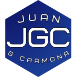
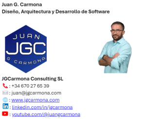

### Propósitos generales para este nuevo ciclo

Hace unos años, en agosto de 2020, escribí sobre la importancia de trabajar nuestra **[marca personal](https://jgcarmona.com/personal-branding/)**. En aquel entonces, acababa de finalizar un curso sobre el tema y estaba inmerso en mi startup. Dos años y una pandemia global después, retomé la divulgación y lancé [**mi canal de YouTube**](https://www.youtube.com/@juangcarmona).

Aquel primer vídeo fue el comienzo de una nueva etapa. En el vídeo me presentaba con mi hija recién nacida en brazos, un momento muy especial que marcaba el inicio de este proyecto de compartir mi conocimiento técnico con el mundo. Hoy, casi tres años después y justo después de dejar a mi hija en su primer día de colegio, reflexiono sobre ese primer paso y todo lo que ha sucedido desde entonces.

Este verano ha sido también un punto de inflexión. En mayo de 2024 se acabó mi colaboración con Porsche y este verano he tenido la oportunidad de dedicarle mucho más tiempo a mi familia y disfrutar de momentos valiosos con mis hijos. Sin embargo, mientras miraba hacia el futuro, sabía que el siguiente paso era continuar consolidando mi presencia en línea y seguir aportando valor a la comunidad de programadores y arquitectos de software. Por eso, aunque he disfrutado de estos meses, también he estado preparando contenido para la audiencia, la actual y la que espero está por venir.

### Pasado, Presente y Futuro de mi canal de **YouTube**

En 2022, mencionaba cómo había lanzado mi canal de **YouTube** con un enfoque claro: compartir contenido técnico de valor y mantenerme fiel a mi misión de educar y divulgar. Tras más de **100 vídeos** publicados, sin regularidad, sin formatos adecuados, sin preparación en muchos casos, los resultados hablan por sí solos.

Aquí están algunos de los números actuales:

- **3.053 visualizaciones** en los últimos 28 días

- **248,9 horas de visualización**

- **2.401 suscriptores**

  
A lo largo del tiempo, no he podido ser tan constante como me hubiera gustado debido a la carga de trabajo, pero a pesar de todo, el canal cuenta con **82.763 visualizaciones** y más de **6.328 horas de visualización acumuladas**. Este crecimiento ha sido una confirmación de que el esfuerzo y la dedicación han valido la pena.  
  
**El futuro del canal** requiere un enfoque más definido y ya estoy trabajando en ello. Esto implica mejorar la **consistencia visual**, elevando la **calidad del contenido** en cada vídeo y estableciendo una **frecuencia de publicación** regular. Para crecer de forma sostenida, es clave no solo publicar contenido valioso, sino hacerlo de manera constante. La audiencia aprecia la regularidad y el compromiso con un formato bien estructurado, lo que también mejora el rendimiento del canal en el algoritmo de YouTube. Además, es importante prestar atención a detalles como las miniaturas, los títulos atractivos y las descripciones claras que ayuden a aumentar el engagement y la visibilidad de los vídeos. La planificación y preparación de los contenidos también es fundamental para ofrecer un valor real y práctico a la audiencia, asegurando que cada vídeo sea una oportunidad de aprendizaje útil para programadores y arquitectos de software.  
  
Solamente puedo deciros que estoy trabajando en ello y que va a empezar a notarse en los próximos vídeos que publique como parte del curso de Inteligencia Artificial con Azure.

### **Contenido de Calidad en Español**

A medida que avanza el tiempo, mi enfoque sigue siendo claro: **crear contenido técnico de calidad** que aporte valor a la comunidad, especialmente para **programadores y arquitectos de software** que quieran mejorar sus habilidades en temas como **Azure, .NET, Python, Inteligencia Artificial (IA), Domain Driven Design (DDD), CQRS, SOLID**, y mucho más.

Mi canal de YouTube y mi blog seguirán siendo los principales canales para compartir este conocimiento, siempre con la intención de que cualquier persona, independientemente de su nivel técnico, pueda aprender y mejorar sus habilidades.

Estoy preparando una serie de publicaciones, todas en español, que cubrirán desde los aspectos más avanzados de la **arquitectura de software**, hasta los principios básicos del diseño y la asignación de responsabilidades. **Azure**, **.NET**, **Python**, **patrones de diseño** y **responsabilidad**, **subsistemas** y muchos otros temas estarán en el centro de este contenido.

Con más de **100 vídeos** y una comunidad de **2.400 suscriptores**, me siento motivado para seguir creciendo y compartiendo contenido de calidad. Este año se presenta como una oportunidad para consolidar todo el trabajo realizado, renovar mi compromiso con la divulgación técnica y continuar aportando a la comunidad.

### **Renovación de Imagen**

También he decidido actualizar mi **marca personal**, homogeneizando mi presencia en las diferentes redes, creando un nuevo **logo** y una **firma de correo** más profesional. Estos elementos no son meros detalles, sino representaciones visuales de lo que ofrezco: **diseño, arquitectura y desarrollo de software**. No es solamente para mi audiencia, que también, es para mis clientes, porque no sólo se puede vivir del boca a boca.

- **Nuevo Logo**: Un diseño más moderno y profesional que refleja mis valores y mi enfoque en el desarrollo de software y la arquitectura en la nube.

- **Firma de Correo**: Ahora, cada correo que envío tiene una imagen unificada con mi nueva marca personal, incluyendo mi foto y el logo, lo que refuerza mi identidad visual en cada comunicación.

Al final del día, me mantengo fiel a lo que mencioné en aquel primer artículo tras la creación del canal: **[el primer paso siempre es el más difícil](https://jgcarmona.com/el-primer-paso-siempre-es-el-mas-dificil/)**, pero una vez que lo das, todo comienza a fluir. Estoy emocionado por lo que viene y por todo lo que compartiré en los próximos meses. ¡Nos vemos en el próximo post!
