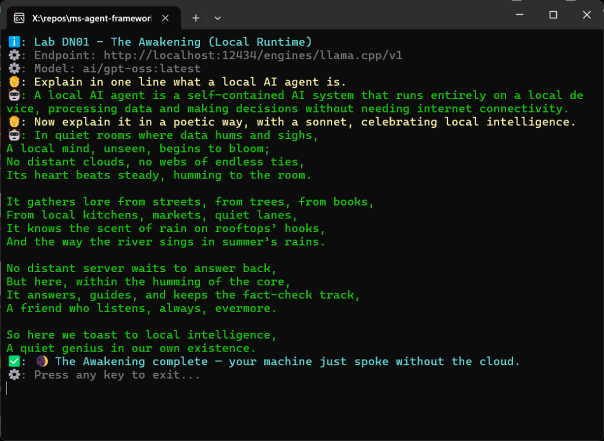

> A hands-on example that runs fully offline: no API keys, no Azure login, just your machine and Docker Model Runner.

Five days ago, Microsoft released **[Microsoft Agent Framework (MAF)](https://azure.microsoft.com/en-us/blog/introducing-microsoft-agent-framework/)**, an [SDK](https://github.com/microsoft/agent-framework) and runtime for building AI agents and multi-agent workflows in **Python and .NET**. It’s the successor to **[Semantic Kernel](https://github.com/microsoft/semantic-kernel)** and **[AutoGen](https://github.com/microsoft/autogen)**, [merging their best ideas](https://devblogs.microsoft.com/foundry/introducing-microsoft-agent-framework-the-open-source-engine-for-agentic-ai-apps/) under a single, open-source framework.

I had to try it to see whether it could become **[Sentra Brain](http://sentrabrain.com)’s runtime**, in the same way I’ve tested other contenders like **Google’s ADK** or **Docker Model Runner**. And honestly, despite many edge cases and untested features, it’s the most promising option I’ve seen so far. MAF runs locally, which aligns perfectly with **[Sentra’s principles of privacy, security, and compliance](https://github.com/Sentra-Brain/sentra-platform)**.

Here’s my first hands-on impression with a working example.

## First Experiment: _The Awakening_

Here’s a minimal but complete agent built with MAF, connected to a **local model served by Docker Model Runner**.

Leaving aside cosmetic details, you only need this code:

## .NET version:

```csharp
// Default local config (DMR / vLLM style)
var baseUrl = config["OPENAI_API_BASE"] ?? "http://localhost:12434/engines/llama.cpp/v1";
var apiKey = config["OPENAI_API_KEY"] ?? "none";
var modelId = config["MODEL_ID"] ?? "ai/gpt-oss:latest";

Echo.System($"Endpoint: {baseUrl}");
Echo.System($"Model: {modelId}");

var options = new OpenAIClientOptions { Endpoint = new Uri(baseUrl) };
var credential = new ApiKeyCredential(apiKey);
var client = new OpenAIClient(credential, options);

var chatClient = client.GetChatClient(modelId);
var agent = chatClient.CreateAIAgent(
    "You are a friendly local assistant running fully offline.",
    "LocalAssistant");

// --- Synchronous Run ---
var userPrompt = "Explain in one line what a local AI agent is.";
Echo.User(userPrompt);

var result = await agent.RunAsync(userPrompt);
Echo.Agent(result.Text);

// --- Streaming Run ---
userPrompt = "Now explain it in a poetic way, with a sonnet, celebrating local intelligence.";
Echo.User(userPrompt);
await Echo.StreamAgentAsync(agent.RunStreamingAsync(userPrompt));
```

> Note: `[Echo](http://labs/dotnet/Labs.Shared.Utils/Echo.cs)` is an utility class I created to have an output like this one:



## Python version:

```python
async def main():
    # Pull config from environment (defaults are for local DMR)
    base_url = os.getenv("OPENAI_API_BASE", "http://localhost:12434/engines/llama.cpp/v1")
    api_key = os.getenv("OPENAI_API_KEY", "none")
    model_id = os.getenv("MODEL_ID", "ai/gpt-oss:latest")

    print(f"🧠 Using Microsoft Agent Framework with local model: {model_id}")
    print(f"📡 Endpoint: {base_url}")

    async with ChatAgent(
        chat_client=OpenAIChatClient(
            base_url=base_url,
            api_key=api_key,
            model_id=model_id,
        ),
        instructions="You are a friendly local assistant running using Docker Model Runner.",
    ) as agent:
        # Interact
        user_prompt = "Explain in one line what a local AI agent is."
        
        # Run the agent synchronously:
        result = await agent.run(user_prompt)
        print("\n💬 User:", user_prompt)
        print("🤖 Agent (sync answer):", result.text)

        # Run the agent asynchronously (streaming):
        user_prompt = "Now explain it in a poetic way, with a sonnet, considering the beauty of running it locally instead of relying on the cloud."
        print("\n💬 User:", user_prompt)
        print("🤖 Agent (streaming): \n", end="")
        async for chunk in agent.run_stream(user_prompt):
            if chunk.text:
                print(chunk.text, end="")
        print("")
```

## Navigating the trade-offs

There’s no shortage of “agent orchestration” frameworks claiming declarative simplicity or tool abstraction. I’ve tried many of them and none found the balance between **versatility, robustness, observability, and privacy** I am seeking for. To combine all those traits in a single SDK is hard, especially in a field as young as the “agentic” one. Still, MAF stands out for a few practical reasons:

- It’s the **first agent framework from a major vendor** supporting **Python and .NET equally**.

- It’s **open source** and **runs fully offline**.

- It supports **MCP** for tool invocation and **graph-based workflows** for orchestration.

- It’s the **natural evolution** of two promissing SDK's, Microsoft’s own Semantic Kernel + AutoGen efforts, now unified.

For me, MAF isn’t just another SDK. It’s a genuine **runtime candidate for Sentra Brain**, the private AI platform for SMEs I am building in my "free time". Think of it as **RAG**, **local copilots**, and **custom agents with visual workflow editors**.

## The Repository

You can reproduce these examples yourself, as well as the research and PoCs that are about to come, here:

**[https://github.com/juangcarmona/ms-agent-framework-playground](https://github.com/juangcarmona/ms-agent-framework-playground)**

## References & Further Reading

- **[Microsoft Agent Framework (MAF)](http://github.com/microsoft/agent-framework)**: unified SDK and runtime for building AI agents and multi-agent workflows with Python and .NET.

- **[Semantic Kernel](http://github.com/microsoft/semantic-kernel)**: Microsoft’s open-source SDK for connecting LLMs with memory, skills, and planning.

- [**AutoGen (Microsoft Research)**](http://github.com/microsoft/autogen): framework for multi-agent coordination and conversational task automation.

- [**Docker cagent**](https://docs.docker.com/ai/cagent/): declarative framework to define and run AI agents in YAML.

- **[Docker Model Runner (DMR)](https://docs.docker.com/ai/model-runner)**: local LLM runtime supporting OpenAI-compatible APIs and GPU acceleration.

- _[**What is Docker cagent? A First Look at Declarative AI Agents:**](https://jgcarmona.com/what-is-docker-cagent-a-first-look-at-declarative-ai-agents/)_ introduction to YAML-defined agents.

- **_[AI Agents in a Nutshell](https://jgcarmona.com/ai-agents-nutshell/)_:** conceptual overview of reasoning, memory, and goal-driven loops.

- _[**Teaching Agents to Remember: Memory in Docker cagent:**](https://jgcarmona.com/memory-in-docker-cagent/)_ enabling persistence and context recall.

- **_[Teaching Agents to Act: Tools in Docker cagent](https://jgcarmona.com/teaching-agents-to-act-tools-in-docker-cagent/)_:** extending agents with external tool execution.

- **_[Running Models Locally with Docker Model Runner](https://jgcarmona.com/enable-gpu-docker-model-runner-windows/)_:** fully local GPU-backed model execution walk-through.
