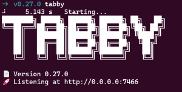
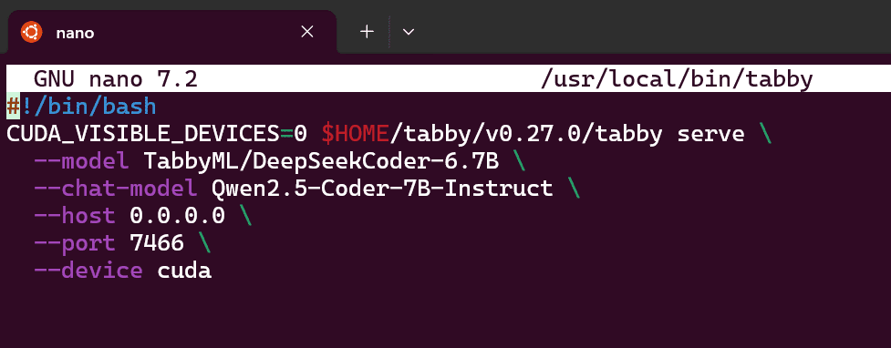
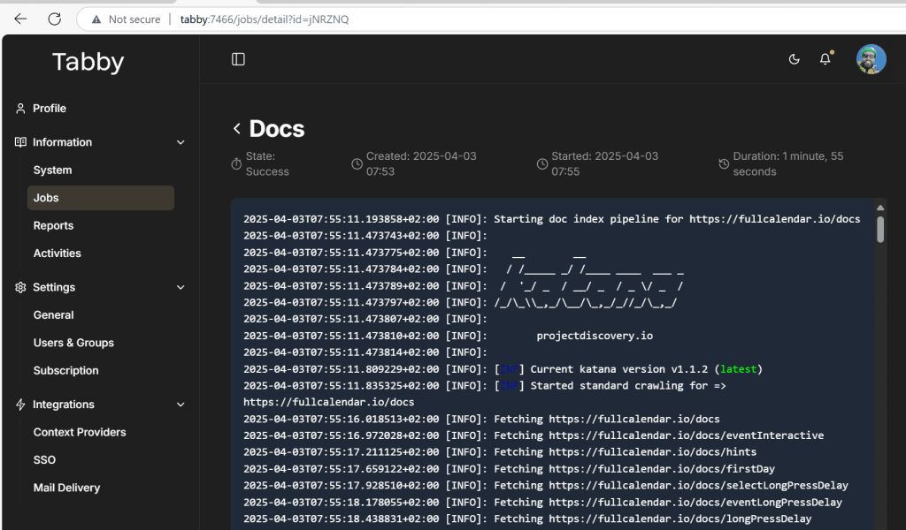

> Want to **run AI LLM locally with GPU** without sending your code to the cloud? Here’s how to run your own private AI coding assistant, powered by open-source LLMs, directly on your machine with GPU using **Tabby ML**.
> 
> This recipe is focused for those working on a Windows + WSL environment, but can be used by anyone using Ubuntu as well.



### Why Run a Local LLM with GPU?

Running an **AI LLM locally with GPU** gives you:

- **Performance**: Instant completions using your own hardware (no latency)

- **Privacy**: No code leaves your machine

- **Flexibility**: Choose your favorite open-source model (Qwen, DeepSeek, etc.)

- **Control**: Zero dependency on cloud APIs or subscriptions

## What You Need

We're setting up a **fully local GPU-powered AI assistant** using:

| Tool | Purpose |
| --- | --- |
| Windows 11 | Host operating system |
| WSL2 + Ubuntu 24.04 | Dev environment inside Windows |
| NVIDIA RTX A6000 | 48GB VRAM for model inference (!!) |
| Tabby ML v0.27.0 | Open-source coding assistant |
| CUDA 12.8 | GPU acceleration backend |
| [DeepSeekCoder 6.7B](https://huggingface.co/deepseek-ai/deepseek-coder-6.7b-instruct) or [Qwen 2.5 Coder 7B](https://huggingface.co/Qwen/Qwen2.5-Coder-7B-Instruct) (or any [other model supported](https://tabby.tabbyml.com/docs/models/) by [Tabby](https://www.tabbyml.com/)) | LLM model |

## Step-by-Step: Running Your Private Tabby Instance locally

First of all, if you don't know Tabby [you should read the docs](https://tabby.tabbyml.com/docs/welcome/). It has more than 30k starts on GitHub. I won't show you here hoy tu use it on your IDE, no, here you'll learn how to run it on your development environment or network.

### 1\. Download Tabby (CUDA Build)

I will use CUDA 12 build, you could also try it with a CPU only build, but that will limit your capabilities for obvious reasons.

```bash
mkdir -p $HOME/tabby/v0.27.0
cd $HOME/tabby/v0.27.0
wget https://github.com/TabbyML/tabby/releases/download/v0.27.0/tabby_x86_64-manylinux_2_28-cuda123.tar.gz
tar -xzvf tabby_x86_64-manylinux_2_28-cuda123.tar.gz --strip-components=1

rm tabby_x86_64-manylinux_2_28-cuda123.tar.gz
```

This gives you a **CUDA-accelerated build** of Tabby and `llama-server`.

### 2\. Create a System-Wide `tabby` Command

Yep, I am a lazy guy, I preffer to spend few more minutes creating a script to automate that finally works for me, and this might also work for you.

```bash
sudo nano /usr/local/bin/tabby
```

```bash
#!/bin/bash
CUDA_VISIBLE_DEVICES=0 $HOME/tabby/v0.27.0/tabby serve \
  --model TabbyML/DeepSeekCoder-6.7B \
  --chat-model Qwen2.5-Coder-7B-Instruct \
  --host 0.0.0.0 \
  --port 7466 \
  --device cuda
```



Then, let's provide execution permisions:

```bash
sudo chmod +x /usr/local/bin/tabby
```

An now you can launch your LLM with a simple:

```
tabby
```

### 3\. Access It from Both Ubuntu and Windows

Edit your Ubuntu and Windows `hosts` file:

```adoc
127.0.0.1 tabby
```

Now you can access your AI at:

```adoc
http://tabby:7466
```

### 4\. Auto-start Tabby at Boot with systemd

> **TBH: I couldn't make this work properly and I finally decided to launch it manually. I will keep this as a non-fully-working recipe. If you make it work, please, let us know in the comments.**

I told you I am a lazy guy... And I don't even want to write tabby. It is my assistant and I want it to be ready at boot time, so, let's create and enable this service:

```bash
sudo nano /etc/systemd/system/tabby.service
```

```yaml
[Unit]
Description=Tabby ML
After=default.target

[Service]
User=juan
ExecStartPre=/bin/sleep 10
ExecStart=/usr/local/bin/tabby
Restart=always
RestartSec=10

[Install]
WantedBy=default.target
```

To enable the service just execute:

```bash
sudo systemctl daemon-reload
sudo systemctl enable --now tabby.service
```

Tabby will now start automatically after reboot — your **local LLM is always on**.

NOTE: after rebooting my system it didn't work, it seems systemd **doesn't start by default** unless explicitly enabled in your distro. To fix this:

```bash
sudo nano /etc/wsl.conf
```

2. Add:

```csharp
[boot]
systemd=true
```

3. Exit and shutdown WSL completely:

```bash
wsl --shutdown
```

4. Launch Ubuntu again:

```bash
wsl
```

Now `systemd` will run automatically, and your `tabby.service` should work on boot.

You can confirm with:

```bash
systemctl status tabby.service
```

## Final Result: Local AI LLM with GPU, Ready for Dev

You now have:

- A **self-hosted AI LLM** running on our **local GPU**

- Full privacy — no code sent to external servers

- Fast completions using **DeepSeekCoder** or **Qwen** (or the model of your choice)

- Seamless access from Ubuntu _and_ Windows

- Full control over the backend and environment

### Why This Matters

As technical leaders, our priorities are clear: **speed, privacy, and control**. Running a **self-hosted AI** with **GPU acceleration** gives our teams exactly that, and **Tabby ML** makes it practical.

There are impressive coding copilots out there, but I simply can't justify sending our clients’ **intellectual property** to third-party servers with unclear data handling practices. Every keystroke matters. **Privacy isn't optional, it's our responsibility.**

With Tabby, there's **no cloud, no lock-in**, just a powerful, private AI that runs **on our own infrastructure**, exactly how it should be.

If you set up Tabby using this approach, I’d love to hear how it’s working for you.  


## ⚠️ \[Update – April 3, 2025\]

### 1\. Katana Required for Context Providers

If you want Tabby to **import and reason over documentation**, you’ll need to install [Katana](https://github.com/projectdiscovery/katana), which is used by Tabby as a crawling backend for context providers.

Install it with:

```bash
curl -L https://github.com/projectdiscovery/katana/releases/download/v1.1.2/katana_1.1.2_linux_amd64.zip -o katana.zip
unzip katana.zip katana
sudo mv katana /usr/bin/
rm katana.zip
```



### 2\. GPU Index Inversion Gotcha

⚠️ **Important**: Your `CUDA_VISIBLE_DEVICES` index may not match the physical GPU labels shown in `nvidia-smi`.

In my case:

- `CUDA_VISIBLE_DEVICES=0` actually mapped to **GPU 1 (RTX A6000)**

- `CUDA_VISIBLE_DEVICES=1` ended up using **GPU 0 (T1000)**

To be safe, test manually with:

```bash
CUDA_VISIBLE_DEVICES=0 python3 -c "import torch; print(torch.cuda.get_device_name(0))"
```

Make sure it's pointing to your fastest GPU before launching Tabby.

Now I can say that I'm starting to squeeze all the power out of Tabby at super speed.
