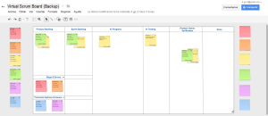

Al anterior artículo, "[Mi resumen de SCRUM](http://juan-garcia-carmona.blogspot.com.es/2012/08/mi-resumen-de-scrum.html)", le ha faltado, y ha sido a propósito, una parte muy importante: la Scrum Board. 

  

La Scrum Board o pizarra Scrum es **uno de los elementos mas importantes en SCRUM** ya que sirve como **punto de unión** entre todos los integrantes del **grupo de trabajo** y el **Product Owner** y es donde el **Scrum Master** va representando diariamente el estado del flujo de trabajo del **Sprint** en curso. Las reuniones diarias deberían hacerse frente a la Scrum Board y, si es posible, el resto de reuniones también. 

  

En su modelo mas **básico** la Scrum Board constaría de **dos columnas**, a la izquierda una columna "To Do" con cosas que hay que hacer y a la derecha una columna "Done" con las cosas que se han hecho. 

  

La evolución lógica es añadir una **columna** intermedia "**In progress**" donde se irían colocando las cosas en curso.

  

Si nos ponemos meticulosos, o como dicen algunos, talibanes del Scrum, la columna "To Do" ha de llamarse "Sprint Backlog" y a la izquierda de ésta columna ha de haber otra columna con el "Product Backlog", columna en la que el Product Owner iría desarrollando sus ideas, casos de uso y demás. 

  

Yo, además, añadiría, y de hecho ya lo he hecho en dos proyectos Scrum en los que he trabajado, una columna entre "In-Progress" y Done. Esta columna estaría reservada para el proceso de testing, es decir, para las pruebas de aceptación. Además de ésta columna, a la derecha y para rizar el rizo en la calidad del producto y, buscando la satisfacción del product owner, podemos poner otra columna reservada para que el product owner verifique las cosas que los miembros del grupo de trabajo dan por acabadas y listas para pasar a "Done". 

  

Resumiendo, y de izquierda a derecha, las columnas de mi pizarra ideal serían: Product Backlog, Sprint Backlog, In-Progress, In-Testing, Product Owner Verification y Done!  
  

Pero las pizarras de Scrum o Scrum Boards no se componen solo de columnas, hasta ahora he hablado de "cosas" cuando debería haber hablado de Historias de Usuario o Casos de Uso, Tareas, características técnicas, Errores, Bugs y problemas o bloqueos.  
  
En la primera columna, el Product Backlog, debería haber tan solo historias y junto a cada historia las tareas en las que se subdivide. Una historia, junto con sus tareas, pasará al Sprint Backlog al comienzo de un Sprint y los miembros del equipo irán acometiendo las distintas tareas de la historia pasándolas de la columna de Sprint Backlog a la columna "In-Progress". Si las tareas son testeables, es decir, pueden pasar algún tipo de prueba de aceptación, pasarán, una vez completadas, a la columna de Testing y de ahí a la de Product Owner Verification para ser verificadas por el jefe de producto. Si pasan ambas verificaciones entonces pasarán a Done. Por lo general ésto no es del todo posible, mi experiencia me dice que las tareas supuestamente acabadas pasan a la columna de testing pero no son testadas hasta que no se han completado todas las tareas de dicha historia ya que van encaminadas a la consecución de una historia de usuario que es la que de por sí define las pruebas de aceptación que utilizarían los testers y a posteriori el jefe de producto para testar y verificar dicha historia antes de pasarla a Done. ¿Suena a jeroglífico?  
  
Volvamos al principio de éste artículo:  
  
1º.- Dos columnas: "To Do" y "Done":  
  

  

  
  
2º.- Tres columnas: "To Do", "In-Progress", "Done":  
  

  

  
3º.- Cinco columnas: "Product Backlog" "Sprint Backlog", "In-Progress", "Verification", "Done":  
(La imagen no es exáctamente lo que digo pero te puedes hacer una idea de a lo que me refiero)  

  

4º.- Seis columnas:  "Product Backlog" "Sprint Backlog", "In-Progress", "Testing", "Verification", "Done":  
(podría ser parecida a ésta)  

  

5º.- La pizarra completa: "Product Backlog", "Sprint Backlog", "In-Progress", "Testing", "Product Owner Verification", "Done" mas una zona para bugs y errores y otra para bloqueos y características técnicas:  
  
Os dejo una imagen de una propia que acabo de hacer con la **herramienta de dibujo de Google Docs**, es un documento público para el que encontraréis un enlace dentro de un rato para que la adaptéis a vuestra situación si os resulta interesante o útil, además tengo que explicar de donde me ha surgido la idea de ésta Scrum Board:  
  

  

Ésta Scrum Board es una evolución de [ésta de aquí](http://www.scrumology.net/2010/06/21/how-to-create-a-virtual-story-wall-in-google-docs/). Gracias a ese tutorial os podéis crear la vuestra personalizada, yo lo he que hecho ha sido añadir las columnas que me han hecho falta (la de testing) y dos apartados bajo las columnas de los backlogs para ubicar ahí bugs, errores, características técnicas y bloqueos. Abrid en una ventana nueva [**Mi Scrum Board Virtual**](https://docs.google.com/drawings/d/1BHHRdaBE3eAL8QrQE3yNpqWZnCBhICrSIfWB4b--1pc/edit) y os la explico encantado.  
  
Hay un **código de colores**:  
  
Rojo: Bug  
Naranja: Error  
Amarillo: Tarea  
Verde: Historia de Usuario  
Morado: Bloqueo  
Azul: Característica Técnica  
  
Con esa pizarra delante os puedo contar **de un simple vistazo** que hay una tarea pendiente en el **Product Backlog**, ésa la cogeríamos el próximo Sprint junto con alguna más que probablemente esté preparando el jefe de producto. Ahora mismo, durante éste Sprint se está trabajando en **una historia de usuario** de tamaño XL (ya trataré en otro artículo cómo se "pesan" las tareas e historias) compuesta de **tres tareas**, una sin empezar, **una In-Progress** que la está haciendo Juan **y otra en Testing.** Además **hay una historia de usuario pendiente de verificación** del jefe de producto, es decir, ya ha pasado las pruebas de aceptación.  
  
Vemos, además, que en la columna del Produc Backlog, abajo, de izquierda a derecha y de arriba abajo, tenemos un bug, en rojo, un error, en naranja, una característica técnica, en azul y un bloqueo en morado. Están ahí a modo de ejemplo pero gracias a las columnas, a conocer el código de colores y a la experiencia podría deciros prácticamente lo mismo mirando la pizarra desde unos cuantos metros de distancia y sólo tendría que acercarme a ella si quisiera ver detalles más específicos.  
  
Algo que se suele utilizar en las Scrum Boards son **avatares**, es decir, pequeñas representaciones de cada miembro del equipo que se ponen encima de la tarea que esta realizando cada uno en cada momento. En éste ejemplo en cada tarjeta, al final, pone: "Asignado a: ALGUIEN", pues eso sería sustituido por un avatar imantado, por ejemplo, o un post-it con formas (yo he sido durante un año una flecha de color verde).  
  
Bueno, creo que por hoy ya he dicho bastante sobre Scrum, me apunto en mi backlog personal algunas cosas sobre las que aún no he hablado como son la cuantificación de historias y tareas mediante el Scrum Poker en el Sprint Planning (si, hay una reunión en la que la gente juega al poker, es cierto) o la gestión de errores, bugs o marcha atrás de historias o tareas por no pasar las pruebas de aceptación o la verificación del jefe de Producto.  
  

Juan García Carmona

[d.jgc.it@gmail.com](mailto:d.jgc.it@gmail.com)
