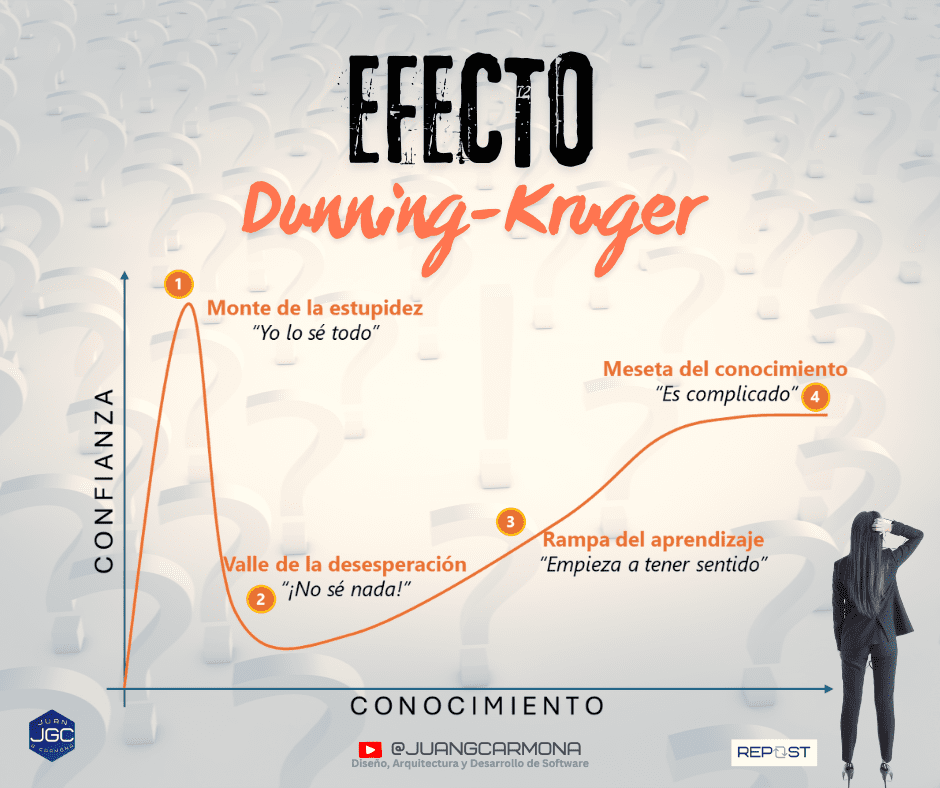
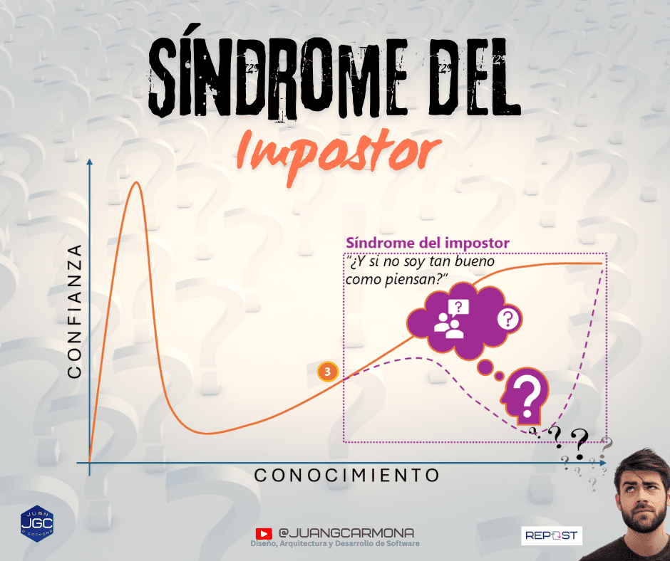

> _Por qué muchos expertos dudan… y muchos novatos no_

Si aún no lo has visto o vivido, lo verás.  
Esto pasa todos los días. A todas horas. En casi todos los contextos.

Hay personas que apenas han empezado a adentrarse en una materia —la que sea— y ya opinan con total seguridad, sentando cátedra como si fueran auténticos maestros. Y otras que, aun con años de experiencia, dudan de lo que dicen o incluso se reprimen a la hora de opinar.

Esta paradoja ocurre más a menudo de lo que pensamos y hoy quiero explicarte por qué ocurre. Ambos extremos tienen explicación. Por un lado tenemos el [**efecto Dunning-Kruger**](https://es.wikipedia.org/wiki/Efecto_Dunning-Kruger). Por otro, el [**Síndrome del Impostor**](https://es.wikipedia.org/wiki/S%C3%ADndrome_del_impostor). Son fenómenos distintos, pero comparten algo en común,ambos son **sesgos cognitivos**. Es decir, distorsionan la realidad. En concreto, distorsionan la percepción que tenemos sobre nuestra propia competencia.

## El exceso de confianza o efecto Dunning-Kruger

El [**efecto Dunning-Kruger**](https://es.wikipedia.org/wiki/Efecto_Dunning-Kruger) es un sesgo por el cual las personas con poco conocimiento o habilidad en una materia tienden a sobreestimarse.  
No lo hacen por maldad ni por arrogancia. Lo hacen —paradójicamente— por ignorancia. No tienen aún suficiente perspectiva para entender la complejidad real del asunto.

Cuando sabes poco, todo parece fácil. Y eso dispara tu confianza.  
Pero a medida que aprendes, empiezas a ver lo difícil. Aparecen los matices, los riesgos, las excepciones… y de repente eres consciente de lo poco que sabías. Entras en el llamado **valle de la desesperación**.

A partir de ahí, con esfuerzo y práctica, vas entendiendo. Todo empieza a tener sentido, y con el tiempo alcanzas niveles más altos de competencia. Pero lo haces con más cautela, con más humildad, con menos certezas absolutas.

Esto lo he visto cientos de veces: en tecnología, en liderazgo, en consultoría.  
Alguien aprende una nueva herramienta y al día siguiente opina como si tuviera años de experiencia. Un perfil junior descubre un framework o una metodología y quiere reestructurar todo el equipo.  
Personas que apenas han explorado un tema… y ya hablan con firmeza.

La clave aquí no es lo que sabemos, sino lo que **ignoramos que no sabemos**.  
Eso es lo más peligroso.

Y sí, me incluyo. La vida me ha enseñado a recordar esto cada vez que empiezo con algo nuevo.  
Tenemos que ser más humildes. Más prudentes. Porque si acabas de empezar, seguro que **no** lo sabes todo sobre el tema.

## La falta de confianza o Síndrome del Impostor

El [**Síndrome del Impostor**](https://es.wikipedia.org/wiki/S%C3%ADndrome_del_impostor) actúa justo al contrario. Afecta a personas **muy competentes**, pero que creen no merecer sus logros.

Dudan de sí mismas. Piensan que han tenido suerte. Que otros están mejor preparados. Que en cualquier momento alguien se dará cuenta de que "no deberían estar ahí".

Es especialmente común en profesionales que están dando un salto:  
Desarrolladores que empiezan a liderar. Técnicos que forman a otros. Investigadores que asumen gestión. Jóvenes altamente preparados al mando de startups o en puestos de responsabilidad.

Cuando eso ocurre, se amplía tu campo de visión. Ves lo que antes no veías.  
Y ese nuevo mapa te sitúa, otra vez, en el valle de la duda. ¡Casi como si volvieras a empezar!

Cuanto más sabes, más difícil es sentirte completamente seguro.  
Porque ahora ves todo lo que falta.

## Dos extremos que alteran la realidad

El efecto Dunning-Kruger y el Síndrome del Impostor son opuestos, pero complementarios. Uno infla artificialmente la autoconfianza. El otro la reduce injustamente. Pero ambos distorsionan el juicio. Y en contextos profesionales, eso puede tener consecuencias.

El resultado es que las personas más preparadas empiezan a dudar, a cuestionarse a sí mismas, mientras que otras, con menos experiencia, opinan sin dudar. A veces, tiene tristes consecuencias, porque se promociona antes al que habla con seguridad, aunque no siempre tenga razón y se silencian voces valiosas porque dudan de sí mismas. Se confunde humildad con debilidad y confianza con competencia.

La seguridad no siempre es un síntoma de saber, a veces es solo un reflejo del desconocimiento.

## Cómo saber si te está afectando

Si tiendes a hablar con seguridad sobre temas que apenas conoces, quizá estás cayendo en el efecto Dunning-Kruger.

Hazte estas preguntas:

- ¿Estoy seguro porque lo domino o porque aún no veo su complejidad?

- ¿He contrastado mi opinión con alguien más experimentado?

- ¿Estoy simplificando algo que tal vez no lo es?

Si, por el contrario, sueles dudar de ti mismo, puede que sufras el síndrome del impostor.

Para averiguarlo, pregúntate:

- ¿Estoy minimizando mis logros por costumbre?

- ¿Mi inseguridad viene de hechos reales o de una narrativa interna?

- ¿Exijo a los demás lo mismo que me exijo a mí mismo?

## ¿Qué puedes hacer para no caer en la trampa?

No necesitas elegir entre callar o aparentar. Puedes practicar una tercera vía: la conciencia. Si tienes poca experiencia, sé prudente. Escucha más. Pregunta antes de opinar.

Hay un gran valor en admitir que todavía no lo sabes todo.

Si tienes experiencia y dudas, no luches por eliminar la duda. Aprende a convivir con ella. Revisa tu trayectoria con hechos, no con sensaciones. Recoge feedback, guarda logros, habla con otros que estén en tu misma situación.

Y si lideras equipos, presta atención a estas dinámicas. No siempre el que habla más alto tiene más razón. A veces, el que calla es el que más puede aportar. Aprovecha el entusiasmo y la energía del que habla y el conocimiento del que calla, y combina sus fortalezas para que superen sus debilidades. El novato adquirirá conciencia de lo mucho que le queda por aprender y el experto confianza en sí mismo. Piensa que tu rol aquí consiste muchas veces en leer entre líneas y no dejar que el ruido silencie a la experiencia.

## Para terminar

Todos queremos avanzar. Todos queremos tomar buenas decisiones. Todos queremos saber que lo que hacemos, lo hacemos bien.

Pero avanzar en nuestra vida profesional no siempre es fácil, de hecho, a menudo, la incomodidad es señal de progreso. Es lo que se conoce como salir de la zona de confort. Ahí es donde sucede el verdadero aprendizaje.

La duda, bien gestionada, es nuestra aliada. Pero ojo, no podemos dejar que la duda se transforme en miedo.

Y la seguridad, sin base, es un riesgo. El exceso de confianza puede salirnos muy caro, en cualquier ámbito.

Como decía mi abuela:

> **"De valientes está el cementerio lleno".**

## ¿Hablar o callar?

Entender estas paradojas puede [ayudarnos a decidir mejor](https://jgcarmona.com/coaching-lideres-tecnicos/). Hablar o callar no es solo una elección comunicativa, es un reflejo de cómo nos vemos por dentro. **La ignorancia grita. La sabiduría duda.** Pero ambas pueden aprender si las sabemos escuchar.

## ¿Te has sentido alguna vez así?

¿Has visto esto en tu equipo o entorno?

Cuéntamelo. Me interesa mucho saber cómo lo has vivido tú.
