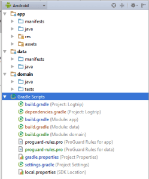
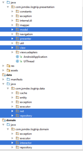

Ya hablé algo sobre este tema hace mucho tiempo pero las cosas han cambiado mucho desde entonces y escribo este artículo puesto que me ha costado mucho encontrar información útil sobre la materia. Parece que a quienes documentan para los desarrolladores Android no les importan mucho las buenas prácticas en cuanto a arquitectura o dan por hecho que los desarrolladores son suficientemente maduros como para solucionarse ellos solos estas cuestiones. La verdad es que ideas no me faltan, ni me faltaban, pero al no encontrar ni una sola referencia a este tema uno acaba metiendo todo en el mismo proyecto Android y acaba cayendo en errores típicos de otra década como son alto acoplamiento, poca reutilización de código y poca cohesión, en definitiva código sucio y difícilmente escalable... Pero por suerte, tras mucho buscar y varias preguntas en Stack Overflow, entre ellas [éste](http://stackoverflow.com/questions/32133565/architectures-for-restful-android-applications), he encontrado con algo que me gusta y sobre lo que quiero basar mi actual desarrollo, Clean Architecture.  
  
Una de las últimas tendencias en cuanto a arquitecturas, no sólo para Android, se conoce como [Clean Architecture](https://www.blogger.com/), no voy a entrar en detalles pues el artículo que la presenta lo hace mucho mejor de lo que yo lo podría hacer, se merece al menos una lectura en diagonal si vas a seguir leyendo mi artículo:

  

Buscando por la red he encontrado una implementación de este patrón que es lo que quiero replicar hoy y es el objetivo de éste artículo. Estoy hablando del artículo de Fernando Cejas - [Architecting Android…The evolution](http://fernandocejas.com/2015/07/18/architecting-android-the-evolution/) Él propone lo siguiente:

)

  

  

Fernando nos dice que la cantidad de círculos, de capas, no importa, que lo verdaderamente importante es que las dependencias vayan en una única dirección, hacia dentro. Si nos fijamos este modelo viene a ser el diseño guiado por domino (Domain Driven Design) pero representado en forma de círculos concéntricos. ¿Qué significa cada cosa? (Me voy a limitar a hacer una traducción casi literal)

- **Entities:** Entidades, objetos de negocio de la aplicación.
    
- **Use Cases:** dirigen el flujo de datos de y hacia las entidades, también se les conoce como Interactors
    
- **Interface Adapters:** son un conjunto de adaptadores que convierten datos entre el formato mas conveniente para los Interactors y las entidades...
    
- **Frameworks and Drivers:** aquí es donde van todos los detalles, la interfaz de usuario, herramientas y ese tipo de cosas...
    

Yo no voy a seguir el ejemplo de Fernando, yo ya tengo una aplicación con una funcionalidad muy básica que quiero migrar hacia éste modelo arquitectónico por capas tal y como estoy acostumbrado a hacerlo en otros entornos partiendo de mi actual proyecto y lo que voy a hacer va a ser crear una librería de Android para el dominio y otra para los datos y ahora os enseño como queda la estructura de mi proyecto.

> Varias horas después...

 Hey! ¡Sigo aquí! Me he peleado con gradle y con temas de dependencias, con los nombres de los paquetes, con Android Studio y con un montón de cosas (de hecho empecé ayer con todo esto y hoy he seguido según he vuelto del trabajo...) Y bueno, ya tengo un proyecto que compila, aún no lo he ejecutado porque sé que el funcionamiento de lo que haya ahora será trivial, absurdo, he quitado mucho de lo que tenía para ceñirme a la estructura del [proyecto de Fernando](https://github.com/android10/Android-CleanArchitecture/releases/tag/v0.7.0) porque viendo su código y su estructura he visto muchas cosas que me gustan y muchas técnicas que quiero utilizar en mi proyecto... Y, lo dicho, por fin tengo un proyecto que compila y con la siguiente estructura:

  

  

Una de las cosas que me han gustado de lo que he visto y copiado del proyecto de Fernando es la Inyección de Dependencias ya que yo vengo de .Net y no había visto nada parecido aplicado a Android como Dagger 2. Lo nombro pero no voy a explicar como se hace ya que podéis verlo en el código del proyecto y podéis leer un manual bastante potente que el mismo Fernando escribió hace no mucho: [Tasting Dagger 2 on Android](http://fernandocejas.com/2015/04/11/tasting-dagger-2-on-android/)

  

De igual forma me ha gustado mucho el uso de RxJava, ya me lo habían recomendado pero hasta ahora no me había atrevido a adentrarme mucho, pero ya que el ejemplo lo traía le he dedicado un buen tiempo a leer sobre él, tanto en sus orígenes como [Rx (Reactive Extensions)](https://rx.codeplex.com/) (puede que lo use para solucionar un requisito con el que estamos de lleno en el curro), hasta varios ejemplos de RxJava como [éste del propio Fernando](http://fernandocejas.com/2015/01/11/rxjava-observable-tranformation-concatmap-vs-flatmap/) y [o este otro muy interesante de Matthias Käppler](https://mttkay.github.io/blog/2013/08/25/functional-reactive-programming-on-android-with-rxjava/), además de la [Wiki de GitHub](https://github.com/ReactiveX/RxJava/wiki) ... Pero quizá lo que más aclare su aplicación y uso sea ésta página sobre el [The RxJava Android Module](https://github.com/ReactiveX/RxJava/wiki/The-RxJava-Android-Module) y éste diagrama que explica como se utiliza, con qué intenciones:

  

  

Al final el resultado es, a grandes rasgos, el módulo de presentación que contiene lo relativo a presentación pura, con un patrón MVP además de varios paquetes de utilidades (constantes, excepciones, la inyección de dependencias, etcétera); un modulo de Datos cuya responsabilidad es la gestión de los datos de la aplicación, esto es, cachés, ficheros locales, llamadas al API Rest, etcétera; y un módulo de Dominio donde se definen las clases del dominio y los casos de uso, los interactors, que son inyectados en la capa de presentación mediante ActivityComponentes y Módulos (ésto está en presentation/internal.di/).  

  

Me ha costado bastante, la verdad, sacar conclusiones de lo que he ido viendo, entender usos de algunas cosas haciendo ingeniería inversa, adaptar su proyecto y la inyección de dependencias en la capa de presentación para tirar de AppCompatActivity y poder seguir usando Material tal y como lo estaba haciendo antes... pero todo o casi todo lo que he visto me ha gustado y definitivamente voy a usar esta estructura para mi proyecto actual. Aún tengo que refactorizar cosas, por ejemplo me gustaría sacar clases genéricas en varias cosas pues en su ejemplo trabaja con users pero yo voy a trabajar con otras entidades y ya he visto mientras estudiaba el código varios puntos donde tendría que generalizar... Quizá dentro de poco vuelva a escribir para contar qué tal me va con ésta aventura en la que ando liado últimamente, espero que todo esto que he escrito, que no dejan de ser divagaciones, le sirva a alguien para mejorar un poco la estructura y la calidad de sus proyectos Android.  
  
A Fernando, si alguna vez me lees, gracias!
