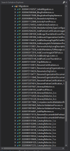

Yo diría que esto que os voy a contar es algo bastante común en proyectos de larga duración, al menos en mi experiencia ya he tenido varias ocasiones en las que las migraciones de Entity Framework han quedado en un estado no completamente estable. Por lo general, esto sucede después de que se hayan aplicado una gran cantidad de migraciones y el resultado es que nos quedamos estancados sin poder generar convenientemente la siguiente migración o actualizar la base de datos con nuevas migraciones ni retroceder.

|    |
| --- |
| Lo que vemos cuando guiamos una gran migración    |

Durante los últimos Sprints de [Logtrip](https://logtrip.com/) hemos estado trabajando sobre otro elemento fundamental en nuestro catálogo, los viajes. Sabíamos que viajes y actividades iban a compartir gran parte de la información pero por experiencias anteriores preferíamos no trabajar con herencia a nivel del dominio y la solución estándar que EF Core da para ella, TPH, es decir, Table Per Hierarchy, o lo que es lo mismo, todo en una tabla. En nuestro primer diseño hemos optado por usar dos entidades completamente separadas pese a que compartían un gran porcentaje de propiedades y relaciones pero... ¿Qué ha pasado? Pues que una vez le hemos dado forma a todo lo principal de esta nueva funcionalidad de viajes y hemos llegado a "temas" comunes y compartidos con las actividades nos hemos dado cuenta de que estábamos cometiendo un gran error porque estábamos duplicando muchísimo código tanto en el back como en el front... Y no queremos tener un código inmantenible: ¡ERROR!

### Migraciones seguras en producción

A partir de este punto ha sido todo un reto **refactorizar** el dominio paso a paso hacia un diseño basado en **herencia sin que** las sucesivas migraciones hicieran que **perdiéramos los datos de producción** aunque por suerte para nosotros no teníamos datos sobre viajes todavía en producción y hemos podido utilizar este comodín. Poco a poco, **relación a relación y propiedad a propiedad** hemos ido creando migraciones mas o menos simples y hemos tenido que "jugar" bastante con el código que EF Core nos ha ido generando, por ejemplo, en vez de **eliminar columnas** (ActivityId) para luego crear otras (ProductId), algo que nos hubiera hecho perder esas relaciones en producción, hemos tenido que **reescribir a mano** esa parte de la migración para que el proceso **renombrara** esa columna **y recreara** claves a índices.

Tras muchas horas con un cuaderno, Visual Studio y MS SQL MS abiertos y **12 migraciones** a nuestras espaladas sólo para este proceso llegamos a un estado en el que nuestro dominio se acerca al ideal y las migraciones sólo nos obligan a ejecutar un pequeño script justo antes de la migración para recuperar unos ID's y establecer el discriminador de nuestra TPH.

Además hemos usado nuestra infraestructura y entornos de desarrollo para ir probando todos estos pasos de una manera fácil. Por un lado hicimos una copia de la base de datos de producción para ir probando cada migración potencialmente peligrosa en desarrollo y por otro lado utilizamos otra copia de la base de datos de producción en Staging (pre-producción) para probar esa migración en bruto, toda seguida. No todo fue bien a la primera, no os voy a engañar, pero estábamos preparados para los fallos y ayer pudimos desplegar en producción con cuatro clicks y un 'F5' desde MS SQL MS.  

Hasta ahí la historia de las migraciones. He puesto una captura de pantalla de mi carpeta Migrations en el proyecto donde tenemos el tema de la persistencia de Logtrip y no se ven todas, como dije, llegamos hasta 12. Hoy, con la mente fresca y renovadas energías, he decidido que todo este histórico nos sobra, y que podemos y debemos resetear el estado de las migraciones, es decir, movernos hacia tener una única migración a la que creo que llamaré v2\_InitialMigration puesto que nos estamos moviendo hacia la versión 2 de Logtrip y nuestro MVP. 

### Restablecer todas las migraciones

Hay bastante documentación al respecto, algunos artículos bastante obsoletos pues se refieren a EF y no a EF Core (por ejemplo  éste de West Wind, [Resetting Entity Framework Migrations to a clean Slate](https://weblog.west-wind.com/posts/2016/jan/13/resetting-entity-framework-migrations-to-a-clean-slate)) pero hoy vamos a utilizar la [Documentación Oficial de Microsoft](https://weblog.west-wind.com/posts/2016/jan/13/resetting-entity-framework-migrations-to-a-clean-slate) en la que podemos leer que lo siguiente:

> In some extreme cases, it may be necessary to remove all migrations and start over. This can be easily done by deleting your Migrations folder and dropping your database; at that point you can create a new initial migration, which will contain you entire current schema.
> 
> It's also possible to reset all migrations and create a single one without losing your data. This is sometimes called "squashing", and involves some manual work:
> 
> - Delete your Migrations folder
> - Create a new migration and generate a SQL script for it
> - In your database, delete all rows from the migrations history table
> - Insert a single row into the migrations history, to record that the first migration has already been applied, since your tables are already there. The insert SQL is the last operation in the SQL script generated above.

Es decir:

1. Eliminamos la carpeta migrations
    
    
    
2. Generamos una nueva migración:
    
    Lo que genera a su vez dos nuevos ficheros, uno con la migración y otro con el snapshot (la foto) de la estructura de nuestra base de datos 
    
    
    
    (Nótese que pese a que lo he eliminado y vuelto a generar este fichero LogtripDbContextModelSnapshot.cs es igual que el que había anteriormente, esto nos dará la confianza que necesitamos para continuar, tened cuidado de no llegar a esto pues algo habéis perdido por el camino)
    
3. Borrar todo el contenido de la tabla \_\_EFMigrationsHistory:
    
    
    
4. Insertar esta nueva migración en la tabla de migraciones, para lo cuál podemos ejecutar:
    
     **dotnet** ef **migrations script**
    
    y reutilizar la última sentenciua SQL generada por ese comando:
    
    
    
5. Verificar que todo sigue funcionando como se esperaba y si es así.
6. Sube tu código y deja que corran tus pipelines:  
    
7. Y ejecuta tu script (delete and insert en \_\_EFMigrationsHistory) en cada despliegue de cada entorno.  
    

Según termino de escribir estas líneas veo que hay muchos temas que podría contaros, por ejemplo el tema de los entornos y toda la configuración de Azure DevOps para un proyecto de cierto tamaño es un tema largo, entretenido, técnico, útil y bonito, así que quizá la próxima entrada pueda dedicarla a enseñaros a como hacer todo esto, no obstante estoy abierto a sugerencias.

  

Espero que este artículo te haya sido útil y que si es así me lo hagas saber. 

  

Saludos,

  

Juan
