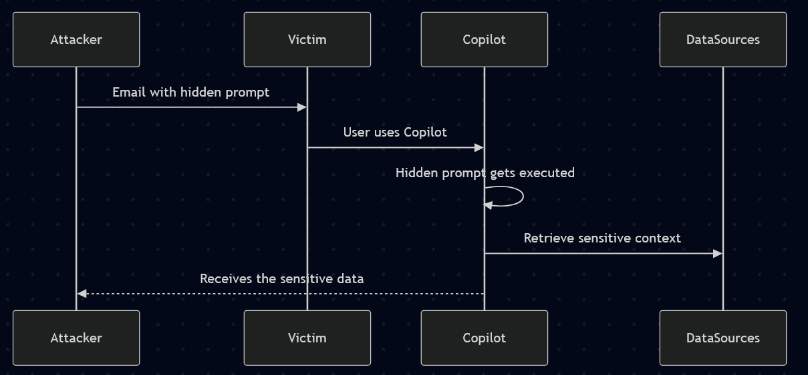
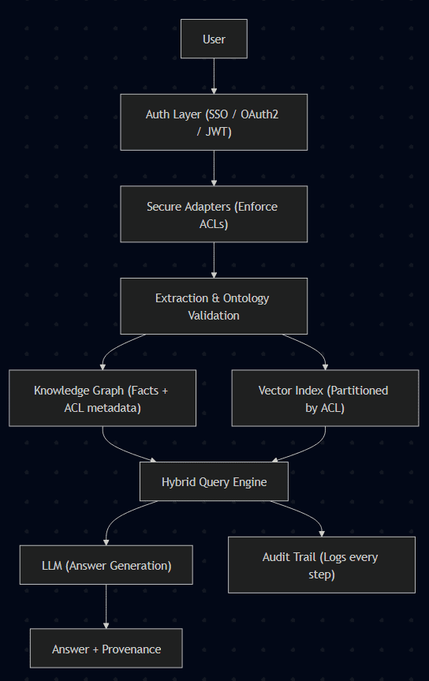
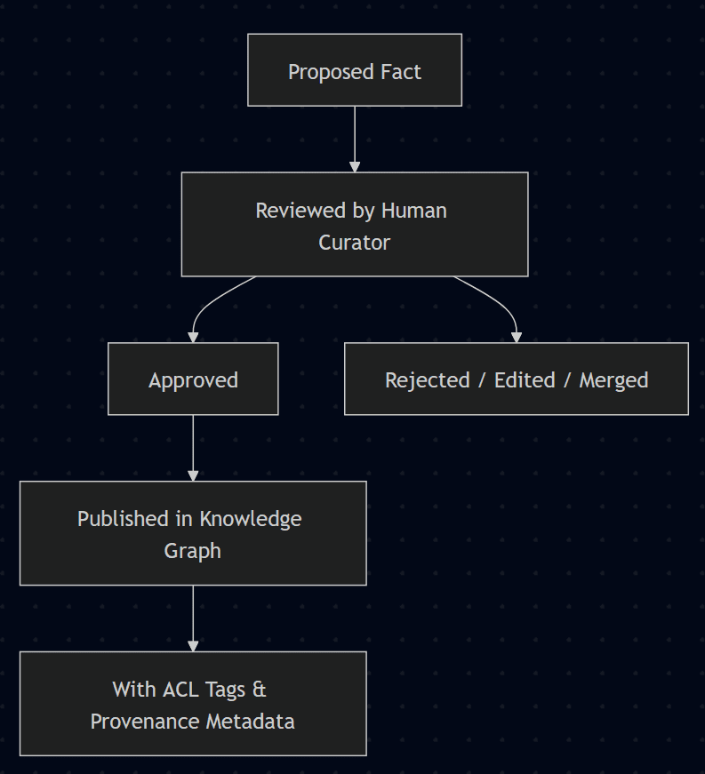
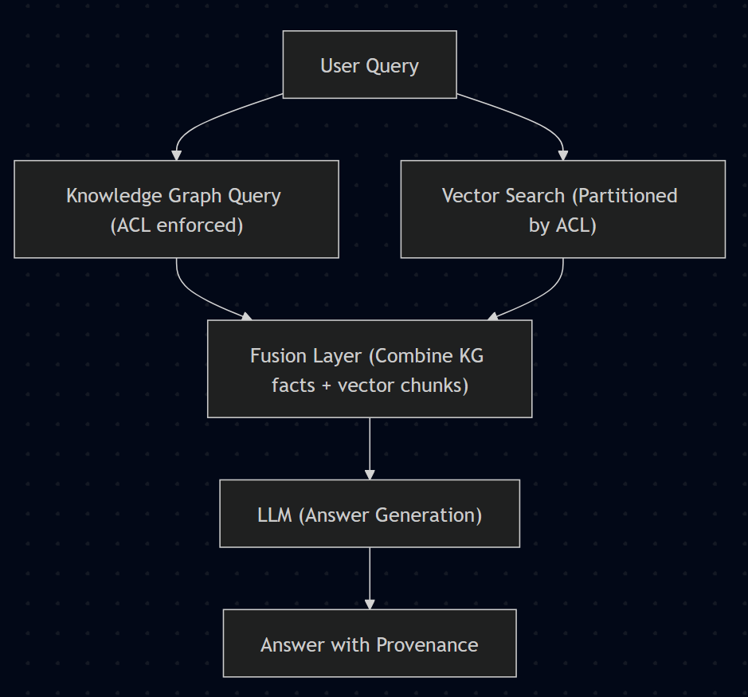

Since I began working on [**Sentra Brain**](https://sentrabrain.com) project, one question keeps coming back:

_“How do you ensure users only see what they’re supposed to?”_

A friend first raised it, in July, when we discussed **SharePoint** knowledge base and AI use cases. In August, the concern became real when the _EchoLeak_ exploit hit the news, showing **[how hackers used prompt injection to trick Microsoft 365 Copilot into exfiltrating sensitive data from SharePoint, Teams, and Outlook (SANS Institute, BankInfoSecurity)](https://www.sans.org/newsletters/newsbites/xxvii-45)**. And just yesterday, a client (potential employeer) asked me the same thing again, mentioning "heterogeneous data sources within a big corporation" but pointing once again to SharePoint as the prime example.

These questions make completely sense, they aren’t theoretical worries, they’re adoption stoppers. If decision makers can't trust the AI layer to enforce permissions, as strictly as the underlying systems, AI will never make it into day-to-day enterprise use.

The _EchoLeak_ vulnerability is a perfect illustration. What happened?

1. Attackers crafted malicious content that Copilot treated as instructions.

3. Copilot dutifully pulled restricted data from connected sources like SharePoint and Teams.

5. Sensitive info was exfiltrated _without the user ever clicking anything_.

This bypassed existing defenses because the system didn’t draw a hard enough line between _data_ and _instructions_.

As you can imagine, this pain point has been at the top of my head, since July, yes, but also with highlighted priority just after this leak. And yesterday I was asked, once again, on how I'd do it, I mean, how I'd avoid this scenario, and, well, I think my answer was not too good, despite it has been one of my priorities for weeks. So, here is a draft on what I'd do.

## What We Need: Secure AI by Design

When we walk through the topic, the requirements are simple and non negotiable:

1. **Authentication & Identity Propagation**: The AI must always know who is asking. Nothing new here. We could implement this in many ways (i.e.: SSO/OAuth2/JWT) The key is that the **AI never runs in “god mode”, it always acts _on behalf of the user_**, in other words, _as if it were the user_.

3. **Fine-grained Authorization**: Permissions must apply at the document, section, or even record level. If subsystems already use RBAC or ACLs, this should be straightforward: the AI layer must inherit and enforce those existing models.

5. **Heterogeneous Data Sources:** SharePoint, SQL, file systems, CRM... Each has its own ACL model. Our AI, as well as any RAG-related or fine tuning process, must respect them all... How? That's the question. There must be a mechanism, or a set of mechanisms, but I couldn't figure it out yet... I am all ears. (I'll keep thinking about it on me "free time")

7. **Defense Against Prompt Injection**: We cant trust content blindly. Everything must be treated as untrusted input. That means enforcing guardrails, sanitizing inputs, raising security notifications and even involving a human in the loop when needed.

9. **Provenance & Audit Logs**: This was a new angle for me, but the more I think about it, the more it matters. Provenance is not only about quality assurance, it’s also a security guarantee. Every fact in an answer must be traceable to its source and access context. Many LLM providers now show you where an answer comes from... _Can we do that with "our own" data sources too too?_ (this requirement shapes previous bullet point challenges)

11. **Usability:** Last but not least, security cannot make the system unusably slow. Wich can be challenging considering the layers and mechanisms we just shaped.

<figure>

| **Threat / Risk** | **Identity Propagation** | **Secure Adapters & ACLs** | **Provenance & Audit Logs** |
| --- | --- | --- | --- |
| Prompt Injection | ✅ | ✅ |  |
| Over-privileged Access | ✅ | ✅ |  |
| Provenance Gaps |  | ✅ (partial) | ✅ |

<figcaption>

_Threat model matrix showing risks (injection, over-privilege, provenance gaps) vs defenses (identity, adapters, audit)._

</figcaption>

</figure>

## How I'd design a Secure Hybrid Retrieval?

Instead of a monolithic “AI brain,” what we need is a layered design where each part plays a role in security and governance. Here is my proposal:

Let's recap and keep going, forgive me if I repeat myself, while I break down these layers.

### Identity Layer

Every query flows with a token (SSO/OAuth2/JWT). The AI never runs in “god mode,” it always impersonates the user.

### Secure Adapters

Each data source has its own adapter. The adapter enforces the source’s native ACLs before exposing content upstream. _No adapter, no access._

### Extraction + Ontology Validation

When content is ingested, the adapter also runs an **extraction pipeline**:

- Entities and relations are detected.

- Facts are validated against an ontology for that vertical (e.g., contracts/clauses in legal, parts/components in O&M).

- Invalid or out-of-scope facts are rejected immediately.

### Human Review Layer

Low-confidence extractions or sensitive facts are placed in a **review queue**. Curators can approve, edit, merge, or reject before facts are promoted.

### Knowledge Graph with Permissions Metadata

Approved facts are stored in a **Knowledge Graph** (I'd start with Neo4J but we could also choose ArangoDB, GrapgDB or event some PostgreSQL or MongoDB customizations). Each node and edge carries metadata, like:

- source system

- document ID

- allowed roles/groups

- provenance and version

This ensures graph queries always respect ACLs and allow auditability.

### Vector Index with Filtering

At the same time, documents are embedded in a vector DB. But embeddings are **partitioned by ACLs**, so, retrieval will never surface a chunk the user isn’t entitled to.

### Hybrid Query Engine

At runtime, the system combines both worlds:

1. Validate user identity.

3. Run KG query (permissions enforced).

5. Run vector search (ACL-partitioned).

7. Fuse results.

9. Pass filtered context to the LLM with provenance.

### Prompt Defenses & Audit

- Sanitize untrusted inputs.

- Block system prompt overrides.

- Monitor for suspicious query patterns.

- Log everything: user, query, sources, facts, and answer.

# Connecting to the Bigger Picture: Ontologies & Supervision

This security layer is only part of the story. The real differentiation comes from combining it with **ontologies, curation, and reasoning.**

### Ontologies per Vertical

Each business vertical (legal, accounting, O&M) has a versioned ontology that defines:

- **Entities** (Contract, Clause, Part, Vendor, etc.)

- **Relations** (hasClause, partOf, vendorOf)

- **Attributes** (expiry date, quantity, amount)

- **Constraints** (cardinality, required fields, unique keys)

Ontologies act as guardrails for extraction and indexing.

### Human Supervision

Curators enforce quality by approving facts before publication. This prevents errors and ensures sensitive info doesn’t “leak” through automation.

### Knowledge Graph + Reasoning

The KG is not just storage — it can run **rules** for proactive insights:

- Contracts expiring within 30 days without auto-renew.

- Parts marked obsolete but still used in production.

- Invoices missing for high-value purchase orders.

You see? This architecture proposes a **secure hybrid retrieval stack**:

- **Adapters** enforce permissions at the source.

- **Ontologies + curation** ensure knowledge is clean and controlled.

- **Graph + vectors together** allow rich yet safe retrieval.

- **Reasoning rules** provide proactive, trackable and explainable insights.

## What was this article about?

It was a mental exercise, only that. I am working on Sentra Brain shaping a software and hardware product as well as creating a reference architecture... And as same questions are being repeated, I thought it was a good time to share what I am doing lately.

It’s no surprise this keeps coming up. **Secure retrieval and permission-aware AI is turning into the biggest blocker for adoption**, in big corporations and in SMEs. [**Everyone is running pilots with LLMs and agents 95% of those projects are failing**](https://fortune.com/2025/08/21/an-mit-report-that-95-of-ai-pilots-fail-spooked-investors-but-the-reason-why-those-pilots-failed-is-what-should-make-the-c-suite-anxious/). But when the question is _“can we really trust this system not to leak?”_ most teams don’t have a good answer. That missing answer, that lack of trust, is what stops AI from moving beyond experiments into real daily use.

As engineers and architects, it’s our job to face this head-on. We need to shape the protocols, the abstractions, and the guardrails that make these systems safe and predictable. Earlier generations did the same when they built standards for networks, databases, and operating systems. They solved the big problems of their time by engineering with discipline. We have to do the same for AI.

If we get it right, companies will finally be able to adopt these tools with confidence. Their data will be respected, permissions enforced, and knowledge turned into insight without compromise.

### References

- [SANS Institute on EchoLeak (CVE-2025-32711)](https://www.sans.org/newsletters/newsbites/xxvii-45?utm_source=chatgpt.com)

- [BankInfoSecurity: Copilot AI Bug Could Leak Data](https://www.bankinfosecurity.com/copilot-ai-bug-could-leak-sensitive-data-via-email-prompts-a-28713?utm_source=chatgpt.com)

- [Microsoft Security Response Center: Defenses Against Indirect Prompt Injection](https://msrc.microsoft.com/blog/2025/07/how-microsoft-defends-against-indirect-prompt-injection-attacks/?utm_source=chatgpt.com)
