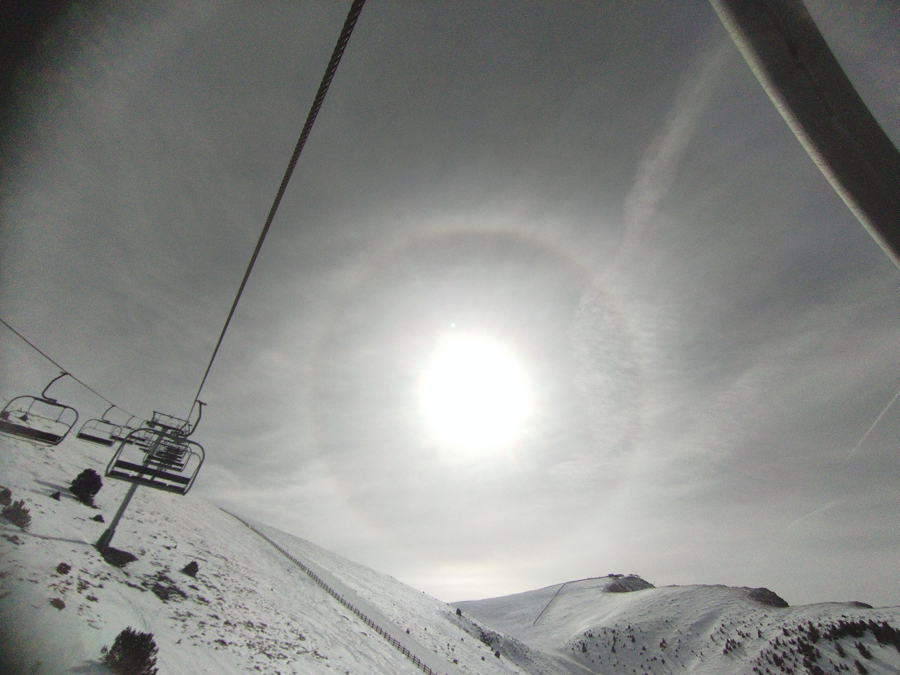

## **¿Es posible construir una carrera tecnológica sólida sin sacrificar tu vida personal? Sí. La clave está en mantener equilibrio y disciplina para rendir en entornos exigentes durante muchos años.**

Hace poco, el Gobierno [propuso reducir la jornada laboral a 37,5 horas semanales](https://prensa.mites.gob.es/webPrensa/listado-noticia/noticia/4439).  
Se armó un buen revuelo. Unos lo aplaudían como conquista social. Otros lo veían como un ataque a la competitividad.  
A mí, más que discutir, me hizo pensar. Pensé en todas esas personas, emprendedores, técnicos, líderes de equipo, fundadores de startups, que no trabajan más horas porque quieren, sino porque **sienten que el proyecto depende de ellos**. Personas que no tienen tiempo para parar, porque sienten que si lo hacen, lo pagarán caro. Personas que no necesitan que les regulen la jornada… necesitan **recuperar el sentido**. Necesitan recuperar el control de sus vidas.

Y me di cuenta de que, en ese debate, **nadie hablaba de ellos**.

### No hay balas de plata

Yo tampoco tengo la fórmula. Pero sí tengo una vida en la que las piezas encajan. No escribo esto desde la cima de nada. No lo hago como ejemplo, ni como gurú. Lo escribo porque **yo también me hice esa pregunta muchas veces**:

¿Se puede construir una carrera tecnológica ambiciosa y ganar reputación sin renunciar a vivir?

Y con el tiempo, y mucho ensayo y error, encontré mi respuesta:

> **No se trata de elegir entre trabajo y vida, se trata de dejar de verlos como enemigos.**

Soy **padre de familia**, y eso marca mis prioridades.  
También soy **alpinista, esquiador de montaña, escalador, runner, pianista y scout de corazón**.

Y sí, también soy **arquitecto de software, desarrollador full-stack y mentor de equipos técnicos**.

No separo todo eso en compartimentos. **No creo en el “balance” como meta, sino en la integración como camino.** Intento llevar una vida coherente, donde no tengo que dejar de ser una cosa para poder ser otra.

### Entrenar cuerpo y mente también es parte del trabajo

Practico yoga casi todos los días. Corro, escalo, esquío o simplemente salgo a respirar al monte cada vez que puedo. No es postureo, es porque me conozco y sé que **sin energía no consigo enfocarme**, y sin foco no se pueden tomar buenas decisiones. Ni en la vida ni en la tecnología.

He aprendido más sobre liderazgo guiando a compañeros en un paso delicado de alta montaña, que en muchos cursos de los que cualquiera puede hacer online, y no son baratos. La montaña me ha enseñado a **leer el terreno, a respetar el riesgo y avanzar con cabeza, a no dejarme vencer por el miedo, a saber cuando apretar más y, también, a saber cuándo parar y cuando retirarme**. Lo mismo que aplico cada vez que acompaño a un equipo a escalar su siguiente reto.

### Más de 20 años en proyectos críticos

He trabajado con startups, scaleups y grandes empresas. He visto ideas convertirse en productos, productos venirse abajo, y equipos volver a levantarse. No me interesa impresionar con tecnicismos.

> **Me interesa resolver con claridad, honestidad y visión a largo plazo.**

Después de más de 20 años sigo convencido de lo mismo: el equilibrio entre familia, deporte y trabajo no es una concesión, es lo que me ha permitido rendir en proyectos críticos y acompañar a equipos en momentos decisivos. Esa integración es lo que quiero seguir aportando en cada reto.
