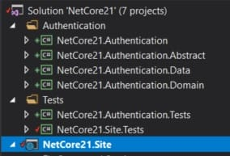

Siguiendo con el ejemplo que me ha traído hasta aquí ([1](https://juan-garcia-carmona.blogspot.com/2018/06/asp-net-core-21-angular-6.html), [2](https://juan-garcia-carmona.blogspot.com/2018/06/asp-net-core-21-angular-6-autenticacion.html) y [3](https://juan-garcia-carmona.blogspot.com/2018/06/docker-practico-sonarqube.html)) el objetivo de este artículo es ver como podemos organizar, dividiéndolo en librerías y organizando la solución por carpetas, un servicio que pretende aplicar DDD. Digo pretende porque en nuestro caso el dominio es quizá demasiado simple pues solo hablamos de usuarios y prácticamente no hemos añadido nada a Identity pero lo vamos a estructurar así porque el objetivo de este proyecto es crecer y aplicar una arquitectura basada en microservicios. ¿Qué va a tener ésta futura arquitectura? En cuanto a servicios, a grandes rasgos el objetivo es tener:

  

1. **NetCore21.Site** será nuestro "servicio de entrada", es decir, la interfaz de la arquitectura hacia el mundo exterior, tanto porque ahí alojemos nuestra web como porque también exponemos un API autenticado que podrá ser utilizado por, potencialmente, cualquier tipo de cliente como podrían ser aplicaciones de escritorio o móviles nativas.
2. **NetCore21.Authentication.Service**, aquí tendremos, en un servicio aislado, todo lo referente a la autenticación
3. **NetCore21.Whatever.Service**,  que como bien dice el nombre será cualquier cosa, cualquier unidad de negocio, funcional y con entidad propia. tal que, como hace NetCore21.Authentication.Service tenga razón de ser por si mismo, con pocos o ningún punto de contacto con el dominio global de la solución. Este tipo de microservicios pueden ser desarrollados y mantenidos por pequeños grupos de desarrollo además de poder ser desplegados y escalados de forma independiente, sin duda las principales ventajas de los microservicios.

**Respecto a los microservicios**, sobre microservicios se ha escrito y se escribe mucho, hay muchas lecturas recomendadas y varios repositorios muy inspiradores. Mi experiencia me dice que, respecto a los microservicios, el principal reto es dividir el dominio global en pequeños contextos aislados minimizando todo lo posible las interrelaciones entre ellos. Para diseñar una arquitectura de microservicios se hace necesario conocer conceptos como API Gateway, DDD, EventSourcing y CQRS, entre otros muchos. Además requiere que se conozca muy bien el negocio para poder realizar la subdivisión en unidades de negocio o unidades funcionales, las cuales, a su vez, son las principales candidatas en convertirse en uno o varios microservicios.  Este artículo no pretende convertirse en una introducción a los microservicios (lo apuinto en mi TODO list), el objetivo es reestructurar la actual solución y cubrir con tests unitarios el código que ya tenemos y estamos moviendo, aplicando principios SOLID por el camino, ya de paso.

  

**¿Por dónde empezamos?** Pues creo que tiene lógica extraer todo lo referente a autenticación a librerías separadas, vamos a añadir una carpeta de solución, Authentication y a ver qué podemos extraer del actual monolito. (un rato después...)

  

Hemos extraído cuatro proyectos para la autenticación y ahora tenemos dos proyectos de tests, el inicial del site y otro para la parte de autenticación:

  

- Authentication

- NetCore21.Authentication
- NetCore21.Authentication.Abstract
- NetCore21.Authentication.Data
- NetCore21.Authentication.Domain

- Tests

- NetCore21.Authentication.Tests
- NetCore21.Site.Tests

Y tras adaptar ligeramente nuestro scritp de SonarScanner (ver el "[Docker práctico: SonarQube](https://juan-garcia-carmona.blogspot.com/2018/06/docker-practico-sonarqube.html)") y escribir varios tests para JwtFactory y TokenGenerator, hemos obetnido una cobertura cercana al 100% en ambas clases:

  

  

  

  

Y un par de horas después, con calma, Hemos cubierto con tests unitarios Tanto AccountController como los validadores de los view models que usamos en nuestros controladores... Y tras lanzar el script de SonarScanner los resultados son éstos, la cobertura ha aumentado hastya un 34% (he quitado TypeScript del análisis por ahora, ya haré un artículo sobre tests unitarios con Angular, otra tarea a mi TODO list), y hemos conseguido probar el 100% de AccountsController aumentando con ello la cobertura general del proyecto Site:

  

  

  

Respecto al aspecto que tiene el código de tests voy a dejar algún ejemplo pero no todo, ,por ejemplo, AccountsControllerTests utiliza tres mocks, uno por cada dependencia que el controlador tiene, el UserManager, el mapper de AutoMapper, y el DbContext, y en él se prueban:

1. Los parámetros del constructor (hay gente que discrepa de estos tests pero no podemos dar por hecho que esta clase siempre va a ser usada dentro de esta aplicación con nuestro querido mecanismo nativo de inyección de dependencias)
2. Que ante un ModelState inválido se devuelve un BadRequest
3. Que cuando CreateAsync falla se devuelve un BadRequest (dudo de si es la mejor opción)
4. Que, por último, cuando todo está correcto, se salva el nuevo usuario y se devuelve un Ok (200)

Es decir, **tenemos una lista de requisitos de bajo nivel** con el comportamiento de ese componente, con las cosas que hace, y esa lista se ha convertido en una lista de tests, los cuales además indican, con su nombre, qué es lo que se está probando. Ya lo dije hace tiempo en otro artículo, los tests, nuestra lista de tests, deberían documentar nuestro código tan sólo con sus nombres pues cubren requisitos de bajo nivel... **Os invito a comentar y a criticar estos tests unitarios:**

  

  

Quedan varios controladores que cubrir con tests unitarios y al hacerlo cubriremos también clases y código usado indirectamente por ellos, voy a continuar con AuthController... Y veinte minutos y siete tests después ya tenemos una cobertura del 100% en AuthController lo que además supone que en total tenemos un 47% de cobertura.

  

Creo que puedo decir que el código de pruebas es auto explicativo pero aprovecho para recordar que siempre contesto cuando se me pregunta así que si estás leyendo esto y te surge alguna duda por favor compártela conmigo y estaré encantado de ayudarte.

  

Quedan por probar FaceoobController y ProfileController pero ambos **tienen varios problemas** que los hacen difícilmente testables como por ejemplo, **un DbContext dentro del controlador**, que es algo a evitar pues, digamos que debería estar en otra capa debidamente encapsulado, o, por ejemplo, hacer un **private HttpCliente = new HttpClient()** con lo que se genera una fuerte dependencia que además nos impide hacer un test unitario del bloque o los bloques de codigo que lo usen. 

  

Como comienzo parece suficiente, hemos empezado a refactorizar, a extraer librerías y a cubir el código con tests unitarios y por el camino hemos limpiado y ordenado un poco todo. En el siguiente artículo vamos a centarnos un poco más en lo que es **DDD** y en las **capas** que se proponen y extraeremos de los controladores de nuestro API toda la lógica de negocio a una **capa de servicios** de aplicación. También abordaremos uno de los típicos **módulos reutilizables** entre servicios, **Http**, es decir, el poder hacer peticiones Http entre servicios, nuestros o de terceros como en el caso de la autenticación con Facebook. Durante los últimos años, tomando como punto de partida **ResilientHttpClient** (lo podéis encontrar en el [repositorio eShopsOnContainers del equipo de César de la Torre](https://github.com/dotnet-architecture/eShopOnContainers)), lo he ido evolucionando en diferentes proyectos y actualmente dicho componente se ha convertido en uno de esos artefactos de código de los que uno se siente orgulloso por la cantidad de problemas que resuelve. Lo dicho, de momento cerramos este primer artículo y espero tener el siguiente durante los próximos días. 

  

Un saludo,

  

  

Juan
