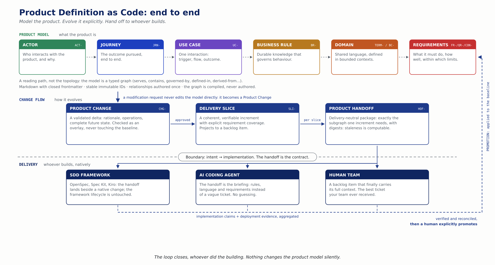

A few days ago, I published [Product Definition as Code for the AI-SDLC](/en/product-definition-as-code/) and [ProductShape](https://github.com/juangcarmona/productshape), its reference implementation.

Then I watched Frank Coyle's talk, [Why Agentic Systems Need Ontologies](https://www.youtube.com/watch?v=Sir59K8ZDPU). It gave precise language to something I was already building, and exposed a sentence in my own manifesto I could no longer defend.

The central formulation:

> Probabilistic reasoning inside. Logical guardrails outside.

That is the separation behind ProductShape: deterministic tools enforce structure, AI does semantic work, humans decide. Both approaches start from the same truth: an LLM is probabilistic, while many boundaries around its work are not.

But Coyle talks about agents acting on a runtime world: orders, refunds, payments. Product Definition as Code operates earlier, at design time, before the spec and before implementation. Those layers are related but not interchangeable.

## The same problem, two sides

An AI agent can produce a perfectly valid tool call that is completely wrong for the business. The JSON conforms, the identifier is valid, the tool exists. And yet the order was already refunded, the transition is impossible, the authorization is missing.

Type validation catches malformed data. It does not establish business truth.

The same happens in the AI-SDLC. A coding agent can produce compiling code and passing tests for the wrong product behaviour. It implements a ticket while contradicting a rule hidden in another ticket. It satisfies the local spec while drifting from the product.

The model is not malfunctioning. It is reconstructing the most plausible meaning from fragmented context. If that context is incomplete or contradictory, the agent guesses.

Coyle's answer: place an ontology around the agent so its actions can be checked against a formal domain model. Product Definition as Code answers the upstream version: place a canonical product model before the backlog and the SDD workflow.

> Do not ask a probabilistic system to be the authority for deterministic boundaries.

## Correcting my own manifesto

The ProductShape manifesto says:

> **Not an ontology.** The artifact types are a small, opinionated vocabulary for defining products, not a universal knowledge model.

The intention was correct. The sentence was not.

I wanted to prevent ProductShape from becoming a universal ontology, an RDF/OWL project, or a graph database. That boundary still matters. But "not an ontology" is too absolute.

Tom Gruber defines an ontology as an [explicit specification of a conceptualization](https://tomgruber.org/writing/ontolingua-kaj-1993.pdf): concepts, relationships, definitions and constraints in a domain. ProductShape already has all of that: a defined vocabulary, typed relationships, constraints on which types may participate, stable identity rules, lifecycle rules, a normative specification, deterministic conformance checking.

The `relationshipSpecs` table in [`@prodshape/core`](https://github.com/juangcarmona/productshape/blob/main/packages/core/src/relationships.ts) explicitly declares valid source type, relationship and target types. That is an ontological commitment, expressed in TypeScript and JSON Schema instead of OWL.

The accurate statement:

> Product Definition as Code defines a bounded ontology for product definition. It is not a universal product ontology, a semantic-web platform, or a runtime domain model.

An ontology is not synonymous with RDF, OWL or a triple store. Those are technologies for representing or reasoning over ontologies. The conceptual model comes first.

## Three layers, not one

The word "ontology" becomes dangerous when layers are collapsed.

| Layer | What it contains | Who owns it |
| --- | --- | --- |
| Product-definition metamodel | The kinds of product knowledge that can exist and valid relationships between them | Product Definition as Code |
| Product knowledge graph | The actors, journeys, rules, language and requirements of one concrete product | The product team |
| Runtime world and invariants | Current orders, users, payments, states and enforced rules | The implemented system |

ProductShape owns the first two. It can validate that a relationship exists, that the referenced artifact exists, that its type is allowed, that a requirement is structurally reachable from the behaviour that justifies it.

It does not know whether order `1234` has already been refunded. It should not. That belongs to the operational system.

ProductShape ensures the obligation to prevent a duplicate refund is explicit before an agent designs the software, and remains traceable after it ships.

## The graph is not yet the meaning

The graph compiler answers structural questions deterministically: which rules govern this use case, which requirements derive from this rule, which artifacts belong in this handoff.

It cannot answer: does changing the refund window from 30 to 60 days contradict another rule?

The rule's meaning still lives in Markdown. The graph knows the rule exists and where it connects. It does not convert prose into executable logic. That is why `impact` is structural, not semantic.

> A knowledge graph is not automatically a reasoning system.

Turning every business rule into formal logic would create a different product entirely. Most teams would never complete the model, and many product decisions are not reducible to a useful executable expression.

## From context to guardrail obligations

Today, a Product Handoff carries the relevant subgraph for one delivery slice. That is better than giving an agent one isolated ticket. But a business rule included as context is still natural language. The agent can misinterpret it, implement only part of it, or satisfy it in one path while leaving another open.

The next evolution: make **guardrail obligations** explicit in the handoff.

```markdown
## Guardrail obligations

- BR-REFUND-001: An order may be refunded at most once.
- CON-AUTH-001: Only an authorized support actor may initiate a refund.
```

The implementation workflow returns evidence showing where each obligation became enforceable:

```yaml
obligations:
  BR-REFUND-001:
    mechanisms:
      - kind: domain-invariant
        evidence: src/refunds/refund-policy.ts
      - kind: database-constraint
        evidence: migrations/unique-refund-per-order.sql
      - kind: automated-test
        evidence: tests/refunds/duplicate-refund.spec.ts
```

The format is not the point. The traceability is. ProductShape defines and transports the obligation. The delivery workflow demonstrates where it was materialized. Promotion requires evidence that the boundary did not disappear between the Markdown and the running software.

I intend to propose guardrail obligations as an RFC against the PDaC specification, following the process described below. If you want to shape it, that is the door.



## Ontologies do not replace engineering

A runtime rule like "an order may be refunded only once" still requires enforcement by the software: domain invariants, idempotency keys, database constraints, authorization policies, state transitions, tests, auditing. Writing it in an ontology does not make those controls unnecessary.

It is also important to be precise about semantic-web technologies. [RDFS](https://www.w3.org/TR/rdf-schema/) supports inference, not closed validation. [OWL](https://www.w3.org/TR/owl2-primer/) reasons under an open-world assumption. [SHACL](https://www.w3.org/TR/shacl/) is the W3C language for validating RDF graphs against explicit conditions. These determine whether a system infers, validates or rejects.

ProductShape already uses closed JSON Schemas and deterministic TypeScript validators. Replacing those with RDF/OWL would add complexity without automatic safety. The correct question is not "how do we put OWL into ProductShape" but "which product questions cannot be answered by the current model, and what is the smallest formal mechanism that would answer them?"

JSON-LD or SHACL may be worth exploring as optional projections, if they prove a real use case. Markdown remains canonical. The graph remains reproducible.

## A symbolic layer for the AI-SDLC

The connection between Coyle's argument and Product Definition as Code is a shared system design, not a shared technology stack.

In ProductShape:

- AI interviews, recovers, drafts, explores, analyzes and proposes.
- Deterministic tooling validates schemas, identities, relationships, lifecycle, digests and staleness.
- Humans approve changes, slices and promotion.
- The delivered software enforces operational invariants at runtime.

> The agent proposes. The product definition constrains. The software enforces. The human decides.

This is a neurosymbolic architecture at the level of the SDLC. The neural component does semantic work. The symbolic component constrains structure and carries traceability. Neither is asked to do the other's job.

## What this changes

Some of this has already happened between drafting this article and publishing it. Product Definition as Code now has a vendor-neutral home: the [PDaC specification](https://github.com/product-definition-as-code/spec) (v0.1, request for comments) lives in its own organization, separate from ProductShape, with a signable [manifesto](https://github.com/product-definition-as-code/spec/blob/main/MANIFESTO.md), a governance model and a public RFC process. The first RFCs are open, including one that makes silent edits to the product model machine-detectable through a baseline lock. The methodology's boundary was also restated end to end: the handoff is delivery-neutral, and the same package briefs an SDD framework, an AI coding agent, or a human team.

What remains to change:

The metamodel should become directly inspectable as one generated artifact, rather than distributed across schemas, specs and validators.

Product Handoffs should evolve from carrying context to carrying explicit guardrail obligations with delivery evidence. That will be an RFC.

JSON-LD and SHACL may be worth exploring as optional projections, if they prove a real use case.

What should not happen: ProductShape should not become a triple store, a runtime rules engine, a universal domain-modelling language, an OWL reasoner in the CLI, or a replacement for application invariants. The boundedness is not a limitation to remove. It is part of the design.

## In a Nutshell

1. **Agentic systems need authority outside the model.** Probabilistic reasoning cannot be the final authority for deterministic boundaries.
2. **ProductShape already contains a bounded ontology.** Its vocabulary, typed relationships and conformance rules meet the practical definition.
3. **Design-time product knowledge is not runtime world state.** ProductShape defines what the product should do. The running system enforces it.
4. **A graph is not automatically meaning.** Structure is deterministic; semantics still live in Markdown and require interpretation.
5. **The next step is obligation traceability.** Rules should travel through the handoff and return with evidence of enforcement.
6. **Ontologies do not replace engineering.** Domain invariants, authorization, state machines, constraints and tests remain mandatory.
7. **Do not adopt semantic-web infrastructure by reflex.** Use RDF, OWL, SHACL or JSON-LD only where their semantics solve a demonstrated problem.
8. **The AI-SDLC needs a symbolic layer before the spec.** AI proposes, deterministic tools validate, software enforces, humans decide.

The first article ended with a modest hypothesis: a versioned graph of product artifacts can provide better context before implementation begins. I still believe that. But ontologies raise the standard. Better context is not enough. The product model must make boundaries explicit, preserve them through delivery, and connect them to evidence that the implemented system actually enforces them.

Not an ontology of everything. An explicit, bounded, versioned definition of the product, before the backlog, before the spec, and before an agent writes a beautifully implemented misunderstanding.

If this resonates: read and [sign the manifesto](https://github.com/product-definition-as-code/spec/blob/main/SIGNATORIES.md), try the reference implementation with `npx @prodshape/cli init`, or bring your objections to the [open RFCs](https://github.com/product-definition-as-code/spec/issues). The specification wants a second implementation, and it wants reviewers even more.

## References

- [Why Agentic Systems Need Ontologies](https://www.youtube.com/watch?v=Sir59K8ZDPU), Frank Coyle, AI Engineer.
- [A Translation Approach to Portable Ontology Specifications](https://tomgruber.org/writing/ontolingua-kaj-1993.pdf), Thomas R. Gruber.
- [RDF Schema 1.1](https://www.w3.org/TR/rdf-schema/), W3C Recommendation.
- [OWL 2 Web Ontology Language Primer](https://www.w3.org/TR/owl2-primer/), W3C Recommendation.
- [Shapes Constraint Language (SHACL)](https://www.w3.org/TR/shacl/), W3C Recommendation.
- [The PDaC specification](https://github.com/product-definition-as-code/spec), v0.1 RFC, and [pdac.dev](https://pdac.dev).
- [ProductShape](https://github.com/juangcarmona/productshape), the reference implementation of Product Definition as Code.
- [The PDaC Manifesto](https://github.com/product-definition-as-code/spec/blob/main/MANIFESTO.md).
- [Product Definition as Code for the AI-SDLC](/en/product-definition-as-code/), the first article in this series.
