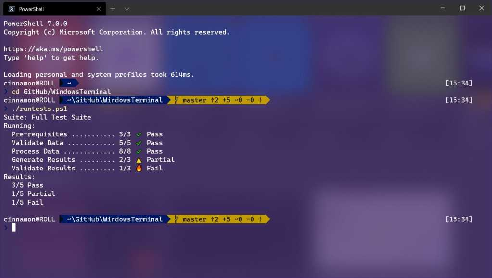
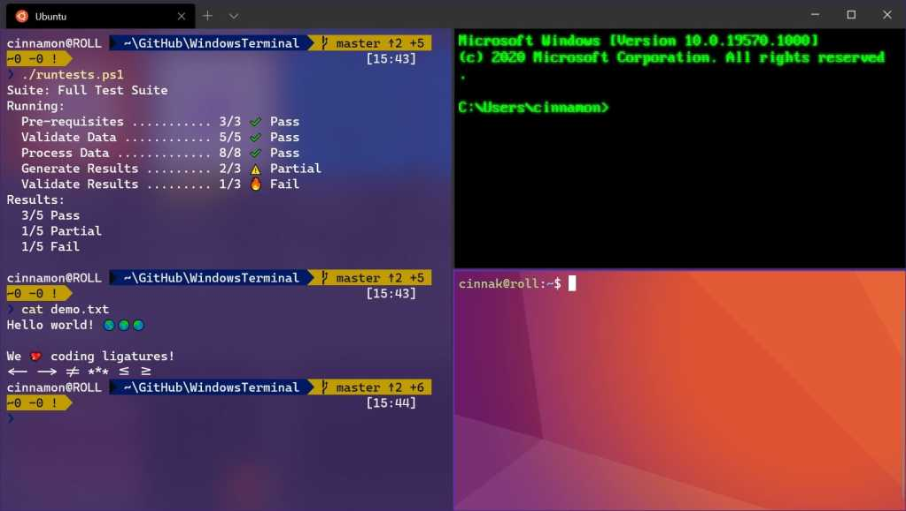

## ¿Quieres empezar a usar Linux sin salir de Windows? Con **WSL (Windows Subsystem for Linux)** puedes tener Ubuntu en tu PC en 5 minutos.


## 1: Instalar WSL y Ubuntu

WSL nos permite tener otros sistemas operativos conviviendo en nuestra máquina con nuestro Windows. Lo uso desde que salió y ya no puedo vivir sin él porque tengo lo mejor de ambos mundos.

1.1.- Abre **PowerShell (o CMD) como administrador** (clic derecho sobre el icono de PowerShell o CMD).  
1.2.- Escribe y ejecuta:

```powershell
wsl --install
```

1.3.- Windows instalará WSL 2 y Ubuntu  
1.4.- Probablemente te toque reiniciar el sistema.

## 2: Abrir Ubuntu por primera vez

2.1.- Desde el Menú de Inicio, busca y lanza **Ubuntu**.  
2.2.- La primera vez te pedirá crear un **usuario** y una **contraseña**. Usa algo seguro pero fácil de recordar, esa será la contraseña del administrador.  
  
**OJO**: por seguridad la contraseña no se muestra al escribirla.

## 3: Actualizar el sistema

Una vez dentro de Ubuntu:

```bash
sudo apt update && sudo apt upgrade -y
```

- `sudo` permite ejecutar el comando como **administrador**.

- `apt update` busca actualizaciones.

- `apt upgrade` las instala.

> ### **¡Enhorabuena! ¡Ya eres linuxero!**

## Y ahora... ¿qué hago?

Ya tienes Ubuntu funcionando dentro de Windows. ¿Lo siguiente? Aprender a usarlo como un **administrador de red**.

### Aprender Linux desde cero

- [https://linuxjourney.com](https://linuxjourney.com) → ideal para aprender visualmente.

- [https://ubuntu.com/tutorials](https://ubuntu.com/tutorials) → guías oficiales de Ubuntu.

- [https://explainshell.com](https://explainshell.com) → explica comandos línea por línea.

### Cheatsheets

- https://overapi.com/linux → chuleta de comandos.

- [https://github.com/Idnan/bash-guide](https://github.com/Idnan/bash-guide) → guía rápida de Bash.

👉 Sigue con el segundo artículo:  
**“Guía básica de Linux para administradores de red”**

## EXTRA 1: Comandos básicos de Ubuntu

| Comando | Qué hace |
| --- | --- |
| `pwd` | Muestra la ruta de la carpeta actual |
| `ls` | Lista archivos y carpetas |
| `ls -l` | Lista detallada (con permisos, fechas, tamaños…) |
| `ls -a` | Incluye archivos ocultos |
| `cd carpeta/` | Entra en una carpeta |
| `cd ..` | Sube un nivel en la ruta |
| `mkdir nombre/` | Crea una carpeta nueva |
| `rm archivo.txt` | Elimina un archivo |
| `rm -r carpeta/` | Elimina una carpeta y su contenido |
| `mv origen destino` | Mueve (o renombra) un archivo o carpeta |
| `cp origen destino` | Copia un archivo o carpeta |
| `touch archivo.txt` | Crea un archivo vacío |
| `nano archivo.txt` | Abre un archivo en el editor de texto (modo terminal) |
| `cat archivo.txt` | Muestra el contenido de un archivo |
| `head archivo.txt` | Muestra las primeras líneas |
| `tail archivo.txt` | Muestra las últimas líneas |
| `chmod +x script.sh` | Da permisos de ejecución a un script |
| `./script.sh` | Ejecuta un script en la carpeta actual |
| `sudo comando` | Ejecuta el comando como **s**uperus**u**ario |
| `history` | Muestra el historial de comandos |
| `clear` | Limpia la pantalla |
| `exit` | Cierra la terminal o sesión |

## Extra 2: Descubre Windows Terminal -> Tu consola unificada

Una vez tengas Ubuntu instalado con WSL, te recomiendo usar [**Windows Terminal**](https://apps.microsoft.com/detail/9n0dx20hk701) como tu entorno de trabajo principal. Es mucho más potente, cómodo y flexible que las ventanas clásicas de `cmd` o `PowerShell`.

### ¿Qué es Windows Terminal?

Windows Terminal es una aplicación moderna de consola para Windows que te permite:

- Abrir **PowerShell**, **CMD** y **WSL (Ubuntu, Debian, etc.)** en pestañas separadas.

- Personalizar colores, fuentes y temas.

- Usar atajos de teclado para moverte entre sesiones.

- Copiar y pegar de forma más intuitiva.





### ¿Cómo se instala?

Si usas Windows 11, **ya lo tienes instalado** por defecto.  
Si no, puedes instalarlo desde Microsoft Store:

🔗 [Instalar Windows Terminal desde la Microsoft Store](https://apps.microsoft.com/detail/9n0dx20hk701)

### ¿Por qué usarlo?

Con Windows Terminal puedes:

- Tener una pestaña con `Ubuntu (WSL)` y otra con `PowerShell`, y cambiar entre ellas con `Ctrl+Tab`.

- Ver todo tu trabajo de red o sysadmin en un solo sitio, sin abrir múltiples ventanas flotantes.

- Integrar scripts, alias, y perfiles personalizados.

### ¿Cómo lo uso con Ubuntu?

1. Abre **Windows Terminal** desde el menú Inicio.

3. Haz clic en la flechita (`˅`) junto a la pestaña abierta.

5. Selecciona **Ubuntu** (u otra distro WSL instalada).

Ya estás dentro. Todo lo que aprendas en Linux, lo puedes ejecutar aquí directamente.

### ¿Quieres personalizarlo?

Haz clic en `Configuración` dentro de Windows Terminal y verás cómo puedes:

- Cambiar el fondo y el tema.

- Usar tu fuente preferida (ej: Fira Code).

- Poner Ubuntu como pestaña por defecto.

Este terminal no solo te organiza, sino que **hace que trabajar con Linux y Windows a la vez sea fluido**. Es otra herramienta que uso desde que existe, porque me hace la vida mucho más fácil.

> Ideal para cualquier administrador, desarrollador o usuario curioso.
