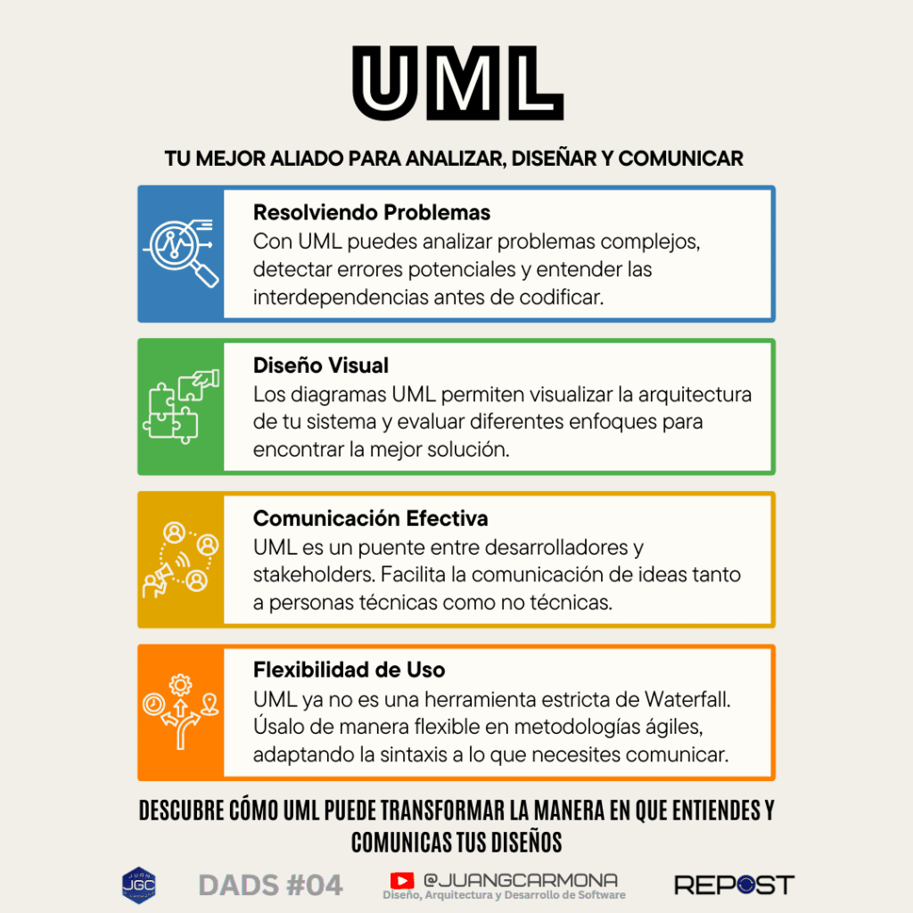
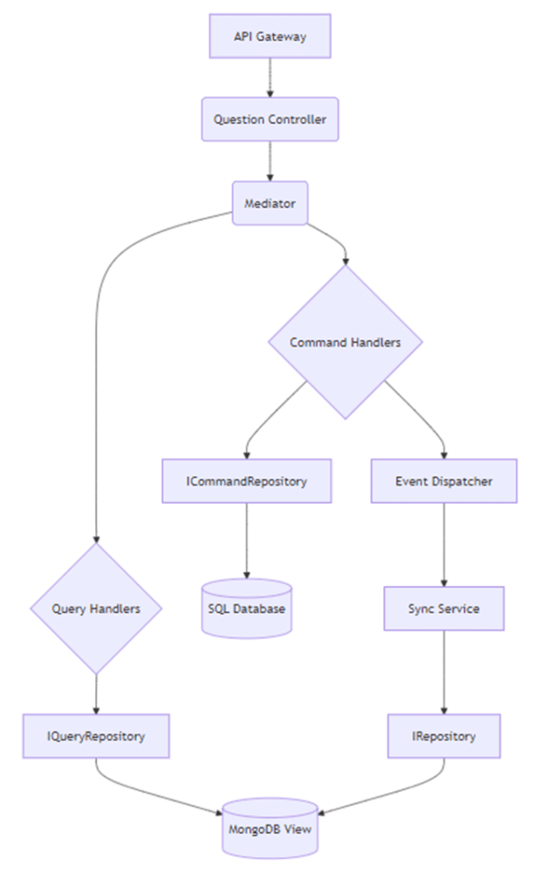
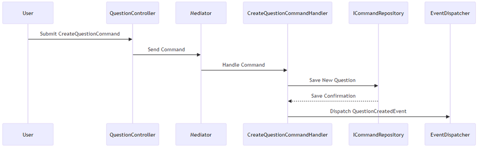
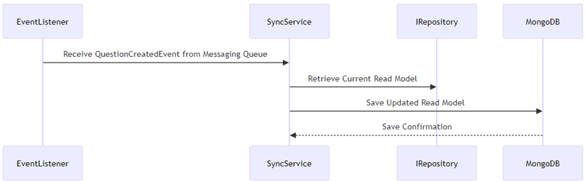
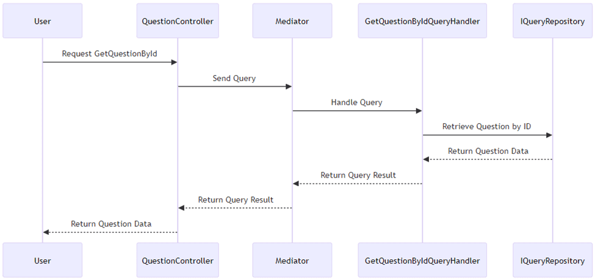
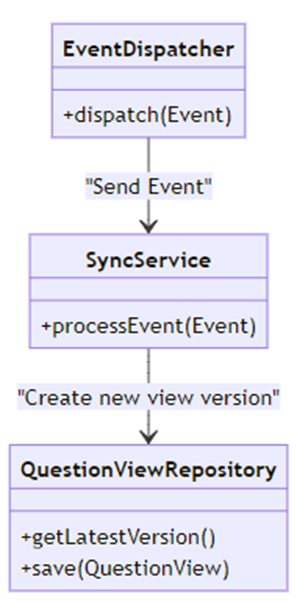
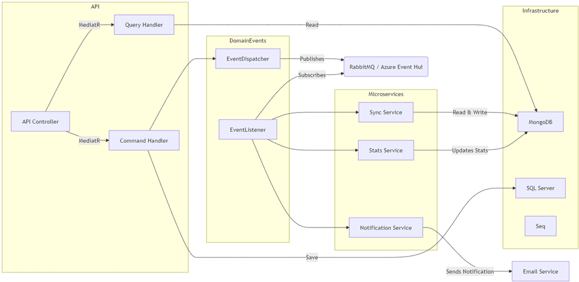

## Tu mejor aliado para analizar, diseñar y comunicar de forma efectiva

En proyectos complejos, la comunicación entre desarrolladores y personas no técnicas suele convertirse en un desafío. ¿Cómo lograr que todos entiendan el panorama completo y se mantengan alineados? Aquí es donde UML entra en acción. Este lenguaje visual permite representar, diseñar y compartir nuestras ideas de forma clara y comprensible, sin importar el nivel técnico de la audiencia.

https://www.youtube.com/watch?v=rrD2UPAeLDI

ESTE VÍDEO LLEVA UN REGALO EN SU INTERIOR

Tranquilo, no vamos a hacer de esto una clase de teoría. En la serie **[DADS (Diseño, Arquitectura y Desarrollo de Software)](https://www.youtube.com/playlist?list=PLquujPA7EWzNBPpN8vcN4XkvuGxIxYyu2)**, vamos a utilizar utilizar UML para visualizar y explicar conceptos clave de diseño y arquitectura de software, acompañados de ejemplos prácticos en cada capítulo. Y aunque ya tengas experiencia previa con UML, vale la pena hacer un repaso rápido para asegurarnos de que todos hablamos el mismo idioma antes de avanzar a temas más complejos.

## **¿Por qué UML sigue siendo relevante hoy en día?**

En sus inicios, UML se asoció con metodologías rígidas como Waterfall, lo que lo convirtió en una herramienta estática y casi inamovible. Los diagramas UML se utilizaban como una especie de contrato de diseño, y cualquier cambio suponía un alto coste en tiempo y recursos. Esto, sumado a la evolución de las metodologías ágiles, hizo que muchos lo consideraran obsoleto.

Pero el panorama ha cambiado. UML ha sabido adaptarse a los entornos dinámicos de desarrollo moderno, integrándose perfectamente en sprints y ciclos de desarrollo ágiles. Hoy en día, no se trata de seguir al pie de la letra cada regla de sintaxis, sino de utilizar UML como un lenguaje visual flexible que permite estructurar, comunicar y documentar soluciones. Es decir, se ha transformado en una herramienta dinámica que respalda la comunicación y el diseño en cada fase del desarrollo de software.

## **¿Qué hace que UML sea una herramienta tan poderosa?**

Su capacidad para representar gráficamente nuestras ideas y facilitar la colaboración entre equipos multidisciplinarios. UML se adapta a los cambios constantes, sin importar el contexto del proyecto, y nos ayuda a identificar dependencias, evaluar opciones y documentar nuestros sistemas de una manera estructurada y sencilla. Por esto, aunque ya no se utilice como una herramienta rígida, sigue siendo esencial en proyectos ágiles, diseño arquitectónico y, por supuesto, en sistemas distribuidos complejos como los que vamos a ver más adelante.

Antes de pasar a un caso práctico de UML aplicado a DDD y CQRS, repasemos brevemente los diagramas más utilizados y cuándo resulta útil emplearlos.

### Diagramas UML más Usados y sus Elementos Clave

Entender bien los diferentes tipos de diagramas UML es esencial para elegir el adecuado según la situación. Desde representar la estructura general de una aplicación hasta visualizar la interacción entre componentes, los siguientes diagramas se destacan por su utilidad en contextos de diseño arquitectónico, metodologías ágiles y DDD:

- **Diagrama de Clases**: Muestra la estructura estática del sistema, con clases, atributos, métodos y sus relaciones (herencia, asociaciones, dependencias). Es ideal para representar la estructura general de la aplicación y cómo se relacionan los distintos componentes. Por ejemplo, en un sistema basado en DDD, se puede utilizar para representar agregados y sus relaciones, o visualizar cómo las entidades se conectan en un módulo específico del dominio.

- **Diagrama de Secuencia**: Describe la interacción entre objetos a lo largo del tiempo. Perfecto para visualizar cómo se comunican los componentes del sistema en un flujo específico, como un flujo de autenticación o una transacción de compra. Se usa mucho para representar procesos de negocio y la comunicación entre servicios o APIs.

- **Diagrama de Actividad**: Representa flujos de control, decisiones y condiciones. Ideal para detallar procesos lógicos complejos y mostrar cómo se suceden las acciones dentro de un sistema, como un flujo de trabajo o la lógica de una operación CRUD.

- **Diagrama de Componentes**: Define la estructura modular del sistema y cómo interactúan los diferentes módulos entre sí. Ideal para visualizar cómo se distribuyen las responsabilidades en un sistema grande y cómo los componentes se interconectan.

- **Diagrama de Paquetes**: Organiza el sistema a nivel de paquetes, mostrando las relaciones entre distintos grupos de clases. Útil para representar sistemas grandes donde se necesita una visión global de cómo se estructuran los módulos y las dependencias entre ellos.

**Referencia**: Si quieres profundizar en cada tipo de diagrama y ver ejemplos más detallados, no dudes en visitar mi artículo anterior, **UML de Batalla**, donde explico en profundidad cada uno de estos diagramas con ejemplos prácticos.

## Beneficios de Usar UML

Cuando hablamos de UML, no nos referimos únicamente a dibujar diagramas bonitos. UML es una herramienta capaz de influir en todo el proceso de desarrollo de software. Desde ayudar a detectar errores antes de que se conviertan en un problema hasta mejorar la comunicación en el equipo, UML nos ofrece una serie de beneficios clave que vale la pena destacar. Vamos a explorar cómo podemos aprovechar al máximo su potencial.

## Análisis Visual: Detectando Problemas Antes de Que Aparezcan

Con UML tenemos una vista previa del sistema antes de escribir una sola línea de código. Los diagramas nos permiten detectar dependencias, redundancias o posibles problemas de diseño que, de otra forma, podrían no ser tan evidentes. Esto es especialmente valioso cuando se trabaja en un entorno ágil o en sistemas complejos como los basados en DDD y CQRS.

Piénsalo como un plano arquitectónico: nadie empieza a construir un rascacielos sin tener una representación visual de cómo encajan las piezas y qué problemas podrían surgir. De la misma forma, un diagrama UML actúa como un blueprint que sirve de referencia para todos los involucrados en el proyecto. Además, nos permite ver “el todo” y las partes en un mismo lugar, ayudándonos a detectar errores de manera anticipada y a definir las relaciones entre componentes del sistema.

## Diseño y Arquitectura de Soluciones: Estructura y Flexibilidad

Imagina que tienes que rediseñar una parte de tu sistema porque, después de un sprint, las prioridades han cambiado. Sin una visual clara de cómo está estructurado el sistema, hacer cambios puede ser un dolor de cabeza. Aquí es donde UML destaca: nos permite ver la arquitectura del sistema desde diferentes ángulos, evaluar opciones y realizar modificaciones con una base sólida.

El uso de diagramas UML en el diseño arquitectónico nos ayuda a visualizar no solo cómo se organizan las entidades y los módulos, sino también cómo interactúan entre sí. Esto nos permite realizar ajustes rápidos sin perder de vista el panorama completo. Y lo mejor de todo, ¡sin necesidad de bucear en cientos de líneas de código!

## Comunicación Efectiva: Conectando Ideas Técnicas y No Técnicas

¿Cuántas veces hemos intentado explicar un concepto técnico a alguien de nuestro equipo que no está familiarizado con los detalles de la implementación? Ya sea a un product owner, un project manager o incluso a un compañero de otra área, UML se convierte en nuestro mejor traductor visual.

Un diagrama bien hecho permite explicar flujos complejos de forma que cualquiera pueda entenderlos, sin importar su background técnico. Ya no se trata de usar jerga o tecnicismos que pueden alejar a nuestro interlocutor, sino de emplear un lenguaje visual que todos puedan seguir. Esto hace que UML sea perfecto para sesiones de brainstorming, reuniones de diseño o presentaciones de avances del proyecto. Todos pueden ver y comprender el diseño, lo que fomenta una mejor colaboración y entendimiento.

## Flexibilidad y Adaptación: Diagramas que Crecen Contigo

UML no solo nos ayuda a estructurar un proyecto desde el inicio, sino que también se adapta al crecimiento y a los cambios en el desarrollo. A medida que nuestro software evoluciona, nuestros diagramas pueden evolucionar con él. No estamos atrapados en una única visión del sistema: podemos ir ajustando los diagramas según las necesidades del proyecto.

Además, UML nos permite trabajar a distintos niveles de detalle. Podemos crear diagramas simples que representen la interacción general del sistema o profundizar en el detalle de cada módulo según la fase de desarrollo. Esta flexibilidad hace que UML sea una herramienta poderosa tanto en proyectos grandes como en proyectos más pequeños.

¿Qué significa esto para nosotros? Que contar con una herramienta como UML en nuestro kit no solo nos facilita el trabajo, sino que también nos ayuda a mejorar nuestra capacidad de análisis, diseño y comunicación en cada fase del proyecto. Así que, cuando se trata de diagramar, ¡UML al rescate!

Ahora que entendemos cómo UML nos ayuda en el análisis, diseño y comunicación, veamos cómo podemos llevar estas ideas a la práctica en un proyecto real utilizando DDD y CQRS.

## Introducción al Caso de Estudio

En este caso práctico, vamos a explorar cómo UML nos ayuda a entender la estructura de un sistema complejo basado en DDD (Domain-Driven Design) y CQRS (Command and Query Responsibility Segregation), con un enfoque especial en el uso del patrón Mediator. La arquitectura que vamos a examinar es la de un proyecto tipo Q&A (Preguntas y Respuestas), similar a Stack Overflow, que implementa consultas y comandos a través del patrón Mediator.

El patrón Mediator actúa como intermediario entre diferentes componentes, facilitando la comunicación y reduciendo el acoplamiento entre las clases. En nuestra implementación, utilizamos la librería MediatR, la cual abstrae la lógica de manejo de comandos y consultas, permitiéndonos organizar mejor el flujo de ejecución y la responsabilidad de cada componente.

## Uso Práctico de UML en un Sistema Basado en DDD y CQRS

Para entender cómo aplicar UML en la práctica, vamos a analizar un caso de estudio basado en un sistema de preguntas y respuestas (Q&A), similar a plataformas como Stack Overflow. Este tipo de aplicación requiere una arquitectura robusta que permita manejar grandes volúmenes de datos y consultas concurrentes. Para lograrlo, hemos optado por una combinación de **Domain-Driven Design (DDD)** y **Command Query Responsibility Segregation (CQRS)**, implementada con el **Patrón Mediator**. A lo largo de esta sección, veremos cómo UML nos ayuda a estructurar y comunicar esta complejidad de manera efectiva.

### 1\. Estructura del Sistema Q&A

El sistema Q&A está diseñado en torno a la entidad central `Question`. Los comandos y consultas se manejan de manera separada mediante el uso de **CQRS** y el **Patrón Mediator** (utilizando la librería `MediatR`), garantizando que las operaciones de lectura y escritura se encuentren correctamente aisladas. El sistema utiliza una base de datos SQL para el almacenamiento de comandos y MongoDB (NoSQL) para las vistas de solo lectura, haciendo que este enfoque sea ideal para escenarios de **consistencia eventual**.

A continuación, se muestra un diagrama de componentes de alto nivel con los servicios y dependencias del sistema:

**Figura 1**: Diagrama de componentes que muestra cómo la API se comunica con los servicios principales a través de `MediatR` y cómo cada servicio interactúa con los repositorios y bases de datos subyacentes.

### 2\. Flujo de Comandos: Creación de una Nueva Pregunta

#### 2.1 Lado de la API

El sistema utiliza `MediatR` para manejar los comandos y distribuirlos a los manejadores correspondientes. Por ejemplo, cuando un usuario crea una nueva pregunta, se ejecuta el siguiente flujo:

**Figura 2.1**: Diagrama de secuencia que muestra la creación de una nueva pregunta, persistiendo la entidad en el `ICommandRepository` y despachando un evento a través del `EventDispatcher`.

#### Explicación:

1. El **Usuario** envía un `CreateQuestionCommand` al **QuestionController**.

3. El **Controller** envía el comando al **Mediator**.

5. **Mediator** encuentra el manejador adecuado, en este caso `CreateQuestionCommandHandler`, y le pasa el comando para ser procesado.

7. El manejador escribe la nueva `Pregunta` utilizando el **ICommandRepository**.

9. Después de guardar exitosamente en el repositorio, el manejador despacha un `**QuestionCreatedEvent**`.

#### 2.2 Lado del SyncService

Después de que el `CreateQuestionCommand` es procesado y se despacha un `QuestionCreatedEvent`, el `SyncService` utiliza un `EventListener` para reaccionar a este evento y actualizar el modelo de lectura almacenado en MongoDB. Esto garantiza que el modelo de lectura permanezca consistente con el estado actual de las entidades de dominio. El flujo es el siguiente:

**Figura 2.2**: Diagrama de secuencia que ilustra cómo el Sync Service escucha los eventos de dominio a través de un `EventListener`, recupera el modelo de lectura actual y actualiza la vista en MongoDB.

#### Explicación:

1. **EventListener** recibe el `QuestionCreatedEvent` desde la cola de mensajes (e.g., RabbitMQ o Azure Event Hub).

3. El **EventListener** notifica al **Sync Service** sobre el nuevo evento.

5. El **Sync Service** obtiene la versión más reciente del modelo de lectura desde el **IRepository**.

7. El **Sync Service** actualiza el modelo de lectura y lo guarda en **MongoDB**.

9. **MongoDB** confirma que el modelo de lectura actualizado se ha guardado correctamente.

Este proceso asegura que el modelo de lectura, utilizado por los manejadores de consulta, esté siempre actualizado y refleje los últimos cambios en el sistema, sin acoplar directamente los lados de lectura y escritura de la aplicación.

### 3\. Flujo de Consultas: Recuperación de una Pregunta

Las consultas se manejan de manera diferente a los comandos, ya que solo leen datos y no modifican el estado del sistema. El siguiente diagrama de secuencia muestra el proceso para recuperar una pregunta por su ID:

**Figura 3**: Diagrama de secuencia para manejar una consulta que recupera datos de preguntas desde el `IQueryRepository`.

### 4\. Consistencia Eventual y el Sync Service

El `Sync Service` es responsable de mantener la consistencia entre los repositorios de comando y de consulta. Cada vez que se despacha un nuevo evento (e.g., `QuestionCreatedEvent`), el Sync Service actualiza el modelo de lectura en MongoDB creando una nueva versión del documento. 

**Figura 4**: Diagrama de clases que muestra cómo el Sync Service procesa eventos y crea nuevas versiones de las vistas en MongoDB.

### 5\. Visión General de la Arquitectura de Componentes

El siguiente diagrama proporciona una visión general de los microservicios y sus interacciones con el bus de mensajes y las bases de datos. Cada servicio se despliega como un contenedor separado, lo que permite escalabilidad independiente y aislamiento de fallos.

**Figura 5: Vista general de la arquitectura de componentes.**  
Este diagrama muestra cómo se organizan y comunican los contenedores principales de la solución, incluyendo servicios esenciales como la API, el Sync Service, el Notification Service y el Stats Service. Cada microservicio está aislado, ejecutándose en su propio contenedor, y se conecta a los repositorios y dependencias correspondientes según su funcionalidad.

La comunicación entre microservicios se realiza a través de un bus de mensajes, que puede ser RabbitMQ o Azure Event Hub, asegurando la propagación de eventos de manera asíncrona. Los componentes de soporte incluyen SQL Server para el almacenamiento de datos de comandos, MongoDB para el almacenamiento de los modelos de lectura y Seq para la monitorización y el logging del sistema. Esta arquitectura asegura una clara separación de responsabilidades, escalabilidad y consistencia eventual en toda la solución.

### Explicación del Diagrama:

1. **API Controller**: Representa la interfaz principal del sistema, gestionando comandos y consultas a través de `MediatR`.

3. **MediatR**: Actúa como intermediario entre el API Controller y los `Command Handlers` y `Query Handlers`, facilitando la comunicación interna de la aplicación.

5. **Command Handler**: Maneja las solicitudes de comandos, que generalmente modifican el estado de la aplicación. Los resultados se persisten en **SQL Server**.

7. **Query Handler**: Se encarga de las solicitudes de consultas, recuperando los datos desde la base de datos NoSQL (**MongoDB**), optimizada para lecturas rápidas.

9. **Domain Events**: Los eventos del dominio se envían y procesan a través del `EventDispatcher` y `EventListener`. Se publican en el bus de mensajes (RabbitMQ o Azure Event Hub) y se escuchan en los microservicios correspondientes.

11. **Sync Service**: Recibe eventos del dominio y actualiza los modelos de lectura en **MongoDB** para reflejar el último estado del dominio, manteniendo así la consistencia eventual.

13. **Notification Service**: Se suscribe a ciertos eventos y envía notificaciones a través de diferentes canales como **Email Service**.

15. **Stats Service**: Recibe eventos específicos para actualizar las estadísticas en **MongoDB**, lo que permite hacer un seguimiento del rendimiento y uso del sistema sin interferir con otros microservicios.

17. **SQL Server**: Contiene el estado del dominio para los comandos.

19. **MongoDB**: Almacena los modelos de lectura, que son consultados y actualizados por los microservicios para ofrecer datos de manera eficiente.

21. **Seq**: Proporciona observabilidad, almacenamiento de logs y monitorización del sistema.

23. **Event Bus (RabbitMQ / Azure Event Hub)**: Se utiliza para la propagación de eventos entre los diferentes microservicios, asegurando una comunicación desacoplada y asíncrona.

Con esta arquitectura, cada microservicio opera de forma independiente y escala según la carga que recibe, mientras se mantiene la consistencia y colaboración a través del bus de mensajes. Este enfoque modular permite un mantenimiento más sencillo, mejor rendimiento y una clara separación de responsabilidades entre los componentes.

## Buenas Prácticas y Consejos para Usar UML

A lo largo del tiempo, nos hemos dado cuenta de que UML no se trata de crear diagramas perfectos ni de seguir todas las normas al pie de la letra. Se trata de una herramienta que nos ayuda a transmitir ideas complejas y a entender mejor las relaciones dentro de nuestros sistemas. Aquí tienes algunas de las mejores prácticas para sacarle el máximo provecho a UML sin caer en la rigidez.

## 1\. No Ser Demasiado Rígido con la Sintaxis

En muchos contextos, la formalidad de UML se puede volver un obstáculo. Si bien la sintaxis y las normas existen por una razón, no deberíamos sacrificarlas en detrimento de la comunicación efectiva. En lugar de obsesionarnos con la perfección de cada elemento, prioricemos que el mensaje sea claro y comprensible.

- **Enfatiza la claridad por encima de la exactitud**: Si omitir detalles o ajustar la presentación hace que el diagrama se entienda mejor, hazlo.

- **Usa colores y notas**: Añadir anotaciones o resaltar partes clave del diagrama puede ayudar a clarificar conceptos.

- **Divídelo en partes**: Si un diagrama se vuelve demasiado complejo, descomponlo en diagramas más pequeños que aborden subtemas o módulos específicos.

Ejemplo: Un diagrama de secuencia detallado puede volverse complicado. Si te encuentras en esta situación, crea un diagrama más general y luego aborda los detalles en diagramas separados.

## 2\. Combinar UML con Herramientas Modernas y Repositorios

Aprovecha herramientas que te permitan crear, visualizar y mantener los diagramas actualizados fácilmente. Dos de las opciones más recomendadas son **Mermaid** y **PlantUML**, que te permiten crear diagramas directamente en Markdown y sincronizarlos con tus repositorios, como GitHub o GitLab.

- **Mermaid**: Una opción ligera y sencilla para crear diagramas como código, que se integra muy bien con GitHub y GitLab. Ideal para mantener la documentación junto con el código.

- **PlantUML**: Similar a Mermaid pero con más opciones y un lenguaje más robusto. Puedes integrarlo en tu editor de código (por ejemplo, VS Code) y usarlo para que tus diagramas se generen automáticamente a partir de los archivos fuente.

Además, puedes explorar **Modelos C4**, que proporcionan una estructura útil para representar la arquitectura de software a distintos niveles de abstracción. En los próximos capítulos de la [serie DADS](https://www.youtube.com/playlist?list=PLquujPA7EWzNBPpN8vcN4XkvuGxIxYyu2), profundizaremos en C4 y su implementación con UML y herramientas como PlantUML.

**Pro tip**: Crea un README con tu documentación en Markdown que incluya diagramas UML generados con Mermaid o PlantUML. Así, cualquiera que clone el repositorio podrá ver los diagramas junto con el código.

## 3\. Usa UML para Soportar Metodologías Ágiles

Aunque UML surgió en un contexto más estructurado, se adapta perfectamente a metodologías ágiles. Puedes utilizar UML como un complemento durante sprints y reuniones de planificación, para detallar flujos de trabajo y coordinar al equipo.

- **Diagramas en las reuniones de planificación**: Utiliza diagramas de actividades para visualizar el flujo de una funcionalidad que se va a desarrollar en un sprint.

- **Documentación continua**: Cada vez que implementes un cambio significativo, actualiza los diagramas para reflejar la arquitectura actual. Esto te ayudará a mantener una documentación viva y relevante.

Ejemplo: Imagina que has definido un diagrama de clases inicial para un módulo. A medida que avanzas en el desarrollo, ajusta ese diagrama con cambios en las relaciones o estructuras de las clases, y compártelo con el equipo.

## 4\. Piensa en UML como un Soporte Visual, no como una Restricción

Utiliza UML como una extensión de tus ideas. Si en algún momento te sientes limitado por la sintaxis o el formato, busca cómo adaptar el diagrama para que te permita expresar mejor el concepto. Recuerda que UML no es un fin en sí mismo, sino un medio para comunicarte de manera efectiva con tu equipo.

- **No temas romper las reglas**: Agrega elementos visuales o conecta nodos de maneras no convencionales si eso ayuda a entender el diagrama.

- **Experimenta con diferentes diagramas**: Si un diagrama de clases no representa claramente una estructura, prueba con un diagrama de componentes o de paquetes.

Ejemplo: En un diagrama de clases que se vuelve muy detallado, omite las relaciones menores y prioriza mostrar las interacciones principales. Luego puedes crear un diagrama separado para las relaciones omitidas si es necesario.

Con estos consejos, estarás en una mejor posición para aprovechar UML sin sentirte atado por sus reglas. Como hemos mencionado, UML es un aliado visual para analizar, diseñar y comunicar. Si quieres ver ejemplos prácticos de cómo aplicamos estos conceptos en código, visita nuestro [repositorio de patrones de diseño](https://github.com/jgcarmona-com/design-patterns) y explora cómo utilizamos UML junto con C4 y otras metodologías para documentar nuestros proyectos.

En el próximo capítulo de **[DADS](https://www.youtube.com/playlist?list=PLquujPA7EWzNBPpN8vcN4XkvuGxIxYyu2)**, exploraremos en profundidad los Modelos C4 y cómo complementan a UML para representar arquitecturas complejas de forma intuitiva. Si quieres aprender más sobre patrones de diseño, técnicas de documentación y cómo llevar todo esto a la práctica, ¡no te lo pierdas!

## UML Debe Estar en Tu Kit de Herramientas

A lo largo de este artículo, hemos visto cómo UML se ha convertido en una herramienta invaluable para cualquier desarrollador o arquitecto de software que quiera llevar sus proyectos al siguiente nivel. Ya sea que estemos analizando problemas complejos, diseñando nuevas arquitecturas o simplemente comunicando nuestras ideas a otros, UML se adapta perfectamente a cada una de estas situaciones.

Entonces, ¿por qué deberíamos considerar a UML como un “superhéroe” en nuestro arsenal de diseño de software? Porque nos permite hacer cosas que no podríamos lograr solo con palabras o incluso con código. Con UML, podemos crear un plano visual del sistema que todos los involucrados, desde desarrolladores hasta stakeholders, pueden entender y discutir. Esto se traduce en:

- **Resolución de problemas más efectiva**: Detectar errores y entender dependencias antes de la codificación nos ahorra tiempo y dolores de cabeza durante el desarrollo.

- **Comunicación más clara**: Diagrama tras diagrama, UML actúa como un puente entre nuestras ideas y la comprensión de las mismas por parte de otros, reduciendo malentendidos y facilitando la colaboración.

- **Adaptabilidad a cualquier entorno**: Desde metodologías tradicionales como Waterfall hasta enfoques ágiles y dinámicos, UML se adapta a nuestras necesidades, ayudándonos a visualizar y ajustar nuestros sistemas sin perder flexibilidad.

En última instancia, el verdadero valor de UML no radica en seguir su sintaxis a rajatabla, sino en cómo nos permite estructurar, analizar y comunicar de manera efectiva. Utilizando UML en combinación con prácticas de diseño moderno como DDD y CQRS, podemos crear sistemas robustos y mantenibles que sean entendibles para todos los miembros de nuestro equipo. Si podemos transmitir nuestras ideas con claridad y construir una base sólida para nuestros proyectos, habremos aprovechado el potencial de UML al máximo. Así que, ¡anímate a darle una oportunidad en tus proyectos y descubre cómo esta herramienta puede ser ese recurso visual que lleve tu desarrollo a otro nivel!

**MI CONSEJO**: Integra UML en tus proyectos como parte de tu flujo de trabajo habitual. No hace falta ser un experto ni crear diagramas perfectos. Solo necesitas tener claro que, cuando se trata de estructurar, diseñar y comunicar, UML puede ser ese "superhéroe" que te saque de un apuro y te ayude a entender y hacerte entender con más facilidad.

Así que, ¿por qué no explorar UML en tu próximo proyecto? Prueba distintas herramientas, experimenta con diferentes diagramas y descubre cómo puede mejorar tu manera de trabajar. ¡Seguro que encontrarás en UML a un gran aliado para hacer que tus ideas cobren vida!

Con esto, hemos concluido este artículo. Pero esto es solo el comienzo: en los próximos capítulos de la serie **[DADS](https://jgcarmona.com/category/dads/)**, vamos a explorar patrones de diseño y metodologías de documentación como C4. Así que, si quieres seguir desarrollando tus habilidades y aprender más sobre diseño y arquitectura de software, ¡no te lo pierdas!

**Recursos Adicionales:**

- [**Repositorio ddd-cqrs-vsa en GitHub**](https://github.com/jgcarmona-com/ddd-cqrs-vsa): Explora la implementación completa de los conceptos discutidos en este artículo.

- [**PlantUML**](https://plantuml.com/): Herramienta para crear diagramas a partir de texto y automatizar su generación.

- [**Mermaid**](https://mermaid.js.org/): Librería para crear diagramas en Markdown de forma sencilla y visual.

- Artículos sobre patrones de diseño: Más recursos sobre diseño y arquitectura en mi blog.

El ejemplo presentado en este documento está basado en el repositorio ddd-cqrs-vsa, que forma parte de mis sesiones de **coaching y mentoría** para arquitectos y líderes técnicos. Si te interesa profundizar en la implementación de patrones como DDD y CQRS, o quieres llevar a tu equipo al siguiente nivel en términos de diseño y arquitectura de software, este repositorio te ofrece una base sólida y ejemplos prácticos para lograrlo.

¿Te gustaría llevar tus habilidades de diseño y arquitectura a un nivel profesional y aplicar estas metodologías en tus propios proyectos? En mis mentorías personalizadas, te mostraré cómo integrar DDD y CQRS en sistemas reales, y cómo UML puede ser tu aliado visual para comunicar de manera efectiva con tu equipo y stakeholders. Te invito a explorar el [repositorio ddd-cqrs-vsa](https://github.com/jgcarmona-com/ddd-cqrs-vsa) y a ponerte en contacto para comenzar a trabajar juntos.

**¿Te ha sido útil esta guía?** Compártela con otros desarrolladores, suscríbete a la newsletter y sigue explorando más contenido sobre diseño, arquitectura y desarrollo de software. ¡Nos vemos en el próximo capítulo de DADS!
