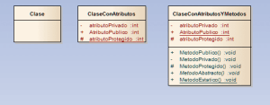
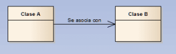
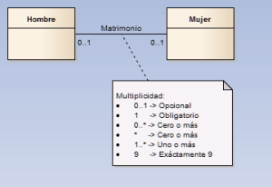
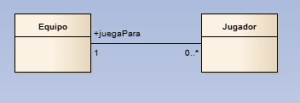
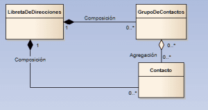
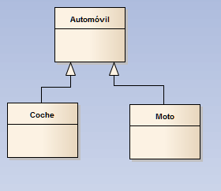
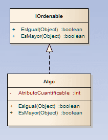
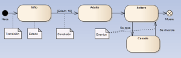
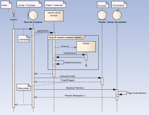
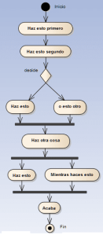

Doy por hecho que quien lea este artículo ya sabe lo que significa la programación orientada a objetos. Para quien no lo conozca, con una rápida consulta en Google, he llegado a [éste documento](http://www.nebrija.es/~abustind/Informatica/MetodologiaII/Introduccion.pdf) en el que, de forma rápida, se explica de forma muy simple lo que significa la orientación a objetos.

Éste artículo no pretende ser una guía de UML sino una referencia rápida para que analistas y desarrolladores lo utilicen de forma adecuada durante sus discusiones en la fase de análisis y en épocas tempranas del desarrollo así como en sus argumentaciones sobre la calidad del software que están desarrollando si les fuera necesario y por eso lo he llamado UML de batalla.

El objetivo de éste artículo es mostrar de forma muy rápida y visual para qué sirve, cuál es la nomenclatura básica y cómo se utiliza UML ([Unified Modelling Languaje](http://meusite.mackenzie.com.br/rogerio/the-unified-modeling-language-user-guide.9780201571684.997.pdf)) y para ello voy a utilizar una herramienta profesional, [Enterprise Architect](http://www.sparxsystems.com.au/), para la que tengo mi correspondiente licencia. Para diseños y diagramas rápidos existen muchas herramientas UML, una de ellas, gratuita y online, se llama [yuml](http://yuml.me/). Es bastante intuitiva aunque en mi opinión lo más recomendable es siempre usar papel y lápiz o una pizarra y aplicar bien la nomenclatura. 

**Diagrama estático de** **Diagrama estático de clases**

Un diagrama de clases UML es una manera versátil y estandarizada de describir la estructura de un sistema, sus clases, con sus atributos y métodos, y las relaciones entre ellas. Un diagrama de clases puede representar de forma visual la arquitectura, los requisitos de entidades, los patrones y los diseños de un proyecto de software.

Una clase en programación orientada a objetos es cualquier entidad susceptible de ser representada en código. En general se puede decir que cualquier sustantivo puede ser representado mediante una clase (animal, perro, gato, automóvil, coche, moto, servidor, cliente, etcétera) pero también pueden representarse con clases conceptos mas abstractos como rol o cargo.

Las clases tienen atributos, es decir propiedades, por ejemplo un coche tendrá una matrícula, un modelo, un color.

Las clases tienen métodos, es decir, acciones, por ejemplo un coche se podrá arrancar o mover.

Tanto las propiedades como los métodos pueden ser públicos, si cualquiera puede acceder a ellas o ejecutarlos, privados, si sólo sin accesibles desde la propia clase o protegidos, si sólo son accesibles desde clases "por debajo" de ella.

**Relaciones entre clases**

Asociación

Dos clases pueden estar asociadas, es decir, relacionadas de alguna manera. A la hora de hacer nuestros diseños este tipo de relación se puede representar de distintas maneras:

Ésta es una relación unidireccional, la Clase A se asocia con la Clase B.

Ésta relación no define direccionalidad pero si multiplicidad, un Hombre puede tener una relación de matrimonio con ninguna o una mujer y viceversa.

Se puede especificar en la relación cuál es el rol de los intervinientes, en este caso el jugador juega para el equipo.

Agregación y composición

**Agregación** significa que un elemento contiene o está formado por otros elementos, por ejemplo un coche tiene cuatro ruedas, un motor, etcétera. 

La **composición** es una forma más fuerte de agregación que se utiliza para indicar la propiedad del todo sobre sus partes. 

Una forma fácil de determinar si debemos dibujar una agregación o una composición es ver si tiene sentido la existencia de una parte si se destruye el todo. 

En este ejemplo se ve claramente como una libreta de direcciones se compone de contactos y de grupos de contactos. La libreta de direcciones puede estar vacía y no tener ni grupos de contactos ni contactos (multiplicidad = 0..\*) pero si hubiera un contacto o un grupo de contactos y destruyéramos la libreta de direcciones entonces tendríamos que destruir (o se destruirían) tanto el contacto como el grupo de contactos. Este razonamiento nos indica que la relación es de composición. Sin embargo la relación entre un grupo de contactos y un concato es de agregación ya que un contacto perteneciente a un grupo de contactos debería seguir existiendo aunque elimináramos el grupo de contactos. ¿Fácil? Visto así puede ser sencillo pero es un error habitual "liarse" entre agregación y composición.

**Generalización o Herencia**

Cada instancia de las clases hijas es a su vez una instancia de la clase padre, es decir, en el ejemplo, todo coche o moto de nuestro programa es un automóvil.

Realización e **Interfaces**

Una interfaz es un "contrato", significa que cualquier clase que realice dicha interfaz está obligada a implementar los métodos de la interfaz.

En éste ejemplo tenemos "Algo" "ordenable" y para ser ordenable debe implementar "el contrato", es decir, los métodos EsIgual y EsMayor.

**Diagrama de estados**

Los diagramas de estados muestran el conjunto de **estados** por los cuales pasa un objeto durante su vida en una aplicación y muestran los **eventos** o las **condiciones** que disparan las **transiciones** entre un estado y otro.

**Diagramas de Secuencia**

Un diagrama de secuencia representa el flujo de trabajo y el paso de mensajes entre distintos elementos de un sistema de manera secuencial y cómo se comunican dichos elementos para conseguir un fin. 

Los diagramas de secuencia pueden tener distinto nivel de detalle, en éste ejemplo se muestra el proceso de compra con muy poco nivel de detalle, secuencialmente vemos que el usuario accede a la zona de compras y que selecciona distintos objetos (se muestra dentro de un bucle). En un momento dado el usuario calcula el total y una entidad de nuestro sistema, la entidad pedido, le dice al usuario el total a pagar. Acto seguido el usuario realiza el pedido y, una vez nuestro gestor de pedidos procede al pago automático, le confirma al usuario que se ha realizado el pedido.

**Diagramas de Actividad**

Representa los flujos de trabajo de los componentes en un sistema, de negocio y operacionales, es decir, muestran el flujo de control general. En éstos diagramas aparecen decisiones, flujos en paralelo y convergencias entre procesos. Un ejemplo autoexplicativo puede ser el siguiente:

Aquí vemos como, primero se ejecuta un proceso, después se ejecuta otro, después se toma una decisión y o se ejecuta una cosa y otra, tras lo cual se realiza otra acción y por último se ejecutan en paralelo dos procesos que desembocan en un proceso que termina la ejecución. Quizá es un poco tosco pero se ve claramente la nomenclatura gráfica, ¿no?

Hasta aquí el resumen de UML de batalla. Quizá deba ampliar este artículo con diagramas de componentes y de despliegue en un futuro pero creo que eso lo voy a dejar para un siguiente artículo más adelante. De momento quiero centrarme en buenas prácticas de programación, principios GRASP de asignación de responsabilidades y en patrones de diseño en los siguientes artículos y con los diagramas estáticos de clases que se han visto aquí, los primeros y quizá con los diagramas de secuencia sea suficiente para documentar dichos artículos.
