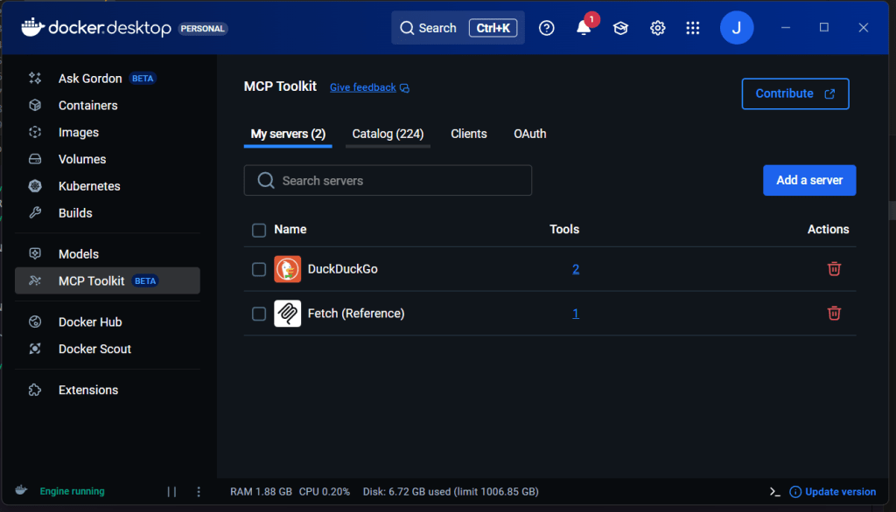
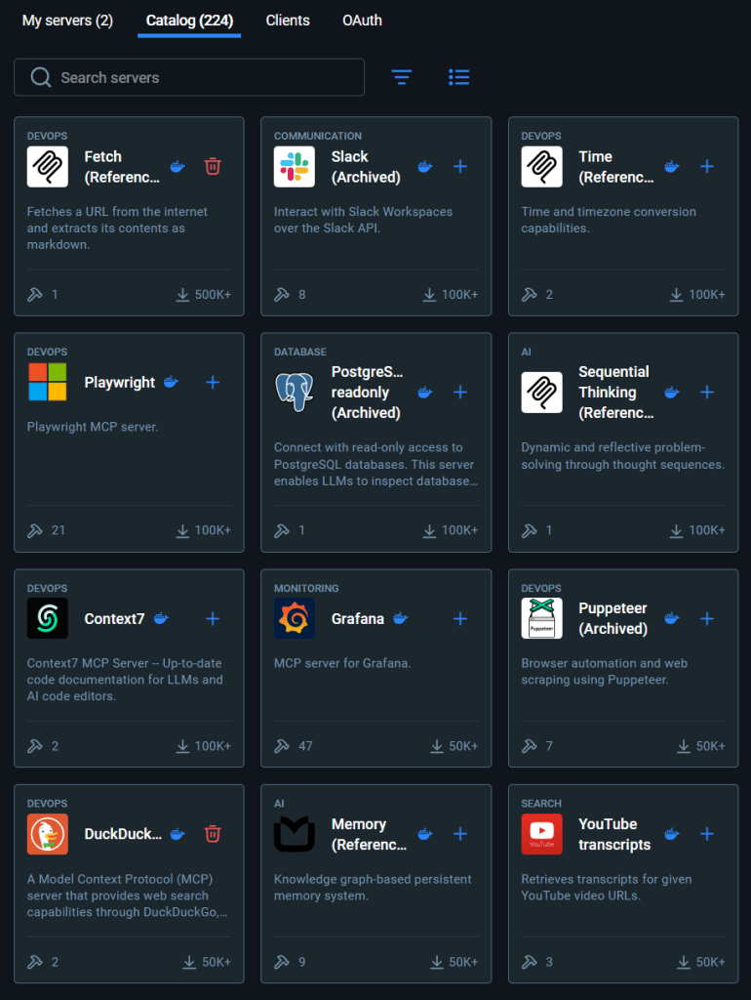

> If you’ve already followed my previous articles, from [**AI Agents in a Nutshell**](https://jgcarmona.com/ai-agents-nutshell/) to [**Agentic Reasoning with Microsoft Agent Framework**](https://jgcarmona.com/agentic-reasoning-with-microsoft-agent-framework/), you know that Microsoft Agent Framework (MAF) is not just about generating text. It’s about reasoning, planning, acting, and reflecting, the full **SPAR loop**.

This time I will focus only on MCP. I'll show the way you can connect your agents with to the outside world using the **Model Context Protocol**, and we will use locally running Docker MCP servers for this... Using both flavors, C# and Python. I hope you enjoy it.

## What MCP Actually Does

**MCP (Model Context Protocol)** is an open standard that allows an agent to use external tools, local or remote, in a consistent way. Instead of embedding APIs directly, the agent “speaks MCP” to small tool servers that expose capabilities such as `search`, `fetch`, or `calculate`. Each tool can run locally (via STDIO), remotely (via HTTP/SSE or WebSocket), and, in the case of MAF, hosted in Azure AI Foundry.

### Local, Private, and Powerful

In my setup, I used **Docker Model Runner (DMR)** as the local intelligence engine, exposing OpenAI-compatible APIs to both .NET and Python. Then I connected two MCP servers: **DuckDuckGo** (search) and **Fetch** (content retriever); running in Docker containers.



At the time of writing this there are 224 MCP in Docker's Catalog... As an example of what you can find:  



And you don't need me to tach you how to get them and run them locally, do you?

## The .NET Agent (DN03)

In last article I showed an agent using two tools, search and fetch, but here is how it did it. As this MCP servers are hosted in same machine we can rely on STDIO, so, using `Microsoft.Extensions.AI` and the `ModelContextProtocol.Client` libraries, we first start two MCP clients, then enumerate their tools like and finally, add those tools to our agent. Like this:

```csharp
// 1.- Create the clients:

await using var duck = await McpClient.CreateAsync(
    new StdioClientTransport(new StdioClientTransportOptions {
        Name = "DuckDuckGo",
        Command = "docker",
        Arguments = new[] { "run", "-i", "--rm", "mcp/duckduckgo" }
    }));

await using var fetch = await McpClient.CreateAsync(
    new StdioClientTransport(new StdioClientTransportOptions {
        Name = "Fetch",
        Command = "docker",
        Arguments = new[] { "run", "-i", "--rm", "mcp/fetch" }
    }));

// 2.- Enumerate all tools:

var duckTools = new List<McpClientTool>();
await foreach (var tool in duck.EnumerateToolsAsync())
    duckTools.Add(tool);

var fetchTools = new List<McpClientTool>();
await foreach (var tool in fetch.EnumerateToolsAsync())
    fetchTools.Add(tool);

// Combine both sets into one AITool[] for the agent
var tools = duckTools.Concat(fetchTools)
                     .Cast<AITool>()
                     .ToArray();

// 3.- Create an AI Agent with those tools:
var agent = chatClient.CreateAIAgent("Agent instructions go here",
                                     name: "AgentNameGoesHere",
                                     tools: tools);
```

Once registered, the agent can plan its actions, call `search` and `fetch`, and reflect on the results. The Working source code **[is here](https://github.com/juangcarmona/ms-agent-framework-playground/blob/main/labs/dotnet/03_spar/Msaf03Spar/Program.cs).**

## The Python Agent (P03)

In Python, the same logic applies, but you must keep your MCP tools alive while the agent runs:

```python
# 1.- Create the clients:

chat_client = OpenAIChatClient(base_url=base_url, api_key=api_key, model_id=model_id)

duck = MCPStdioTool(
    name="DuckDuckGo",
    command="docker",
    args=["run", "-i", "--rm", "mcp/duckduckgo"],
    chat_client=chat_client,
)
fetch = MCPStdioTool(
    name="Fetch",
    command="docker",
    args=["run", "-i", "--rm", "mcp/fetch"],
    chat_client=chat_client,
)

# 2.- Enumerate all tools:

all_tools = [*duck.functions, *fetch.functions]

# 3.- Create an AI Agent with those tools:

agent = ChatAgent(
    chat_client=chat_client,
    instructions=instructions,
    name="ResearchAgent",
    tools=all_tools
 )
```

That was one of the key issues I found while porting the lab:  
if you exit the `async with` block too early, your agent disconnects from the MCP servers, leading to the error:

`MCP server not connected, please call connect() before using this method.`

Once that’s fixed, your agent can really “act” running tool calls in real time and streaming back the results.

### Lessons Learned

- **Keep MCP tools connected** for the full duration of the run.

- **DMR works flawlessly** as a local OpenAI endpoint for MAF.

- **Streaming behavior differs** slightly between C# and Python the Python SDK streams partial tool calls, which need buffering.

- **Everything can run locally**: no API keys, no cloud dependencies, no privacy concerns.

## What’s Next?

To be honest, I am not 100% sure, I planed to explore **multi-agent collaboration**, letting one agent plan and another or others execute... But I am willing to try Microsoft Agent Framework DevUI, which, I've heard, it's only available for Python... Yes, I think it makes sense and it will facilitate user feedback

## **Read next:**

- [Build Your First Local AI Agent with Microsoft’s Agent Framework](https://jgcarmona.com/building-local-chat-agent-microsoft-agent-framework-dotnet/)

- [Change the Context Size in Docker Model Runner](https://jgcarmona.com/change-dmr-context-size/)

- [Agentic Reasoning with Microsoft Agent Framework](https://jgcarmona.com/agentic-reasoning-with-microsoft-agent-framework/)
