Over the last few days I started hearing a word everywhere: `harness`. At first, honestly, I thought it was just another buzzword... But some colleagues at work showed me what an harness mean, by example, and just before I could taste one by myself (I had other plans for this morning than writing this concrete article) VSCode Team release Agents View, and that changed my mind for the good.

VS Code's Agents Window will become an operating system for software engineering agents. They just shipped the clearest implementation of it: a multi-engine harness that hosts Copilot CLI, Claude, and cloud agents inside one window. 

## The model is no longer the product

For years, AI focused, mostly, on releasing new models: bigger, smarter with better better benchmarks. But with the rise of agents, the challenge shifted from model intelligence, which is always welcome, to runtime execution. Why is that? Autonomous workflows introduce problems like context management, retries, orchestration, permissions, isolation, observability, governance, and, recently, input and output token usage as well as cost control. These are not model problems, these are runtime problems, and solve them all was really challenging.

That is why the idea of harnesses started to emerge, and, interestingly, it emerged almost simultaneously across different companies, teams, and ecosystems facing the exact same runtime problems.

## So... WTF is a harness?

The best definition I can give today is this one:

> A harness is the runtime system around the model.

Another definition could be:

> A harness is an Agentic Operating System

At the end of the day, the harness is the engineering system that can let us turn those tokens into something valuable. Let's say it is a `well integrated with AI and agentic workflows, set of tools that allows us to fine tune the entire process, end to end`. Much like the difference between a text editor and a modern IDE, the harness centralizes execution, coordination, context, governance, and operational control. In AI-assisted coding, it becomes responsible for:

- filesystem access
- terminal execution
- tool calling
- MCP integration
- validation loops
- retry logic
- workspace isolation
- context injection
- memory persistence
- governance
- approvals
- orchestration
- agent coordination
- observability

You see? It is engineering infrastructure. Prompt engineering optimized inputs, agent engineering optimized loops, and now harnesses are optimizing the runtime itself.

> that is where the ecosystem is heading.

## The VS Code Agents Window is the harness

Everything I described above (the runtime, the orchestration, the tools, the governance) VS Code just shipped  as a product. A stable, first-class window. It is true it can improve, but I have been trying fro two days and it has become my preferred workplace.

VS Code 1.120 (released May 13, 2026) shipped the **Agents Window to Stable**. And Microsoft literally uses the word **"agent harness"** in the release notes. You pick your harness from a dropdown. The terminology has become official.

One key insight: **the Agents Window is not tied to a single model or a single provider.** It's a multi-engine harness. On my machine, right now, I can pick between Copilot CLI (local terminal agent), Claude (Anthropic's model directly), and Copilot Cloud (GitHub's remote infrastructure). Those are the engines I have access to at this local AI bastion. Others might have more and the harness should support it.

### What's shipping in the Agents window

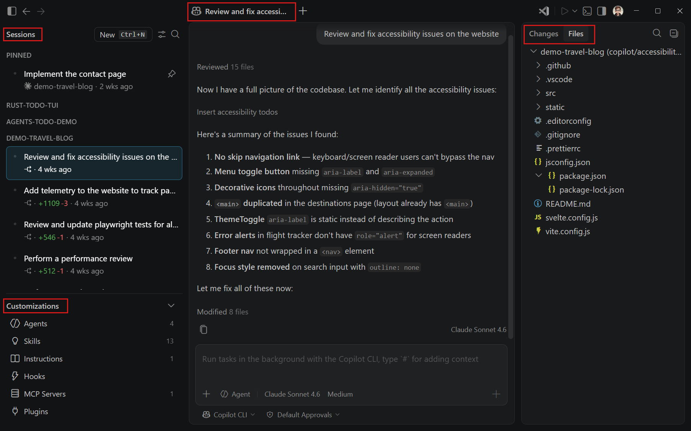

The Agents window has four main areas:

1. **Sessions list**: all your sessions across workspaces, grouped by project or timeframe. Right-click for rename, mark as done, pin, and more.
2. **Customizations panel**: direct access to agents, skills, instructions, hooks, MCP servers, and plugins. All your AI configuration in one place.
3. **Chat area**: the main interaction surface. Tabs for sub-sessions when you run parallel tasks within the same workspace.
4. **Changes panel**: file changes and diffs from the agent's edits, with commit/merge/discard actions and a full file explorer.

Let me show you the pieces that matter most.

### Sessions: your work becomes trackable

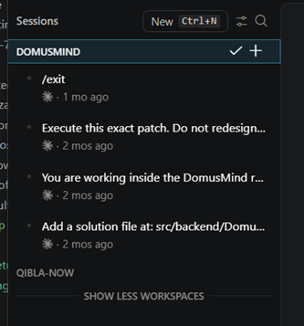

Sessions are not chat history. They are work items. You can pin them, rename them, mark them done, filter by workspace. Every session carries its own agent harness, its own isolation mode, its own changes. When you come back next week, you don't scroll through a chat log, you pick up a session where you left it.

### Picking your workspace and harness

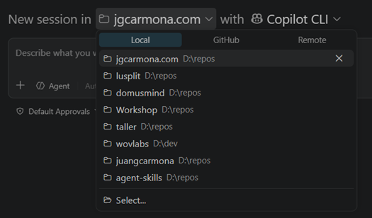

When you create a new session, you first pick the workspace, a local folder or a GitHub repository. The Agents window gives you access to all your workspaces from one place without opening each in a separate window.

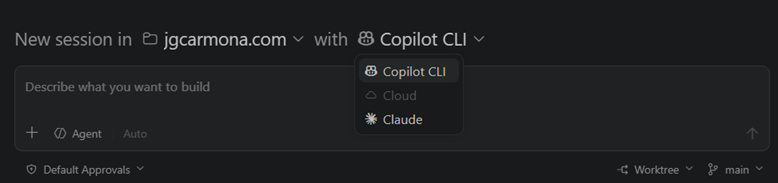

Then you pick your engine. Copilot CLI runs locally with your terminal and tools. Copilot Cloud runs on GitHub's infrastructure with full repo access. Claude agent uses Anthropic's model directly. The runtime is now a first-class, user-visible concept. Not hidden behind a menu. Front and center.

This is what makes it a harness rather than just another chat window. The same workspace, the same tools, the same customizations, different engines. The VS Code Agents Window is the car. You swap the engine depending on the job.

### The file explorer and changes view

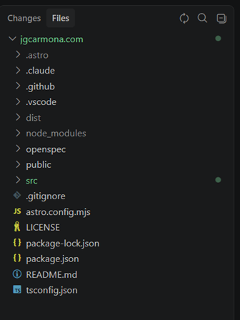

The right panel shows you both a full file explorer and a diff view of what the agent changed. You can browse the codebase, review changes, commit, merge, or discard, all without leaving the Agents window. For worktree isolation, changes stay in a separate branch until you're ready.

### Customizations: the control surface, made visible

This is where it gets interesting for anyone who read [my article on instructions and skills](/en/copilot-instructions-agents-skills/). Everything I described in that article, agents, skills, instructions, hooks, MCP servers and plugins, is now surfaced in a dedicated panel.

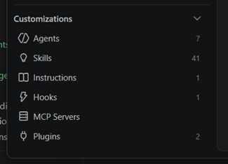

You can view, edit, enable, or disable any customization. You can scope them per project or globally. You can even generate new ones from a prompt.

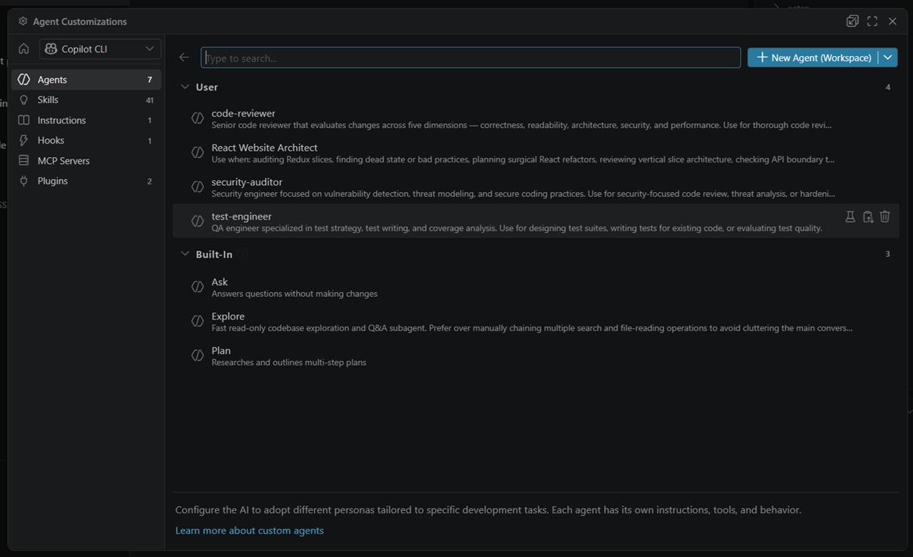

Custom agents: the same `AGENTS.md` personas I covered before, are now manageable from the UI. You can see which tools each agent has access to, which instructions it follows, and toggle them on the fly.

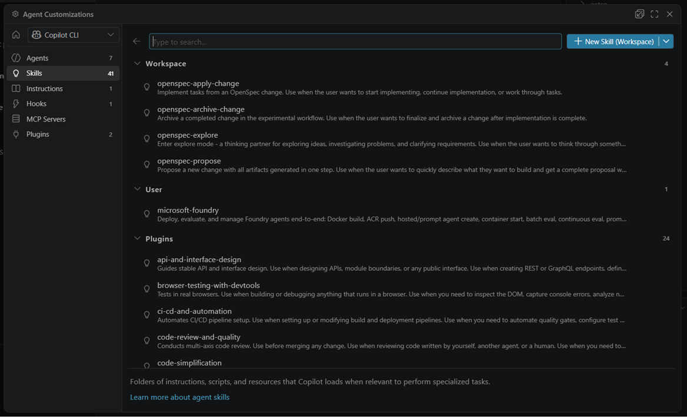

Skills are visible too. My OpenSpec skills (`propose`, `apply`, `explore`, `archive`) show up here. You can enable or disable them per session, per agent.

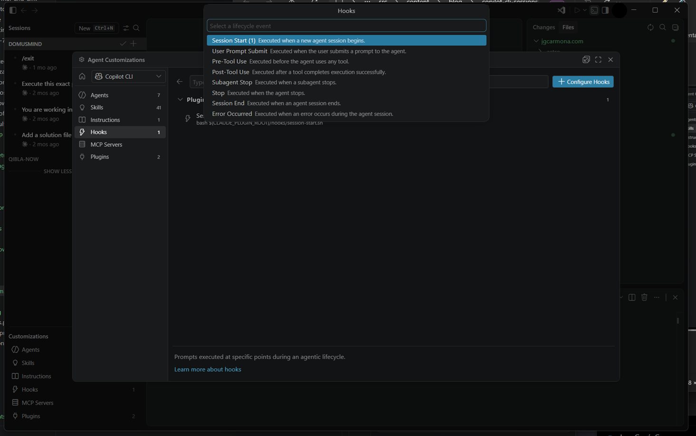

Hooks run shell commands at lifecycle points: before the agent starts, after it finishes, when it hits an error. Automated quality gates without manual intervention.

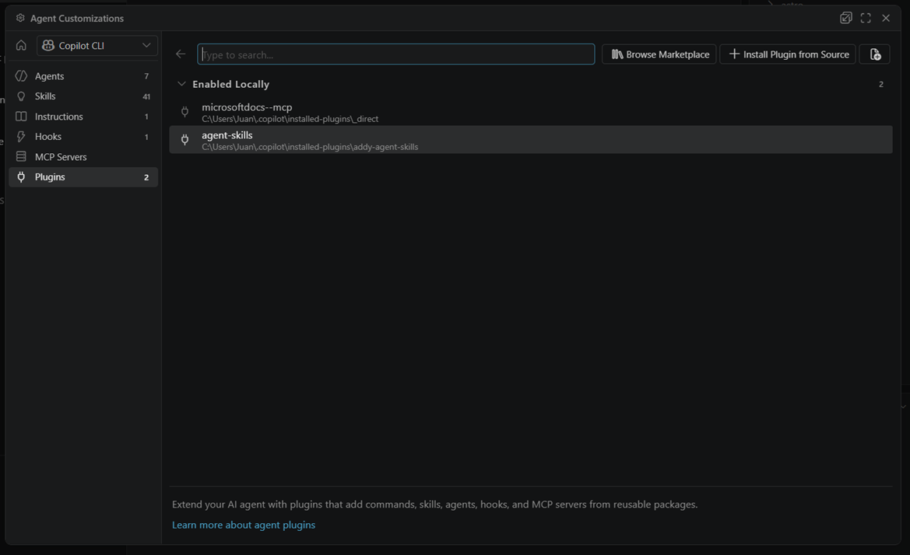

And plugins bundle all of the above, skills, agents, instructions, MCP servers, into installable packages. Install once, customize your harness across projects.

### Beyond the UI

There's more shipping alongside: worktree isolation (agent changes stay in a branch until you merge), sub-sessions for parallel tasks, remote sessions via SSH, an integrated browser for localhost, validation tasks (`npm run build`, `pytest`), inline diff feedback, plan mode, terminal risk badges, and BYOK token visibility. The [VS Code 1.120 release notes](https://code.visualstudio.com/updates/v1_120) cover everything.

And it's not just VS Code. The same week: Copilot CLI sessions in JetBrains, enterprise-managed plugins, GitHub Copilot app preview, and cloud agent tasks via REST API. This is no longer autocomplete inside an editor.

## Under the hood: the official harness architecture

The day before I'm writing this, the VS Code team published ["The Coding Harness Behind GitHub Copilot in VS Code"](https://code.visualstudio.com/blogs/2026/05/15/agent-harnesses-github-copilot-vscode). Read it. It's the clearest engineering description of what everyone in the ecosystem has been trying to articulate.

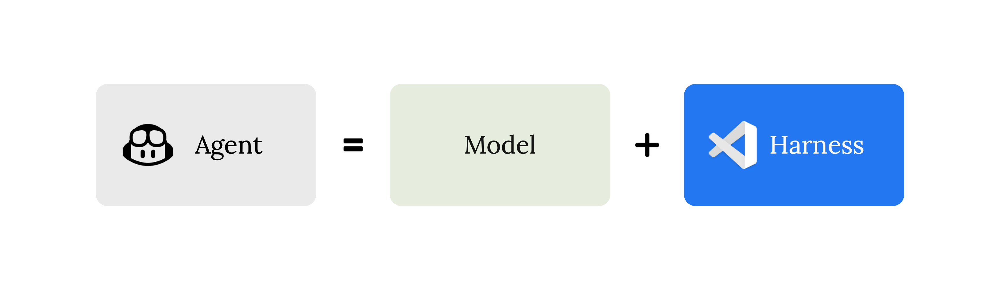

**Agent = Model + Harness.** The model generates tokens. The harness turns those tokens into action. Three responsibilities: context assembly (what the model sees), tool exposure (what the model can do), and tool execution (making it actually happen). Their conclusion: *"The model is the engine. The harness is the car."*

I've been saying the same thing across this whole series. Feels good to read the VS Code team spell it out.

### The loop

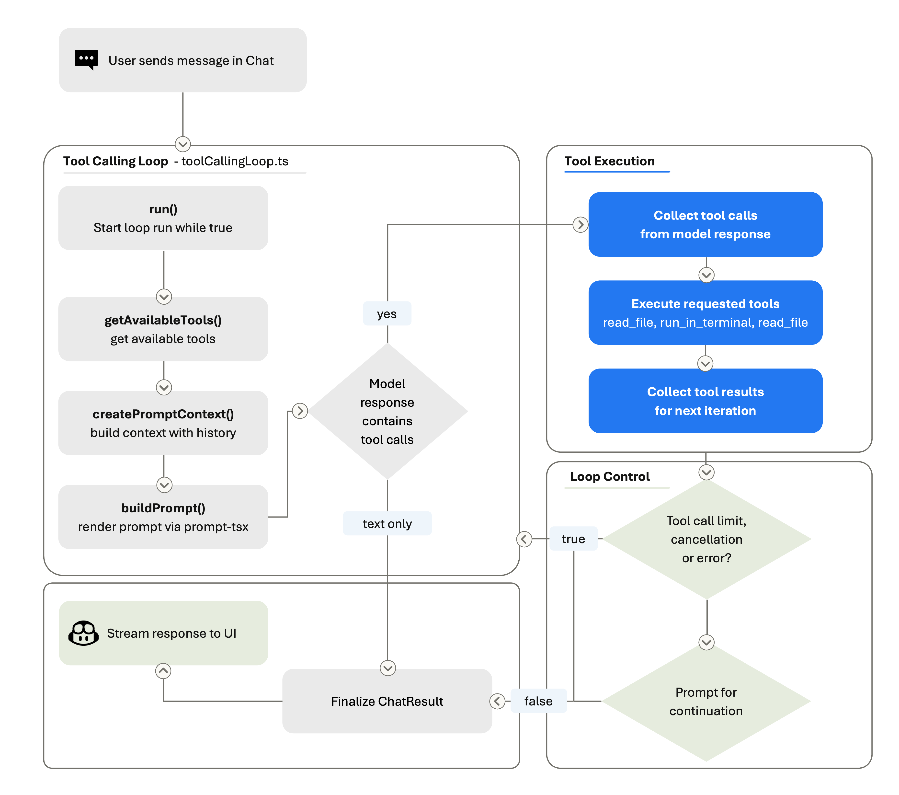

Think → act → observe → think again. Each iteration: build prompt, call model, execute tools, loop back. A single user message can trigger dozens of rounds, searching files, editing code, running tests, reading output, iterating on failures. You see none of it until the turn ends.

The prompt is rebuilt every iteration. The model always sees the latest workspace state. When history gets too long, the harness compresses it. All of that is harness work, not model work.

### Per-model tuning

Here's something that blew my mind: **the harness behaves differently depending on which model is active.** Claude uses `replace_string_in_file`; GPT uses `apply_patch`. Gemini needs explicit reminders to actually call tools instead of narrating them. Even different checkpoints of Claude get different system prompts.

This explains why the same prompt, same tools, same workspace produces radically different results when you swap models. I used to blame raw intelligence. Part of it was missing per-model harness tuning. Practical lesson for local setups: when your 7B model underperforms, check your instructions and tool descriptions before blaming the model.

### VSC-Bench: measuring what matters

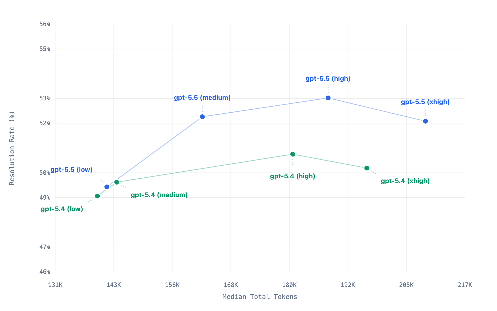

The VS Code team built their own eval suite because SWE-bench has contamination issues and Terminal-Bench measures shell puzzles, not developer workflows. VSC-Bench measures real VS Code tasks across four dimensions: correctness, effort, token efficiency, and latency.

The interesting finding: past a certain "effort" threshold, more thinking tokens actually *reduce* success rate. Effort controls are a harness concern. They even run VSC-Bench on PRs before merging, harness changes get numbers before they land.

## The competitive landscape, in one paragraph

Cursor understood the UX first, it made orchestration feel fluid. Windsurf pushed harder into persistent autonomous flow. Cline and Roo exposed the machinery everyone else hid behind a curtain. OpenHands went furthest, persistent execution, sandboxed systems, operational autonomy. Less editor, more engineering runtime. All of them, in different ways, proved that the interaction model is no longer "ask for completion." It's supervise, redirect, validate, orchestrate.

## Why local models proved this first

Frontier cloud models can compensate for bad orchestration through sheer intelligence. Local models cannot. A 7B model without tools, instructions, validation, and constraints collapses into hallucinations immediately.

That's why [MCP matters](/en/copilot-cli-mcp-tools/). That's why [instructions matter](/en/copilot-instructions-agents-skills/). That's why [SDD matters](/en/copilot-cli-sdd-workflows/). That's why harnesses matter. Orchestration compensates for weaker reasoning. And honestly, even frontier models behave dramatically better under strong orchestration. The runtime quality affects everyone.

## The questions that actually matter now

People keep debating model benchmarks and context windows. Meanwhile the real shift is operational:

How do you govern agents? Structure workflows? Validate outputs? Coordinate subagents? Control costs? Prevent drift?

Those are runtime questions. Harness questions. And the harness itself now determines cost, throughput, efficiency, and scalability, which is exactly why I wrote [Mayday!](/en/may-day/) in the first place.

## One last thing: governance is real

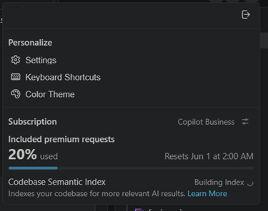

Your harness is tied to your GitHub account. Your account belongs to an organization. And your org can restrict which models, MCP servers, and plugins you get. GitHub shipped enterprise-managed plugins on May 6. This is already live.

So "Your AI. Your rules." is true for personal use. For teams, it's more like "Your AI. Your org's rules. Within those, your customizations." That's governance. Know where your sandbox boundary is.

## My take

We were already building harnesses, scripts, CI pipelines, tmux workflows, MCP integrations, SDD protocols. The ecosystem just became conscious of them.

Now the runtime is the product. Not the model. Not the prompt. Not the editor. The orchestration layer.

And once you combine local AI, cloud escalation, MCP tools, autonomous loops, SDD workflows, governance, and multi-agent coordination... you are no longer doing AI-assisted development. You are building software engineering systems powered by agents.

Your AI. Your runtime. Your rules.

## This series

1. [Mayday! Mayday! We're Running Out of Fuel!](/en/may-day/): the manifesto
2. [How I Set Up GitHub Copilot CLI on Local Hardware](/en/github-copilot-local-setup/): setup and wiring
3. [MCP Is How Local Copilot Becomes Useful](/en/copilot-cli-mcp-tools/): tools, not magic
4. [Copilot Instructions, Agents, and Skills](/en/copilot-instructions-agents-skills/): governance
5. [Running SDD Workflows with Local Copilot](/en/copilot-cli-sdd-workflows/): specification-driven development
6. **You are here**: VSCode Agents Window, An AI Harness Inside Visual Studio Code

## References

- [The Coding Harness Behind GitHub Copilot in VS Code](https://code.visualstudio.com/blogs/2026/05/15/agent-harnesses-github-copilot-vscode): official harness architecture post by the VS Code team (Julia Kasper, Megan Rogge, Aaron Munger)
- [Use the Agents Window](https://code.visualstudio.com/docs/copilot/agents/agents-window): official Agents window documentation
- [VS Code 1.120 Release Notes](https://code.visualstudio.com/updates/v1_120): Agents window reaches Stable
- [GitHub Changelog May 2026](https://github.blog/changelog/2026/): Copilot CLI sessions, enterprise plugins, cloud agents
- [Cursor](https://cursor.sh/): agent-native IDE
- [Windsurf](https://codeium.com/windsurf): autonomous flow coding
- [Cline](https://github.com/cline/cline): open runtime for AI agents
- [Roo Code](https://github.com/RooVetGit/Roo-Cline): Cline fork with approvals
- [OpenHands](https://github.com/All-Hands-AI/OpenHands): autonomous engineering runtime
- [GitHub Copilot CLI](https://docs.github.com/en/copilot/copilot-cli): terminal-based agent
- [OpenSpec](https://github.com/Fission-AI/OpenSpec): lightweight SDD framework
- [Model Context Protocol](https://modelcontextprotocol.io/): the tool integration standard

---

Remember:

> ## Your AI. Your rules.
