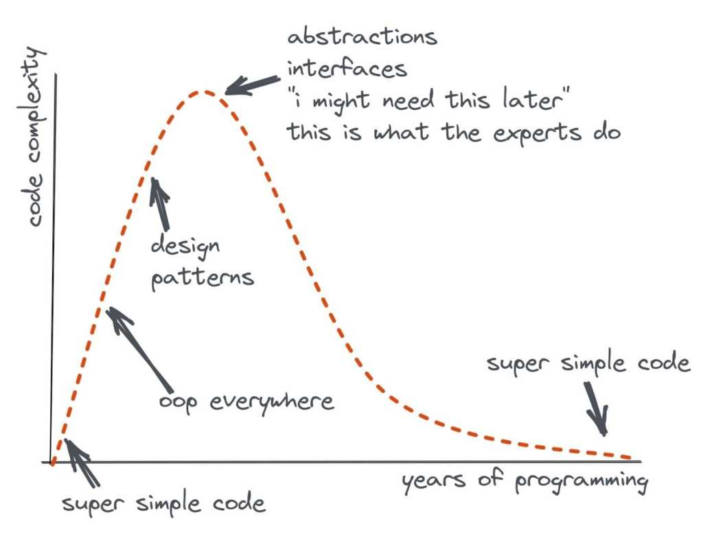

## Introducción al Wabi-Sabi

El Wabi-Sabi es una filosofía japonesa que encuentra belleza en la imperfección, la simplicidad y la naturaleza cambiante de las cosas. El término "wabi" se refiere a la **simplicidad y modestia**, mientras que "sabi" se relaciona con la **belleza** que se revela con el **paso del tiempo y la evolución**. Este concepto se originó en el Japón medieval y se arraigó en el arte del té, pero desde entonces se ha extendido a múltiples aspectos de la vida japonesa y se ha convertido en una parte integral de la cultura del país. El Wabi-Sabi nos enseña a encontrar la belleza en lo simple, lo imperfecto y lo efímero, y a apreciar la naturaleza cambiante de todo lo que nos rodea.

## Aplicando el Wabi-Sabi al desarrollo de software

El desarrollo de software es un viaje fascinante y en constante evolución. A medida que avanzas en tu carrera, es probable que te enfrentes a desafíos relacionados con la complejidad y los diseños excesivamente elaborados. Yo también he pasado por esa etapa, obsesionado con implementar todos los patrones, "mejores prácticas" y enfoques populares que encontraba. Pensaba que un buen diseño y una arquitectura limpia eran sinónimo de excelencia, pero con el tiempo, aprendí a valorar la belleza de la simplicidad y la eficiencia.

Cuando comienzas tu trayectoria en el desarrollo de software, es natural buscar incorporar todas las técnicas y enfoques que aprendes. Crees que siguiendo al pie de la letra los principios de "desacoplamiento", "separación de responsabilidades" o los [**principios SOLID**](https://jgcarmona.com/solid-y-grasp-buenas-practicas-hacia-el-exito-en-el-desarrollo-de-software/), estás en el camino correcto. Yo también estuve ahí, creyendo que más complejidad en mis diseños significaba un mejor código. Pero en retrospectiva, me di cuenta de que había caído en el exceso de ingeniería, un problema demasiado frecuente en nuestro gremio, creando aplicaciones más complicadas de lo necesario.

## Transformación personal y profesional

Sin embargo, a medida que adquieres experiencia, descubres una perspectiva diferente, una búsqueda de equilibrio, aceptando la imperfección como algo necesario. Muchos lo llamarían, simplemente, madurez, pero ahora tengo claro que puedo ponerle nombre: Wabi-Sabi. Esta filosofía japonesa te invita a encontrar la belleza en la simplicidad y la imperfección. Al igual que apreciar la serenidad de un jardín zen o la imperfección en una cerámica, el Wabi-Sabi en el desarrollo de software te anima a buscar la simplicidad como una forma de crear sistemas más efectivos.

La simplicidad en el diseño y la implementación de un sistema de software es una herramienta poderosa. Al buscar el equilibrio adecuado entre funcionalidad y complejidad, puedes reducir la carga cognitiva y mejorar la usabilidad del software. No se trata de buscar la perfección absoluta, sino de encontrar la elegancia en soluciones simples y eficientes.

Además, el Wabi-Sabi abraza la aceptación de los errores y las imperfecciones. Reconoce que los problemas y las equivocaciones son parte del proceso de aprendizaje. En lugar de temer a los errores, debemos aprender de ellos, iterar en nuestros diseños y aplicar mejoras continuas. A través de la práctica constante y la aceptación de la evolución, podemos crear software más sólido y en constante mejora.

En mi propia trayectoria, he experimentado cómo el enfoque del Wabi-Sabi ha transformado mi perspectiva como desarrollador de software. He aprendido a valorar la belleza de la simplicidad y la elegancia en mis diseños. Antes, me obsesionaba con la complejidad y buscaba encontrar el patrón más adecuado a aplicar en cada problema, creyendo que esta era la clave para el éxito. Sin embargo, con el tiempo, me di cuenta de que la verdadera excelencia radica en encontrar soluciones simples y eficientes.

## Complejidad Vs. Experincia

Quiero compartir aquí este gráfico compartido por [Dave Callan](https://www.linkedin.com/in/davidcallan) en LinkedIn, pues está tremendamente relacionado con la filosofía Wabi-Sabi y demuestra que el principio de esta filosofía es algo que los profesionales aprenden y practican de forma natural. Me hizo reflexionar sobre mi propio camino y cómo he evolucionado a lo largo de los años. Al principio, me encontraba en el extremo izquierdo del gráfico, obsesionado con la complejidad y tratando de aplicar todas las "mejores prácticas" disponibles. Pero a medida que adquirí más experiencia y conocimiento, comencé a buscar la simplicidad en mis diseños y a valorar la evolución continua.

El Wabi-Sabi en el desarrollo de software no solo se trata de crear sistemas más simples, sino también de aceptar los errores y las imperfecciones como oportunidades de crecimiento. Ahora, veo los errores como trampolines para mejorar y aprender. No tengo miedo de probar nuevas ideas, iterar en mis diseños y buscar constantemente formas de optimizar mi código.

## Aplicaciones más allá del desarrollo de software

El concepto de Wabi-Sabi va más allá del desarrollo de software y se puede aplicar en diferentes aspectos de nuestras vidas. Por ejemplo, en el diseño de interiores, abrazar el Wabi-Sabi implica apreciar la belleza de los objetos desgastados y envejecidos, integrando elementos naturales y resaltando la imperfección como parte de la estética. En el arte culinario, el Wabi-Sabi se manifiesta en la sencillez de los ingredientes y la presentación minimalista, valorando la calidad y los sabores auténticos. En general, el Wabi-Sabi nos enseña a encontrar la belleza en lo simple, lo efímero y lo imperfecto, recordándonos que la perfección no siempre es necesaria para apreciar lo verdaderamente hermoso.

El Wabi-Sabi también puede aplicarse a la forma en que disfrutamos de nuestro día a día, valorando los momentos simples y cotidianos. En lugar de buscar la perfección en nuestras experiencias familiares, podemos apreciar los pequeños momentos de conexión y alegría que surgen de compartir tiempo de calidad juntos. Durante las vacaciones, en lugar de obsesionarnos con planificar cada detalle, podemos permitirnos disfrutar de los momentos espontáneos y apreciar la belleza de los lugares y las experiencias auténticas. Al adoptar esta mentalidad Wabi-Sabi, encontramos gratitud en los pequeños detalles y descubrimos la belleza en lo imperfecto y lo efímero de nuestras vidas diarias.

Te invito a abrazar la filosofía del Wabi-Sabi en tu trabajo como desarrollador de software. Aprecia la belleza de la simplicidad y la evolución continua. No te obsesiones con la complejidad, sino que busca soluciones simples y eficientes. Acepta los errores como oportunidades de aprendizaje y mejora constante. Recuerda que la verdadera belleza radica en la simplicidad y la elegancia. ¡Embárcate en este viaje del Wabi-Sabi y descubre cómo puede transformar tu carrera en el desarrollo de software!

Puedes volver a la serie de artículos sobre filosofías niponas aplicadas al desarrollo de software **[haciendo clic aquí](https://jgcarmona.com/mejorar-en-programacion-con-filosofias-japonesas/)**.
