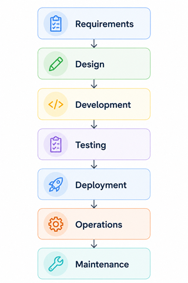
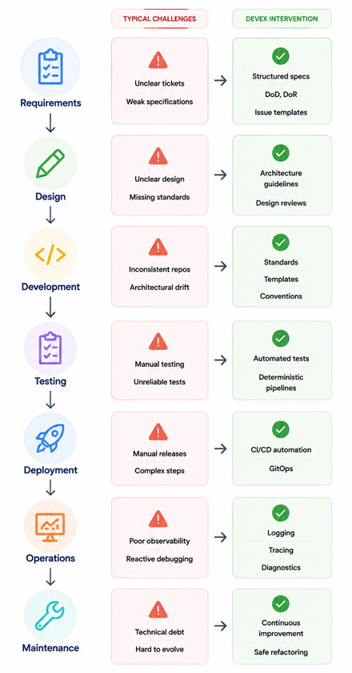
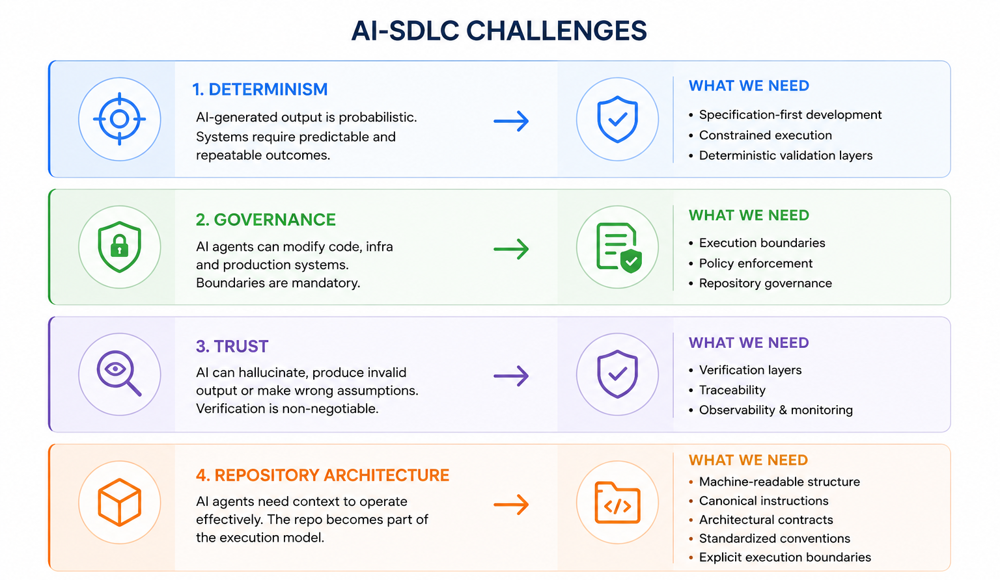
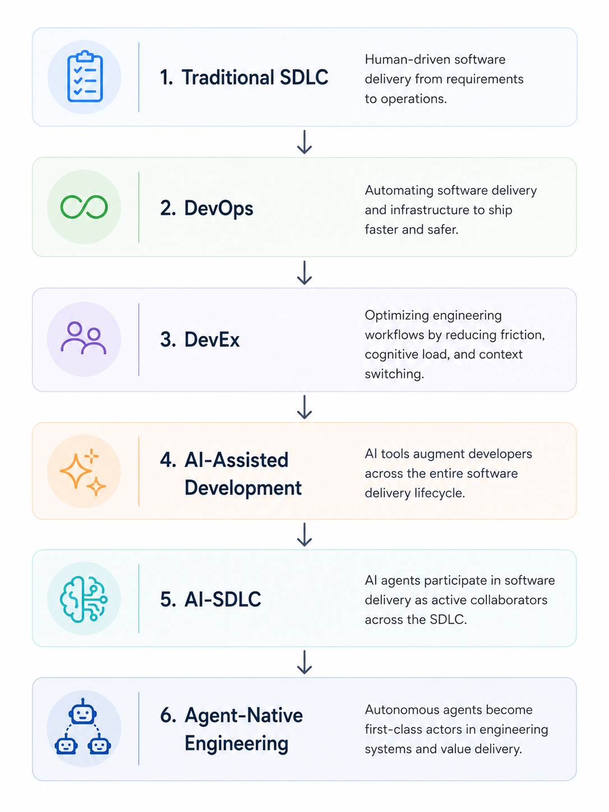

Over the last months I have been working with many organizations navigating the shift toward AI-assisted development. The conversations always converge on the same topics. Software engineers and leadership teams already understand that the software delivery model is changing, yet most organizations are still focused on the wrong question.

I sense their fear because the dominant thought quickly becomes: when will AI replace the entire team?

> AI is going to replace developers!

That conversation is wrong: AI is not replacing software engineers broadly. It is replacing engineers whose value is primarily in writing code.

The industry spent decades optimizing how engineers write code. AI is now commoditizing that layer so the value is moving upward: architecture, systems thinking, business understanding, governance, socio-technical design, and this is where DevEx becomes the critical engineering discipline.

## So, What is DevEx?

At its core, DevEx, Developer Experience, can be understood through three fundamental dimensions.

* **Feedback Loops** → How quickly engineers receive feedback from the system.
* **Cognitive Load** → How much mental effort is wasted dealing with complexity unrelated to business value.
* **Flow State** → How effectively engineers can sustain uninterrupted, focused work.

These dimensions define how efficient an engineering system actually is.

### Feedback Loops

Feedback loops determine the distance between action and validation. Slow CI pipelines, delayed pull request reviews, flaky tests, or long local build times introduce uncertainty and reduce delivery speed. High-performing engineering organizations minimize this latency as much as possible.

### Cognitive Load

Cognitive load measures how much accidental complexity engineers must continuously process. Undocumented APIs, unclear ownership, fragmented repositories, complex deployment procedures, or excessive infrastructure concerns force developers to spend mental energy understanding the system instead of solving product problems. Effective DevEx reduces this burden through standardization, abstractions, and clear architectural boundaries.

### Flow State

Flow state represents the ability to sustain deep engineering work without interruption. Constant incidents, unstable environments, operational interruptions, meeting overload, and deployment anxiety continuously break concentration. Strong engineering systems protect focus by making software delivery predictable, reliable, and operationally safe.

These dimensions are deeply connected. Slow feedback loops increase cognitive load, a high cognitive load disrupts flows and broken flows reduce engineering quality.

So, what is DevEx?

> ### DevEx is the practice of reducing friction across the engineering system by accelerating feedback, minimizing unnecessary complexity, and preserving execution focus, enabling teams to deliver with rigor, speed, and confidence.

## DevEx Within SDLC

Developer Experience is not an isolated discipline because organizations operate delivery systems, and those systems are traditionally defined by the Software Development Lifecycle, a.k.a SDLC, and at its simplest form, software delivery follows a relatively predictable sequence.

Every stage introduces concrete and well-known challenges. Requirements become ambiguous, architecture drifts over time, test pipelines become unreliable, deployments remain manual, and operational systems often lack proper observability. These are structural inefficiencies inside our engineering systems. Mature organizations systematically identify these constraints and continuously remove friction across every stage of software delivery.

Many organizations treat DevEx as a tooling initiative, but that view is incomplete, as I said, DevEx is the optimization layer surrounding the entire SDLC because its purpose is to systematically identify and eliminate friction at every stage of software delivery. 

Until now, all these constraints existed in human-driven software delivery systems, but Artificial Intelligence completely changes that assumption.

## AI-SDLC Introduces New Engineering Problems

Traditional software systems depended on deterministic human execution. AI introduces probabilistic behavior into those workflows, creating constraints that must be designed into the engineering system.

In practice, AI-SDLC brings four core challenges:

- **Determinism:** probabilistic output requires specification-driven workflows and deterministic validation.
- **Governance:** agent actions need strict execution boundaries, policy enforcement, and repository controls.
- **Trust:** AI-generated artifacts require verification, traceability, observability, and systematic checks.
- **Repository Architecture:** agents need machine-readable structure, clear conventions, and explicit architectural contracts.

This is the shift: software delivery is no longer only about implementation speed, but about designing reliable systems where humans and AI can operate with control and confidence.

## The Evolution Of Engineering Systems

If we observe the last two decades of engineering evolution, a clear pattern emerges: the optimization target keeps moving one level higher—from Traditional SDLC, to DevOps, to DevEx, to AI-assisted development, to AI-SDLC, and now toward agent-native engineering where autonomous agents become first-class actors in software delivery.

For decades, software engineering focused on the implementation layer: write faster, build faster, ship faster. AI is now commoditizing that layer and shifting value upward into architecture, systems thinking, governance, repository design, and organizational design.

As a result, engineers valued only for implementation will become increasingly interchangeable, while those who can design and improve the engineering system itself will become far more impactful. The natural evolution for modern engineers is becoming better systems thinkers capable of understanding the architecture, constraints, and delivery mechanics surrounding software itself.

The future of software engineering will not be defined only by who writes the best code. As implementation becomes automated, the real differentiator is designing systems where humans and AI agents collaborate safely and effectively.

Coding still matters, but understanding the engineering system surrounding that code matters far more.

The future belongs to engineers who operate one abstraction layer higher.
