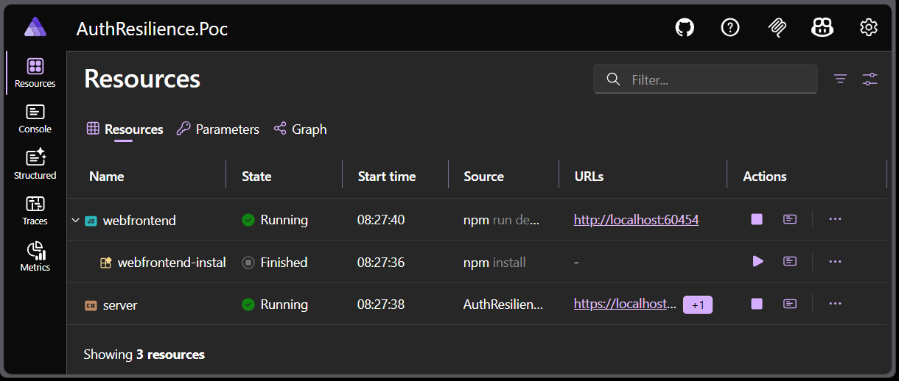
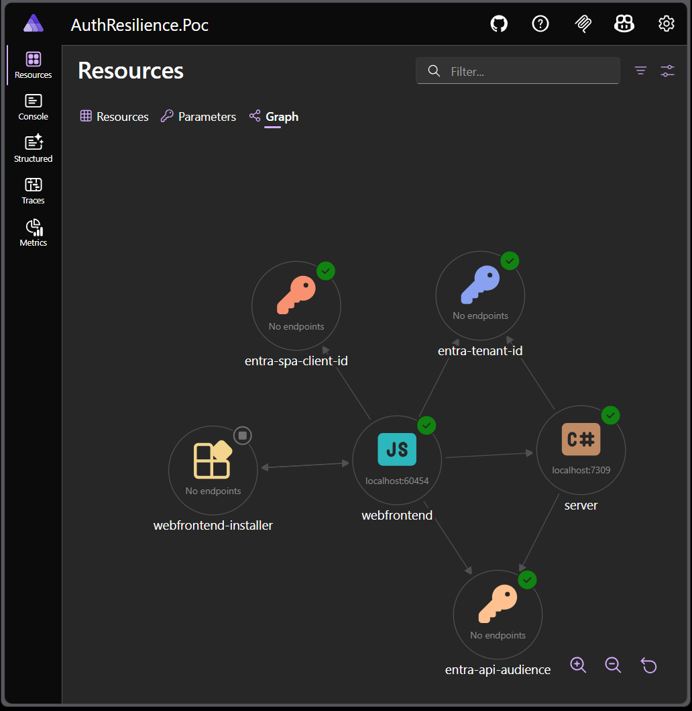
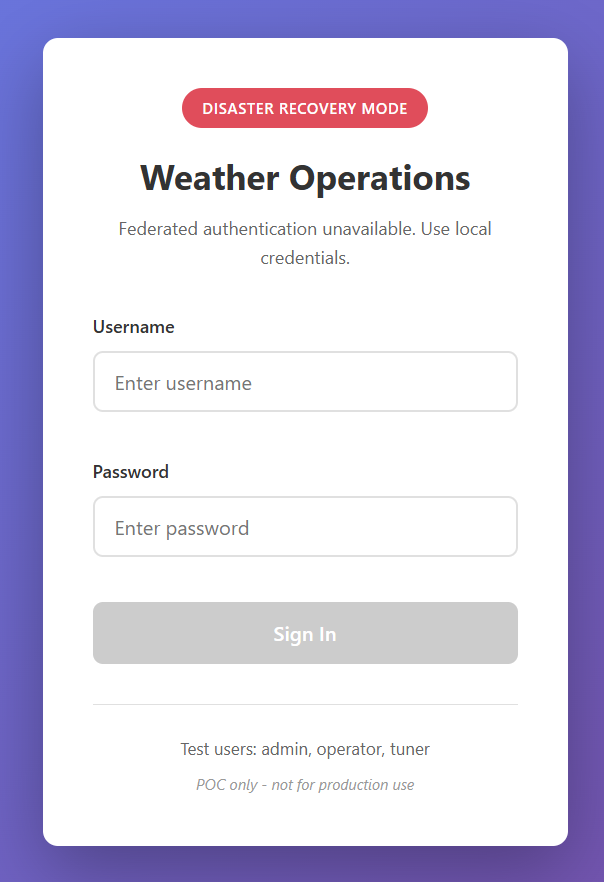
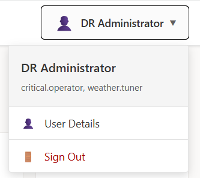
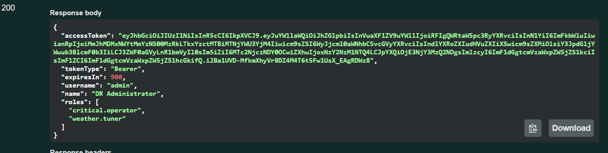
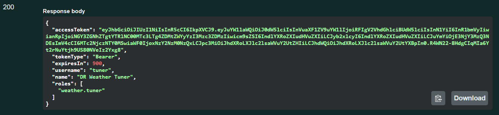
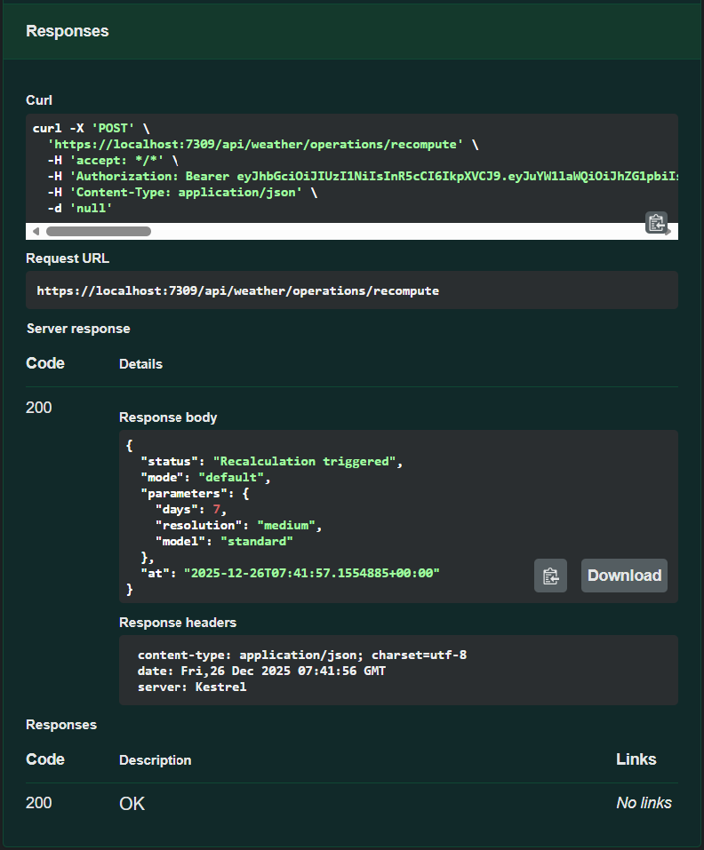
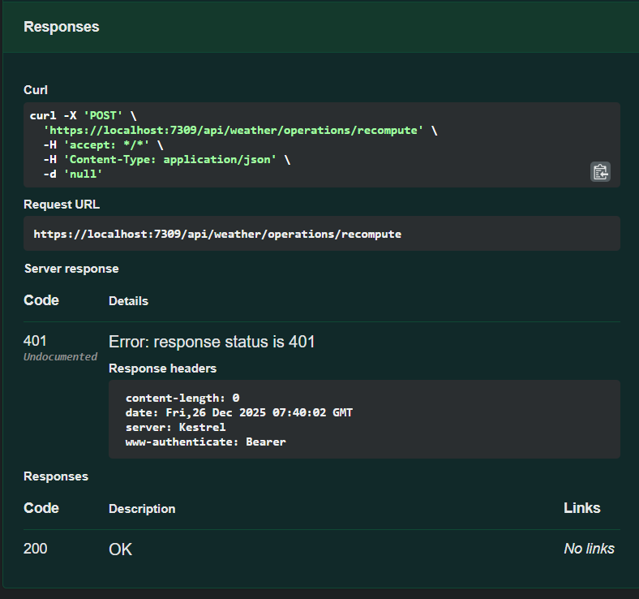
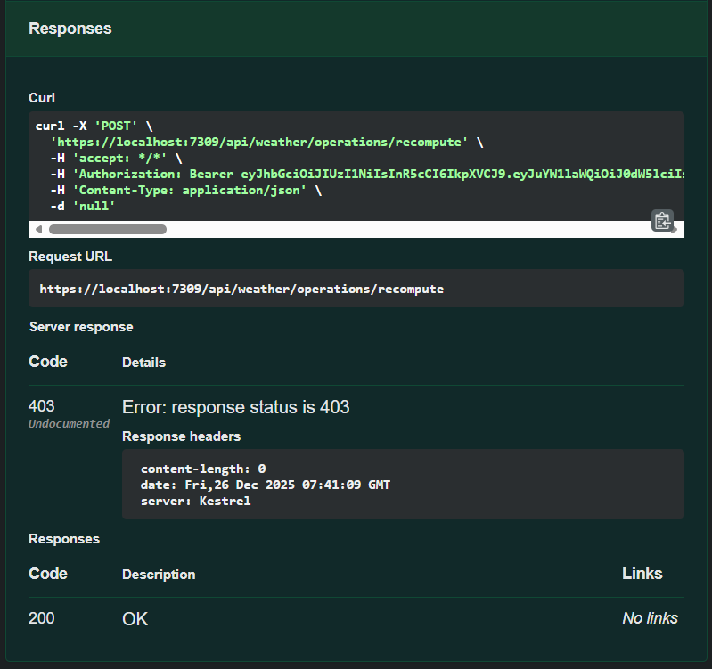

---
lang: en
title: "What If Your Identity Provider Goes Down?"
description: "Designing authentication resilience when Azure Entra ID is unavailable, using dual auth strategies, role-based authorization, and .NET Aspire."
pubDate: 2025-12-26
tags:
  - "cybersecurity"
  - "azure"
  - "sw-architecture"
  - "devex"
  - "sw-craftsmanship"
heroImage: "images/what-if-your-idp-goes-down.png"
---

## TL;DR

- Identity providers can become a single point of failure.
- Disabling authentication during outages is dangerous.
- Authentication resilience means replacing the identity source, not bypassing auth.
- The same authorization model must work across normal and DR modes.
- .NET Aspire made this PoC significantly faster to build.

*This article assumes familiarity with JWTs, OAuth2, and modern web application architecture.*

---

> Designing authentication resilience with Azure Entra ID, ASP.NET, React, and .NET Aspire

Modern applications tend to treat their identity provider as an immutable fact of life. Azure Entra ID, Okta, Auth0, they are assumed to be *always there*. Until one day they aren’t. This article explores a question most architectures quietly avoid:

> **What happens if your identity provider is unavailable, but your users still need to complete critical work?**

To answer it, I built a small but complete Proof of Concept that demonstrates how an application can continue operating, in a controlled, degraded mode, even when federated identity is unreachable. The full source code for this PoC is available in the accompanying [GitHub repository](https://github.com/juangcarmona/auth-resilience-poc).

The PoC is built with:
- Azure Entra ID + MSAL
- ASP.NET Core
- React
- Microsoft Aspire

## The Problem Nobody Likes to Think About

In most systems today:

- Authentication is tightly coupled to a single identity provider
- Authorization depends entirely on tokens issued by that provider
- If identity fails, the application fails

This is rarely questioned. Identity providers are treated as “Tier-0 infrastructure”.

### But outages happen:
- Regional Entra incidents
- Network partitions
- DNS failures
- Tenant or conditional access misconfiguration
- Emergency access scenarios

When that happens, the real question is not:

> “Can users log in?”

It’s this:

> **Can authorized users still complete critical operations?**

## What Most Systems Actually Do

When teams do think about identity outages, the first mitigation idea is often the worst one.

Typical reactions include:
- 🚫 **Disabling authentication entirely**
- ⚠️ **Bypassing authorization checks “temporarily”**
- 🧑‍💻 **Hard-coding a special user**
- 🧩 **Short-circuiting the auth pipeline behind a feature flag**

In other words: 🚨**faking the authentication flow**🚨.

This is usually justified as an emergency measure:
> “We’ll remove auth just until the identity provider comes back.”

### 🚩But this approach is extremely dangerous.

Once authentication or authorization is bypassed:
- 🔍 The system no longer knows *who* is acting
- 🧱 Authorization semantics collapse
- 🧾 Auditability disappears
- 🌐 Every endpoint effectively becomes public

At that point, the system may still be running, but it is no longer under control. Ironically, these mitigations often create a risk that is far greater than the original outage. A temporary identity failure is replaced by a permanent security incident. The key mistake is treating **availability** as more important than **authorization**.

A safer approach is not to remove authentication, but to **replace the identity source** while preserving the same authorization model. That distinction is what this PoC is built around.

## The Invariant That Actually Matters

The key insight behind this PoC is simple:

> **Authentication is not the same thing as identity.**

Identity answers *who you are*.  
Applications care about *what you are allowed to do*.

That leads to an important invariant:

> **Authorization semantics must survive identity failure.**

If a system can preserve:
- the same roles
- the same authorization checks
- the same backend behavior

then identity becomes replaceable infrastructure, not a single point of failure.

## The Design: Two Authentication Modes, One Authorization Model

The PoC is intentionally minimal.

There are two authentication modes:

### Normal mode
- Federated authentication via Azure Entra ID
- MSAL on the frontend
- Entra-issued access tokens

### Disaster Recovery mode
- A local authentication flow
- Short-lived JWTs issued by the backend
- No dependency on Entra at runtime

What does **not** change:
- Backend endpoints
- Authorization policies
- Role names
- Business logic

From the application’s point of view, the token source is irrelevant.  
Only validity and roles matter.

## Explicit Configuration

We can't afford to leave "magic tricks" within anyone's reach... because the potential for disaster can be devastating. Switching between modes is an **operational decision**, not a runtime toggle. 

> Disaster Recovery mode is intentionally manual and explicit.  
> It is not an automatic fallback and should never be silently enabled in production environments.

In this PoC, the authentication mode is controlled via configuration
(e.g. `appsettings.Development.json`):

- `AuthMode = normal`
- `AuthMode = dr`

This keeps the behavior:
- explicit
- reviewable
- environment-specific

There is no UI switch and no “automatic fallback”.  
That is a deliberate choice.

## Why .NET Aspire Made This Fast

This experiment would have taken significantly longer without **.NET Aspire**.

Aspire provided:
- A clean AppHost
- First-class orchestration of frontend and backend
- Centralized configuration
- A frictionless local environment

It allowed me to focus on **architecture**, not plumbing.

Even though the auth-mode switch is driven by configuration files, Aspire made it trivial to:
- run the full system locally
- observe both services together
- iterate quickly

For a PoC like this, Aspire dramatically reduced time-to-signal.

## Frontend Architecture: Authentication as a Strategy

On the frontend, authentication is modeled explicitly as a **strategy**.

There is:
- one application
- one authorization model
- multiple authentication implementations

At startup:
1. The app calls a `/settings` endpoint
2. It determines the active authentication mode
3. It selects the corresponding auth strategy

In Disaster Recovery mode:
- MSAL is completely bypassed
- A dedicated login form is shown immediately
- Tokens are obtained from the backend
- The rest of the UI behaves identically

This keeps authentication concerns isolated and makes the rest of the app oblivious to identity source.

## Roles as the Unifying Contract

A key design decision was to standardize on **roles** as the contract between:

- Entra ID tokens
- DR tokens
- Frontend authorization logic
- Backend policies

Examples:
- `critical.operator`
- `weather.tuner`

These roles:
- Are defined in Entra app registrations
- Are embedded in DR-issued JWTs
- Are enforced by the same ASP.NET authorization policies
- Are consumed identically by the frontend

This allowed the business logic to remain untouched across modes.

## The Cornerstones of the Solution
### Backend Cornerstones

The backend is where the most important invariants are enforced.
Several design decisions make the solution resilient without branching business logic.

**1. Dual authentication schemes, single authorization model**  
The API explicitly supports two JWT bearer schemes:
- one for Azure Entra ID
- one for Disaster Recovery tokens

Only one scheme is active at runtime, selected via configuration.
Authorization policies and endpoints remain unchanged.

This logic lives in the authentication configuration layer of the API.

**2. Roles as the stable contract**  
Both Entra-issued tokens and DR-issued tokens contain the same role names.
Authorization policies are written once and reused across modes.

From the API’s perspective, the token issuer is irrelevant.
Only validity and roles matter.

**3. Disaster Recovery token issuance is explicit and scoped**  
The DR login endpoint:
- issues short-lived JWTs
- embeds roles directly in the token
- mirrors the structure expected by existing authorization policies

There is no attempt to emulate Entra ID.
The goal is continuity, not equivalence.

**4. No conditional business logic**  
Endpoints do not check “auth mode”.
They only rely on standard authorization.

This is a deliberate constraint: if the backend needs to know *where* the token came from, the design has already failed.

> Readers interested in the backend flow should start by exploring the authentication configuration and the DR token generator in the repository.

### Frontend Cornerstones

On the frontend, the goal is to make authentication source an implementation detail.

**1. Authentication as a strategy**  
The application defines a single authentication contract and multiple implementations:
- one backed by MSAL and Entra ID
- one backed by a custom DR login flow

The rest of the application talks to the contract, not the provider.

**2. Configuration-driven behavior**  
At startup, the frontend calls a settings endpoint to determine the active authentication mode.
This drives:
- which auth strategy is instantiated
- which login UX is shown
- whether Disaster Recovery indicators are displayed

There is no manual switch and no mixed-mode behavior.

**3. Roles derived from access tokens only**  
Authorization decisions in the UI are based exclusively on roles extracted from access tokens.
This avoids coupling authorization logic to any specific identity provider.

The same role checks work unchanged in both normal and DR modes.

**4. Minimal UI divergence**  
Outside of the login flow and a clear visual indicator, the application behaves identically.
This reinforces the idea that Disaster Recovery is a degraded mode, not a different application.

> Readers should look at the authentication strategy abstraction and the application bootstrap logic to understand how the frontend remains identity-agnostic.

## The Proof

The PoC demonstrates something very specific:

- In normal mode, Entra-issued tokens authorize critical operations
- In DR mode, locally-issued tokens authorize **the same operations**
- No endpoint duplication
- No conditional authorization logic

From the system’s perspective, nothing changes.

## What This PoC Is *Not*

This project is intentionally limited.

It is:
- not a replacement for Azure Entra ID
- not a full IAM solution
- not production-ready security guidance

It does not attempt to solve:
- identity lifecycle
- MFA
- credential recovery
- advanced threat scenarios

Its goal is much narrower: to show that **identity dependency can be reduced** if you design for it.

## Why I Stopped Here

Proofs of Concept should stop early.

Once the core idea is validated:
- more features reduce clarity
- more polish hides the architectural point

This PoC proves one thing:

> **Authentication resilience is possible without rewriting your system — if you plan for it upfront.**

## Repository and Code References

The full source code for this PoC is available in the accompanying [GitHub repository](https://github.com/juangcarmona/auth-resilience-poc).

For readers who want to explore further, the most relevant areas are:
- Backend authentication configuration and authorization policies
- Disaster Recovery token issuance logic
- Frontend authentication strategy abstraction
- Application bootstrap and settings loading

The repository is intentionally small and focused to keep the architectural signal clear.

## Final Thoughts

Identity providers are critical infrastructure, but they don’t have to become a single point of failure.

By separating, identity, authentication, and authorization, and by treating authentication mode as an explicit operational concern, it’s possible to build systems that **degrade gracefully instead of failing completely**.

> The real goal is not surviving identity outages, it’s designing systems where identity outages are no longer existential.

That’s the real takeaway of this experiment.
