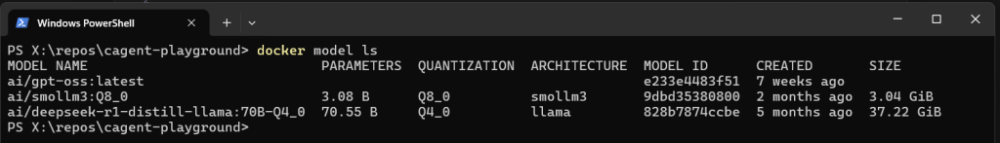
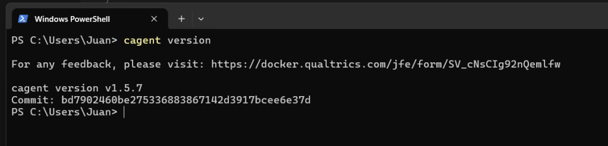
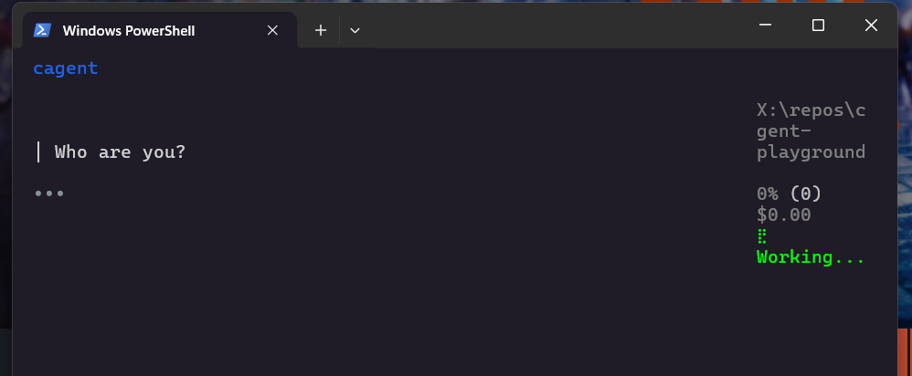
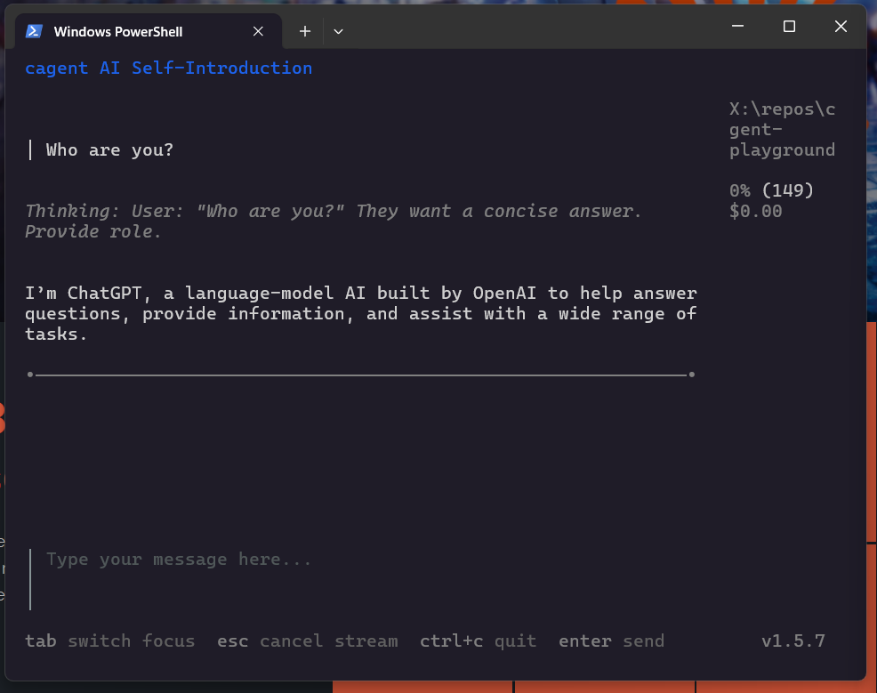

I’ve been exploring AI for years, learning, experimenting, and building PoCs around GenAI systems, assistants, and multi-agent platforms. And if there’s one constant across all these projects, it’s **glue code**: endless Python or TypeScript code just to juggle prompts, API keys, memory, and tool calls.

The result? Every PoC eventually turned into a brittle tangle of dependencies — hard to reproduce, harder to share. Even popular frameworks like [LangChain](https://langchain.com) or **[ADK](https://google.github.io/adk-docs/)** carry that same DNA: powerful, yes, but often messy under the hood. My current side project, [Sentra Brain](https://github.com/sentra-brain), has faced these very same challenges.

Now imagine cutting through all of that. No boilerplate. No half-broken notebooks. Just **one file, one agent** — portable, declarative, reproducible.

That’s where **Docker cagent** comes in.

> 🤖 **cagent** 🤖  
> A powerful, easy-to-use, customizable runtime that orchestrates AI agents with specialized capabilities, tools, and multi-agent interactions.

Think of it as **Docker Compose for AI agents**.

## **One YAML = one reproducible agent.**

And here’s where my bias kicks in: **I’ve always loved Docker containers for their manageability and reproducibility**. Cagent extends that same philosophy into AI agents. You describe the agent’s persona, instructions, and tools in YAML. Cagent "takes care of the rest", model calls, memory, tool execution, even teams of agents. Or at least it seems so, I’m still exploring, but so far I’m quite happy…

## Why It Matters

- **No glue code** → You declare, not code.

- **Portable** → Agents are versioned and shareable like Docker images.

- **Local-first** → With Docker Model Runner (DMR), everything runs offline. No OpenAI keys, no remote APIs, just Docker + YAML.

- **Multi-agent ready** → Teams of agents can collaborate, each with its own role.

For me, _the killer feature is **local execution**_. Everything I’ll show here runs on my machine with DMR. That’s why I wrote [a separate article on how to set up DMR](https://jgcarmona.com/enable-gpu-docker-model-runner-windows/). If you’re not familiar with it yet, [I recommend starting there](https://jgcarmona.com/enable-gpu-docker-model-runner-windows/).

## Getting Started with cagent

Well, this is my environment, doesn’t need to match yours exactly, I use Windows 11 and WSL2, and this was my recipe (more or less)

**1.- Install Docker Desktop** with WSL2 backend enabled.

2.- **Check your local models**: run `docker model ls`



3.- **Download and install cagent** from [GitHub releases](https://github.com/docker/cagent). (In Windows, you can download it and copy to the final place, like C:\\Program Files\\cagent\\cagent.exe. Then add it to your PATH so that you can run cagent from all over your system... e.g.: `cagent info`: )



## Our First Agent

Now that cagent is ready, it's time to enjoy, to learn by doing... To guide my steps, and to help you follow me, I've created this repo:

[**https://github.com/juangcarmona/cagent-playground**](https://github.com/juangcarmona/cagent-playground)

  
And my first example is `agents/hello-assistant.yaml`. Here’s the full YAML for a simple assistant agent

```yaml
version: "2"
agents:
  root:
    model: gpt-oss
    description: A simple local assistant
    instruction: |
      You are a helpful AI assistant. Answer concisely and clearly.

models:
  gpt-oss:
    provider: dmr # needs to be "dmr" for local models
    model: ai/gpt-oss   # NOTE: be sure you pick one from `docker model ls`
    base_url: http://localhost:12434/engines/llama.cpp/v1
    # use http://model-runner.docker.internal/engines/v1 if you run cagent from a container
```

How to run it?

**Option 1 — the direct way**  
Just run: `cagent run agents/hello-assistant.yaml`

> Note: cagent currently requires `OPENAI_API_KEY` to be set, even if you’re running local models. Just use any placeholder value.

**Option 2 — the shortcut**  
In the repo I’ve added simple launch scripts ([PowerShell](https://github.com/juangcarmona/cagent-playground/blob/main/run_agent.ps1) and [Bash](https://github.com/juangcarmona/cagent-playground/blob/main/run_agent.sh)). With them, you can run any agent just by passing its name.

Run it, and… **bang!** 🎉 You’ll get a live session in your terminal. Type a question → the model answers. That’s it: your first agent, running locally.





## First Impressions

- Setup is minimal: one binary, one YAML.

- Using DMR feels natural: cagent doesn’t care if the model is local or remote.

- Having agents as **shareable artifacts** (push/pull like Docker images) feels like a game-changer.

This is just the start. Next, I’ll explore cagent’s **memory** and **tools**, teaching agents to remember, track todos, and interact with files.

Repo: **[cagent-playground](https://github.com/juangcarmona/cagent-playground)**

* * *

> For me, cagent feels like a bridge between messy PoCs and reproducible agent systems. I’m still exploring its limits, but the combination of Docker, YAML, and local-first execution already makes it a strong candidate to boost Sentra Brain’s development and versatility. It won’t replace deeper engineering work, but it does make experimentation faster, cleaner, and easier to share. And that, in this space, is a big deal.
