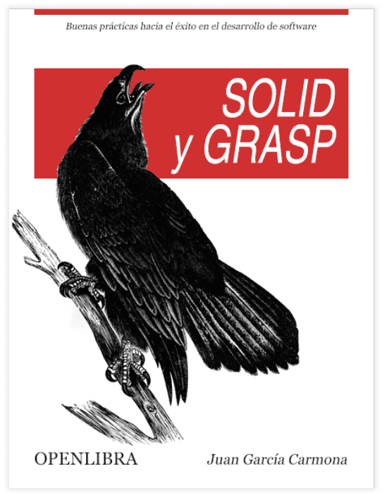
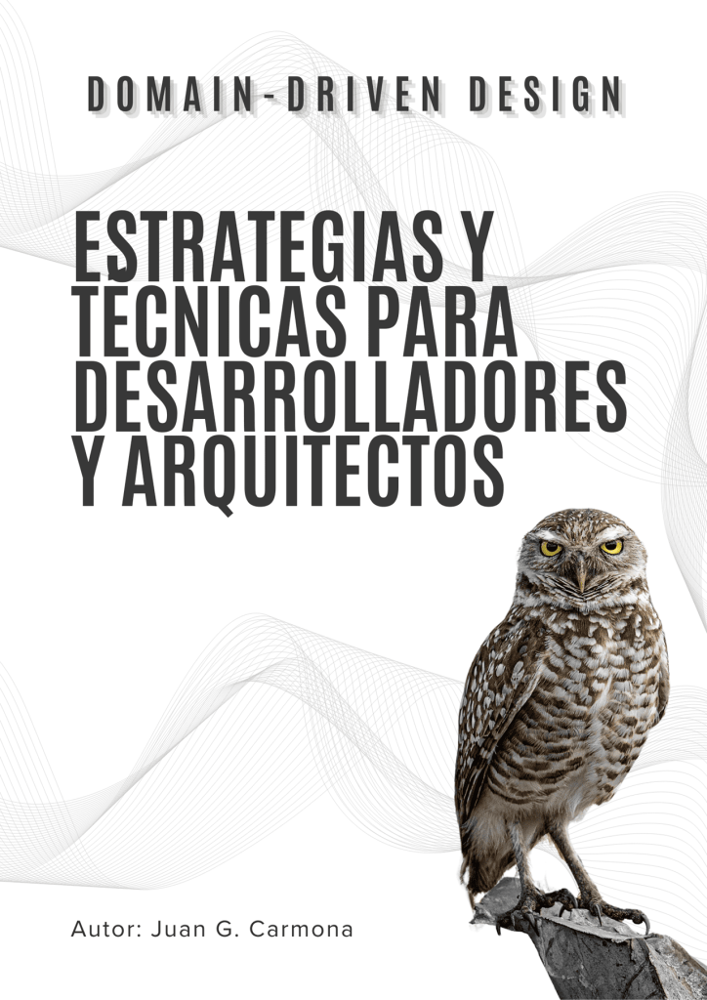
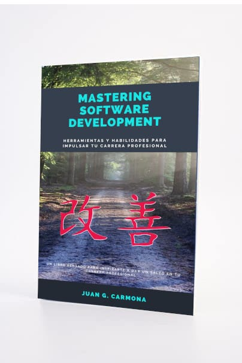

> Durante más de 20 años, he trabajado como desarrollador, arquitecto y mentor, ayudando a equipos y empresas a superar desafíos tecnológicos. Mi pasión por compartir conocimientos me ha llevado a escribir libros que buscan no solo enseñar principios de software, sino también inspirar a profesionales a mejorar continuamente. Cada libro está pensado para aportar valor, con un enfoque práctico y cercano, abordando tanto conceptos técnicos como habilidades personales que considero esenciales para el éxito en la industria.

* * *

## SOLID y GRASP: Buenas Prácticas hacia el Éxito en el Desarrollo de Software

Este libro ofrece una guía clara y práctica sobre los principios de diseño SOLID y los patrones de diseño GRASP. A lo largo del libro, se explican conceptos fundamentales como el Principio de Responsabilidad Única, la Inversión de Dependencias y el Control de Creación de Objetos, utilizando ejemplos detallados que muestran cómo aplicar estas prácticas en proyectos reales. Además, se incluyen ejercicios prácticos y estudios de caso que permiten al lector comprender mejor la teoría y aplicarla a su trabajo cotidiano.

Con un enfoque en las buenas prácticas y la calidad del código, este libro es ideal para desarrolladores que buscan estructurar su software de manera eficiente y profesional, evitando errores comunes y creando aplicaciones más mantenibles.

[DESCARGAR EL LIBRO COMPLETO](https://jgcarmona.com/wp-content/uploads/2024/10/solid-y-grasp-buenas-practicas-hacia-el-exito-en-el-desarrollo-de-software.pdf)

* * *

## **Domain-Driven Design**: **Estrategias y Técnicas para Desarrolladores y Arquitectos**

En este libro, aún en desarrollo, se exploran a fondo los conceptos de Domain-Driven Design (DDD) y su aplicabilidad en entornos complejos de desarrollo de software. Cada capítulo se centra en un aspecto fundamental de DDD, desde la creación de un lenguaje ubicuo y la identificación de contextos delimitados, hasta la implementación de patrones tácticos y estratégicos. Se abordan temas como la gestión de consistencia y transacciones, el diseño basado en eventos y la evolución del modelo a lo largo del ciclo de vida del proyecto.

El contenido está diseñado para ayudar a desarrolladores y arquitectos a modelar dominios de negocio complejos, permitiendo que el software refleje con precisión la lógica del negocio y evolucione de manera ágil y eficaz. Con ejemplos prácticos y referencias a proyectos de código abierto, este libro es una referencia esencial para quienes buscan llevar su conocimiento de DDD a un nivel más avanzado.

[DESCARGAR UNA MUESTRA](https://jgcarmona.com/wp-content/uploads/2024/10/ddd-estrategias-y-tecnicas-para-desarrolladores-y-arquitectos-sample.pdf)

* * *

## Mastering Software Development: Herramientas y Habilidades para Impulsar tu Carrera Profesional

Este libro está orientado a desarrolladores que desean llevar su carrera al siguiente nivel, enfocándose tanto en habilidades técnicas como en habilidades blandas necesarias para destacarse en el desarrollo de software. Aborda principios y filosofías de mejora continua como Kaizen, Ikigai y Ganbatte, que se combinan con técnicas avanzadas de diseño de software, arquitectura y gestión de proyectos.

El contenido abarca desde la elección de metodologías ágiles hasta la implementación de DevOps y la integración continua. Además, incluye un apartado dedicado a las habilidades de comunicación, liderazgo y resolución de conflictos, esenciales para cualquier desarrollador que aspire a roles más senior o de liderazgo en su carrera. Es un libro integral que guía al lector desde el dominio técnico hasta el desarrollo personal y profesional.

[PRÓXIMAMENTE DISPONIBLE](#)

